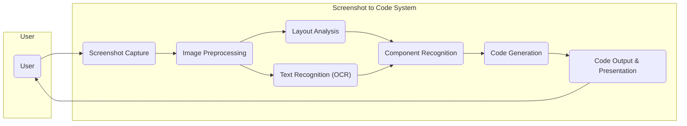
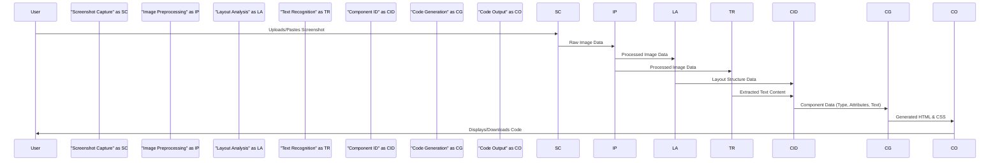
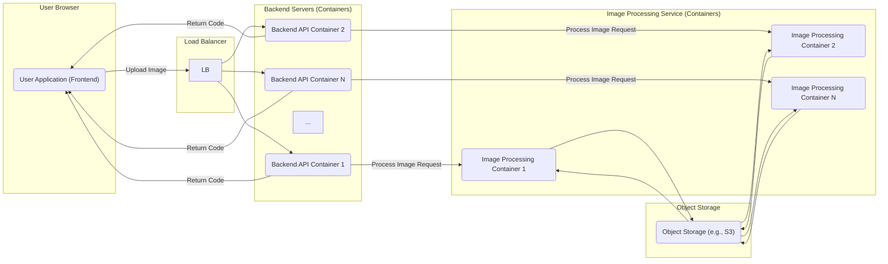

# Project Design Document: Screenshot to Code

**Version:** 1.1
**Date:** October 26, 2023
**Author:** Gemini (AI Language Model)

## 1. Introduction

This document provides an enhanced and detailed design overview of the "screenshot-to-code" project, as found on GitHub at [https://github.com/abi/screenshot-to-code](https://github.com/abi/screenshot-to-code). This revised document aims to provide an even clearer and more comprehensive articulation of the system's architecture, components, data flow, and technologies involved, specifically for threat modeling purposes.

### 1.1. Purpose

The primary purpose of this document is to provide a refined and more detailed understanding of the "screenshot-to-code" project's design. This enhanced clarity will empower stakeholders, particularly security engineers, to conduct more effective analysis of potential security threats and vulnerabilities within the system.

### 1.2. Scope

This document covers the core functionalities and architecture of the "screenshot-to-code" project as understood from the provided GitHub repository. It maintains a focus on the technical aspects directly relevant to security considerations, providing greater depth in key areas. The scope includes:

*   Refined high-level system architecture
*   More detailed descriptions of key components, including potential sub-components
*   Enhanced data flow diagrams illustrating data transformations
*   More specific technology stack overview with potential versioning
*   Expanded deployment considerations, including different environments
*   More detailed initial security considerations, categorized by area

### 1.3. Goals

The goals of this enhanced design document are to:

*   More precisely define the system's boundaries and components with greater granularity.
*   More clearly illustrate the interactions between different parts of the system, including data transformations.
*   Identify the specific technologies and data formats involved in the process.
*   Provide a stronger and more detailed basis for identifying potential threat vectors and attack surfaces.

## 2. System Overview

The "screenshot-to-code" project converts a visual representation of a user interface (a screenshot) into functional code, typically HTML and CSS. The core process involves ingesting an image, performing a multi-stage analysis of its visual elements, and generating corresponding code that aims to accurately replicate the layout, styling, and potentially the semantic structure.

Here's a refined high-level overview of the system:

## 3. Component Details

This section provides a more detailed description of each component identified in the system overview, including potential sub-components and specific functionalities.

*   **Screenshot Capture:**
    *   **Description:** This component is the entry point for receiving the screenshot image from the user.
    *   **Functionality:**
        *   Accepts image file uploads (e.g., PNG, JPG, WebP) with size and type validation.
        *   Potentially supports pasting images directly from the clipboard.
        *   May include client-side image preview functionality.
    *   **Inputs:** Image file data, clipboard data.
    *   **Outputs:** Raw image data (in its original format or a standardized format).

*   **Image Preprocessing:**
    *   **Description:** This component prepares the raw image data for subsequent analysis.
    *   **Functionality:**
        *   **Format Conversion:** Converts the image to a consistent internal format (e.g., RGB).
        *   **Resizing and Normalization:** Adjusts image dimensions and pixel values for optimal processing.
        *   **Noise Reduction:** Applies filters to reduce image noise and artifacts.
        *   **Color Correction:** May adjust brightness, contrast, and saturation.
    *   **Inputs:** Raw image data.
    *   **Outputs:** Processed image data.

*   **Layout Analysis:**
    *   **Description:** This component analyzes the processed image to identify the structural layout of UI elements.
    *   **Functionality:**
        *   **Edge Detection:** Identifies boundaries and outlines of elements.
        *   **Region Proposal:** Proposes potential regions containing UI elements.
        *   **Hierarchical Grouping:** Determines the parent-child relationships between elements.
    *   **Inputs:** Processed image data.
    *   **Outputs:** Data representing the layout structure (e.g., bounding boxes, coordinates, hierarchical relationships).

*   **Text Recognition (OCR):**
    *   **Description:** This component extracts textual content from the image.
    *   **Functionality:**
        *   Identifies text regions within the image.
        *   Performs optical character recognition to convert image text to digital text.
        *   May include language detection and support for multiple languages.
    *   **Inputs:** Processed image data.
    *   **Outputs:** Extracted text content with corresponding location information.

*   **Component Recognition:**
    *   **Description:** This component identifies and classifies individual UI components within the recognized layout.
    *   **Functionality:**
        *   **Object Detection:** Uses machine learning models to identify common UI elements (buttons, text fields, images, icons, etc.).
        *   **Attribute Extraction:** Attempts to identify attributes like text content, color, and size.
        *   **Semantic Interpretation:**  May try to infer the purpose or function of components.
    *   **Inputs:** Processed image data, layout structure data, extracted text content.
    *   **Outputs:** Data representing identified UI components with their types, properties, and associated text.

*   **Code Generation:**
    *   **Description:** This component generates the corresponding code based on the identified components and their layout.
    *   **Functionality:**
        *   **HTML Structure Generation:** Creates the HTML markup using appropriate semantic elements where possible.
        *   **CSS Styling:** Generates CSS rules to match the visual appearance (positioning, colors, fonts, etc.).
        *   **Code Formatting:** Applies formatting rules for readability.
        *   **Potential for Framework-Specific Code:** May have logic to generate code for specific CSS frameworks (e.g., Tailwind CSS, Bootstrap).
    *   **Inputs:** Layout structure data, component identification data, extracted text content.
    *   **Outputs:** Generated code (HTML, CSS).

*   **Code Output & Presentation:**
    *   **Description:** This component presents the generated code to the user and provides options for interaction.
    *   **Functionality:**
        *   **Code Display:** Presents the generated HTML and CSS code in an editable text editor or code viewer with syntax highlighting.
        *   **Download Options:** Allows users to download the generated code as separate HTML and CSS files or a single archive.
        *   **Copy to Clipboard:** Provides functionality to copy the code snippets to the clipboard.
        *   **Potential Preview:** May offer a live preview of the generated UI.
    *   **Inputs:** Generated code (HTML, CSS).
    *   **Outputs:** Displayed code, downloadable files, clipboard data, potentially a rendered preview.

## 4. Data Flow

The following diagram illustrates the flow of data through the system, highlighting key data transformations:

## 5. Technology Stack

This section provides a more specific overview of the likely technologies involved, including potential libraries and frameworks with possible version considerations.

*   **Programming Languages:**
    *   Python (Likely for backend processing, image analysis, machine learning tasks. Potential versions: 3.8+)
    *   JavaScript (Likely for frontend interactions, potentially Node.js for backend services. Potential versions: ES6+)

*   **Libraries and Frameworks:**
    *   **Frontend:**
        *   React, Vue.js, or similar for building the user interface components. (e.g., React v17+, Vue.js v3+)
        *   HTML5, CSS3 for structuring and styling the frontend.
    *   **Backend:**
        *   Flask or Django (Python) for building the API and handling requests. (e.g., Flask v2.0+, Django v3.0+)
        *   Node.js with Express.js could also be used for the backend. (e.g., Node.js v14+, Express.js v4+)
    *   **Image Processing:**
        *   OpenCV (for advanced image manipulation and analysis). (e.g., OpenCV v4.0+)
        *   Pillow (PIL) (for basic image format handling and manipulation). (e.g., Pillow v8.0+)
    *   **OCR (Optical Character Recognition):**
        *   Tesseract OCR engine (potentially with Python wrappers like PyTesseract). (e.g., Tesseract v4.0+)
        *   Cloud-based OCR services like Google Cloud Vision API or AWS Textract.
    *   **Machine Learning:**
        *   TensorFlow or PyTorch for building and training component recognition models. (e.g., TensorFlow v2.0+, PyTorch v1.8+)
        *   Scikit-learn for general machine learning tasks. (e.g., Scikit-learn v0.24+)

*   **Cloud Services (Optional):**
    *   Cloud storage (e.g., AWS S3, Google Cloud Storage, Azure Blob Storage) for temporary storage of uploaded images or generated code.
    *   Cloud-based vision APIs (e.g., Google Cloud Vision API, AWS Rekognition, Azure Computer Vision) for OCR and object detection.
    *   Cloud hosting platforms (e.g., AWS EC2, Google Compute Engine, Azure VMs, Heroku, Netlify, Vercel).

## 6. Deployment Architecture

The deployment architecture can vary significantly based on factors like scalability requirements, cost considerations, and target user base.

*   **Local Execution (Desktop Application):** The entire application is packaged and runs directly on the user's desktop. This eliminates the need for a server but limits accessibility.
*   **Client-Server Model (Web Application):**
    *   **Frontend (Client-side):**  A web browser application built with HTML, CSS, and JavaScript.
    *   **Backend (Server-side):** A server application handling API requests, image processing, and code generation.
    *   **Possible Deployment Environments:**
        *   **Single Server:** All backend components reside on a single server instance.
        *   **Load Balanced Servers:** Multiple backend server instances behind a load balancer for increased availability and performance.
        *   **Containerized Deployment (e.g., Docker, Kubernetes):**  Components are packaged into containers for easier deployment and scaling.
*   **Serverless Deployment:** Utilizing cloud functions (e.g., AWS Lambda, Google Cloud Functions, Azure Functions) to handle specific tasks like image processing and code generation, triggered by events.

A common client-server deployment with containerization might look like this:

## 7. Security Considerations (Detailed)

This section expands on the initial security considerations, categorizing potential threats and vulnerabilities for a more structured analysis.

*   **Input Validation & Sanitization:**
    *   **Image Upload Vulnerabilities:**
        *   Malicious image files designed to exploit image processing libraries (e.g., buffer overflows).
        *   Billion laughs attack or similar XML-based attacks if SVG uploads are allowed.
        *   Ensuring correct `Content-Type` and file signature verification.
    *   **Code Injection (during processing):**
        *   Exploiting vulnerabilities in OCR engines or layout analysis tools through crafted images.

*   **Cross-Site Scripting (XSS):**
    *   **Outputting Generated Code:**
        *   Failing to sanitize the generated HTML and CSS, allowing injection of malicious scripts when displayed to the user.
        *   Ensuring proper encoding of user-provided text extracted via OCR.

*   **Server-Side Vulnerabilities:**
    *   **Authentication and Authorization:**
        *   Lack of proper authentication to restrict access to backend APIs.
        *   Insufficient authorization checks, allowing users to perform actions they shouldn't.
    *   **Injection Attacks:**
        *   SQL injection if a database is used (unlikely for core functionality but possible for user management).
        *   Command injection if the application executes external commands based on user input.
    *   **Dependency Vulnerabilities:**
        *   Using outdated libraries and frameworks with known security flaws.
        *   Lack of a robust dependency management strategy.
    *   **Session Management:**
        *   Insecure session handling, leading to session hijacking or fixation.

*   **Data Security & Privacy:**
    *   **Temporary Storage of Images:**
        *   Ensuring secure storage and deletion of uploaded images.
        *   Implementing appropriate access controls for temporary storage.
    *   **Storage of Generated Code (if applicable):**
        *   Protecting stored code from unauthorized access.
    *   **Privacy Implications:**
        *   Consideration of user data privacy if usage patterns or uploaded images are logged or analyzed.

*   **API Security (if applicable):**
    *   **Rate Limiting:** Protecting against abuse and denial-of-service attacks on the API.
    *   **Input Validation:**  Validating all data received through the API.
    *   **Secure Communication (HTTPS):** Ensuring all communication is encrypted.

*   **Denial of Service (DoS):**
    *   **Resource Exhaustion:**
        *   Attacks targeting resource-intensive image processing tasks.
        *   Lack of proper resource limits and throttling.

*   **Intellectual Property & Copyright:**
    *   While not a direct technical vulnerability, consider the potential for users to upload copyrighted material and the implications of the generated code. This might require disclaimers or usage guidelines.

## 8. Future Considerations

*   **Enhanced Semantic Understanding:**  Improving the ability to generate more semantically correct HTML, beyond just visual replication.
*   **Support for Interactive Elements:**  Generating basic JavaScript for simple interactive elements.
*   **Integration with Design Systems:**  Allowing users to specify a design system to influence the generated code.
*   **Accessibility Considerations:**  Incorporating accessibility best practices into the code generation process.
*   **Code Refactoring and Optimization:**  Implementing techniques to generate more maintainable and efficient code.
*   **Version Control Integration:**  Potentially allowing users to commit generated code to a version control system.

This enhanced design document provides a more granular and detailed understanding of the "screenshot-to-code" project's architecture and functionalities. This deeper insight is crucial for conducting a thorough and effective threat modeling exercise, leading to the identification and mitigation of potential security risks.