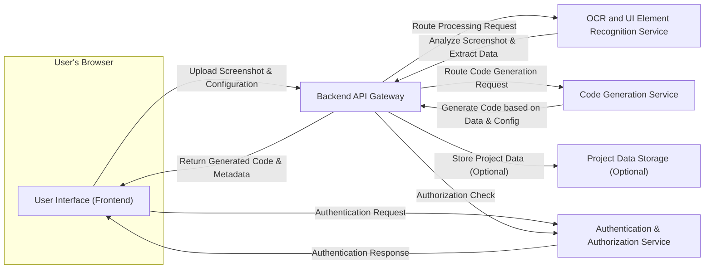

## Project Design Document: Screenshot to Code (Improved)

**1. Introduction**

This document provides a detailed design for the "Screenshot to Code" project, a tool designed to convert images of user interface designs (screenshots) into functional code. This document outlines the system's architecture, components, data flow, and technologies. Its primary purpose is to serve as a foundation for comprehensive threat modeling activities.

**2. Goals and Objectives**

* **Primary Goal:** To enable users to efficiently generate clean and functional code (primarily HTML and CSS, with potential for JavaScript/framework-specific code) directly from UI screenshots.
* **Key Objectives:**
    * **Accuracy:**  Accurately identify a wide range of UI elements (e.g., buttons, text inputs, images, containers, icons) within a screenshot.
    * **Translation:**  Translate identified UI elements and their visual properties (e.g., size, position, color, font) into semantically correct and well-structured code.
    * **User Experience:** Provide an intuitive and user-friendly interface for uploading screenshots, reviewing the identified elements, configuring code generation options, and accessing the generated code.
    * **Configurability:** Offer users options to customize the generated code, such as choosing target frameworks (e.g., Bootstrap, Tailwind CSS), naming conventions, and code formatting preferences.
    * **Extensibility:** Design the system with modularity in mind to allow for future expansion and the addition of support for more code languages, frameworks, and UI element types.

**3. Architecture Overview**

The system employs a modular, client-server architecture with clearly defined responsibilities for each component. This separation of concerns enhances maintainability and scalability.

**4. Component Details**

* **User Interface (Frontend):**
    * **Responsibility:**  Provides the user-facing interface for all interactions with the application.
    * **Functionality:**
        * Secure user authentication and session management.
        * Allows users to upload screenshots via drag-and-drop or file selection, with client-side validation (e.g., file type, size).
        * Displays the uploaded screenshot and potentially highlights identified UI elements for user review.
        * Presents the generated code in a clear, editable code editor with syntax highlighting.
        * Enables users to configure code generation parameters (e.g., target framework, CSS methodology).
        * Handles asynchronous communication with the Backend API Gateway using secure protocols (HTTPS).
        * Provides feedback to the user on the status of processing and potential errors.
    * **Technology:**  Likely built using a modern JavaScript framework like React, Vue.js, or Angular, leveraging HTML5, CSS3, and potentially a UI component library (e.g., Material UI, Ant Design).

* **Backend API Gateway:**
    * **Responsibility:** Acts as the single entry point for all frontend requests, routing them to the appropriate backend services. Enforces security policies and handles cross-cutting concerns.
    * **Functionality:**
        * Receives requests from the frontend and performs initial validation.
        * Authenticates and authorizes user requests before forwarding them to backend services.
        * Implements rate limiting and request throttling to prevent abuse.
        * Handles request routing and load balancing across backend services.
        * Potentially performs request transformation and response aggregation.
        * Provides API documentation and monitoring capabilities.
    * **Technology:**  Could be implemented using API Gateway services offered by cloud providers (e.g., AWS API Gateway, Google Cloud API Gateway, Azure API Management) or open-source solutions like Kong or Tyk.

* **OCR and UI Element Recognition Service:**
    * **Responsibility:**  Processes the uploaded screenshot image to extract textual content and identify and classify UI elements.
    * **Functionality:**
        * Receives image data from the API Gateway.
        * Performs advanced Optical Character Recognition (OCR) to accurately extract text, handling various fonts, sizes, and orientations.
        * Employs computer vision techniques and potentially machine learning models to detect and classify UI elements (e.g., buttons, input fields, images, icons, containers) with their bounding boxes and properties.
        * Returns structured data representing the identified elements, including their type, position, size, text content, and visual attributes (e.g., color, background).
    * **Technology:**  Likely leverages robust cloud-based vision APIs (e.g., Google Cloud Vision API, AWS Rekognition, Azure Computer Vision) for accuracy and scalability. Could also incorporate custom-trained machine learning models for improved element recognition.

* **Code Generation Service:**
    * **Responsibility:**  Transforms the structured data of identified UI elements into functional code based on the user's configuration.
    * **Functionality:**
        * Receives structured UI element data and user configuration parameters from the API Gateway.
        * Translates UI element types and their properties into corresponding code syntax (e.g., HTML tags, CSS styles, framework-specific components).
        * Applies user-defined configurations for target frameworks, styling methodologies (e.g., inline styles, separate CSS files, CSS-in-JS), and naming conventions.
        * Potentially generates basic JavaScript code for interactive elements based on recognized patterns.
        * Returns the generated code in a well-formatted and structured manner.
    * **Technology:**  Likely utilizes template engines (e.g., Jinja2, Handlebars) or code generation libraries specific to the target code languages and frameworks. Could involve a modular design to support different code generation strategies.

* **Project Data Storage (Optional):**
    * **Responsibility:**  Persists project-related data if the application needs to store user projects, generated code, or configurations.
    * **Functionality:**
        * Securely stores uploaded screenshots, generated code snippets, user configurations, and project metadata.
        * Provides mechanisms for users to manage and retrieve their projects.
        * Ensures data integrity and availability.
    * **Technology:**  Could be a relational database (e.g., PostgreSQL, MySQL) or a NoSQL database (e.g., MongoDB, DynamoDB) depending on the data structure and scalability requirements. Cloud-based object storage (e.g., AWS S3, Google Cloud Storage) could be used for storing the actual image files.

* **Authentication & Authorization Service:**
    * **Responsibility:** Manages user authentication and authorization for accessing the application and its resources.
    * **Functionality:**
        * Handles user registration, login, and password management.
        * Issues and verifies authentication tokens (e.g., JWT).
        * Enforces authorization policies to control access to specific features and data based on user roles or permissions.
        * May integrate with third-party identity providers (e.g., OAuth 2.0).
    * **Technology:** Could be implemented using dedicated authentication and authorization services (e.g., Auth0, Okta, AWS Cognito) or open-source solutions.

**5. Data Flow**

The following steps detail the typical data flow within the system:

1. **User Uploads Screenshot and Configuration:** The user interacts with the frontend to upload a screenshot image and configure code generation options.
2. **Frontend Sends Request to API Gateway:** The frontend sends an HTTPS request containing the screenshot and configuration data to the Backend API Gateway. The request includes authentication credentials.
3. **API Gateway Authenticates and Authorizes Request:** The API Gateway verifies the user's identity using the Authentication & Authorization Service and ensures they have the necessary permissions.
4. **API Gateway Routes Request to OCR Service:** The API Gateway routes the screenshot image to the OCR and UI Element Recognition Service for processing.
5. **OCR Service Analyzes Screenshot:** The OCR service performs OCR and UI element detection on the image.
6. **OCR Service Returns Structured Data:** The OCR service sends structured data representing the identified UI elements and text back to the API Gateway.
7. **API Gateway Routes Request to Code Generation Service:** The API Gateway routes the structured element data and user configuration to the Code Generation Service.
8. **Code Generation Service Generates Code:** The Code Generation Service translates the element data into code based on the provided configuration.
9. **Code Generation Service Returns Generated Code:** The Code Generation Service sends the generated code back to the API Gateway.
10. **API Gateway Sends Response to Frontend:** The API Gateway sends the generated code and any relevant metadata back to the frontend.
11. **Frontend Displays Code to User:** The frontend displays the generated code to the user in an interactive editor.
12. **(Optional) API Gateway Stores Project Data:** If persistence is enabled, the API Gateway may trigger the storage of the screenshot, generated code, and configurations in the Project Data Storage.

**6. Technology Stack**

* **Frontend:**
    * JavaScript (ES6+)
    * React, Vue.js, or Angular
    * HTML5
    * CSS3 (and potentially preprocessors like Sass or Less)
    * UI Framework (e.g., Material UI, Tailwind CSS, Ant Design)
    * State Management (e.g., Redux, Vuex, Context API)
* **Backend API Gateway:**
    * Node.js with Express, Python with Flask/FastAPI, or Java with Spring Boot
    * Cloud Provider API Gateway Service (AWS, Google Cloud, Azure)
* **OCR and UI Element Recognition Service:**
    * Google Cloud Vision API, AWS Rekognition, or Azure Computer Vision
    * Potentially: TensorFlow, PyTorch for custom model development
* **Code Generation Service:**
    * Node.js, Python, or Java
    * Template Engines (e.g., Jinja2, Handlebars, EJS)
    * Code Generation Libraries (e.g., specific to target frameworks)
* **Project Data Storage (Optional):**
    * Relational Databases: PostgreSQL, MySQL
    * NoSQL Databases: MongoDB, DynamoDB
    * Cloud Object Storage: AWS S3, Google Cloud Storage, Azure Blob Storage
* **Authentication & Authorization Service:**
    * Auth0, Okta, AWS Cognito, Firebase Authentication
    * OpenID Connect, OAuth 2.0
* **Deployment:**
    * Cloud Platform (AWS, Google Cloud, Azure)
    * Containerization (Docker)
    * Orchestration (Kubernetes)
    * Serverless Functions (AWS Lambda, Google Cloud Functions, Azure Functions)

**7. Deployment Model**

The application is designed for cloud deployment to leverage scalability and reliability.

* **Frontend:** Deployed as a Single Page Application (SPA) hosted on a CDN (e.g., AWS S3 with CloudFront, Google Cloud Storage with Cloud CDN) for optimal performance.
* **Backend API Gateway:** Deployed as a managed API Gateway service or as a containerized application on a managed container service (e.g., AWS ECS, Google Kubernetes Engine, Azure Kubernetes Service) for scalability and resilience.
* **OCR and UI Element Recognition Service:** Utilizes cloud-based vision APIs, requiring proper API key management and secure integration.
* **Code Generation Service:** Can be deployed as a set of microservices, either as serverless functions or containerized applications, allowing for independent scaling and deployment.
* **Project Data Storage:** Managed database services offered by cloud providers (e.g., AWS RDS, Google Cloud SQL, Azure SQL Database) or managed NoSQL database services are suitable.
* **Authentication & Authorization Service:**  Leverages a managed authentication service or a self-hosted solution deployed within the cloud environment.

**8. Security Considerations (Pre-Threat Modeling)**

This section outlines key security considerations that will be the focus of the subsequent threat modeling exercise.

* **Authentication and Authorization:**
    * Secure implementation of user authentication mechanisms to verify user identity.
    * Robust authorization policies to control access to API endpoints and resources based on user roles and permissions.
    * Protection against common authentication attacks (e.g., brute-force, credential stuffing).
    * Secure storage of user credentials (using hashing and salting).
* **Input Validation and Sanitization:**
    * Strict validation of all input data received from the frontend, including uploaded screenshots and configuration parameters, to prevent injection attacks (e.g., SQL injection, cross-site scripting).
    * Sanitization of user-provided data before processing and storage.
    * File type and size validation for uploaded screenshots to prevent malicious uploads.
* **Data Transmission Security:**
    * Mandatory use of HTTPS for all communication between the frontend and backend to encrypt data in transit.
    * Secure configuration of TLS certificates.
* **API Security:**
    * Protection against common API vulnerabilities (e.g., broken authentication, excessive data exposure, lack of resources and rate limiting).
    * Implementation of rate limiting and request throttling to prevent denial-of-service attacks.
    * Secure handling of API keys and secrets.
* **OCR Service Security:**
    * Secure communication and data transfer with the chosen OCR service provider, ensuring data privacy and confidentiality.
    * Proper management of API keys and credentials for the OCR service.
* **Code Generation Security:**
    * Preventing the generation of potentially malicious or insecure code.
    * Implementing safeguards to avoid code injection vulnerabilities in the generated output.
* **Data Storage Security:**
    * Encryption of sensitive data at rest in the database.
    * Secure access controls and permissions for the database.
    * Regular backups and disaster recovery plans.
* **Dependency Management:**
    * Regular scanning and updating of third-party libraries and dependencies to address known vulnerabilities.
    * Use of software composition analysis tools.
* **Logging and Monitoring:**
    * Comprehensive logging of security-related events for auditing and incident response.
    * Real-time monitoring of system health and security metrics.
* **Cross-Site Scripting (XSS) Prevention:**
    * Implementing appropriate output encoding and sanitization techniques in the frontend to prevent XSS attacks.
* **Cross-Site Request Forgery (CSRF) Prevention:**
    * Implementing CSRF protection mechanisms (e.g., anti-CSRF tokens).

**9. Assumptions and Constraints**

* **Assumptions:**
    * Users have access to a modern web browser with JavaScript enabled.
    * The network connection between the user and the application is reliable and secure.
    * The quality and clarity of the uploaded screenshots are sufficient for accurate OCR and UI element recognition.
    * Users understand the limitations of automated code generation.
* **Constraints:**
    * The accuracy of code generation is inherently limited by the complexity and visual clarity of the UI in the screenshot.
    * The system may not be able to perfectly replicate complex UI interactions, animations, or dynamic behavior without manual adjustments.
    * Support for specific niche UI frameworks or libraries may be initially limited and require future development.
    * The cost of using cloud-based vision APIs can impact the overall operational cost.

This improved design document provides a more detailed and comprehensive understanding of the "Screenshot to Code" project. It incorporates additional considerations and clarifies various aspects of the system, making it a more robust foundation for effective threat modeling.