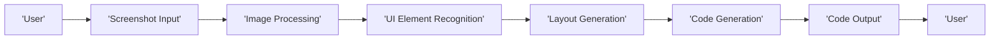
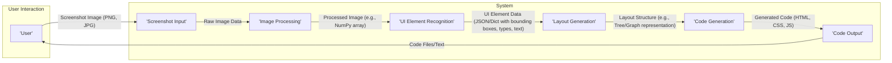

# Project Design Document: Screenshot to Code

**Version:** 1.1
**Date:** October 26, 2023
**Author:** AI Architecture Expert

## 1. Introduction

This document outlines the design of the "screenshot-to-code" project, as found on GitHub ([https://github.com/abi/screenshot-to-code](https://github.com/abi/screenshot-to-code)). The purpose of this document is to provide a clear and detailed description of the system's architecture, components, and data flow. This document will serve as the foundation for future threat modeling activities, providing the necessary context to identify potential vulnerabilities and attack vectors.

## 2. Goals

*   Clearly define the system's architecture and components with sufficient technical detail.
*   Describe the data flow within the system, including data transformations and formats.
*   Identify key technologies, dependencies, and potential integration points.
*   Provide a robust basis for identifying potential security vulnerabilities and their impact.
*   Outline basic error handling and edge case considerations.

## 3. High-Level Architecture

The "screenshot-to-code" project aims to convert a visual representation (screenshot) of a user interface into corresponding code. The high-level architecture can be represented as follows:

**Description:**

*   **User:** The entity interacting with the system, providing the screenshot and receiving the generated code. This could be a human user or another system via an API.
*   **Screenshot Input:** The mechanism through which the user provides the screenshot. This component handles the initial reception and validation of the image data.
*   **Image Processing:**  The stage where the input image is prepared for analysis. This involves transformations to optimize the image for the UI element recognition algorithms.
*   **UI Element Recognition:** The core component responsible for identifying, classifying, and extracting information from UI elements within the image. This likely involves sophisticated Machine Learning models and potentially Optical Character Recognition (OCR).
*   **Layout Generation:**  This component interprets the recognized UI elements and their spatial relationships to determine the overall layout structure and hierarchy of the UI.
*   **Code Generation:**  The process of translating the identified UI elements, their attributes, and the determined layout into actual code in a specified target language or framework.
*   **Code Output:** The mechanism through which the generated code is presented to the user or another system.

## 4. Detailed Component Design

This section provides a more detailed description of each component identified in the high-level architecture, focusing on functionality, data handling, and potential security considerations.

### 4.1. Screenshot Input

*   **Functionality:**
    *   Receives the screenshot image from the user through various methods.
    *   Performs initial validation of the image (e.g., file type, size, basic integrity checks).
    *   Handles potential errors during image upload or transmission.
*   **Possible Implementation:**
    *   Web-based file upload form with `multipart/form-data` encoding.
    *   Clipboard integration leveraging browser APIs.
    *   REST API endpoint accepting image data (e.g., base64 encoded or direct file upload).
*   **Data Format:** Accepts common image formats (e.g., PNG, JPG, JPEG).
*   **Considerations:**
    *   **Security:** Vulnerable to malicious file uploads (e.g., polyglot files, oversized files leading to denial-of-service). Input validation is crucial.
    *   **Error Handling:** Needs to handle cases where the uploaded file is not a valid image or exceeds size limits.

### 4.2. Image Processing

*   **Functionality:**
    *   Prepares the input image for optimal processing by the UI Element Recognition component.
    *   May involve resizing, grayscale conversion, noise reduction, contrast adjustment, and normalization.
    *   Could involve techniques to enhance text clarity for OCR.
*   **Possible Operations:**
    *   Resizing using libraries like Pillow or OpenCV.
    *   Grayscale conversion using color space transformations.
    *   Noise reduction using filters (e.g., Gaussian blur, median filter).
    *   Normalization to standardize pixel values.
*   **Dependencies:** Image processing libraries (e.g., OpenCV, Pillow).
*   **Data Format:** Transforms the input image into a standardized format suitable for the next stage (e.g., a NumPy array).
*   **Considerations:**
    *   **Security:** Potential vulnerabilities in image processing libraries could be exploited if not properly managed.
    *   **Performance:** Image processing can be computationally intensive; optimization is important.

### 4.3. UI Element Recognition

*   **Functionality:**
    *   Identifies and localizes UI elements within the processed image using object detection techniques.
    *   Classifies each identified element into predefined categories (e.g., button, text input, label, image, icon, dropdown).
    *   Performs Optical Character Recognition (OCR) on text-based elements to extract textual content.
    *   May involve post-processing to refine element boundaries and classifications.
*   **Key Aspects:**
    *   **Object Detection:** Utilizes trained Machine Learning models (e.g., Faster R-CNN, YOLO, DETR) for bounding box prediction.
    *   **Object Classification:** Employs classification models (often integrated with object detection models) to determine element types.
    *   **Text Recognition (OCR):** Leverages OCR engines (e.g., Tesseract, Google Cloud Vision API) to extract text.
*   **Technology:** Likely involves trained Machine Learning models (e.g., Convolutional Neural Networks - CNNs) implemented using frameworks like TensorFlow or PyTorch.
*   **Output:**  Structured data representing the identified UI elements, including:
    *   Bounding box coordinates (e.g., x_min, y_min, x_max, y_max).
    *   Element type (e.g., "button", "text_field", "image").
    *   Extracted text content (if applicable).
    *   Confidence scores for detection and classification.
    *   Potentially visual attributes like color, font (if inferable).
*   **Considerations:**
    *   **Security:**  Vulnerable to adversarial attacks on the ML models, potentially leading to misclassification or missed detections. Data used for training the models needs to be secure and representative.
    *   **Accuracy:** The accuracy of this component is critical for the overall system's success. Performance can be affected by image quality, element complexity, and model training data.

### 4.4. Layout Generation

*   **Functionality:**
    *   Analyzes the structured output from the UI Element Recognition component to infer the hierarchical layout and spatial relationships between UI elements.
    *   Determines the structure of containers, grids, and other layout patterns.
    *   May involve rule-based systems, graph algorithms, or further ML models to understand layout semantics.
*   **Possible Approaches:**
    *   Analyzing spatial proximity and alignment of elements.
    *   Identifying parent-child relationships based on containment.
    *   Using graph-based representations to model the UI structure.
*   **Output:**  A structured representation of the UI layout, defining:
    *   The hierarchy of UI elements (e.g., a button nested within a div).
    *   Layout properties (e.g., relative positioning, grid structure).
    *   Potential grouping of elements.
*   **Considerations:**
    *   **Security:**  If layout generation relies on external data or models, those sources need to be secured.
    *   **Complexity:**  Inferring complex layouts can be challenging; the algorithm needs to handle various UI structures.

### 4.5. Code Generation

*   **Functionality:**
    *   Translates the structured layout and identified UI elements into code in a specified target language or framework.
    *   Maps recognized UI elements to corresponding code components or elements (e.g., a "button" element to an `<button>` tag in HTML).
    *   Generates styling information (e.g., CSS) based on inferred visual attributes and layout.
    *   Constructs the code structure according to best practices for the target language.
*   **Key Aspects:**
    *   **Target Language Selection:**  The system needs to support or be configurable for different output languages (e.g., HTML/CSS, React JSX, Flutter Dart, Swift UI).
    *   **Component Mapping:**  A mapping mechanism is required to link recognized UI element types to code constructs.
    *   **Style Generation:**  May involve heuristics or pre-defined style templates.
    *   **Code Templating:**  Template engines (e.g., Jinja2, Handlebars) can be used to generate code snippets.
*   **Considerations:**
    *   **Security:**  Major risk of generating insecure code (e.g., including user-provided text without proper sanitization, leading to XSS vulnerabilities). Code generation logic needs to be carefully designed to prevent this.
    *   **Customization:** Users may need options to customize the generated code (e.g., styling, component libraries).

### 4.6. Code Output

*   **Functionality:**
    *   Presents the generated code to the user in a usable format.
    *   May offer options to download the code as files or copy it to the clipboard.
    *   Could provide a preview of the generated UI (if applicable).
*   **Possible Methods:**
    *   Displaying the code in a syntax-highlighted text editor within the application.
    *   Providing a download link for generated code files (e.g., `.html`, `.css`, `.js`).
    *   "Copy to clipboard" functionality.
    *   Potentially integrating with online code editors or repositories.
*   **Data Format:**  Text-based code files in the target language.
*   **Considerations:**
    *   **Security:**  Ensure the output mechanism itself doesn't introduce vulnerabilities (e.g., serving generated code directly without proper content security policies).
    *   **Usability:**  The output should be easy for the user to understand and use.

## 5. Data Flow Diagram

**Data Flow Description:**

1. The **User** provides a **Screenshot Image** (typically in formats like PNG or JPG) to the **Screenshot Input** component.
2. The **Screenshot Input** receives the **Raw Image Data** and passes it to the **Image Processing** component.
3. The **Image Processing** component transforms the image into a **Processed Image** (e.g., a NumPy array) suitable for analysis and sends it to the **UI Element Recognition** component.
4. The **UI Element Recognition** component analyzes the image and outputs **UI Element Data**, typically in a structured format like JSON or a Python dictionary, containing details about each detected element.
5. The **UI Element Data** is used by the **Layout Generation** component to create a **Layout Structure**, which could be represented as a tree or graph.
6. The **Layout Structure** is fed into the **Code Generation** component, which generates the **Generated Code** in the target language.
7. The **Generated Code** is presented to the **User** as **Code Files/Text** via the **Code Output** component.

## 6. Technology Stack

*   **Programming Languages:** Python (likely for backend, ML components, and image processing), JavaScript (likely for frontend if web-based).
*   **Machine Learning Libraries:** TensorFlow, PyTorch, OpenCV, scikit-learn, Transformers (for advanced NLP tasks in OCR).
*   **Web Framework (if applicable):** Flask, Django, FastAPI (for backend), React, Vue.js, Angular (for frontend).
*   **Image Processing Libraries:** Pillow, OpenCV, scikit-image.
*   **OCR Libraries:** Tesseract (with PyTesseract wrapper), Google Cloud Vision API, Azure Computer Vision API.
*   **Code Generation Libraries/Templates:** Jinja2, Mako, Handlebars, potentially custom code generation logic.
*   **Data Storage (if needed):**  Potentially for storing user data, processed images, or model artifacts (e.g., PostgreSQL, MongoDB, cloud storage).
*   **Containerization:** Docker for packaging and deployment.
*   **Orchestration:** Kubernetes (if deployed at scale).

## 7. Deployment Model

The deployment model significantly impacts the security considerations.

*   **Web Application:** Deployed on a cloud platform (e.g., AWS, Google Cloud, Azure) using services like EC2, Google Compute Engine, or Azure VMs, potentially with containerization (Docker, Kubernetes). This model introduces web application security concerns (OWASP Top 10).
*   **Command-Line Interface (CLI) Tool:** Distributed as a standalone executable or package (e.g., using PyInstaller or similar). Security focuses on the distribution mechanism and potential vulnerabilities in the packaged application.
*   **Desktop Application:** Packaged for specific operating systems (e.g., Windows, macOS, Linux) using tools like Electron or native packaging. Security considerations include local file access and potential vulnerabilities in embedded web technologies (if using Electron).

## 8. Security Considerations (Detailed for Threat Modeling)

This section expands on the initial security considerations, providing more specific examples of potential threats related to each component and data flow.

*   **Screenshot Input:**
    *   **Threat:** Malicious file upload (e.g., uploading a file disguised as an image that exploits vulnerabilities in image processing libraries).
    *   **Mitigation:** Strict input validation (file type, size, magic numbers), sanitization, and potentially sandboxing the image processing.
    *   **Threat:** Denial-of-service (DoS) by uploading extremely large images.
    *   **Mitigation:** Implementing file size limits and request rate limiting.
*   **Image Processing:**
    *   **Threat:** Exploiting vulnerabilities in image processing libraries (e.g., buffer overflows).
    *   **Mitigation:** Keeping libraries up-to-date, using secure coding practices, and potentially sandboxing the processing.
*   **UI Element Recognition:**
    *   **Threat:** Adversarial attacks on ML models, causing misclassification of elements or injection of fake elements.
    *   **Mitigation:** Robust model training with diverse and clean data, input sanitization, and potentially adversarial training techniques.
    *   **Threat:** Data poisoning of the training data, leading to biased or inaccurate predictions.
    *   **Mitigation:** Secure the training data pipeline and implement data integrity checks.
*   **Layout Generation:**
    *   **Threat:** If layout generation relies on external data sources, those sources could be compromised, leading to incorrect layout interpretations.
    *   **Mitigation:** Secure communication and authentication with external data sources.
*   **Code Generation:**
    *   **Threat:** Generation of code with Cross-Site Scripting (XSS) vulnerabilities if user-provided text from the screenshot is directly inserted into the code without sanitization.
    *   **Mitigation:** Strict output encoding and sanitization of any text extracted from the image before including it in the generated code. Use parameterized queries or equivalent mechanisms if database interactions are involved (though less likely in this specific project).
    *   **Threat:** Generation of code with other injection vulnerabilities (e.g., command injection if the generated code interacts with the operating system in an unsafe way).
    *   **Mitigation:** Carefully design the code generation logic to avoid constructing commands or queries from potentially untrusted data.
*   **Code Output:**
    *   **Threat:** If the generated code is displayed directly in a web browser without proper Content Security Policy (CSP), it could be vulnerable to XSS if the generated code itself contains malicious scripts (even if unintentionally).
    *   **Mitigation:** Implement a strong CSP to restrict the execution of scripts and other resources.
    *   **Threat:** If the generated code is offered for download, ensure the download mechanism is secure and doesn't allow for path traversal vulnerabilities.
    *   **Mitigation:** Use secure file handling practices and avoid constructing file paths from user input.
*   **General Considerations:**
    *   **Authentication and Authorization (if web-based):** Secure user accounts and restrict access to sensitive functionalities.
    *   **Data Security:** Protect the confidentiality and integrity of any stored data (e.g., user uploads, model artifacts). Use encryption at rest and in transit.
    *   **Dependency Management:** Regularly update dependencies to patch known vulnerabilities. Use dependency scanning tools.
    *   **Logging and Monitoring:** Implement comprehensive logging to detect and respond to security incidents.

## 9. Error Handling and Edge Cases

*   **Screenshot Input:** Handle cases where the uploaded file is not a valid image, exceeds size limits, or is corrupted. Provide informative error messages to the user.
*   **Image Processing:** Implement error handling for issues during image manipulation (e.g., unsupported formats).
*   **UI Element Recognition:** Handle cases where no UI elements are detected or the confidence scores are low. Consider providing feedback to the user or allowing manual correction.
*   **Layout Generation:** Address scenarios with ambiguous or complex layouts.
*   **Code Generation:** Handle cases where the system cannot map a recognized element to a code component. Provide fallback mechanisms or inform the user.
*   **General:** Implement global exception handling to prevent unexpected crashes and log errors appropriately.

## 10. Future Considerations

*   **Support for more UI frameworks and languages.**
*   **Improved accuracy and robustness of UI element recognition, especially for complex UIs.**
*   **Customization options for code generation and styling, allowing users to influence the output.**
*   **Integration with design tools (e.g., Figma, Sketch) for a more seamless workflow.**
*   **Real-time screenshot processing or processing of screen recordings.**
*   **Incorporating accessibility considerations into the generated code.**

This improved document provides a more detailed and technically rich description of the "screenshot-to-code" project, making it a more effective foundation for comprehensive threat modeling activities. The added details about data formats, potential vulnerabilities, and error handling provide a clearer picture of the system's inner workings and potential attack surfaces.