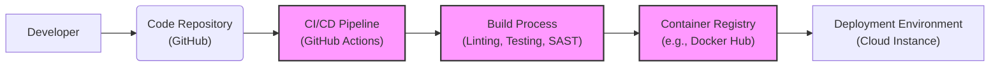

# BUSINESS POSTURE

- Business Priorities and Goals:
 - Priority 1: Rapid UI Prototyping. The primary goal is to enable users to quickly convert UI screenshots into functional code, significantly accelerating the UI development process.
 - Priority 2: Ease of Use. The tool should be simple and intuitive to use, requiring minimal technical expertise to generate code from screenshots.
 - Priority 3: Code Accuracy and Quality. While speed is important, the generated code should be reasonably accurate and of sufficient quality to be a useful starting point for developers.
 - Priority 4: Platform Agnostic Code Generation. Support for generating code in various popular frameworks and technologies (e.g., HTML/CSS/JS, React, Vue) to cater to a wider range of users.

- Business Risks:
 - Risk 1: Inaccurate Code Generation. If the tool generates inaccurate or low-quality code, it may lead to rework and negate the time-saving benefits, potentially damaging user trust.
 - Risk 2: Security Vulnerabilities in Generated Code. If the code generation process introduces security vulnerabilities into the output code, it could expose users' applications to security risks.
 - Risk 3: Data Privacy Concerns. If screenshots contain sensitive information (e.g., personal data, confidential designs), improper handling or storage of these screenshots could lead to data breaches and privacy violations.
 - Risk 4: Availability and Reliability. Downtime or unreliable performance of the tool could disrupt users' workflows and hinder their development processes.
 - Risk 5: Intellectual Property Infringement. If the tool inadvertently generates code that infringes on existing intellectual property, it could lead to legal issues.

# SECURITY POSTURE

- Existing Security Controls:
 - security control: HTTPS for web application access. (Assumed standard practice for web applications, not explicitly stated in the repository but highly likely).
 - security control: Input sanitization on the frontend. (Assumed basic frontend validation to prevent obvious client-side issues, not explicitly stated).
 - accepted risk: Limited security focus in initial open-source project phase. Security is likely not the primary focus in the early stages of this project, typical for many open-source initiatives prioritizing functionality and speed of development.
 - accepted risk: Reliance on community contributions for security improvements. Security enhancements and vulnerability patching may depend on community contributions, which can be less predictable than dedicated security teams.

- Recommended Security Controls:
 - recommended security control: Server-side input validation and sanitization. Implement robust server-side validation to prevent injection attacks and ensure data integrity.
 - recommended security control: Regular dependency scanning.  Automate scanning of project dependencies for known vulnerabilities to mitigate supply chain risks.
 - recommended security control: Secure code review process. Implement code review practices, including security-focused reviews, to identify and address potential vulnerabilities before deployment.
 - recommended security control: Security testing (SAST/DAST). Integrate static and dynamic application security testing tools into the development pipeline to automatically detect security flaws.
 - recommended security control: Rate limiting and abuse prevention. Implement rate limiting to protect against denial-of-service attacks and abuse of the service.
 - recommended security control: Data minimization and secure storage of uploaded screenshots. Minimize the storage of uploaded screenshots and implement secure storage practices if screenshots are retained temporarily.

- Security Requirements:
 - Authentication:
  - requirement: For public, open-source version, authentication might not be strictly necessary for basic functionality. However, consider authentication for features like saving projects, user preferences, or accessing more advanced features.
  - requirement: If user accounts are introduced, implement strong password policies and secure password storage (hashing and salting).
 - Authorization:
  - requirement: Authorization might be less relevant in a basic version. If user accounts and projects are introduced, implement authorization to control access to user-specific data and features.
 - Input Validation:
  - requirement: Implement comprehensive input validation on both the client-side and server-side to prevent injection attacks (e.g., cross-site scripting, command injection) and ensure data integrity. Validate uploaded screenshots (file type, size, etc.) and any user-provided parameters.
 - Cryptography:
  - requirement: Use HTTPS to encrypt communication between the user's browser and the server to protect data in transit.
  - requirement: If sensitive data is stored (even temporarily), consider encryption at rest. For this project, screenshot data might be considered sensitive depending on its content.

# DESIGN

- C4 CONTEXT

```mermaid
graph LR
    subgraph "Screenshot to Code Tool"
        A("Screenshot to Code Web Application")
    end
    B["Web Browser"] --> A
    C["Code Editor"] <-- A
    D["Developer"] --> B
    D --> C
    style A fill:#f9f,stroke:#333,stroke-width:2px
```

- C4 CONTEXT Elements:
 - Element:
  - Name: Web Browser
  - Type: User
  - Description: Used by developers to access and interact with the "Screenshot to Code Web Application".
  - Responsibilities: Accessing the web application, uploading screenshots, viewing generated code, downloading generated code.
  - Security controls: Browser security features (e.g., Content Security Policy enforced by the web application), user-managed browser security settings.
 - Element:
  - Name: Screenshot to Code Web Application
  - Type: Software System
  - Description: The core application that takes screenshots as input and generates code.
  - Responsibilities: Receiving screenshots from users, processing screenshots to generate code, providing generated code to users, managing user sessions (if applicable).
  - Security controls: Input validation, output sanitization, HTTPS, authentication and authorization (if implemented), rate limiting, security logging and monitoring.
 - Element:
  - Name: Code Editor
  - Type: Software System
  - Description: Used by developers to edit and utilize the code generated by the "Screenshot to Code Web Application".
  - Responsibilities: Receiving and storing generated code, allowing developers to modify and integrate the code into their projects.
  - Security controls: Code editor security features (e.g., plugin security, secure file handling), developer-managed security practices within the code editor.
 - Element:
  - Name: Developer
  - Type: Person
  - Description: The user who utilizes the "Screenshot to Code Web Application" to accelerate UI development.
  - Responsibilities: Uploading relevant screenshots, reviewing and adapting generated code, integrating generated code into projects, ensuring the security of the final application.
  - Security controls: Secure coding practices, awareness of security risks in generated code, responsible use of the tool.

- C4 CONTAINER

```mermaid
graph LR
    subgraph "Screenshot to Code Web Application"
        A["Web Application" <br> (Frontend)]
        B["API Server" <br> (Backend)]
        C["Code Generation Engine"]
        D["Screenshot Storage" <br> (Temporary)]
        A --> B
        B --> C
        B --> D
    end
    E["Web Browser"] --> A
    F["Code Editor"] <-- A
    style A fill:#f9f,stroke:#333,stroke-width:2px
    style B fill:#f9f,stroke:#333,stroke-width:2px
    style C fill:#f9f,stroke:#333,stroke-width:2px
    style D fill:#f9f,stroke:#333,stroke-width:2px
```

- C4 CONTAINER Elements:
 - Element:
  - Name: Web Application (Frontend)
  - Type: Container
  - Description:  The client-side application, likely built with JavaScript frameworks (e.g., React, Vue), responsible for user interaction, uploading screenshots, displaying generated code, and communicating with the API Server.
  - Responsibilities: Rendering user interface, handling user input, uploading screenshots to API Server, displaying generated code received from API Server.
  - Security controls: Client-side input validation, output encoding, Content Security Policy, secure handling of user sessions (if applicable).
 - Element:
  - Name: API Server (Backend)
  - Type: Container
  - Description: The server-side application, likely built with Python, Node.js, or similar, responsible for handling API requests from the Frontend, orchestrating code generation, and managing temporary screenshot storage.
  - Responsibilities: Receiving screenshot uploads, authenticating requests (if authentication is implemented), routing requests to Code Generation Engine, managing temporary storage of screenshots, providing generated code to Frontend.
  - Security controls: Server-side input validation, authorization, rate limiting, security logging, secure API design, protection against common web application vulnerabilities (OWASP Top 10), secure configuration management.
 - Element:
  - Name: Code Generation Engine
  - Type: Container
  - Description: The core component responsible for processing screenshots and generating code. This might involve image processing, OCR, and AI/ML models.
  - Responsibilities: Receiving screenshots from API Server, analyzing screenshots, generating code based on screenshot content, returning generated code to API Server.
  - Security controls: Secure coding practices within the engine, input validation of screenshot data, protection of any internal models or algorithms, resource management to prevent denial-of-service.
 - Element:
  - Name: Screenshot Storage (Temporary)
  - Type: Container
  - Description: Temporary storage for uploaded screenshots during the code generation process. This could be in-memory storage, temporary files on disk, or a short-lived database.
  - Responsibilities: Temporarily storing uploaded screenshots, providing access to screenshots for the Code Generation Engine, securely deleting screenshots after processing or after a short period.
  - Security controls: Secure storage configuration, access control to storage, data retention policies (minimize retention), secure deletion of data, encryption at rest if sensitive data is stored.

- DEPLOYMENT

- Deployment Options:
 - Option 1: Local Execution (Developer Machine). The entire application (Frontend, Backend, Code Generation Engine) could be packaged as a desktop application or run locally using Docker Compose for development and testing.
 - Option 2: Cloud Deployment (Single Instance). Deploy all containers (Frontend, Backend, Code Generation Engine, Screenshot Storage) onto a single cloud instance (e.g., EC2, VM) for a simple, self-contained deployment.
 - Option 3: Cloud Deployment (Containerized and Scalable). Deploy containers using a container orchestration platform like Kubernetes or cloud container services (e.g., ECS, Google Kubernetes Engine) for scalability, resilience, and easier management.

- Selected Deployment Architecture: Cloud Deployment (Single Instance)

```mermaid
graph LR
    subgraph "Cloud Instance"
        A["Web Application Container" <br> (Frontend)]
        B["API Server Container" <br> (Backend)]
        C["Code Generation Engine Container"]
        D["Screenshot Storage Volume" <br> (Temporary)]
        E["Load Balancer"]
        F["Internet"]
        F --> E
        E --> A
        E --> B
        E --> C
        A -->> B
        B -->> C
        B -->> D
    end
    style A fill:#f9f,stroke:#333,stroke-width:2px
    style B fill:#f9f,stroke:#333,stroke-width:2px
    style C fill:#f9f,stroke:#333,stroke-width:2px
    style D fill:#f9f,stroke:#333,stroke-width:2px
    style E fill:#ccf,stroke:#333,stroke-width:2px
```

- DEPLOYMENT Elements:
 - Element:
  - Name: Web Application Container (Frontend)
  - Type: Container
  - Description: Docker container running the Frontend Web Application.
  - Responsibilities: Serving the static frontend assets, handling user requests, communicating with the API Server Container.
  - Security controls: Container image scanning for vulnerabilities, minimal container image, regular patching of container image, network policies to restrict container communication.
 - Element:
  - Name: API Server Container (Backend)
  - Type: Container
  - Description: Docker container running the Backend API Server.
  - Responsibilities: Handling API requests, orchestrating code generation, managing temporary screenshot storage, interacting with the Code Generation Engine Container.
  - Security controls: Container image scanning for vulnerabilities, minimal container image, regular patching of container image, network policies to restrict container communication, secure API configuration, input validation, rate limiting.
 - Element:
  - Name: Code Generation Engine Container
  - Type: Container
  - Description: Docker container running the Code Generation Engine.
  - Responsibilities: Processing screenshots and generating code.
  - Security controls: Container image scanning for vulnerabilities, minimal container image, regular patching of container image, network policies to restrict container communication, secure configuration of the engine, resource limits to prevent denial-of-service.
 - Element:
  - Name: Screenshot Storage Volume (Temporary)
  - Type: Storage Volume
  - Description: Persistent volume attached to the API Server Container for temporary storage of uploaded screenshots.
  - Responsibilities: Providing temporary storage for screenshots.
  - Security controls: Access control to the volume, encryption at rest (if necessary), secure deletion of data on volume, monitoring volume usage.
 - Element:
  - Name: Load Balancer
  - Type: Network Component
  - Description: Distributes incoming traffic from the Internet to the Web Application, API Server, and Code Generation Engine Containers.
  - Responsibilities: Load balancing, SSL termination, routing traffic.
  - Security controls: DDoS protection, SSL/TLS configuration, access control lists, web application firewall (WAF) if needed.
 - Element:
  - Name: Internet
  - Type: Network
  - Description: Public internet through which users access the application.
  - Responsibilities: Providing network connectivity for users.
  - Security controls: N/A - external network, focus on securing application and infrastructure exposed to the internet.

- BUILD



- BUILD Process:
 - Element:
  - Name: Developer
  - Type: Person
  - Description: Software developer writing and committing code changes.
  - Responsibilities: Writing code, performing local testing, committing code to the repository.
  - Security controls: Secure coding practices, local development environment security.
 - Element:
  - Name: Code Repository (GitHub)
  - Type: Software System
  - Description: Git repository hosted on GitHub, storing the project's source code.
  - Responsibilities: Version control, source code management, triggering CI/CD pipeline.
  - Security controls: Access control to repository, branch protection, audit logging, vulnerability scanning of repository dependencies (GitHub Dependabot).
 - Element:
  - Name: CI/CD Pipeline (GitHub Actions)
  - Type: Automation System
  - Description: Automated pipeline defined using GitHub Actions to build, test, and publish the application.
  - Responsibilities: Automating build process, running tests, performing security checks, building container images, publishing artifacts.
  - Security controls: Secure pipeline configuration, access control to pipeline definitions, secret management for credentials, audit logging of pipeline execution.
 - Element:
  - Name: Build Process (Linting, Testing, SAST)
  - Type: Process
  - Description: Steps within the CI/CD pipeline to compile code, run linters and static analysis security testing (SAST) tools, and execute unit and integration tests.
  - Responsibilities: Code quality checks, vulnerability detection, ensuring code functionality.
  - Security controls: SAST tools integration, linting rules for security best practices, comprehensive test suite, fail-fast mechanism on security failures.
 - Element:
  - Name: Container Registry (e.g., Docker Hub)
  - Type: Software System
  - Description: Registry for storing and distributing Docker container images.
  - Responsibilities: Storing built container images, providing access to container images for deployment.
  - Security controls: Access control to registry, container image scanning for vulnerabilities (registry vulnerability scanning), secure image signing (if implemented).
 - Element:
  - Name: Deployment Environment (Cloud Instance)
  - Type: Environment
  - Description: Target environment where the application is deployed and running (e.g., cloud instance as described in Deployment section).
  - Responsibilities: Running the application, providing runtime environment.
  - Security controls: Infrastructure security controls (OS hardening, firewall, intrusion detection), runtime security monitoring, regular patching of infrastructure.

# RISK ASSESSMENT

- Critical Business Processes:
 - Process 1: UI Development Workflow. The primary business process is accelerating the UI development workflow for users by providing a tool to quickly generate code from UI screenshots. Disruption or failure of this tool directly impacts the speed and efficiency of UI development.
 - Process 2: Code Generation Accuracy and Reliability. The accuracy and reliability of the code generation process are critical. Inaccurate or unreliable code generation undermines the tool's value proposition and can lead to user dissatisfaction and rework.

- Data to Protect and Sensitivity:
 - Data 1: User Uploaded Screenshots. Screenshots uploaded by users may contain sensitive information, including:
  - Sensitivity: Potentially high, depending on the content of the screenshots. Screenshots could contain UI designs for confidential projects, personal data displayed in UIs, or proprietary information embedded in the visual design.
  - Protection Goal: Confidentiality and Integrity. Prevent unauthorized access, modification, or disclosure of uploaded screenshots. Ensure screenshots are processed and stored securely and deleted appropriately.
 - Data 2: Generated Code. The code generated by the tool is also valuable intellectual property.
  - Sensitivity: Medium to High. Generated code represents the output of the tool and is intended to be used by the user. Protecting its integrity is important.
  - Protection Goal: Integrity and Availability. Ensure the generated code is accurate, not tampered with, and readily available to the user.
 - Data 3: Application Infrastructure and Code. The application's codebase, infrastructure configuration, and secrets are critical for the tool's operation and security.
  - Sensitivity: High. Compromise of infrastructure or codebase could lead to complete system compromise, data breaches, and loss of service.
  - Protection Goal: Confidentiality, Integrity, and Availability. Protect the application's codebase, infrastructure, and secrets from unauthorized access, modification, or disruption.

# QUESTIONS & ASSUMPTIONS

- Questions:
 - Question 1: What is the intended user base for this tool? (Individual developers, small teams, large organizations?) This will influence the required scalability and security considerations.
 - Question 2: What is the expected volume of screenshot uploads and code generation requests? This will help determine infrastructure needs and potential performance bottlenecks.
 - Question 3: What is the data retention policy for uploaded screenshots? Are screenshots stored permanently, temporarily, or not at all after processing? This is crucial for data privacy and storage considerations.
 - Question 4: Are there any specific compliance requirements (e.g., GDPR, HIPAA) that the tool needs to adhere to? This will dictate specific security and privacy controls.
 - Question 5: What level of security is expected for this tool? Is it intended for internal use, public use, or handling sensitive data? This will determine the required security posture and investment.

- Assumptions:
 - Assumption 1: The primary goal is rapid UI prototyping and ease of use, with security being a secondary but important consideration, especially as the project matures.
 - Assumption 2: The tool is initially designed as a web application accessible over the internet.
 - Assumption 3: User screenshots may contain potentially sensitive information, requiring attention to data privacy and security.
 - Assumption 4: The project is open-source and relies on community contributions, which may impact the speed of security updates and vulnerability patching.
 - Assumption 5: The deployment environment is assumed to be a cloud environment for scalability and accessibility, although local deployment is also possible.