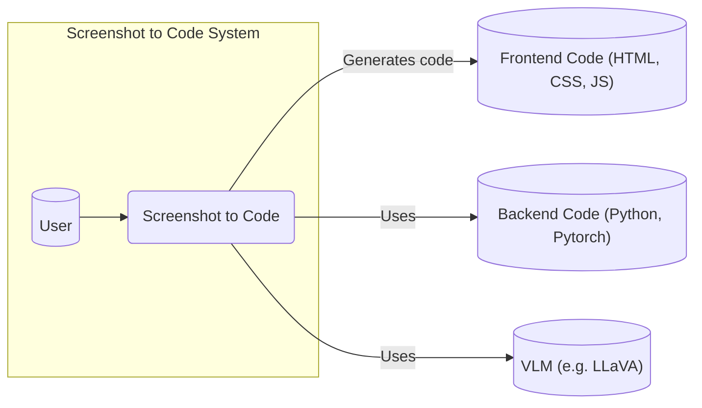
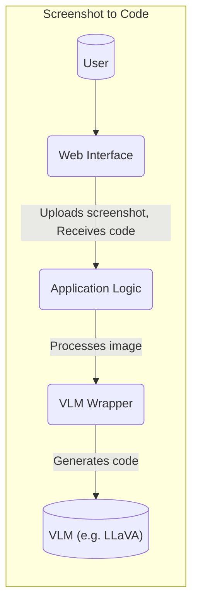
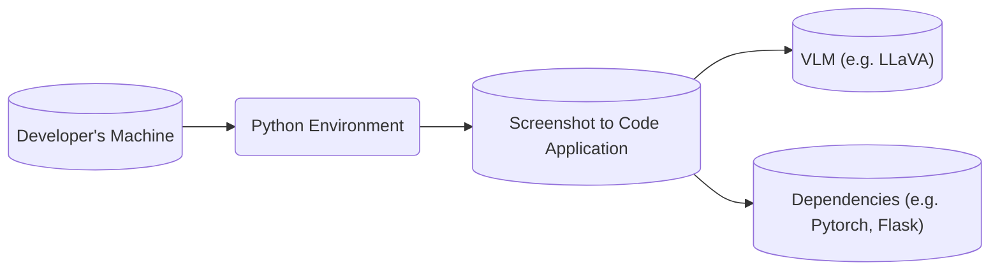
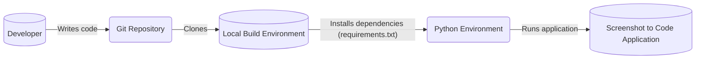

Okay, let's create a detailed design document for the `screenshot-to-code` project.

# BUSINESS POSTURE

Business Priorities and Goals:

*   Rapid Prototyping: Enable developers and designers to quickly translate visual designs into functional code, accelerating the initial stages of development.
*   Reduced Development Time: Minimize the time spent on manually writing boilerplate code for UI elements.
*   Improved Collaboration: Facilitate smoother communication between designers and developers by providing a common visual-to-code translation tool.
*   Accessibility: Potentially improve accessibility by generating code that adheres to accessibility standards (this would depend on the implementation and training data).
*   Cost Reduction: Lower development costs by automating a portion of the front-end development process.

Most Important Business Risks:

*   Inaccurate Code Generation: The generated code may contain errors, be inefficient, or not fully match the intended design, requiring manual correction and potentially negating time savings.
*   Security Vulnerabilities: If the generated code is not carefully vetted, it could introduce security vulnerabilities (e.g., XSS, injection) into the application.
*   Intellectual Property (IP) Concerns: Users may be concerned about uploading proprietary designs to a third-party service (if hosted as a service).  The model itself could be considered valuable IP.
*   Over-Reliance: Developers might become overly reliant on the tool, potentially hindering their understanding of underlying code principles.
*   Maintenance and Updates: The model and codebase need to be continuously updated to keep up with evolving front-end technologies and design trends.
*   Scalability: If offered as a service, the system must be able to handle a large volume of requests without performance degradation.
*   Accessibility Compliance: Generated code may not meet accessibility standards, leading to legal and ethical issues.

# SECURITY POSTURE

Existing Security Controls (based on the GitHub repository):

*   security control: Limited Input Validation: The application likely performs some basic input validation to ensure the uploaded file is an image (e.g., checking file type, size). (Inferred from the nature of the application).
*   security control: Dependency Management: The project uses `requirements.txt` (implied) or similar to manage dependencies, which helps in tracking and updating libraries. (Inferred from standard Python practices).
*   security control: Local Execution: The provided repository is designed to be run locally, reducing the risk associated with data transmission to a third-party service.

Accepted Risks:

*   accepted risk: Limited Input Sanitization: The application may not thoroughly sanitize the input image or the generated code, potentially leading to vulnerabilities if the generated code is used without review.
*   accepted risk: Lack of Authentication/Authorization: The basic application, as presented, does not include authentication or authorization mechanisms, as it's intended for local use.
*   accepted risk: Dependency Vulnerabilities: While dependencies are managed, there's an accepted risk that vulnerabilities in third-party libraries could be exploited.
*   accepted risk: No Output Validation: The generated code is not validated for correctness or security.

Recommended Security Controls:

*   security control: Enhanced Input Validation: Implement rigorous input validation to check for malicious patterns within the image file itself (e.g., using image processing libraries to detect anomalies).
*   security control: Output Sanitization: Sanitize the generated code to prevent common web vulnerabilities (e.g., escaping HTML, JavaScript, and CSS).
*   security control: Static Code Analysis (SAST): Integrate SAST tools into the development workflow to automatically scan the generated code for potential vulnerabilities.
*   security control: Dependency Scanning: Use tools like `pip-audit` or Dependabot to automatically scan dependencies for known vulnerabilities.
*   security control: Content Security Policy (CSP): If the generated code is used in a web context, provide guidance on implementing a strong CSP to mitigate XSS risks.
*   security control: Rate Limiting (if deployed as a service): Implement rate limiting to prevent abuse and denial-of-service attacks.
*   security control: Input Size Limits: Enforce strict limits on the size of uploaded images.

Security Requirements:

*   Authentication: Not required for local execution, but crucial if deployed as a service. Consider API keys or user accounts.
*   Authorization: Not strictly required for the core functionality, but could be used to restrict access to certain features or resources (e.g., in a service context).
*   Input Validation:
    *   Verify that the input is a valid image file (e.g., check file headers, magic numbers).
    *   Limit the dimensions and file size of the uploaded image.
    *   Sanitize the image data to prevent image-based attacks.
*   Cryptography:
    *   If API keys or secrets are used, store them securely (e.g., using environment variables, a secrets management service).
    *   If transmitting data over a network (e.g., in a service context), use HTTPS.
*   Output Validation and Sanitization:
    *   Escape HTML, JavaScript, and CSS in the generated code.
    *   Use a templating engine that automatically escapes output.
    *   Consider using a code formatter and linter to enforce coding standards.

# DESIGN

## C4 CONTEXT

Element Descriptions:

*   Element:
    *   Name: User
    *   Type: Person
    *   Description: A developer or designer who wants to convert a screenshot into code.
    *   Responsibilities: Uploads screenshots, reviews and uses generated code.
    *   Security controls: None (in the local execution context).

*   Element:
    *   Name: Screenshot to Code
    *   Type: Software System
    *   Description: The core application that processes screenshots and generates code.
    *   Responsibilities: Receives screenshot input, processes the image using a VLM, generates code output.
    *   Security controls: Input validation, output sanitization (recommended).

*   Element:
    *   Name: Frontend Code (HTML, CSS, JS)
    *   Type: Code
    *   Description: The generated frontend code representing the UI in the screenshot.
    *   Responsibilities: Provides the structure, styling, and interactivity of the UI.
    *   Security controls: CSP (recommended), output sanitization (in the generation process).

*   Element:
    *   Name: Backend Code (Python, Pytorch)
    *   Type: Code
    *   Description: Code that implements application logic.
    *   Responsibilities: Provides application logic.
    *   Security controls: Secure coding practices.

*   Element:
    *   Name: VLM (e.g. LLaVA)
    *   Type: Software System
    *   Description: Vision-language model.
    *   Responsibilities: Image processing.
    *   Security controls: Secure coding practices.

## C4 CONTAINER

Element Descriptions:

*   Element:
    *   Name: User
    *   Type: Person
    *   Description: A developer or designer.
    *   Responsibilities: Interacts with the web interface.
    *   Security controls: None (in the local execution context).

*   Element:
    *   Name: Web Interface
    *   Type: Web Application
    *   Description: A simple web interface for uploading screenshots and displaying the generated code.  Likely implemented using a framework like Flask or FastAPI.
    *   Responsibilities: Handles user input, displays output, communicates with the application logic.
    *   Security controls: Input validation, output sanitization (recommended).

*   Element:
    *   Name: Application Logic
    *   Type: Python Script/Module
    *   Description:  The core logic that orchestrates the process: receiving the image, calling the VLM wrapper, and returning the generated code.
    *   Responsibilities: Manages the workflow, handles image processing, interacts with the VLM.
    *   Security controls: Input validation, output sanitization, secure coding practices.

*   Element:
    *   Name: VLM Wrapper
    *   Type: Python Script/Module
    *   Description: Code that interfaces with the specific VLM being used (e.g., LLaVA).  Handles model loading, input preparation, and output processing.
    *   Responsibilities: Provides a clean interface to the VLM, handles model-specific details.
    *   Security controls: Secure coding practices, input validation (for the VLM input).

*   Element:
    *   Name: VLM (e.g. LLaVA)
    *   Type: Library/Model
    *   Description: The pre-trained vision-language model that performs the core image-to-code conversion.
    *   Responsibilities: Processes the image and generates the corresponding code.
    *   Security controls: Relies on the security of the pre-trained model and its implementation.

## DEPLOYMENT

Possible Deployment Solutions:

1.  Local Execution (Current): The user clones the repository and runs the application locally.
2.  Containerized Deployment (Docker): The application can be packaged into a Docker container for easier deployment and portability.
3.  Cloud Deployment (e.g., AWS, GCP, Azure): The application could be deployed to a cloud platform as a web service, potentially using serverless functions or container orchestration services.

Chosen Solution (Detailed): Local Execution

Element Descriptions:

*   Element:
    *   Name: Developer's Machine
    *   Type: Desktop/Laptop
    *   Description: The user's local machine where the application is run.
    *   Responsibilities: Provides the execution environment.
    *   Security controls: Relies on the user's machine security.

*   Element:
    *   Name: Python Environment
    *   Type: Virtual Environment
    *   Description: A virtual environment (e.g., using `venv` or `conda`) to isolate the project's dependencies.
    *   Responsibilities: Provides a consistent and isolated environment for the application.
    *   Security controls: Isolation from other system-wide packages.

*   Element:
    *   Name: Screenshot to Code Application
    *   Type: Software System
    *   Description: The application code, including the web interface and application logic.
    *   Responsibilities: Processes screenshots and generates code.
    *   Security controls: Input validation, output sanitization (recommended).

*   Element:
    *   Name: VLM (e.g. LLaVA)
    *   Type: Library/Model
    *   Description: The pre-trained vision-language model.
    *   Responsibilities: Performs the image-to-code conversion.
    *   Security controls: Relies on the security of the pre-trained model.

*   Element:
    *   Name: Dependencies (e.g. Pytorch, Flask)
    *   Type: Library
    *   Description: External libraries.
    *   Responsibilities: Provides functionality.
    *   Security controls: Dependency scanning.

## BUILD

Build Process Description:

1.  Developer: The developer writes and modifies the code.
2.  Git Repository: The code is stored in a Git repository (GitHub).
3.  Local Build Environment: The user clones the repository to their local machine.
4.  Python Environment: A Python virtual environment is created, and dependencies are installed using `requirements.txt` (or a similar mechanism).
5.  Screenshot to Code Application: The application is run locally within the Python environment.

Security Controls in Build Process:

*   security control: Dependency Management: `requirements.txt` (or similar) is used to manage dependencies, allowing for tracking and updating.
*   security control: Version Control (Git): The use of Git allows for tracking changes, code review, and reverting to previous versions.
*   security control: (Recommended) Dependency Scanning: Tools like `pip-audit` or Dependabot can be integrated into the workflow to automatically scan dependencies for known vulnerabilities.
*   security control: (Recommended) Static Code Analysis (SAST): SAST tools can be run locally or as part of a CI/CD pipeline to identify potential security issues in the code.

# RISK ASSESSMENT

Critical Business Processes:

*   Code Generation: The core process of converting screenshots to code must be reliable and accurate.
*   Model Accuracy: The underlying VLM must be accurate and up-to-date.
*   User Experience: The application should be easy to use and provide a smooth workflow.

Data to Protect:

*   Uploaded Screenshots (Sensitivity: Potentially High): Screenshots may contain sensitive design information, proprietary UI elements, or even confidential data if the screenshot captures other application windows.
*   Generated Code (Sensitivity: Medium): The generated code itself may not be highly sensitive, but it could reveal information about the design and structure of the application.
*   Model Weights (Sensitivity: High): The pre-trained VLM weights are a valuable asset and should be protected from unauthorized access or modification.

# QUESTIONS & ASSUMPTIONS

Questions:

*   What specific VLM is being used, and what are its known limitations and security considerations?
*   What are the expected image formats and sizes?
*   Are there any plans to deploy this as a service, and if so, what are the scalability and security requirements?
*   What level of accuracy is required for the generated code?
*   What is the target audience for this tool (e.g., individual developers, teams, enterprises)?
*   What is the process for updating the VLM and other dependencies?

Assumptions:

*   BUSINESS POSTURE: The primary goal is rapid prototyping and reducing development time. The project has a moderate risk appetite, as it's likely aimed at individual developers or small teams initially.
*   SECURITY POSTURE: The current security posture is relatively basic, with a focus on local execution and minimal security controls. It's assumed that users are aware of the risks and will review the generated code before using it in production.
*   DESIGN: The design is assumed to be relatively simple, with a web interface and a Python backend. The VLM is treated as a black box, with the focus on integrating it into the workflow. The deployment is assumed to be local execution for now.