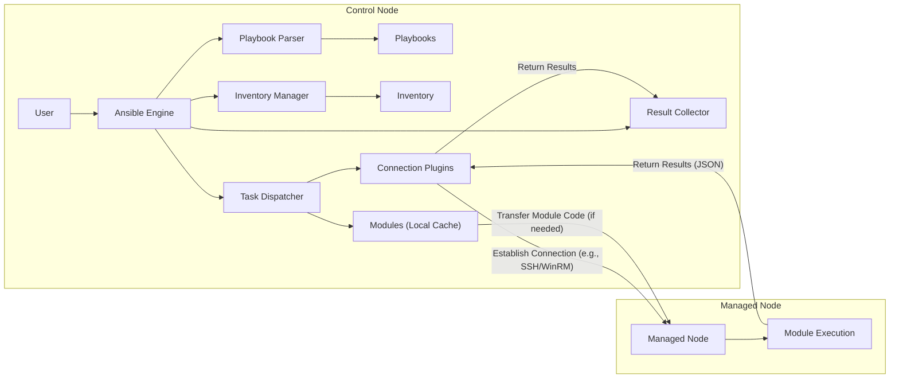

# Project Design Document: Ansible Automation Platform

**Version:** 1.1
**Date:** October 26, 2023
**Author:** AI Software Architect

## 1. Introduction

This document provides a detailed design overview of the Ansible automation platform, focusing on its architecture and key components. This document will serve as the foundation for subsequent threat modeling activities. The design is based on the open-source Ansible project available at [https://github.com/ansible/ansible](https://github.com/ansible/ansible). This revision incorporates tables for better organization and clarifies certain aspects of the architecture.

## 2. Goals

*   Provide a clear and concise description of the Ansible architecture.
*   Identify the key components and their interactions.
*   Outline the data flow within the Ansible platform.
*   Highlight potential security considerations from an architectural perspective.
*   Serve as a basis for identifying potential threats and vulnerabilities.

## 3. Scope

This document covers the core components of the Ansible automation engine and its interaction with managed nodes. It focuses on the execution of Ansible playbooks and the underlying mechanisms involved. It provides a general overview of Ansible modules and plugins, highlighting their roles within the architecture. Specific details of individual modules or plugins are outside the scope of this document.

## 4. High-Level Architecture

Ansible operates on a decentralized, agentless architecture. A central control node orchestrates tasks on managed nodes over standard communication protocols, primarily SSH for Linux/Unix systems and WinRM for Windows systems.

*   **Control Node:** The machine where Ansible is installed and from which playbooks are executed.
*   **Managed Nodes:** The target systems being configured and managed by Ansible.
*   **Inventory:** A file or dynamic source that defines the managed nodes and their groupings, along with associated variables.
*   **Playbooks:** YAML files that define the desired state of the managed nodes and the sequence of tasks to achieve that state.
*   **Modules:** Reusable, idempotent units of code that perform specific tasks on managed nodes.
*   **Plugins:** Extend Ansible's functionality in various areas, such as connection methods, inventory sources, and callback mechanisms.
*   **Connection Plugins:** Handle the communication protocols used to connect to managed nodes (e.g., SSH, WinRM).

## 5. Detailed Component Description

This section provides a more detailed description of the key components.

*   **Ansible Engine:** The core of Ansible, responsible for parsing playbooks, managing inventory, and orchestrating task execution.
    *   **Playbook Parser:** Reads and interprets the YAML-based playbooks, converting them into a series of tasks to be executed.
    *   **Inventory Manager:** Loads and manages the inventory of managed nodes, resolving hostnames and group associations.
    *   **Task Dispatcher:**  Sends individual tasks to be executed on the appropriate managed nodes based on the playbook and inventory.
    *   **Result Collector:**  Receives and processes the results of task executions from managed nodes, providing feedback and error handling.
*   **Inventory:**
    *   Can be a static file (e.g., `hosts` file in INI or YAML format) or a dynamic inventory script that retrieves host information from external sources (e.g., cloud providers, CMDBs).
    *   Defines groups of hosts, allowing for targeted execution of tasks.
    *   Can contain variables at the host or group level, providing context for playbook execution.
    *   May contain sensitive information like usernames, passwords, or API keys (ideally managed securely via Ansible Vault or other secrets management solutions).
*   **Playbooks:**
    *   Written in human-readable YAML format, making them relatively easy to understand and maintain.
    *   Define a series of tasks to be executed on managed nodes in a specific order.
    *   Support features like variables, loops, conditionals, and handlers (actions triggered by specific events).
    *   Can include sensitive information within task definitions, requiring careful handling and potential encryption.
*   **Modules:**
    *   Python code executed on the managed nodes to perform specific actions.
    *   Designed to be idempotent, meaning running a module multiple times should result in the same outcome if the desired state is already achieved.
    *   Return JSON-formatted data about the execution status, including success, failure, and any changes made.
    *   A vast library of built-in modules is available, and users can also develop custom modules for specific needs.
*   **Plugins:**
    *   Extend Ansible's core functionality in various areas. Key plugin types include:
        *   **Connection Plugins:** Handle communication protocols (e.g., `ssh`, `paramiko_ssh`, `winrm`, `docker`).
        *   **Inventory Plugins:**  Connect to and retrieve inventory data from dynamic sources (e.g., `aws_ec2`, `gcp_compute`, `azure_rm`).
        *   **Callback Plugins:**  Customize Ansible's output, logging, and reporting behavior.
        *   **Lookup Plugins:**  Retrieve data from external sources during playbook execution (e.g., files, databases, APIs).
        *   **Filter Plugins:**  Manipulate data within Jinja2 templates used in playbooks.
        *   **Strategy Plugins:**  Control how Ansible executes tasks (e.g., linear, free).
*   **Connection Plugins:**
    *   Responsible for establishing and managing connections to managed nodes.
    *   **SSH:** The primary connection method for Linux-based systems, typically relying on SSH keys for authentication but can also use passwords.
    *   **WinRM:** Used for managing Windows systems, utilizing the Windows Remote Management service, often configured with HTTPS for secure communication.

### 5.1. Key Components Summary

| Component         | Description                                                                                                | Key Functionality                                                                                                | Security Considerations                                                                                                                               |
| ----------------- | ---------------------------------------------------------------------------------------------------------- | ---------------------------------------------------------------------------------------------------------------- | ----------------------------------------------------------------------------------------------------------------------------------------------------- |
| **Ansible Engine** | The core orchestration engine.                                                                             | Parses playbooks, manages inventory, dispatches tasks, collects results.                                         | Secure installation and configuration, access control to the control node.                                                                         |
| **Inventory**       | Defines managed nodes and their properties.                                                              | Lists target hosts, defines groups, stores variables.                                                              | Secure storage, access control, potential for sensitive information.                                                                                |
| **Playbooks**       | YAML files defining automation workflows.                                                                 | Defines tasks, variables, handlers, and desired states.                                                            | Secure storage, code review, potential for embedded secrets, impact of malicious code.                                                              |
| **Modules**         | Reusable units of code executed on managed nodes.                                                        | Performs specific actions on target systems.                                                                      | Use of trusted modules, security of custom modules, potential for vulnerabilities in module code.                                                  |
| **Plugins**         | Extend Ansible's functionality.                                                                          | Provides various capabilities like connection methods, inventory sources, and output customization.              | Security of plugin code, secure configuration of connection plugins (e.g., SSH key management).                                                     |
| **Connection Plugins** | Handle communication with managed nodes.                                                               | Establishes and manages connections using protocols like SSH and WinRM.                                            | Secure configuration of connection protocols (e.g., SSH key management, WinRM HTTPS), authentication mechanisms.                                     |

## 6. Data Flow

The typical data flow during an Ansible playbook execution can be broken down into the following steps:

1. **User initiates playbook execution:** A user on the control node executes the `ansible-playbook` command, specifying the playbook file to run and optionally targeting specific hosts or groups.
2. **Ansible Engine parses the playbook:** The Playbook Parser reads and interprets the YAML playbook, creating an internal representation of the tasks to be performed.
3. **Inventory is loaded and processed:** The Inventory Manager loads the defined inventory source (static file or dynamic script) and resolves hostnames and group memberships. Variables associated with hosts and groups are also loaded.
4. **Tasks are dispatched:** The Task Dispatcher iterates through the tasks defined in the playbook. For each task:
    *   The target managed nodes are determined based on the `hosts` directive in the task.
    *   The appropriate module for the task is identified.
    *   Parameters for the module are determined by combining variables from the playbook, inventory, and command-line arguments.
    *   The module code (typically Python) is located on the control node.
5. **Connection is established:** The relevant Connection Plugin (e.g., SSH or WinRM) establishes a connection to each target managed node using the configured credentials or authentication mechanisms.
6. **Module transfer (if necessary):** If the module code is not already present on the managed node (which is usually the case for standard modules), it is temporarily transferred to the managed node.
7. **Module execution:** The module is executed on the managed node with the provided parameters.
8. **Results are returned:** The module execution results (in JSON format) are sent back to the control node via the established connection.
9. **Result processing:** The Result Collector on the control node receives and processes the results from each managed node, updating the execution status and determining if any changes were made.
10. **Reporting and logging:** Ansible provides output to the user on the control node, indicating the status of each task. Detailed logs of the execution are also typically generated.

## 7. Security Considerations

Security is a critical aspect of Ansible deployments. Several architectural considerations are important for mitigating potential risks:

*   **Control Node Security:** The control node is a highly sensitive system. Its compromise can lead to the compromise of all managed nodes.
    *   **Operating System Hardening:** Implement standard security hardening practices for the control node's operating system, including patching, disabling unnecessary services, and strong firewall rules.
    *   **Access Control:** Restrict access to the control node to authorized users only, using strong authentication mechanisms (e.g., multi-factor authentication).
    *   **Secure Storage:** Protect Ansible configuration files, playbooks, and inventory files with appropriate permissions and encryption where necessary.
    *   **SSH Key Management:** Securely generate, store, and manage SSH keys used for connecting to managed nodes. Avoid storing passwords directly in playbooks or inventory.
*   **Managed Node Security:** While Ansible is agentless, the security posture of managed nodes is crucial.
    *   **Regular Security Updates:** Ensure managed nodes are regularly patched with the latest security updates.
    *   **Strong Authentication:** Enforce strong password policies or utilize SSH key-based authentication on managed nodes.
    *   **Principle of Least Privilege:** Configure user accounts on managed nodes with only the necessary privileges for Ansible to perform its tasks.
    *   **Firewall Configuration:** Implement firewalls on managed nodes to restrict network access.
*   **Communication Security:** Secure communication between the control node and managed nodes is paramount.
    *   **SSH Encryption:** Ansible primarily relies on SSH, which provides encryption for communication. Ensure SSH is configured securely, and avoid using weak ciphers.
    *   **WinRM HTTPS:** When managing Windows nodes, configure WinRM to use HTTPS for encrypted communication.
*   **Playbook Security:** Playbooks can contain sensitive information and potentially malicious code if not developed carefully.
    *   **Code Review:** Implement a code review process for playbooks to identify potential security vulnerabilities or misconfigurations.
    *   **Ansible Vault:** Utilize Ansible Vault to encrypt sensitive data (e.g., passwords, API keys) within playbooks and inventory.
    *   **Idempotency:** Design playbooks to be idempotent to minimize the risk of unintended changes.
    *   **Input Validation:** Sanitize and validate any external input used in playbooks to prevent injection attacks.
*   **Inventory Security:** The inventory can contain sensitive information about managed nodes.
    *   **Secure Storage:** Protect inventory files with appropriate permissions and consider encrypting them, especially if they contain sensitive data.
    *   **Dynamic Inventory Security:** If using dynamic inventory sources, ensure the security of the credentials and APIs used to access the inventory data.
*   **Module Security:** Modules execute code on managed nodes and should be carefully considered.
    *   **Use Trusted Modules:** Prefer using well-established and maintained Ansible modules.
    *   **Secure Custom Modules:** If developing custom modules, follow secure coding practices to avoid introducing vulnerabilities.
    *   **Module Updates:** Keep Ansible and its modules updated to benefit from security patches.
*   **Secrets Management:** Securely managing secrets is crucial for automation.
    *   **Ansible Vault:** Utilize Ansible Vault as the primary mechanism for encrypting secrets within Ansible.
    *   **Integration with Secrets Management Solutions:** Consider integrating Ansible with dedicated secrets management solutions (e.g., HashiCorp Vault, CyberArk) for more robust secret handling.
*   **Access Control:** Implement role-based access control (RBAC) for Ansible resources to restrict access based on user roles and responsibilities.

## 8. Future Considerations

*   Integration with centralized logging and Security Information and Event Management (SIEM) systems for enhanced monitoring and security analysis.
*   Implementation of more granular role-based access control within Ansible, potentially leveraging external authentication and authorization providers.
*   Further adoption of infrastructure-as-code principles and integration with CI/CD pipelines for automated and secure deployments.
*   Exploration of more advanced secrets management strategies and integration with hardware security modules (HSMs).
*   Continuous security assessments and penetration testing of the Ansible infrastructure.

This document provides a comprehensive design overview of the Ansible automation platform, serving as a valuable resource for subsequent threat modeling activities. The detailed component descriptions, data flow diagrams, and security considerations outlined here will enable a thorough analysis of potential threats and vulnerabilities.