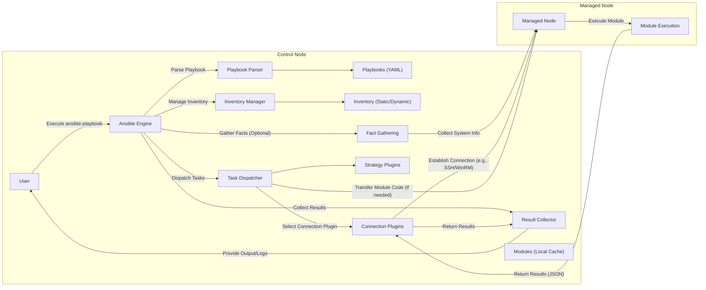

# Project Design Document: Ansible Automation Platform

**Version:** 1.1
**Date:** October 26, 2023
**Author:** AI Software Architect

## 1. Introduction

This document provides an enhanced design overview of the Ansible automation platform, focusing on its architecture, key components, and interactions. This document is intended to serve as a robust foundation for subsequent threat modeling activities. The design is based on the open-source Ansible project available at [https://github.com/ansible/ansible](https://github.com/ansible/ansible).

## 2. Goals

*   Provide a clear, detailed, and comprehensive description of the Ansible architecture.
*   Identify and explain the key components and their interactions with greater granularity.
*   Thoroughly outline the data flow within the Ansible platform, including specific data types.
*   Highlight potential security considerations from an architectural perspective with more specific examples.
*   Serve as a robust and detailed basis for identifying potential threats and vulnerabilities.

## 3. Scope

This document covers the core components of the Ansible automation engine and its interaction with managed nodes, including a more detailed look at the Ansible Engine's internal workings. It focuses on the execution of Ansible playbooks, the underlying mechanisms involved, and the various types of plugins. It provides a general overview of module and plugin roles without delving into the specifics of individual modules or plugins.

## 4. High-Level Architecture

Ansible employs a decentralized, agentless architecture. A central control node orchestrates tasks on managed nodes using standard communication protocols, primarily SSH for Linux/Unix and WinRM for Windows.

*   **Control Node:** The system where Ansible is installed and from which playbooks are executed. This node manages the execution environment.
*   **Managed Nodes:** The target systems being configured and managed by Ansible. These nodes do not require any persistent Ansible agent.
*   **Inventory:** A structured definition of the managed nodes, including their hostnames or IP addresses, groupings, and associated variables.
*   **Playbooks:** YAML files that define the desired state of the managed nodes and the ordered sequence of tasks required to achieve that state.
*   **Modules:** Reusable, self-contained units of code (primarily Python) that perform specific actions on managed nodes.
*   **Plugins:** Extend Ansible's core functionality in diverse areas, such as connection methods, inventory management, task execution strategies, and result callbacks.
*   **Connection Plugins:** Handle the specifics of establishing and managing communication channels with managed nodes (e.g., SSH, Paramiko SSH, WinRM).

## 5. Detailed Component Description

*   **Ansible Engine:** The central orchestrator of Ansible, responsible for the entire automation process.
    *   **Playbook Parser:** Reads, validates, and interprets the YAML-based playbooks, converting them into a series of tasks to be executed.
    *   **Inventory Manager:** Loads, parses, and manages the inventory of managed nodes, providing a dynamic view of the target environment.
    *   **Task Dispatcher:**  Coordinates the execution of tasks on the appropriate managed nodes, taking into account factors like parallelism and execution strategy.
    *   **Result Collector:** Receives, aggregates, and processes the results of task executions from managed nodes, providing feedback on the automation process.
    *   **Strategy Plugins:** Determine how tasks within a playbook are executed (e.g., linear, free).
    *   **Fact Gathering:**  Collects information (facts) about the state of managed nodes, which can be used in playbooks.
*   **Inventory:**
    *   Can be a static file (e.g., `hosts` file in INI or YAML format) or a dynamic inventory script or plugin that retrieves inventory information from external sources (e.g., cloud providers, CMDBs).
    *   Defines groups of hosts, allowing for targeted execution of tasks.
    *   Can contain variables at the host or group level, providing context for playbook execution.
    *   May contain sensitive information like usernames, passwords, or API keys (should be managed securely using Ansible Vault or external secrets management).
*   **Playbooks:**
    *   Written in human-readable YAML format, describing the desired state and the steps to achieve it.
    *   Organized into plays, which target specific groups of hosts.
    *   Contain tasks, which are calls to Ansible modules.
    *   Support variables, loops, conditionals, and handlers (actions triggered by specific events).
    *   May contain sensitive data within task definitions or variable assignments (should be encrypted using Ansible Vault).
*   **Modules:**
    *   Idempotent units of work, meaning they can be run multiple times without causing unintended side effects if the desired state is already achieved.
    *   Executed on the managed nodes, typically written in Python but can be in other languages.
    *   Perform actions such as installing packages, managing services, creating users, copying files, and interacting with APIs.
    *   Return structured data (usually in JSON format) to the control node, indicating the outcome of the execution.
    *   Can be custom-developed to meet specific needs or utilize the extensive library of built-in modules.
*   **Plugins:** Extend Ansible's functionality in various ways.
    *   **Connection Plugins:**  Handle communication protocols (e.g., `ssh`, `paramiko_ssh`, `winrm`, `docker`).
    *   **Inventory Plugins:**  Source inventory data from various systems (e.g., `aws_ec2`, `gcp_compute`, `azure_rm`).
    *   **Callback Plugins:**  Customize Ansible's output, logging, and integration with external systems.
    *   **Lookup Plugins:**  Retrieve data from external sources during playbook execution (e.g., files, databases, APIs).
    *   **Filter Plugins:**  Transform data within playbooks.
    *   **Test Plugins:**  Evaluate conditions within playbooks.
    *   **Strategy Plugins:** Control the execution flow of playbooks (e.g., `linear`, `free`).
    *   **Become Plugins:** Handle privilege escalation (e.g., `sudo`, `pbrun`).
*   **Connection Plugins:**
    *   Responsible for establishing and maintaining communication sessions with managed nodes.
    *   **SSH (Secure Shell):** The primary method for connecting to Linux and Unix-based systems, relying on SSH keys or password authentication. Different implementations exist (e.g., the standard `ssh` client or the Python-based `paramiko_ssh`).
    *   **WinRM (Windows Remote Management):** Used for managing Windows systems, utilizing the WS-Management protocol over HTTP or HTTPS. Requires proper configuration on the managed Windows nodes.

## 6. Data Flow

The typical data flow during an Ansible playbook execution involves the following steps and data types:

1. **User initiates playbook execution:** The user executes the `ansible-playbook` command on the control node, specifying the playbook file path.
    *   **Data:** Command-line arguments, playbook file path.
2. **Ansible Engine parses the playbook:** The Playbook Parser reads and interprets the YAML playbook, converting it into an internal representation of tasks and plays.
    *   **Data:** Playbook content (YAML).
3. **Inventory is loaded:** The Inventory Manager loads the defined inventory, resolving hostnames and groups, and merging any associated variables.
    *   **Data:** Inventory data (static files or output from dynamic inventory sources).
4. **Fact Gathering (Optional):** If enabled, Ansible gathers facts about the managed nodes using the `setup` module.
    *   **Data:** System information from managed nodes (e.g., OS details, network configuration, installed packages).
5. **Tasks are dispatched:** The Task Dispatcher iterates through the tasks in the playbook, determining the target hosts for each task.
    *   **Data:** Task definitions, target host information.
6. **Module selection and parameterization:** For each task, the appropriate module is identified, and its parameters are determined based on the playbook, inventory variables, and gathered facts.
    *   **Data:** Module name, module parameters.
7. **Connection establishment:** The relevant Connection Plugin (e.g., SSH, WinRM) establishes a connection to the managed node using the configured credentials.
    *   **Data:** Connection credentials (e.g., SSH keys, passwords, WinRM credentials).
8. **Module transfer (if necessary):** If the module code is not already present on the managed node, it is transferred.
    *   **Data:** Module code (typically Python).
9. **Module execution:** The module is executed on the managed node with the provided parameters.
    *   **Data:** Module parameters.
10. **Results are returned:** The module execution results (in JSON format) are sent back to the control node via the established connection.
    *   **Data:** Module execution status, output, changes made.
11. **Result processing:** The Result Collector on the control node processes the results, updates the execution status, and triggers any registered handlers.
    *   **Data:** Module execution results (JSON).
12. **Reporting and logging:** Ansible provides output to the user (stdout/stderr) and logs the execution details. Callback plugins can further customize this process.
    *   **Data:** Execution logs, output messages.

## 7. Security Considerations

From an architectural perspective, a range of security aspects are critical for Ansible deployments:

*   **Control Node Security:** The control node is a high-value target. Its compromise can lead to widespread damage.
    *   **Operating System Hardening:** Implement security best practices for the control node's operating system, including regular patching, disabling unnecessary services, and strong firewall rules.
    *   **Access Control:** Restrict access to the control node using strong authentication mechanisms (e.g., multi-factor authentication) and the principle of least privilege.
    *   **Secure Storage:** Protect Ansible configuration files, playbooks, and inventory files with appropriate permissions and encryption.
    *   **SSH Key Management:** Securely generate, store, and manage SSH keys used for authenticating to managed nodes. Avoid storing private keys directly on the control node if possible (consider SSH agent forwarding or dedicated key management solutions).
*   **Managed Node Security:** While Ansible is agentless, the security posture of managed nodes is paramount.
    *   **Regular Security Updates:** Ensure managed nodes are regularly patched and updated to address known vulnerabilities.
    *   **Strong Authentication:** Enforce strong password policies or, preferably, use SSH key-based authentication.
    *   **Minimize Attack Surface:** Disable unnecessary services and ports on managed nodes.
*   **Communication Security:** Secure communication channels are essential to prevent eavesdropping and tampering.
    *   **SSH Encryption:** Ansible's reliance on SSH provides encryption. Ensure strong SSH configurations, including disabling weak ciphers and using strong key exchange algorithms.
    *   **WinRM over HTTPS:** When managing Windows nodes, always configure WinRM to use HTTPS to encrypt communication. Ensure valid certificates are used.
*   **Playbook Security:** Playbooks can introduce vulnerabilities if not written carefully.
    *   **Code Review:** Implement a thorough code review process for all playbooks to identify potential security flaws, such as command injection vulnerabilities or insecure file handling.
    *   **Ansible Vault:** Use Ansible Vault to encrypt sensitive data within playbooks, such as passwords, API keys, and certificates.
    *   **Idempotency:** Ensure playbooks are idempotent to prevent unintended side effects from repeated executions.
    *   **Input Validation:** Validate input variables to prevent injection attacks.
*   **Inventory Security:** The inventory contains sensitive information about managed nodes.
    *   **Secure Storage:** Protect inventory files with appropriate permissions and consider encrypting them, especially if they contain sensitive variables.
    *   **Dynamic Inventory Security:** If using dynamic inventory, ensure the security of the source system and the credentials used to access it.
*   **Module Security:** Modules execute code on managed nodes.
    *   **Trusted Modules:** Primarily use built-in or well-vetted community modules.
    *   **Custom Module Security:** Exercise caution when using custom modules and ensure they are developed with security in mind, following secure coding practices.
*   **Secrets Management:** Securely handling secrets is crucial.
    *   **Ansible Vault:** Utilize Ansible Vault for encrypting secrets within playbooks and inventory.
    *   **External Secrets Management:** Integrate with dedicated secrets management solutions (e.g., HashiCorp Vault, CyberArk) for more robust secret storage and access control.
*   **Access Control:** Implement role-based access control (RBAC) for Ansible resources to restrict access based on user roles and responsibilities.
*   **Logging and Auditing:** Implement comprehensive logging and auditing of Ansible activity on the control node and managed nodes to detect and investigate potential security incidents.

## 8. Future Considerations

*   Enhanced integration with Security Information and Event Management (SIEM) systems for real-time security monitoring.
*   Implementation of more granular role-based access control within Ansible Tower/AWX.
*   Adoption of ephemeral control nodes or containerized Ansible environments for improved security and isolation.
*   Further exploration of security scanning tools and integration with Ansible workflows for automated vulnerability assessment and remediation.

This enhanced document provides a more detailed and comprehensive understanding of the Ansible architecture, crucial for effective threat modeling. The identified components, data flow, and security considerations offer a solid foundation for identifying potential threats and vulnerabilities in subsequent security analysis.
