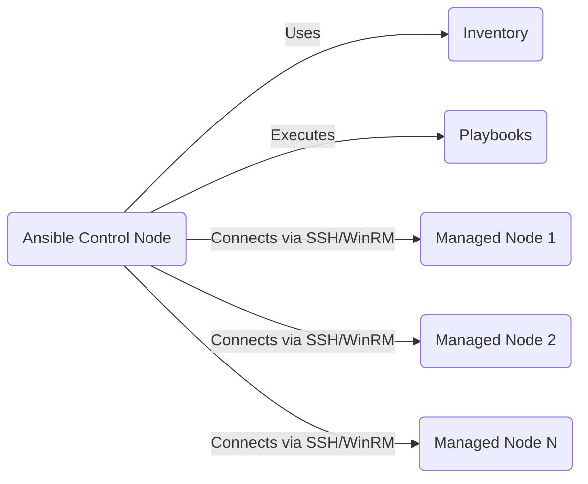
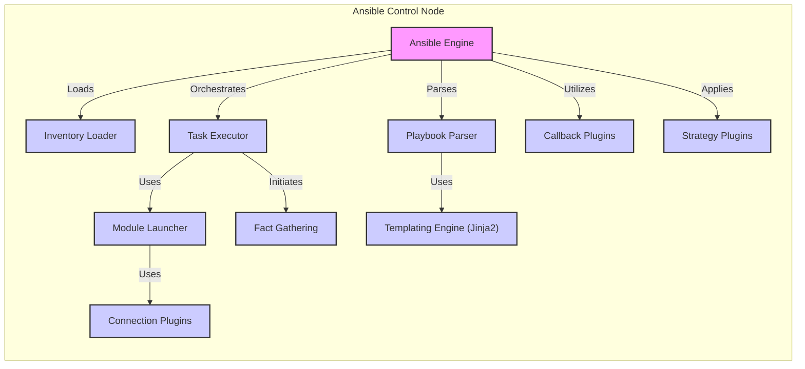
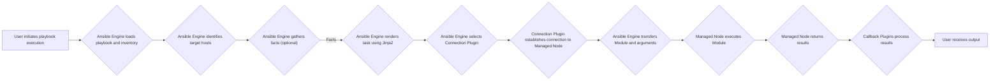

# Ansible Project Design Document

**Version:** 1.1
**Date:** October 26, 2023
**Author:** AI Expert

## 1. Introduction

This document provides a detailed architectural design overview of the Ansible project, focusing on the open-source codebase available at [https://github.com/ansible/ansible](https://github.com/ansible/ansible). It aims to clearly articulate the system's components, their interactions, and the overall architecture to facilitate effective threat modeling and security analysis. This document focuses on the core Ansible engine and its immediate dependencies, excluding related projects like Ansible Automation Platform (formerly Ansible Tower) unless explicitly mentioned for context.

## 2. Goals and Objectives

The primary goal is to create a comprehensive and unambiguous design document of the Ansible project's architecture. Specific objectives include:

*   Clearly identifying and describing the core components of the Ansible system.
*   Illustrating the interactions and data flow between these components during playbook execution.
*   Listing the key technologies, protocols, and data formats employed by Ansible.
*   Providing a solid foundation for subsequent threat modeling exercises by highlighting key architectural elements and data flows.

## 3. High-Level Architecture

Ansible employs an agentless architecture, meaning it does not require any special software to be installed on the managed nodes. It leverages existing secure communication channels like SSH for Linux/Unix systems and WinRM for Windows systems to execute tasks remotely. The central piece is the Ansible Control Node where playbooks are interpreted and execution is orchestrated.

*   **Ansible Control Node:** The system where the Ansible software is installed and from which automation playbooks are run. This node contains the Ansible engine, the inventory of managed hosts, the playbooks defining automation tasks, and various configuration settings.
*   **Managed Node 1, 2, N:** The target systems that Ansible configures and manages. These nodes only need to have SSH or WinRM services enabled for Ansible to interact with them.
*   **Inventory:** A configuration file (or dynamic source) that defines the list of managed nodes, their hostnames or IP addresses, grouping information, and variables associated with them.
*   **Playbooks:** YAML files that describe the desired state of the managed nodes and the sequence of tasks to achieve that state.
*   **Connects via SSH/WinRM:**  Indicates the communication protocols used by the Ansible Control Node to securely connect to and execute tasks on the Managed Nodes.

## 4. Component Architecture

The Ansible Control Node is composed of several interacting components that facilitate the automation process.

*   **Ansible Engine:** The core orchestration engine responsible for reading playbooks, interpreting tasks, managing the inventory, and coordinating the execution of modules on managed nodes.
*   **Inventory Loader:** Responsible for reading and parsing the inventory file or fetching dynamic inventory data from external sources.
*   **Playbook Parser:** Interprets the YAML-based playbook files, understanding the sequence of tasks, variables, and logic defined within.
*   **Task Executor:** Executes individual tasks defined in the playbook. It determines the appropriate module to use for each task and orchestrates its execution.
*   **Module Launcher:** Responsible for transferring and executing Ansible modules on the target managed nodes via the chosen connection plugin.
*   **Connection Plugins:** Handle the low-level communication with managed nodes. Examples include `paramiko` (for SSH), `winrm` (for Windows Remote Management), and `local` (for executing tasks on the control node itself).
*   **Callback Plugins:** Allow users to extend Ansible's behavior during playbook execution. They can be used for logging, sending notifications, or customizing output.
*   **Strategy Plugins:** Determine how Ansible executes tasks within a playbook. Common strategies include `linear` (executing tasks sequentially on each host) and `free` (executing tasks as soon as dependencies are met).
*   **Fact Gathering:** A process where Ansible collects information (facts) about the managed nodes, such as operating system details, network configuration, and installed software. These facts can be used in playbooks.
*   **Templating Engine (Jinja2):** Used to dynamically generate configuration files or commands based on variables and facts.

## 5. Data Flow

The execution of an Ansible playbook involves a specific flow of data and commands between the control node and the managed nodes.

*   **User initiates playbook execution:** A user on the Ansible Control Node starts the playbook execution using the `ansible-playbook` command.
*   **Ansible Engine loads playbook and inventory:** The Ansible Engine reads and parses the specified playbook and the inventory to understand the tasks and target hosts.
*   **Ansible Engine identifies target hosts:** Based on the playbook's host targeting, the engine determines the specific managed nodes the tasks will be executed on.
*   **Ansible Engine gathers facts (optional):** If the playbook requires it, Ansible gathers facts about the target hosts.
*   **Ansible Engine renders task using Jinja2:**  The Ansible Engine uses the Jinja2 templating engine to process any templates within the tasks, using variables and gathered facts.
*   **Ansible Engine selects Connection Plugin:** The appropriate connection plugin (e.g., SSH, WinRM) is selected based on the target host's configuration.
*   **Connection Plugin establishes connection to Managed Node:** The selected plugin establishes a secure connection to the managed node, handling authentication.
*   **Ansible Engine transfers Module and arguments:** The necessary Ansible module (a Python script) and its arguments are transferred to the managed node.
*   **Managed Node executes Module:** The managed node executes the transferred module locally.
*   **Managed Node returns results:** The module execution results (success, failure, changes made) are returned to the Ansible Control Node via the established connection.
*   **Callback Plugins process results:** Callback plugins can intercept and process these results for logging, notifications, or other actions.
*   **User receives output:** The user on the Ansible Control Node receives the output and status of the playbook execution.

## 6. Security Considerations (Detailed Overview)

Security is a critical aspect of Ansible deployments. Key considerations include:

*   **Control Node Security:** The Ansible Control Node is a sensitive system as it stores playbooks (which might contain credentials or sensitive logic), inventory files, and potentially SSH private keys.
    *   **Access Control:** Restricting access to the control node is crucial. Implement strong authentication and authorization mechanisms.
    *   **Secrets Management:** Avoid storing sensitive information directly in playbooks. Utilize Ansible Vault or integrate with external secrets management solutions.
    *   **Regular Updates:** Keep the Ansible software and the control node's operating system up-to-date with security patches.
*   **Managed Node Access Security:** Ansible's agentless nature relies on secure access to managed nodes.
    *   **SSH Key Management:** Properly manage SSH keys used for authentication. Avoid password-based authentication where possible. Implement key rotation policies.
    *   **WinRM Configuration:** Ensure WinRM is configured securely, using HTTPS and strong authentication methods.
    *   **Firewall Rules:** Configure firewalls to restrict access to SSH and WinRM ports on managed nodes.
*   **Playbook Security:** Playbooks define the automation logic and can inadvertently introduce vulnerabilities.
    *   **Code Reviews:** Implement code review processes for playbooks to identify potential security flaws.
    *   **Idempotency:** Ensure playbooks are idempotent to prevent unintended changes if executed multiple times.
    *   **Input Validation:** Validate any input received from external sources or user input within playbooks.
*   **Module Security:** Ansible modules are executed on managed nodes with the privileges of the connecting user.
    *   **Trusted Sources:** Only use modules from trusted sources, such as the official Ansible collections.
    *   **Module Auditing:** Be aware of the actions performed by the modules used in playbooks.
*   **Communication Security:** The communication channel between the control node and managed nodes must be secure.
    *   **SSH Encryption:** SSH provides strong encryption for communication. Ensure it is configured correctly.
    *   **WinRM Encryption (HTTPS):** Use HTTPS for WinRM communication to encrypt data in transit.
*   **Inventory Security:** The inventory file contains information about the infrastructure and should be protected.
    *   **Access Control:** Restrict access to the inventory file.
    *   **Encryption:** Consider encrypting the inventory file if it contains sensitive information.
*   **Plugin Security:**  Custom or third-party plugins can introduce security risks.
    *   **Source Verification:** Only use plugins from trusted and verified sources.
    *   **Security Audits:** Conduct security audits of custom plugins.
*   **Callback Plugin Security:** Malicious callback plugins could potentially intercept sensitive information or disrupt operations.

## 7. Deployment

Ansible can be deployed in various ways, depending on the scale and requirements of the environment. Common deployment scenarios include:

*   **Standalone Control Node:** A dedicated server or workstation with Ansible installed, acting as the central automation hub. This is suitable for smaller environments.
*   **Containerized Control Node:** Running the Ansible Control Node within a container (e.g., Docker) offers benefits like portability and easier management. This approach is common in CI/CD pipelines.
*   **Control Node in the Cloud:** Deploying the Ansible Control Node on a cloud platform (AWS, Azure, GCP) provides scalability and high availability.
*   **Ansible Automation Platform (formerly Ansible Tower):** A more comprehensive solution that provides a web UI, role-based access control, job scheduling, and workflow management for Ansible. This is suitable for larger teams and enterprise environments.

The deployment requires network connectivity between the control node and the managed nodes, with appropriate firewall rules allowing SSH or WinRM traffic. The control node needs access to the inventory and playbooks, which can be stored locally or in a version control system like Git.

## 8. Technologies Used

*   **Core Language:** Python (for the Ansible Engine, modules, and plugins)
*   **Configuration Language:** YAML (for playbooks and inventory files)
*   **Data Exchange Format:** JSON (for structured data exchange and module return values)
*   **Secure Communication (Linux/Unix):** SSH (using libraries like Paramiko)
*   **Secure Communication (Windows):** WinRM (using libraries like pywinrm)
*   **Templating:** Jinja2 (for dynamic configuration and playbook generation)
*   **Version Control (Commonly Used):** Git (for managing playbooks and inventory)
*   **Operating Systems (Control Node):** Primarily Linux-based distributions (e.g., Red Hat Enterprise Linux, Ubuntu), macOS, with limited support on Windows.
*   **Operating Systems (Managed Nodes):** A wide range of operating systems, including various Linux distributions, Windows Server versions, network devices, and cloud platforms.

## 9. Future Considerations

The Ansible project is continuously evolving. Future developments and considerations include:

*   **Enhanced Security Features:** Ongoing efforts to improve security, such as better secrets management integration, enhanced auditing capabilities, and improved role-based access control within the core engine.
*   **Integration with Cloud-Native Technologies:** Deeper integration with container orchestration platforms like Kubernetes and cloud provider services.
*   **Improved Performance and Scalability:** Optimizations to enhance the performance and scalability of Ansible for managing large and complex environments.
*   **Expanded Module Ecosystem:** Continued growth and diversification of Ansible modules to support a wider range of technologies and use cases.
*   **Ansible Automation Platform Enhancements:** Further development of the Ansible Automation Platform to provide more advanced features for enterprise automation.
*   **Increased Adoption of Collections:** Promoting the use of Ansible Collections for better organization and distribution of Ansible content.

This document provides a comprehensive design overview of the Ansible project, suitable for informing threat modeling activities and understanding the system's architecture. It will be updated periodically to reflect changes in the project.