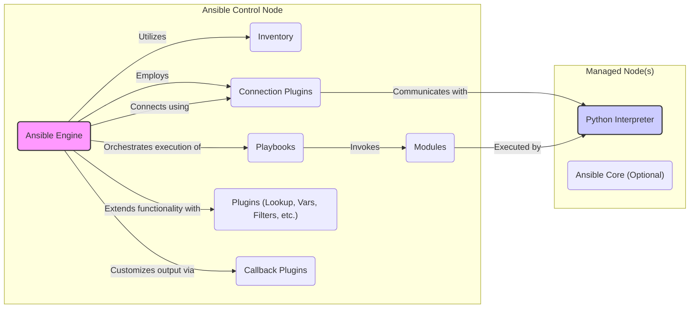

# Project Design Document: Ansible Automation Platform

**Version:** 1.1
**Date:** October 26, 2023
**Author:** AI Software Architect

## 1. Introduction

This document provides an enhanced design overview of the Ansible automation platform, based on the open-source project available at [https://github.com/ansible/ansible](https://github.com/ansible/ansible). Building upon the previous version, this document aims to provide a more detailed and refined articulation of Ansible's architecture, components, and data flow, specifically tailored for subsequent threat modeling activities.

## 2. Goals and Objectives

*   Provide a comprehensive and refined architectural overview of the Ansible project.
*   Identify key components and elucidate their interactions with greater detail.
*   Describe the data flow within the Ansible platform with enhanced clarity.
*   Highlight security-relevant aspects of the design with more specific examples and best practices.
*   Serve as a robust and detailed basis for identifying potential threats and vulnerabilities.

## 3. High-Level Architecture

Ansible employs a decentralized, agentless architecture, leveraging existing infrastructure and protocols, primarily SSH, to manage remote systems. This approach minimizes the footprint on managed nodes and simplifies deployment.

*   **Ansible Control Node:** The central system where Ansible is installed and from which all automation tasks are initiated and managed.
*   **Managed Nodes:** The target systems being managed and configured by Ansible.
*   **Inventory:** A structured definition of the managed nodes, including their hostnames or IP addresses, group memberships, and associated variables.
*   **Playbooks:** YAML-formatted files that define the desired state of the managed nodes and the sequence of tasks required to achieve that state.
*   **Modules:** Reusable, self-contained units of code (primarily Python) that perform specific actions on managed nodes, abstracting away the underlying complexities.
*   **Connection Plugins:** Handle the low-level communication protocols used to connect to managed nodes (e.g., SSH, WinRM, local).
*   **Plugins (Lookup, Vars, Filters, etc.):** Extend Ansible's core functionality in various ways, such as retrieving external data, defining variables, and manipulating data.
*   **Callback Plugins:** Allow customization of Ansible's output, logging, and event handling during playbook execution.
*   **Python Interpreter:** A prerequisite on managed nodes for executing Ansible modules.
*   **Ansible Core (Optional):** A minimal runtime environment that can be installed on managed nodes to optimize module execution and reduce transfer overhead.

## 4. Component Breakdown

### 4.1. Ansible Control Node Components

*   **Ansible Engine:**
    *   The central orchestrator responsible for reading and parsing playbooks.
    *   Manages the inventory of managed hosts.
    *   Coordinates the execution of tasks on target systems.
    *   Handles error management and reporting.
    *   Utilizes connection plugins to communicate with managed nodes.
*   **Inventory:**
    *   Defines the target infrastructure for automation.
    *   Can be static (YAML or INI files) or dynamic (sourced from external systems via inventory scripts or plugins).
    *   Organizes hosts into groups for easier targeting and management.
    *   Allows the definition of host-specific and group-specific variables.
    *   Supports variable precedence rules.
*   **Playbooks:**
    *   Represent automation workflows as a series of plays.
    *   Each play targets a specific group of hosts.
    *   Consist of a list of tasks to be executed sequentially.
    *   Tasks invoke Ansible modules to perform actions.
    *   Support features like handlers (actions triggered by other tasks), roles (grouping related tasks and files), and includes (reusing playbook snippets).
*   **Modules:**
    *   Idempotent by design, ensuring that running a module multiple times produces the same outcome.
    *   Perform a wide range of tasks, including package management, service control, file manipulation, user management, and cloud resource provisioning.
    *   Return structured data (JSON) to the Ansible Engine upon completion.
    *   Can be custom-developed to meet specific needs.
*   **Connection Plugins:**
    *   `paramiko_ssh` (or the newer `ssh` based on `libssh`): The default plugin for connecting to Linux/Unix-like systems via SSH. Handles authentication, command execution, and file transfer.
    *   `winrm`: Used for connecting to Windows systems using the Windows Remote Management (WinRM) protocol.
    *   `local`: Executes tasks on the control node itself.
    *   Other plugins exist for specialized environments and protocols.
*   **Plugins (Lookup, Vars, Filters, etc.):**
    *   **Lookup Plugins:** Enable Ansible to retrieve data from external sources (e.g., files, databases, APIs) during playbook execution. Examples include `file`, `env`, `password`.
    *   **Vars Plugins:** Provide mechanisms for loading variables from various sources, such as external files, environment variables, or command-line arguments.
    *   **Filter Plugins:** Allow manipulation and transformation of data within Jinja2 templates used in playbooks.
    *   **Callback Plugins:** Customize Ansible's output, logging, and integration with external systems. Examples include plugins for sending notifications or storing results in databases.
    *   **Strategy Plugins:** Control how Ansible executes tasks (e.g., linear, free).
    *   **Inventory Plugins:** Extend the ways Ansible can source inventory data.

### 4.2. Managed Node Components

*   **Python Interpreter:**
    *   Required for executing Ansible modules, which are primarily written in Python.
    *   Specific version requirements may vary depending on the Ansible version and the modules being used.
*   **Ansible Core (Optional):**
    *   A lightweight package that can be installed on managed nodes.
    *   Reduces the overhead of transferring modules for each task execution, potentially improving performance.
    *   Contains the necessary runtime environment for executing modules locally on the managed node.

## 5. Data Flow

The typical data flow for an Ansible playbook execution involves a series of steps, starting from user initiation to the completion of tasks on managed nodes.

```mermaid
graph LR
    A["User initiates playbook execution on Control Node"] --> B{"Ansible Engine parses playbook and inventory"}
    B --> C{"Ansible Engine resolves target hosts and variables"}
    C --> D{"Ansible Engine selects and configures connection plugin"}
    D --> E{"Connection plugin authenticates and connects to Managed Node(s)"}
    E --> F{"Ansible Engine compiles and transfers module(s) and arguments"}
    F --> G{"Python interpreter on Managed Node executes module(s)"}
    G --> H{"Module performs actions on the Managed Node"}
    H --> I{"Module returns execution status and results to Ansible Engine"}
    I --> J{"Ansible Engine processes results, handles errors, and updates state"}
    J --> K["Ansible Engine generates output, logs, and potentially triggers callbacks"]
    style A fill:#ccf,stroke:#333,stroke-width:2px
    style K fill:#ccf,stroke:#333,stroke-width:2px
```

*   **User initiates playbook execution on Control Node:** A user executes the `ansible-playbook` command, specifying the playbook file and optionally inventory or other parameters.
*   **Ansible Engine parses playbook and inventory:** The engine reads and interprets the playbook file to understand the desired automation tasks and the inventory file to identify the target hosts.
*   **Ansible Engine resolves target hosts and variables:** Based on the playbook's `hosts` directive and the inventory, the engine determines the specific managed nodes to be targeted and resolves any associated variables.
*   **Ansible Engine selects and configures connection plugin:** The engine selects the appropriate connection plugin based on the target host's configuration and configures it with necessary parameters (e.g., username, port).
*   **Connection plugin authenticates and connects to Managed Node(s):** The connection plugin (e.g., SSH) establishes a secure connection to the managed node(s), typically using SSH keys or password authentication.
*   **Ansible Engine compiles and transfers module(s) and arguments:** The engine prepares the necessary Ansible modules and their arguments for execution on the managed node and transfers them.
*   **Python interpreter on Managed Node executes module(s):** The Python interpreter on the managed node executes the transferred module(s) with the provided arguments.
*   **Module performs actions on the Managed Node:** The module performs the specified actions on the managed node, such as installing software, configuring services, or managing files.
*   **Module returns execution status and results to Ansible Engine:** The module sends the results of its execution (including status, output, and any relevant data) back to the Ansible Engine on the control node.
*   **Ansible Engine processes results, handles errors, and updates state:** The engine processes the received results, checks for errors, updates its internal state, and determines if further actions are required.
*   **Ansible Engine generates output, logs, and potentially triggers callbacks:** Ansible generates output to the console, logs the execution details, and may trigger configured callback plugins for notifications or other actions.

## 6. Security Considerations

*   **Authentication and Authorization:**
    *   **SSH Key Management:** Emphasize the use of SSH key-based authentication over password-based authentication for enhanced security. Proper management and rotation of SSH keys are crucial.
    *   **Ansible Vault:** Utilize Ansible Vault to encrypt sensitive data like passwords, API keys, and certificates within playbooks and variable files. Securely manage the Vault password or key.
    *   **`become` Security:** Exercise caution when using the `become` directive (similar to `sudo`). Implement proper controls and auditing for privilege escalation. Consider using `become_user` and `become_method` for finer-grained control.
    *   **Connection Plugin Security:** Ensure the chosen connection plugin (e.g., SSH, WinRM) is configured securely, including using appropriate encryption and authentication mechanisms.
*   **Data in Transit:**
    *   **SSH Encryption:** Rely on SSH's encryption to protect data transmitted between the control node and managed nodes. Ensure strong ciphers are configured.
    *   **WinRM over HTTPS:** When managing Windows hosts, configure WinRM to use HTTPS for encrypted communication.
*   **Data at Rest:**
    *   **Ansible Vault for Sensitive Data:**  Mandatory for storing sensitive information within Ansible repositories.
    *   **Control Node Security:** Secure the Ansible control node itself, as it holds sensitive information and has access to managed nodes. Implement strong access controls, regular security updates, and intrusion detection systems.
*   **Secrets Management:**
    *   **External Secrets Management Integration:** Consider integrating Ansible with external secrets management solutions (e.g., HashiCorp Vault, CyberArk) for more robust and centralized secret handling.
    *   **Avoid Hardcoding Secrets:** Never hardcode sensitive information directly in playbooks or variable files.
*   **Supply Chain Security:**
    *   **Verify Role and Collection Authenticity:** When using Ansible Galaxy or other sources for roles and collections, verify their authenticity and integrity. Use signed roles and collections where available.
    *   **Dependency Management:** Be mindful of the dependencies of Ansible and its components. Regularly update dependencies to patch vulnerabilities.
*   **Least Privilege:**
    *   **Principle of Least Privilege:** Design playbooks and roles to operate with the minimum necessary privileges on managed nodes.
    *   **Granular Permissions:** Utilize features like `sudoers` configuration in conjunction with `become` to grant specific permissions rather than broad root access.
*   **Auditing and Logging:**
    *   **Centralized Logging:** Configure Ansible to send logs to a centralized logging system for better monitoring, analysis, and security auditing.
    *   **Detailed Logging:** Enable detailed logging to capture relevant information about playbook executions, task outcomes, and user actions.
*   **Connection Security:**
    *   **Firewall Rules:** Implement firewall rules to restrict access to the SSH or WinRM ports on managed nodes, allowing only authorized control nodes to connect.
    *   **Intrusion Detection/Prevention Systems:** Deploy IDPS solutions to monitor for suspicious activity related to Ansible connections.
*   **Module Security:**
    *   **Trusted Modules:** Use well-vetted and trusted Ansible modules. Be cautious when using custom or third-party modules.
    *   **Module Parameter Security:** Understand the security implications of module parameters and avoid passing sensitive information as plain text.

## 7. Deployment Considerations

*   **Control Node Hardening:**
    *   Implement strong password policies or enforce SSH key-based authentication for access to the control node.
    *   Regularly apply security updates and patches to the operating system and Ansible installation.
    *   Restrict network access to the control node.
    *   Consider using a dedicated user account for Ansible operations.
*   **Managed Node Baseline Security:**
    *   Ensure managed nodes are configured with a secure baseline, including up-to-date software, appropriate firewall rules, and security hardening measures.
    *   Regularly audit the security configuration of managed nodes.
*   **Inventory Management Best Practices:**
    *   Secure the inventory file, as it contains sensitive information about managed nodes.
    *   Implement access controls to restrict who can modify the inventory.
    *   For dynamic inventories, secure the credentials used to access the external data sources.
*   **Playbook and Role Development Security:**
    *   Implement code review processes for playbooks and roles to identify potential security vulnerabilities.
    *   Use linters and static analysis tools to check for common security issues in playbooks.
    *   Store playbooks and roles in version control systems (e.g., Git) to track changes and facilitate collaboration.

## 8. Future Considerations

*   **Ansible Automation Platform (Red Hat Ansible Automation Platform):**  Consider the security implications and design considerations of the enterprise platform, which includes components like Ansible Controller (formerly Tower), Automation Hub, and Automation Analytics.
*   **Integration with Security Tools:** Explore integrations with security scanning tools, vulnerability management systems, and SIEM solutions to enhance the security posture of Ansible deployments.
*   **Immutable Infrastructure with Ansible:** Investigate using Ansible to manage immutable infrastructure and the associated security benefits.
*   **Ansible Content Signing:** Explore the use of content signing for Ansible roles and collections to ensure integrity and authenticity.

This enhanced design document provides a more detailed and nuanced understanding of the Ansible project's architecture, data flow, and security considerations. It serves as a more robust foundation for threat modeling activities, enabling a deeper analysis of potential vulnerabilities and the development of more effective mitigation strategies.