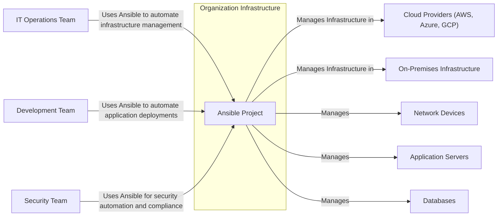
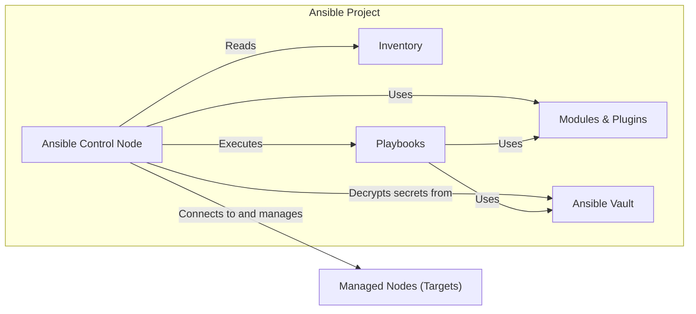
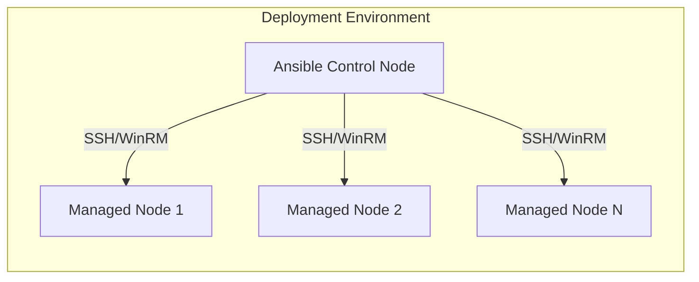
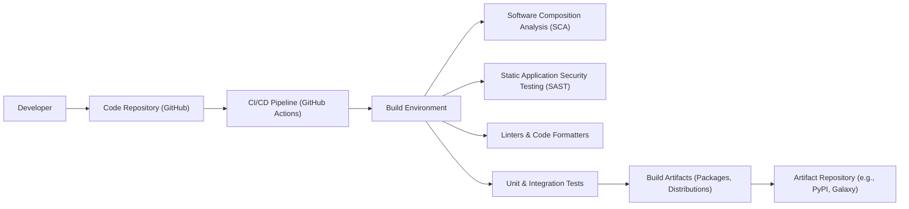

# BUSINESS POSTURE

- Business Priorities and Goals:
  - Automate IT infrastructure management tasks across diverse environments (cloud, on-premises, hybrid).
  - Simplify complex deployments and configurations.
  - Improve operational efficiency and reduce manual errors.
  - Enable consistent and repeatable infrastructure provisioning and management.
  - Accelerate application deployment and updates.
  - Foster collaboration between development and operations teams (DevOps).
- Business Risks:
  - Misconfiguration of infrastructure leading to service disruptions or security vulnerabilities.
  - Unauthorized access to managed systems through compromised Ansible control nodes or credentials.
  - Supply chain attacks targeting Ansible dependencies or distributions.
  - Data breaches due to insecure handling of sensitive information within playbooks or managed systems.
  - Operational disruptions due to vulnerabilities in Ansible core or modules.

# SECURITY POSTURE

- Existing Security Controls:
  - security control: Code reviews for core Ansible and included modules (described in Ansible development guidelines).
  - security control: Vulnerability scanning of Ansible codebase and dependencies (likely performed by community and Red Hat).
  - security control: Release management process with signed releases (available on Ansible releases page).
  - security control: Role-Based Access Control (RBAC) within Ansible Automation Platform (commercial offering, but concepts applicable to open-source).
  - security control: Secure communication channels (SSH, WinRM with HTTPS) for managing remote systems.
  - security control: Vault for encrypting sensitive data within playbooks (documented in Ansible Vault documentation).
  - accepted risk: Reliance on community contributions for security fixes, potential delays in patching vulnerabilities.
  - accepted risk: Complexity of Ansible ecosystem and potential for misconfigurations by users.
  - accepted risk: Open-source nature implies public availability of code, potentially aiding attackers in finding vulnerabilities.
- Recommended Security Controls:
  - security control: Implement automated Supply Chain Security checks for dependencies and build artifacts.
  - security control: Enhance input validation and sanitization in Ansible modules to prevent injection attacks.
  - security control: Promote adoption of security best practices through documentation and tooling (e.g., Ansible-lint with security rules).
  - security control: Implement regular security audits and penetration testing of Ansible deployments.
  - security control: Strengthen secret management practices beyond Ansible Vault, consider integration with dedicated secret management solutions.
- Security Requirements:
  - Authentication:
    - Requirement: Secure authentication mechanisms for accessing Ansible control nodes (e.g., SSH key-based authentication, multi-factor authentication).
    - Requirement: Authentication for accessing managed nodes should be configurable and support various methods (e.g., SSH keys, passwords, Kerberos).
  - Authorization:
    - Requirement: Implement granular role-based access control (RBAC) within Ansible to limit user permissions.
    - Requirement: Authorization mechanisms to control which users or systems can manage specific target nodes or resources.
  - Input Validation:
    - Requirement: Robust input validation for all Ansible modules to prevent injection vulnerabilities (e.g., command injection, SQL injection).
    - Requirement: Validation of playbook syntax and structure to prevent unexpected behavior or errors.
  - Cryptography:
    - Requirement: Use strong cryptography for encrypting sensitive data at rest (Ansible Vault) and in transit (SSH, WinRM with HTTPS).
    - Requirement: Secure key management practices for SSH keys, Vault passwords, and other cryptographic keys.

# DESIGN

## C4 CONTEXT

- Context Diagram Elements:
  - - Name: Ansible Project
    - Type: Software System
    - Description: Open-source IT automation engine that automates provisioning, configuration management, application deployment, orchestration, and more.
    - Responsibilities:
      - Automating infrastructure provisioning and configuration.
      - Deploying and managing applications.
      - Orchestrating complex IT workflows.
      - Enforcing security policies and compliance.
    - Security controls:
      - Access control to Ansible control node.
      - Secure storage of Ansible Vault credentials.
      - Logging and auditing of Ansible activities.
  - - Name: IT Operations Team
    - Type: User
    - Description: Team responsible for managing and maintaining the organization's IT infrastructure.
    - Responsibilities:
      - Infrastructure provisioning and management.
      - System administration and maintenance.
      - Monitoring and incident response.
    - Security controls:
      - Role-based access control to Ansible.
      - Multi-factor authentication for accessing Ansible control node.
      - Security awareness training.
  - - Name: Development Team
    - Type: User
    - Description: Team responsible for developing and deploying applications.
    - Responsibilities:
      - Application development and packaging.
      - Defining application deployment pipelines.
      - Collaborating with operations on deployments.
    - Security controls:
      - Secure coding practices.
      - Access control to application deployment configurations in Ansible.
      - Vulnerability scanning of applications.
  - - Name: Security Team
    - Type: User
    - Description: Team responsible for ensuring the security of the organization's IT systems and data.
    - Responsibilities:
      - Security policy definition and enforcement.
      - Vulnerability management and penetration testing.
      - Security monitoring and incident response.
      - Security audits and compliance checks.
    - Security controls:
      - Security configuration management using Ansible.
      - Security monitoring and alerting integration with Ansible.
      - Security assessments of Ansible deployments.
  - - Name: Cloud Providers (AWS, Azure, GCP)
    - Type: External System
    - Description: Public cloud infrastructure providers offering various services (compute, storage, networking, etc.).
    - Responsibilities:
      - Providing cloud infrastructure resources.
      - Managing cloud service availability and security.
    - Security controls:
      - Cloud provider security controls (IAM, VPC, Security Groups, etc.).
      - Ansible integration with cloud provider APIs for secure resource management.
  - - Name: On-Premises Infrastructure
    - Type: External System
    - Description: Organization's physical data centers and infrastructure.
    - Responsibilities:
      - Hosting and managing on-premises servers and systems.
      - Physical security of data centers.
    - Security controls:
      - Physical security controls for data centers.
      - Network security controls (firewalls, intrusion detection).
      - Operating system and application security hardening.
  - - Name: Network Devices
    - Type: External System
    - Description: Network infrastructure components like routers, switches, firewalls.
    - Responsibilities:
      - Network connectivity and routing.
      - Network security enforcement.
    - Security controls:
      - Network device access control lists (ACLs).
      - Firewall rules and intrusion prevention systems (IPS).
      - Secure network device configuration management using Ansible.
  - - Name: Application Servers
    - Type: External System
    - Description: Servers hosting applications.
    - Responsibilities:
      - Running and serving applications.
      - Application performance and availability.
    - Security controls:
      - Operating system and application security hardening.
      - Web application firewalls (WAFs).
      - Application-level access control.
      - Application deployment and configuration management using Ansible.
  - - Name: Databases
    - Type: External System
    - Description: Database servers storing application data.
    - Responsibilities:
      - Data storage and retrieval.
      - Data integrity and availability.
    - Security controls:
      - Database access control and authentication.
      - Database encryption at rest and in transit.
      - Database security hardening.
      - Database configuration management using Ansible.

## C4 CONTAINER

- Container Diagram Elements:
  - - Name: Ansible Control Node
    - Type: Container (Server/Application)
    - Description: Server where Ansible Engine is installed and playbooks are executed. It orchestrates automation tasks on managed nodes.
    - Responsibilities:
      - Running Ansible Engine.
      - Reading inventory and playbooks.
      - Connecting to managed nodes.
      - Executing modules and plugins.
      - Managing Ansible Vault secrets.
    - Security controls:
      - Operating system security hardening.
      - Access control to the control node (SSH, RBAC).
      - Security auditing and logging.
      - Regular security patching.
  - - Name: Inventory
    - Type: Data Store (Configuration File)
    - Description: Configuration file (or dynamic inventory script) that defines the managed nodes and their groups.
    - Responsibilities:
      - Storing information about managed nodes (hostnames, IPs, groups, variables).
      - Providing dynamic inventory capabilities (e.g., querying cloud providers).
    - Security controls:
      - Access control to inventory files (file system permissions).
      - Secure storage of inventory files.
      - Avoid storing sensitive credentials directly in inventory (use Vault or external secret management).
  - - Name: Playbooks
    - Type: Code (YAML Files)
    - Description: YAML files that define the automation tasks to be executed on managed nodes. They describe the desired state of the infrastructure.
    - Responsibilities:
      - Defining automation workflows.
      - Specifying tasks, roles, and handlers.
      - Using modules and plugins.
      - Integrating with Ansible Vault for secrets.
    - Security controls:
      - Code reviews for playbooks.
      - Static analysis of playbooks (Ansible-lint).
      - Version control for playbooks (Git).
      - Secure storage of playbooks.
      - Input validation within playbooks.
  - - Name: Modules & Plugins
    - Type: Code (Python Modules/Plugins)
    - Description: Reusable units of code that Ansible Engine executes on managed nodes. Modules perform specific tasks (e.g., installing packages, managing services). Plugins extend Ansible's core functionality.
    - Responsibilities:
      - Performing specific automation tasks on managed nodes.
      - Interacting with systems and applications.
      - Providing extensibility to Ansible.
    - Security controls:
      - Code reviews for modules and plugins.
      - Vulnerability scanning of modules and plugins.
      - Input validation within modules and plugins.
      - Secure development practices for modules and plugins.
  - - Name: Ansible Vault
    - Type: Data Store (Encrypted Files)
    - Description: Ansible feature for encrypting sensitive data within playbooks and inventory (e.g., passwords, API keys).
    - Responsibilities:
      - Encrypting and decrypting sensitive data.
      - Securely storing encrypted data.
    - Security controls:
      - Strong encryption algorithms (AES).
      - Secure key management for Vault passwords.
      - Access control to Vault encrypted files.
  - - Name: Managed Nodes (Targets)
    - Type: Container/System (Servers, Network Devices, Cloud Instances)
    - Description: Systems that are managed and configured by Ansible.
    - Responsibilities:
      - Executing tasks sent by Ansible Control Node.
      - Reporting status back to Ansible Control Node.
      - Hosting applications and services.
    - Security controls:
      - Operating system and application security hardening.
      - Access control (SSH, WinRM).
      - Security auditing and logging.
      - Regular security patching.
      - Configuration management by Ansible to enforce security baselines.

## DEPLOYMENT

- Deployment Architecture Options:
  - Option 1: Standalone Ansible Control Node: A single server dedicated as the Ansible control node, managing all target systems. Suitable for smaller environments or proof-of-concepts.
  - Option 2: Clustered Ansible Control Nodes: Multiple Ansible control nodes in a cluster for high availability and scalability. Recommended for larger, production environments.
  - Option 3: Ansible Automation Platform: Red Hat's commercial offering providing a centralized platform with features like RBAC, workflow orchestration, and analytics. Suitable for enterprise deployments requiring advanced features and support.

- Detailed Deployment Architecture (Option 1: Standalone Ansible Control Node):

- Deployment Diagram Elements (Option 1: Standalone Ansible Control Node):
  - - Name: Ansible Control Node
    - Type: Server (Virtual Machine or Physical Server)
    - Description: A single server instance running Ansible Engine, responsible for managing target nodes.
    - Responsibilities:
      - Hosting Ansible Engine and related components.
      - Initiating and managing automation tasks.
      - Maintaining connections to managed nodes.
    - Security controls:
      - Operating system security hardening.
      - Firewall configuration to restrict access to necessary ports (e.g., SSH).
      - Regular security patching and updates.
      - Security monitoring and logging.
  - - Name: Managed Node 1, Managed Node 2, Managed Node N
    - Type: Server/Device (Virtual Machine, Physical Server, Network Device, Cloud Instance)
    - Description: Target systems being managed by Ansible. Can be servers, network devices, cloud instances, etc.
    - Responsibilities:
      - Executing Ansible tasks.
      - Providing resources and services.
    - Security controls:
      - Operating system and application security hardening.
      - SSH/WinRM service hardening.
      - Firewall configuration to restrict inbound connections except from Ansible Control Node (and other authorized sources).
      - Security monitoring and logging.
      - Configuration management by Ansible to enforce security baselines.

## BUILD

- Build Process Elements:
  - - Name: Developer
    - Type: User
    - Description: Software developers contributing to the Ansible project.
    - Responsibilities:
      - Writing code for Ansible core, modules, and plugins.
      - Submitting code changes via pull requests.
      - Addressing code review feedback.
    - Security controls:
      - Secure coding training.
      - Code review process.
      - Multi-factor authentication for code repository access.
  - - Name: Code Repository (GitHub)
    - Type: System (Version Control System)
    - Description: GitHub repository hosting the Ansible project source code.
    - Responsibilities:
      - Version control for source code.
      - Collaboration platform for development.
      - Pull request management.
    - Security controls:
      - Access control to the repository (permissions).
      - Branch protection rules.
      - Audit logging of repository activities.
  - - Name: CI/CD Pipeline (GitHub Actions)
    - Type: System (Automation Platform)
    - Description: GitHub Actions workflows automating the build, test, and release process for Ansible.
    - Responsibilities:
      - Automated build and test execution.
      - Running security scans (SCA, SAST).
      - Publishing build artifacts.
    - Security controls:
      - Secure configuration of CI/CD pipelines.
      - Access control to CI/CD workflows and secrets.
      - Audit logging of CI/CD activities.
  - - Name: Build Environment
    - Type: System (Build Servers)
    - Description: Infrastructure where the Ansible build process is executed (e.g., GitHub Actions runners).
    - Responsibilities:
      - Providing resources for building Ansible.
      - Executing build scripts and commands.
    - Security controls:
      - Security hardening of build environment.
      - Isolation of build processes.
      - Regular patching and updates.
  - - Name: Software Composition Analysis (SCA)
    - Type: Security Tool
    - Description: Tools used to analyze dependencies and identify known vulnerabilities in third-party libraries.
    - Responsibilities:
      - Identifying vulnerable dependencies.
      - Generating reports of vulnerabilities.
    - Security controls:
      - Regularly updated vulnerability databases.
      - Integration with CI/CD pipeline for automated checks.
  - - Name: Static Application Security Testing (SAST)
    - Type: Security Tool
    - Description: Tools used to analyze source code for potential security vulnerabilities without executing the code.
    - Responsibilities:
      - Identifying potential code-level vulnerabilities (e.g., injection flaws).
      - Generating reports of vulnerabilities.
    - Security controls:
      - Regularly updated vulnerability rulesets.
      - Integration with CI/CD pipeline for automated checks.
  - - Name: Linters & Code Formatters
    - Type: Code Quality Tools
    - Description: Tools used to enforce code style guidelines and identify potential code quality issues.
    - Responsibilities:
      - Enforcing code consistency and readability.
      - Identifying potential code defects and style violations.
    - Security controls:
      - Customization of linting rules to include security best practices.
      - Integration with CI/CD pipeline for automated checks.
  - - Name: Unit & Integration Tests
    - Type: Testing Frameworks
    - Description: Automated tests to verify the functionality of Ansible code.
    - Responsibilities:
      - Ensuring code quality and functionality.
      - Detecting regressions.
    - Security controls:
      - Security-focused test cases (e.g., testing input validation, error handling).
  - - Name: Build Artifacts (Packages, Distributions)
    - Type: Software Packages
    - Description: Compiled and packaged versions of Ansible ready for distribution and installation (e.g., Python packages, OS packages).
    - Responsibilities:
      - Distributable software packages.
      - Installation and deployment.
    - Security controls:
      - Signing of build artifacts to ensure integrity and authenticity.
      - Secure storage of build artifacts.
  - - Name: Artifact Repository (e.g., PyPI, Galaxy)
    - Type: System (Package Repository)
    - Description: Public or private repositories where Ansible build artifacts are published and made available for download (e.g., PyPI for Python packages, Ansible Galaxy for roles and collections).
    - Responsibilities:
      - Hosting and distributing Ansible packages.
      - Package versioning and management.
    - Security controls:
      - Access control to artifact repository (for publishing).
      - Security scanning of published packages (by repository providers).
      - HTTPS for secure download of packages.

# RISK ASSESSMENT

- Critical Business Processes:
  - IT Infrastructure Automation: Ansible is used to automate critical infrastructure management tasks, including provisioning, configuration, and patching. Disruptions to Ansible or compromised Ansible deployments can severely impact business operations.
  - Application Deployment Automation: Ansible automates application deployments, impacting the speed and reliability of application releases and updates. Security vulnerabilities in Ansible can lead to compromised application deployments.
  - Security Automation: Ansible is increasingly used for security automation tasks like security configuration management, incident response, and compliance checks. Failure of Ansible in these areas can weaken the organization's security posture.
- Data Sensitivity:
  - Credentials (Passwords, API Keys, SSH Keys): Ansible manages sensitive credentials for accessing and managing target systems. Compromise of these credentials can lead to unauthorized access and data breaches. High sensitivity.
  - Configuration Data: Ansible playbooks and inventory contain configuration data for systems and applications. This data can include sensitive information about system architecture, security settings, and application logic. Medium to High sensitivity depending on the specific data.
  - Logs and Audit Trails: Ansible logs and audit trails contain information about automation activities, including commands executed and systems accessed. This data is important for security monitoring and incident investigation. Medium sensitivity.

# QUESTIONS & ASSUMPTIONS

- Questions:
  - What is the intended deployment scale for Ansible? (Small, medium, large enterprise)
  - What are the specific compliance requirements for the organization using Ansible? (e.g., PCI DSS, HIPAA, SOC 2)
  - What is the organization's current security maturity level?
  - Are there any specific industry regulations or security standards that need to be considered?
  - What is the process for managing and rotating Ansible Vault passwords?
  - Are there any integrations with existing security information and event management (SIEM) or security orchestration, automation, and response (SOAR) systems planned?
- Assumptions:
  - Assumption: The organization using Ansible prioritizes security and is willing to invest in implementing recommended security controls.
  - Assumption: Ansible will be used to manage production environments and critical systems.
  - Assumption: The organization has a dedicated security team responsible for overseeing security aspects of Ansible deployments.
  - Assumption: The organization is using or planning to use Ansible Vault for managing sensitive data.
  - Assumption: The organization has basic security controls in place for their infrastructure, such as firewalls and access control.