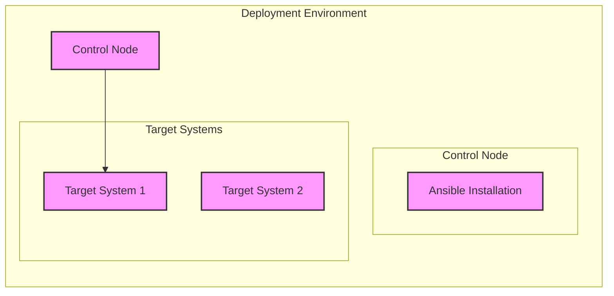
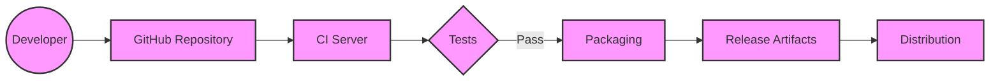

# BUSINESS POSTURE

Ansible is a widely-used open-source project. It's likely backed by a larger organization (Red Hat/IBM) that has a significant interest in maintaining its reputation and stability. The project's goals likely revolve around:

*   Maintaining a large and active user base.
*   Ensuring the software is reliable and performs as expected.
*   Providing a platform that can be extended and integrated with other tools.
*   Minimizing security vulnerabilities that could impact users or the project's reputation.
*   Supporting a wide range of deployment environments and use cases.
*   Providing automation for IT infrastructure.

Business priorities:

*   User Trust: Maintaining the trust of a large, established user base is paramount.
*   Reliability: The software must function reliably in diverse and critical infrastructure environments.
*   Extensibility: The platform's value is tied to its ability to integrate with other tools and systems.
*   Community Engagement: A vibrant community contributes to the project's development and support.

Most important business risks:

*   Reputational Damage: Major security vulnerabilities or widespread failures could severely damage Ansible's reputation and user trust.
*   Loss of User Base: If users lose confidence in Ansible, they may migrate to competing solutions.
*   Supply Chain Attacks: Given Ansible's role in managing infrastructure, a compromised supply chain could have far-reaching consequences for users.
*   Legal and Compliance Issues: Depending on how Ansible is used, there may be legal or compliance implications related to data security and privacy.

# SECURITY POSTURE

Existing security controls (based on the provided repository and general knowledge of secure development practices):

*   security control: Code Reviews: Pull requests on GitHub are subject to review before merging, providing a crucial layer of security oversight. (Implemented in GitHub repository)
*   security control: Static Analysis: Likely use of static analysis tools (linters, code quality checkers) to identify potential vulnerabilities early in the development process. (Mentioned in contribution guidelines, specific tools may vary)
*   security control: Community Reporting: Vulnerabilities can be reported by the community, allowing for rapid identification and response. (Security policy in the repository)
*   security control: Security Policy: A documented security policy outlines how to report vulnerabilities and how the project handles them. (SECURITY.md file in the repository)
*   security control: Signed Releases: Ansible releases are likely signed to ensure their integrity and authenticity. (Common practice, needs verification from release process documentation)
*   security control: Access Control: GitHub repository access is controlled, limiting who can make changes to the codebase. (Implemented in GitHub repository settings)

Accepted risks:

*   accepted risk: Dependency Vulnerabilities: Ansible, like all software, relies on external dependencies. These dependencies may contain vulnerabilities that are outside of the project's direct control.
*   accepted risk: User Misconfiguration: Ansible provides powerful capabilities, but users can misconfigure it in ways that create security risks. The project cannot fully control user behavior.
*   accepted risk: Zero-Day Exploits: Despite best efforts, zero-day vulnerabilities may exist in Ansible or its dependencies.

Recommended security controls:

*   Dynamic Analysis (DAST): Implement dynamic analysis security testing (DAST) to identify runtime vulnerabilities.
*   Software Composition Analysis (SCA): Integrate SCA tools to automatically track and manage dependencies, alerting on known vulnerabilities.
*   Fuzz Testing: Incorporate fuzz testing to discover edge cases and unexpected input handling issues.
*   Threat Modeling: Conduct regular threat modeling exercises to proactively identify and address potential security weaknesses.

Security Requirements:

*   Authentication:
    *   Ansible itself does not handle user authentication directly. It relies on the authentication mechanisms of the target systems (e.g., SSH keys, passwords, API tokens).
    *   Requirement: Securely manage and store credentials used for accessing target systems.
    *   Requirement: Support various authentication methods (SSH, WinRM, etc.) securely.
*   Authorization:
    *   Ansible executes tasks with the privileges of the configured user on the target system.
    *   Requirement: Adhere to the principle of least privilege. Users should only have the necessary permissions to perform their tasks.
    *   Requirement: Provide mechanisms for controlling which users can execute which playbooks and modules. (This may be handled by external systems or Ansible Tower/AWX).
*   Input Validation:
    *   Ansible modules should validate input to prevent unexpected behavior or vulnerabilities.
    *   Requirement: Validate all user-supplied input to modules.
    *   Requirement: Sanitize input to prevent injection attacks (e.g., command injection).
*   Cryptography:
    *   Ansible uses cryptography for secure communication (e.g., SSH) and data protection (e.g., Ansible Vault).
    *   Requirement: Use strong, industry-standard cryptographic algorithms and protocols.
    *   Requirement: Securely manage cryptographic keys.
    *   Requirement: Provide mechanisms for encrypting sensitive data at rest (Ansible Vault).

# DESIGN

## C4 CONTEXT

```mermaid
graph LR
    subgraph "Ansible Ecosystem"
      A[Ansible Core]
    end

    U((User)) --> A
    S[Target Systems] <-- A
    P[Ansible Plugins] <..> A
    C[Control Node] -- "manages" --> S
    C -- "uses" --> A
    E[External Services] <..> A

    classDef element fill:#f9f,stroke:#333,stroke-width:2px
    class A element
```

C4 Context Element List:

*   1.  Name: Ansible Core
    *   Type: Software System
    *   Description: The core Ansible automation engine.
    *   Responsibilities:
        *   Executing playbooks.
        *   Managing inventory.
        *   Interacting with target systems.
        *   Loading and executing modules.
    *   Security Controls:
        *   Code Reviews
        *   Static Analysis
        *   Community Reporting
        *   Security Policy
        *   Signed Releases

*   2.  Name: User
    *   Type: Person
    *   Description: A person who uses Ansible to automate tasks.
    *   Responsibilities:
        *   Writing playbooks.
        *   Defining inventory.
        *   Running Ansible commands.
    *   Security Controls:
        *   N/A (External to the system)

*   3.  Name: Target Systems
    *   Type: Software System
    *   Description: The systems that Ansible manages (servers, network devices, cloud instances, etc.).
    *   Responsibilities:
        *   Executing tasks delegated by Ansible.
        *   Providing state information to Ansible.
    *   Security Controls:
        *   Dependent on the specific target system and its configuration.

*   4.  Name: Ansible Plugins
    *   Type: Software System
    *   Description: Extensions to Ansible that provide additional functionality (e.g., connection plugins, inventory plugins, callback plugins).
    *   Responsibilities:
        *   Extending Ansible's capabilities.
    *   Security Controls:
        *   Code Reviews (if part of the core project)
        *   Static Analysis (if part of the core project)

*   5.  Name: Control Node
    *   Type: Software System
    *   Description: The machine where Ansible is installed and from which playbooks are executed.
    *   Responsibilities:
        *   Running Ansible commands.
        *   Storing playbooks and inventory.
        *   Connecting to target systems.
    *   Security Controls:
        *   Operating System Security
        *   Access Control

*   6.  Name: External Services
    *   Type: Software System
    *   Description: External services that Ansible may interact with (e.g., cloud providers, monitoring systems, notification services).
    *   Responsibilities:
        *   Providing services consumed by Ansible.
    *   Security Controls:
        *   Dependent on the specific external service.

## C4 CONTAINER

```mermaid
graph LR
    subgraph "Ansible Core"
      E[Engine] --> M
      E --> I
      E --> P
      I -.-> M
      M -.-> P
      P -.-> E
    end

    U((User)) --> E
    S[Target Systems] <-- M
    C[Control Node] -- "uses" --> E

    classDef element fill:#f9f,stroke:#333,stroke-width:2px
    class E,M,I,P element
```

C4 Container Element List:

*   1.  Name: Engine
    *   Type: Container
    *   Description: The core Ansible engine that orchestrates the automation process.
    *   Responsibilities:
        *   Parsing playbooks.
        *   Managing inventory.
        *   Scheduling tasks.
        *   Coordinating module execution.
    *   Security Controls:
        *   Code Reviews
        *   Static Analysis

*   2.  Name: Modules
    *   Type: Container
    *   Description: Small, reusable units of code that perform specific tasks on target systems.
    *   Responsibilities:
        *   Performing actions on target systems (e.g., installing packages, managing files, configuring services).
    *   Security Controls:
        *   Code Reviews
        *   Static Analysis
        *   Input Validation

*   3.  Name: Inventory
    *   Type: Container
    *   Description: A definition of the target systems that Ansible manages.
    *   Responsibilities:
        *   Providing a list of hosts and groups.
        *   Storing host-specific variables.
    *   Security Controls:
        *   Access Control (to the inventory file)

*   4.  Name: Plugins
    *   Type: Container
    *   Description: Extensions to Ansible that provide additional functionality.
    *   Responsibilities:
        *   Extending Ansible's capabilities (e.g., connection plugins, inventory plugins, callback plugins).
    *   Security Controls:
        *   Code Reviews (if part of the core project)
        *   Static Analysis (if part of the core project)

## DEPLOYMENT

Possible deployment solutions:

1.  Traditional Installation: Installing Ansible directly on a control node (e.g., a Linux server) using a package manager (apt, yum, etc.) or pip.
2.  Containerized Deployment: Running Ansible within a container (e.g., Docker).
3.  Ansible Tower/AWX: Deploying Ansible Tower or AWX, which provide a web UI, REST API, and role-based access control for managing Ansible.

Chosen solution (for detailed description): Traditional Installation



Deployment Element List:

*   1.  Name: Control Node
    *   Type: Server
    *   Description: The machine where Ansible is installed and from which playbooks are executed.
    *   Responsibilities:
        *   Running Ansible commands.
        *   Storing playbooks and inventory.
        *   Connecting to target systems.
    *   Security Controls:
        *   Operating System Security
        *   Access Control
        *   Firewall

*   2.  Name: Ansible Installation
    *   Type: Software
    *   Description: The Ansible software installed on the control node.
    *   Responsibilities:
        *   Executing playbooks.
        *   Managing inventory.
        *   Interacting with target systems.
    *   Security Controls:
        *   Signed Packages
        *   Regular Updates

*   3.  Name: Target System 1
    *   Type: Server/Device
    *   Description: A system managed by Ansible.
    *   Responsibilities:
        *   Executing tasks delegated by Ansible.
    *   Security Controls:
        *   Operating System Security
        *   Access Control
        *   Firewall
        *   Regular Updates

*   4.  Name: Target System 2
    *   Type: Server/Device
    *   Description: A system managed by Ansible.
    *   Responsibilities:
        *   Executing tasks delegated by Ansible.
    *   Security Controls:
        *   Operating System Security
        *   Access Control
        *   Firewall
        *   Regular Updates

## BUILD

Ansible's build process involves several steps, from development to packaging and distribution. While the specifics may vary, a typical process would look like this:



Build Process Description:

1.  Development: Developers write code and contribute changes via pull requests to the GitHub repository.
2.  Code Review: Pull requests are reviewed by other developers to ensure code quality and security.
3.  Continuous Integration (CI): A CI server (e.g., GitHub Actions, Travis CI, Jenkins) automatically builds and tests the code whenever changes are pushed to the repository.
4.  Testing: The CI server runs a suite of tests, including unit tests, integration tests, and potentially static analysis.
5.  Packaging: If the tests pass, the code is packaged into a distributable format (e.g., Python packages, container images).
6.  Release Artifacts: The packaged artifacts are stored in a repository (e.g., PyPI, a container registry).
7.  Distribution: Users can download and install Ansible from the distribution channels.

Security Controls in the Build Process:

*   Code Reviews: Mandatory code reviews before merging changes.
*   Static Analysis: Automated static analysis tools to identify potential vulnerabilities.
*   Dependency Scanning: Tools to scan dependencies for known vulnerabilities.
*   Signed Releases: Release artifacts are digitally signed to ensure authenticity and integrity.
*   Automated Testing: Comprehensive test suite to catch bugs and regressions.
*   Limited Access to Build System: Access to the CI server and build infrastructure is restricted.

# RISK ASSESSMENT

Critical Business Processes:

*   Infrastructure Automation: Ansible's core function is to automate IT infrastructure management. Disruptions to this process could impact users' ability to manage their systems.
*   Configuration Management: Ansible ensures systems are configured correctly and consistently. Failures in this area could lead to system instability or security vulnerabilities.
*   Application Deployment: Ansible can be used to deploy applications. Problems here could disrupt application availability and functionality.

Data to Protect:

*   Inventory Data: (Sensitivity: Medium to High)
    *   Contains information about target systems, including hostnames, IP addresses, and potentially sensitive variables.
*   Playbooks: (Sensitivity: Medium to High)
    *   Define the tasks to be executed on target systems. May contain sensitive information or reveal details about infrastructure configuration.
*   Credentials: (Sensitivity: High)
    *   Ansible may use credentials (passwords, SSH keys, API tokens) to access target systems. These credentials must be protected at all costs.
*   Ansible Vault Data: (Sensitivity: High)
    *   Data encrypted using Ansible Vault is considered highly sensitive.
*   Logs: (Sensitivity: Low to Medium)
    *   Ansible logs may contain information about the tasks executed and the systems managed.

# QUESTIONS & ASSUMPTIONS

Questions:

*   What specific static analysis tools are used in the Ansible development process?
*   What is the exact process for signing Ansible releases?
*   Are there any specific compliance requirements (e.g., FedRAMP, HIPAA) that Ansible needs to meet?
*   What is the frequency and process for security audits of the Ansible codebase?
*   What are the specific mechanisms for managing secrets and credentials used by Ansible? (Beyond Ansible Vault)
*   How are Ansible plugins vetted for security before being included in the official distribution?
*   What kind of dynamic analysis is performed on Ansible?
*   What is the process for handling security vulnerabilities in third-party dependencies?

Assumptions:

*   BUSINESS POSTURE: The project prioritizes maintaining user trust and a strong reputation.
*   BUSINESS POSTURE: The project has a dedicated security team or individuals responsible for security.
*   SECURITY POSTURE: Regular security updates are released to address vulnerabilities.
*   SECURITY POSTURE: The project follows secure coding practices.
*   DESIGN: Ansible relies heavily on SSH for secure communication with target systems.
*   DESIGN: The control node is a critical security boundary and must be protected.
*   DESIGN: Users are responsible for securing their own target systems.
*   DESIGN: Ansible's core developers have a good understanding of security principles.