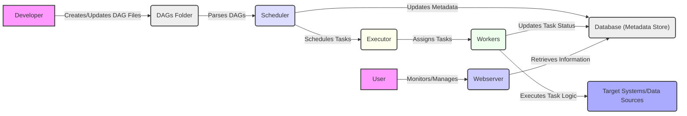

# Project Design Document: Apache Airflow Deployment

**1. Introduction**

This document provides a detailed design overview of an Apache Airflow deployment. It outlines the key components, architecture, data flow, and security considerations relevant for understanding the system and subsequently performing threat modeling. This document aims to provide a comprehensive understanding of the system's structure and interactions, enabling effective identification of potential security vulnerabilities.

**2. Project Overview**

Apache Airflow is a platform to programmatically author, schedule, and monitor workflows. It allows users to define workflows as Directed Acyclic Graphs (DAGs) of tasks. Airflow's scheduler executes these tasks on a variety of executors, and the webserver provides a user interface to monitor and manage workflows. This design document focuses on a typical production deployment of Airflow.

**3. System Architecture**

The following diagram illustrates the high-level architecture of a typical Apache Airflow deployment:

```mermaid
graph LR
    subgraph "User Interaction"
        "User" --> "Webserver";
    end
    subgraph "Core Components"
        "Webserver" --> "Scheduler";
        "Scheduler" --> "Database (Metadata Store)";
        "Scheduler" --> "Executor";
        "Executor" --> "Workers";
    end
    subgraph "External Systems"
        "Workers" --> "Target Systems/Data Sources";
        "Webserver" --> "Target Systems/Data Sources";
    end
    style "User" fill:#f9f,stroke:#333,stroke-width:2px
    style "Webserver" fill:#ccf,stroke:#333,stroke-width:2px
    style "Scheduler" fill:#ddf,stroke:#333,stroke-width:2px
    style "Database (Metadata Store)" fill:#eee,stroke:#333,stroke-width:2px
    style "Executor" fill:#ffe,stroke:#333,stroke-width:2px
    style "Workers" fill:#efe,stroke:#333,stroke-width:2px
    style "Target Systems/Data Sources" fill:#aaf,stroke:#333,stroke-width:2px
```

**4. Key Components**

*   **Webserver:**
    *   Provides the user interface for monitoring, managing, and triggering workflows.
    *   Authenticates and authorizes users.
    *   Displays DAG run status, task logs, and other relevant information.
    *   Interacts with the metadata database to retrieve information.

*   **Scheduler:**
    *   Responsible for scheduling DAG runs based on defined schedules or triggers.
    *   Parses DAG files and updates the metadata database.
    *   Monitors DAG run states and triggers task execution.
    *   Interacts with the executor to assign tasks to workers.

*   **Executor:**
    *   Determines how tasks are executed. Common executors include:
        *   SequentialExecutor: Executes tasks sequentially in a single process (not recommended for production).
        *   LocalExecutor: Executes tasks in parallel on the same machine.
        *   CeleryExecutor: Uses a message broker (e.g., RabbitMQ, Redis) to distribute tasks to worker processes.
        *   KubernetesExecutor: Creates Kubernetes Pods for each task.
        *   DaskExecutor: Uses a Dask cluster for distributed task execution.

*   **Workers:**
    *   Execute the individual tasks defined in the DAGs.
    *   Receive task assignments from the executor.
    *   Interact with target systems or data sources to perform the task logic.
    *   Report task status back to the executor and the metadata database.

*   **Database (Metadata Store):**
    *   Stores metadata about DAGs, tasks, runs, connections, users, and other Airflow configurations.
    *   Common database choices include PostgreSQL and MySQL.
    *   Critical for the operation of all other Airflow components.

*   **Message Broker (Optional):**
    *   Used by executors like CeleryExecutor to queue and distribute tasks to workers.
    *   Examples include RabbitMQ and Redis.

*   **DAG Files:**
    *   Python files that define the workflows (DAGs) and their tasks.
    *   Typically stored in a directory accessible by the scheduler.

**5. Data Flow**

The typical data flow within an Airflow deployment involves the following steps:

*   **DAG Definition:**
    *   Developers create DAG files defining the workflow logic.
    *   These files are placed in the designated DAGs folder.

*   **DAG Parsing and Scheduling:**
    *   The Scheduler periodically parses the DAG files.
    *   It registers the DAGs and their tasks in the metadata database.
    *   Based on the defined schedule or triggers, the Scheduler determines when to run a DAG.

*   **Task Scheduling and Execution:**
    *   When a DAG run is initiated, the Scheduler creates task instances.
    *   The Scheduler communicates with the Executor to assign tasks to available workers.
    *   For executors like CeleryExecutor, tasks are placed in a message queue.

*   **Task Execution by Workers:**
    *   Workers pick up tasks from the Executor (or message queue).
    *   Workers execute the task logic, potentially interacting with external systems.
    *   Workers update the task status in the metadata database.
    *   Task logs are typically stored locally on the worker or in a centralized logging system.

*   **Monitoring and Management:**
    *   Users interact with the Webserver to monitor DAG and task status.
    *   The Webserver retrieves information from the metadata database.
    *   Users can trigger DAG runs, clear task instances, and manage connections through the Webserver.

The following diagram illustrates the data flow:



**6. Deployment Model**

Airflow can be deployed in various ways, each with its own security implications:

*   **Single Server Deployment:**
    *   All components (Webserver, Scheduler, Executor, Workers, Database) run on a single machine.
    *   Suitable for development or testing but not recommended for production due to scalability and resilience limitations.

*   **Distributed Deployment (CeleryExecutor):**
    *   Webserver, Scheduler, and Database run on separate machines.
    *   Workers run on multiple machines and communicate via a message broker (e.g., RabbitMQ, Redis).
    *   Provides better scalability and resilience.

*   **Kubernetes Deployment (KubernetesExecutor):**
    *   Airflow components are deployed as containers within a Kubernetes cluster.
    *   The KubernetesExecutor dynamically creates Pods for each task.
    *   Highly scalable and resilient, leveraging Kubernetes' orchestration capabilities.

*   **Cloud-Managed Services:**
    *   Utilizing managed Airflow services offered by cloud providers (e.g., Amazon MWAA, Google Cloud Composer, Azure Data Factory with Airflow).
    *   Offloads infrastructure management and provides built-in security features.

**7. Security Considerations (Initial)**

This section outlines initial security considerations that will be further explored during threat modeling.

*   **Authentication and Authorization:**
    *   Securing access to the Webserver and the underlying infrastructure.
    *   Managing user roles and permissions within Airflow.
    *   Potential vulnerabilities related to weak authentication mechanisms or authorization bypass.

*   **Data Confidentiality and Integrity:**
    *   Protecting sensitive data within DAG definitions, connections, and logs.
    *   Ensuring the integrity of the metadata database.
    *   Securely managing secrets and credentials used for connecting to external systems.

*   **Network Security:**
    *   Securing communication between Airflow components.
    *   Controlling network access to the Airflow deployment.
    *   Protecting against network-based attacks.

*   **Code Injection:**
    *   Preventing malicious code injection through DAG definitions or user inputs.
    *   Sanitizing inputs and validating data.

*   **Dependency Management:**
    *   Ensuring the security of dependencies used by Airflow and custom tasks.
    *   Regularly updating dependencies to patch vulnerabilities.

*   **Logging and Monitoring:**
    *   Implementing robust logging and monitoring to detect and respond to security incidents.
    *   Securely storing and managing logs.

*   **Infrastructure Security:**
    *   Securing the underlying infrastructure where Airflow is deployed (e.g., servers, containers, cloud resources).
    *   Implementing appropriate security configurations and hardening measures.

**8. Assumptions and Constraints**

*   This design assumes a production-grade deployment requiring scalability and resilience.
*   The specific executor used will impact the deployment architecture and security considerations.
*   Integration with external systems introduces additional security complexities.
*   The security posture of the underlying infrastructure is crucial for the overall security of the Airflow deployment.

**9. Future Considerations**

*   Detailed threat modeling exercise based on this design document.
*   Implementation of specific security controls and best practices.
*   Regular security assessments and penetration testing.
*   Continuous monitoring and incident response planning.

This document provides a foundational understanding of the Apache Airflow deployment architecture, setting the stage for a comprehensive threat modeling exercise to identify and mitigate potential security risks. The detailed breakdown of components, data flow, and initial security considerations will enable a focused and effective threat modeling process.