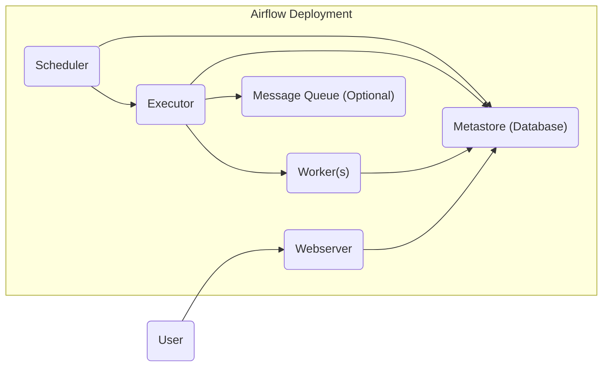
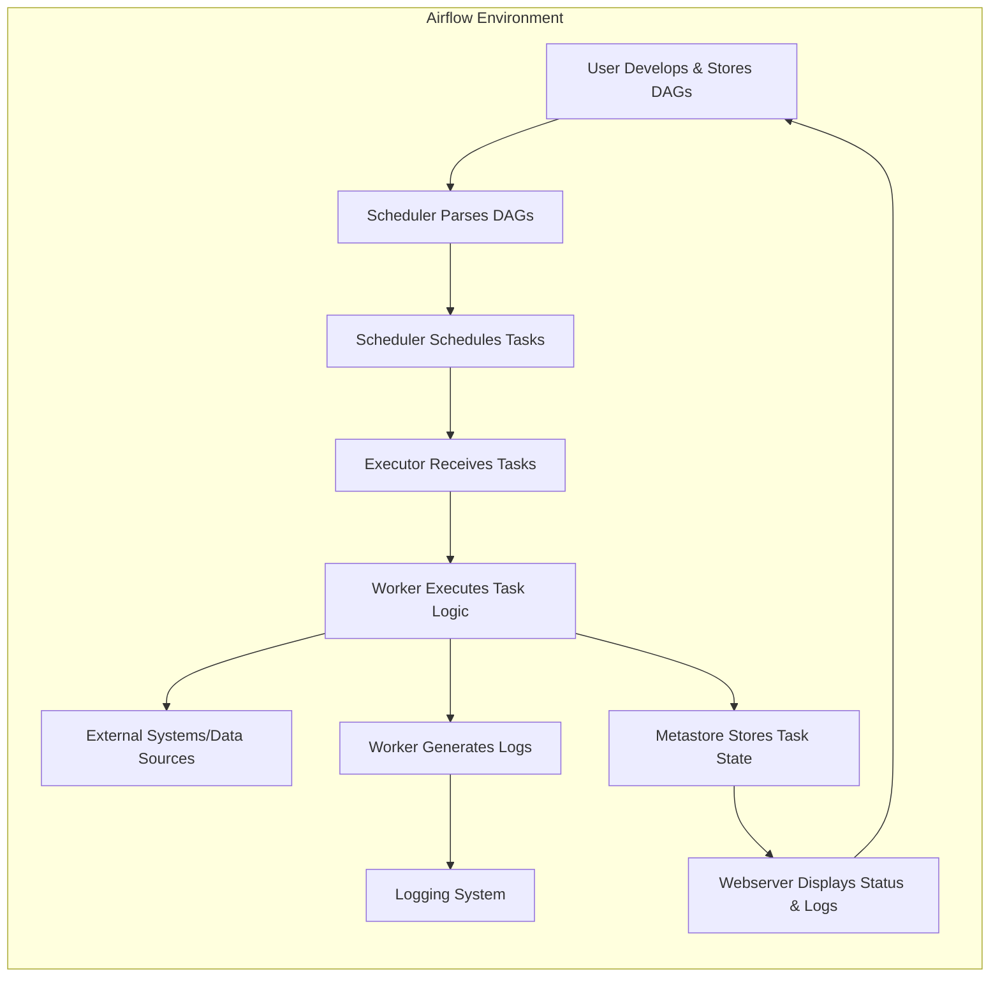

## Project Design Document: Apache Airflow (Improved)

**1. Introduction**

This document provides an enhanced and detailed architectural design overview of Apache Airflow, a platform designed for programmatically authoring, scheduling, and monitoring workflows. This document is intended to serve as a robust foundation for subsequent threat modeling activities, offering a comprehensive understanding of the system's components, their interactions, and the flow of data within the platform. This detailed view is critical for identifying potential security vulnerabilities.

**2. System Overview**

Apache Airflow is an open-source workflow management platform that enables users to define complex workflows as Directed Acyclic Graphs (DAGs) composed of individual tasks. Airflow excels at scheduling and executing these tasks across various environments, while providing robust monitoring and alerting capabilities. Key features that make Airflow a powerful tool include:

*   **Workflow as Code:**  DAGs are defined using standard Python code, promoting version control, collaborative development, and rigorous testing practices.
*   **Dynamic Workflow Generation:** Airflow supports the dynamic generation of DAGs, allowing workflows to adapt based on external data sources or real-time events.
*   **Extensive Integrations:** Airflow's architecture is highly extensible, supporting a vast ecosystem of integrations through operators and hooks that connect to diverse technologies and services.
*   **Scalability and Reliability:** Airflow is designed to scale horizontally, enabling it to manage intricate and large-scale workflows with high reliability.
*   **Intuitive Web UI:**  A user-friendly web interface provides comprehensive monitoring, detailed logging, and efficient management capabilities for workflows and the underlying infrastructure.

**3. Architectural Design**

The core architecture of Apache Airflow is built upon several interconnected components that collaborate to manage and execute workflows effectively.

*   **Webserver:** This component hosts the user interface, providing a visual platform for monitoring and managing DAGs, individual tasks, and the overall Airflow infrastructure. It empowers users to manually trigger DAGs, examine detailed logs, and manage crucial configurations like connections and variables.
*   **Scheduler:** The Scheduler is the central orchestrator, responsible for continuously parsing all DAG files located in designated folders. It analyzes the DAGs to identify tasks, their dependencies, and defined schedules, subsequently scheduling task instances for execution.
*   **Executor:** The Executor determines *how* task instances are actually executed. Airflow's flexible design supports various executors, each with its own execution model:
    *   **SequentialExecutor:** Executes tasks one after another on a single machine. Primarily intended for development and testing environments.
    *   **LocalExecutor:** Executes each task as a separate subprocess on the same machine where the Scheduler is running. Suitable for smaller deployments.
    *   **CeleryExecutor:** Leverages a distributed message queue (such as RabbitMQ or Redis) to distribute task execution requests to a pool of worker processes. Ideal for production environments requiring scalability.
    *   **KubernetesExecutor:** Creates individual Kubernetes Pods for each task instance, providing excellent isolation and scalability within a Kubernetes cluster.
    *   **DaskExecutor:** Integrates with a Dask cluster to enable distributed and parallel task execution, particularly useful for data-intensive workloads.
*   **Workers:** These are the processes responsible for the actual execution of the tasks defined within the DAGs. The number and configuration of workers are dependent on the chosen Executor. For example, with CeleryExecutor, workers subscribe to the message queue.
*   **Metastore (Database):** Airflow relies on a robust database (typically PostgreSQL or MySQL) to persistently store critical metadata. This includes information about DAGs, tasks, task run history, logs, connection details, defined variables, and other essential operational data.
*   **Message Queue (Optional):** When utilizing the CeleryExecutor, a message queue system like RabbitMQ or Redis becomes a crucial component for facilitating communication and task distribution between the Scheduler and the Worker processes.

**4. Data Flow**

The typical lifecycle of a DAG execution within Airflow involves the following data flow:

*   **DAG Definition and Storage:** Users define their workflows as Python scripts (DAGs) and store these files in a designated directory accessible by the Scheduler.
*   **DAG Parsing and Processing:** The Scheduler periodically scans the designated DAG folder, parsing the Python files to understand the workflow structure, including tasks, dependencies, and scheduled execution times.
*   **Task Scheduling and Queuing:** Based on the defined schedules and inter-task dependencies, the Scheduler creates individual task instances and adds them to an execution queue.
*   **Task Assignment and Distribution:** The chosen Executor picks up the queued tasks. In the case of distributed executors like Celery or Kubernetes, this involves communication via the message queue or interaction with the Kubernetes API to allocate resources.
*   **Task Execution and Processing:** Worker processes (or Kubernetes Pods) execute the logic defined within the assigned tasks. This may involve interacting with external systems, processing data, performing computations, or any other operations defined in the task's code.
*   **Logging and Monitoring:** Throughout the execution process, tasks generate logs that are typically stored in a centralized logging system (e.g., local file system, cloud storage). The Webserver retrieves and displays these logs for monitoring and debugging purposes.
*   **State Updates and Persistence:** As tasks progress through their lifecycle (e.g., pending, running, success, failed), their status is updated and persistently stored in the Metastore.
*   **Monitoring and Visualization:** Users can monitor the real-time status of DAGs and individual tasks through the Webserver, which retrieves the latest information from the Metastore to provide a comprehensive view of workflow execution.

**5. Key Components in Detail**

*   **Webserver:**
    *   Developed using the Python Flask web framework.
    *   Provides a comprehensive REST API enabling programmatic interaction with Airflow functionalities.
    *   Manages user authentication and authorization to control access to the platform and its resources.
    *   Presents real-time DAG run status, detailed task logs, and other critical operational information through its user interface.
    *   Allows authorized users to manually trigger DAG executions and manage various aspects of the Airflow environment.
*   **Scheduler:**
    *   A persistent Python process that runs continuously in the background.
    *   Continuously parses DAG files to identify and understand the defined workflows and their components.
    *   Monitors the defined schedules for each DAG and triggers DAG runs at the appropriate times.
    *   Communicates with the configured Executor to queue tasks for execution.
    *   Updates the state of tasks in the Metastore as they progress through their lifecycle.
*   **Executor (CeleryExecutor as an illustrative example):**
    *   Relies on a robust message queue infrastructure (e.g., RabbitMQ, Redis) for inter-process communication.
    *   The Scheduler publishes task execution requests as messages to the designated message queue.
    *   Worker processes subscribe to the message queue and retrieve task execution requests.
    *   Workers execute the tasks and subsequently report the execution status back to the Metastore.
*   **Worker:**
    *   Dedicated Python processes responsible for executing the specific task logic defined within the DAGs.
    *   The number of worker processes can be dynamically scaled based on the workload demands.
    *   Requires access to all necessary libraries, dependencies, and configurations to successfully execute the defined tasks.
    *   Generates detailed logs during task execution, which are stored and made accessible through the Webserver for monitoring and debugging.
*   **Metastore (Database - PostgreSQL as an illustrative example):**
    *   Serves as the central repository for storing critical metadata essential for Airflow's operation.
    *   Contains detailed information about DAGs, tasks, historical run data, execution logs, connection credentials, defined variables, and user account details.
    *   Requires robust security measures to protect the sensitive data it contains from unauthorized access and modification.
    *   Actively accessed by the Webserver, Scheduler, and Worker processes to retrieve and update operational information.
*   **Message Queue (RabbitMQ as an illustrative example):**
    *   Facilitates asynchronous communication between the Scheduler and Worker processes, specifically when using the CeleryExecutor.
    *   Ensures reliable and ordered delivery of task execution requests to available workers.
    *   Requires careful configuration and implementation of security measures to protect the integrity and confidentiality of the messages it handles.

**6. Deployment Considerations**

Airflow's flexibility allows for deployment in various environments, each presenting unique security challenges and considerations:

*   **Local Machine Deployment:** Primarily used for development and testing. Security risks are generally lower but still warrant attention, especially concerning access to sensitive data.
*   **Single Server Deployment:** All Airflow components run on a single server instance. Requires meticulous configuration and robust security hardening to mitigate potential vulnerabilities.
*   **Distributed Deployment with Celery:** Components are distributed across multiple servers, with Celery managing task distribution. Securing the message queue infrastructure and the individual worker nodes is paramount.
*   **Kubernetes Deployment:** Airflow components are containerized and deployed within a Kubernetes cluster. Leverages Kubernetes' built-in security features (RBAC, network policies, secrets management) but requires careful configuration and adherence to security best practices.
*   **Managed Services (e.g., Amazon MWAA, Google Cloud Composer):**  Leverages the underlying security infrastructure provided by the cloud provider. However, users remain responsible for managing access controls, securing DAG code, and protecting connection credentials.

**7. Security Considerations (Detailed for Threat Modeling)**

This section expands on potential security concerns, providing more specific examples for threat modeling:

*   **Authentication and Authorization:**
    *   **Threat:** Unauthorized access to the Webserver and API could allow malicious actors to view sensitive workflow information, trigger unauthorized DAG runs, or modify critical configurations.
    *   **Considerations:**  Evaluate the strength of authentication mechanisms (e.g., password policies, multi-factor authentication). Analyze the granularity of authorization controls and ensure least privilege principles are enforced. Investigate potential vulnerabilities related to default credentials.
*   **Data Security:**
    *   **Threat:** Sensitive data stored in the Metastore (e.g., connection credentials, API keys) could be compromised if the database is not properly secured. Data in transit between components could be intercepted. Logs might inadvertently expose sensitive information.
    *   **Considerations:**  Implement encryption at rest for the Metastore database. Enforce encryption in transit (TLS/SSL) for communication between all components. Implement secure logging practices to prevent the accidental exposure of sensitive data.
*   **Network Security:**
    *   **Threat:** Unsecured network communication between components could allow attackers to eavesdrop on sensitive data or inject malicious commands. Open ports could provide entry points for attackers.
    *   **Considerations:**  Implement network segmentation and firewall rules to restrict communication between components. Ensure all communication channels are secured using TLS/SSL. Regularly audit open ports and services.
*   **Code Injection:**
    *   **Threat:** Malicious actors could inject arbitrary code through vulnerable DAG definitions or task configurations, potentially gaining control of the Airflow environment or the systems it interacts with.
    *   **Considerations:**  Implement robust input validation and sanitization for DAG definitions and task parameters. Enforce secure coding practices and regularly scan DAG code for potential vulnerabilities. Consider using sandboxing or containerization for task execution.
*   **Access Control to Infrastructure:**
    *   **Threat:** Unauthorized access to the underlying infrastructure (servers, containers, databases) could lead to complete compromise of the Airflow environment and the data it manages.
    *   **Considerations:**  Implement strong access control policies based on the principle of least privilege. Enforce multi-factor authentication for administrative access. Implement comprehensive auditing of infrastructure access and modifications.
*   **Dependency Management:**
    *   **Threat:** Using outdated or vulnerable dependencies in Airflow or custom DAG code could introduce security vulnerabilities that attackers could exploit.
    *   **Considerations:**  Implement a robust dependency management process. Regularly update Airflow and all its dependencies to the latest secure versions. Utilize vulnerability scanning tools to identify and remediate vulnerable dependencies.
*   **API Security:**
    *   **Threat:** The Airflow REST API could be targeted by attackers to gain unauthorized access, manipulate workflows, or exfiltrate data if not properly secured.
    *   **Considerations:**  Implement strong authentication and authorization for API access. Enforce rate limiting to prevent denial-of-service attacks. Protect against common web application vulnerabilities (e.g., injection attacks, cross-site scripting).
*   **Secrets Management:**
    *   **Threat:** Storing sensitive credentials (e.g., database passwords, API keys) directly in DAG code or environment variables poses a significant security risk.
    *   **Considerations:**  Utilize secure secrets management solutions (e.g., HashiCorp Vault, cloud provider secrets managers). Avoid storing secrets directly in code or configuration files. Implement mechanisms to securely inject secrets into tasks at runtime.

**8. Diagrams**

*   **High-Level Architecture Diagram:**

*   **Detailed Data Flow Diagram:**

**9. Conclusion**

This improved design document provides a more detailed and nuanced understanding of the Apache Airflow architecture, emphasizing the interactions between its core components and the flow of data. The expanded security considerations section offers a more comprehensive starting point for threat modeling activities. By carefully analyzing these architectural details and potential security vulnerabilities, organizations can proactively implement measures to secure their Airflow deployments and protect sensitive data and critical workflows.