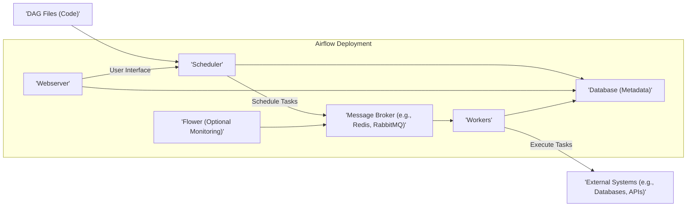

# Project Design Document: Apache Airflow for Threat Modeling

**Version:** 1.1
**Date:** October 26, 2023
**Author:** AI Software Architect

## 1. Introduction

This document provides an enhanced and detailed design overview of Apache Airflow, an open-source workflow management platform. The primary purpose of this document is to serve as a robust foundation for subsequent threat modeling activities. It meticulously outlines the key components, their interactions, data flows, and deployment considerations, with a strong emphasis on aspects relevant to security analysis.

## 2. Project Overview

Apache Airflow is a platform designed for programmatically authoring, scheduling, and monitoring workflows. It empowers users to define complex workflows as Directed Acyclic Graphs (DAGs) composed of individual tasks. Airflow's core functionality centers around the reliable scheduling and execution of these tasks across diverse execution environments.

## 3. System Architecture

The Airflow architecture comprises several critical components that collaborate to manage and execute workflows. Understanding these components and their interactions is crucial for identifying potential threat vectors.

### 3.1. High-Level Architecture Diagram

### 3.2. Component Descriptions

*   **Webserver:**
    *   Purpose: Serves the user interface (UI) for monitoring, managing, and triggering DAGs. It's the primary point of interaction for users.
    *   Functionality:
        *   Displays real-time DAG status, detailed task logs, and comprehensive execution history.
        *   Allows authorized users to manually trigger DAG runs and manage workflow execution.
        *   Provides authentication and authorization mechanisms to control access to the UI and its functionalities. This is a critical security boundary.
        *   Exposes an Application Programming Interface (API) for programmatic interaction, which needs careful security consideration.
    *   Key Interactions: Communicates directly with the Scheduler to initiate actions and with the Database to retrieve and display information.
    *   Security Relevance: Vulnerable to web application attacks (e.g., XSS, CSRF, SQL injection if interacting with the database without proper sanitization), authentication and authorization bypass, and API abuse.

*   **Scheduler:**
    *   Purpose: The brain of Airflow, responsible for scheduling DAG runs based on predefined schedules, dependencies, and external triggers.
    *   Functionality:
        *   Parses DAG files (Python code) to understand the workflow structure, task dependencies, and scheduling parameters. This parsing process needs to be secure to prevent malicious code execution.
        *   Continuously monitors DAG run states and intelligently triggers new runs based on schedules and dependencies.
        *   Manages complex task dependencies and prioritizes task execution.
        *   Communicates extensively with the Database to store and retrieve critical metadata about DAGs, tasks, and runs.
        *   Queues tasks for execution by pushing them onto the Message Broker.
    *   Key Interactions: Reads DAG Files, interacts heavily with the Database, and communicates with the Message Broker.
    *   Security Relevance: Potential for code injection through malicious DAG files, unauthorized modification of schedules, and denial-of-service attacks by overloading the scheduler. Access to the database by the scheduler needs to be secured.

*   **Workers:**
    *   Purpose: The workhorses of Airflow, responsible for executing the individual tasks defined within a DAG.
    *   Functionality:
        *   Continuously polls the Message Broker for new tasks to execute.
        *   Executes the specific code or commands associated with an assigned task. This execution can involve interacting with various external systems.
        *   Updates the status of the executed task in the Metadata Database, providing feedback on progress and completion.
        *   May interact with a wide range of external systems (databases, APIs, cloud services) as defined in the DAG, making secure credential management crucial.
    *   Key Interactions: Interacts with the Message Broker to receive tasks, the Database to update status, and potentially numerous External Systems.
    *   Security Relevance: Vulnerable to code injection if task definitions are not properly sanitized, unauthorized access to external systems if credentials are compromised, and potential for data breaches during task execution. Worker isolation and secure communication channels are important.

*   **Database (Metadata Database):**
    *   Purpose: A persistent store for all metadata related to Airflow operations, including DAG definitions, task states, run history, user information, and connection details.
    *   Functionality:
        *   Persistently stores the state of DAG runs and individual task instances, allowing for tracking and auditing.
        *   Stores user credentials and associated permissions, which must be protected.
        *   Holds connection details (often including credentials) for accessing external systems, making it a high-value target.
        *   Provides a central repository for Airflow's operational data, essential for the functioning of other components.
    *   Key Interactions: Interacted with by the Webserver, Scheduler, and Workers for reading and writing metadata.
    *   Security Relevance: Critical component requiring strong security measures. Vulnerable to SQL injection attacks, unauthorized access leading to data breaches or manipulation, and potential for credential theft. Encryption at rest and in transit is crucial.

*   **Message Broker (e.g., Celery, Redis, RabbitMQ):**
    *   Purpose: Acts as an intermediary queue for distributing tasks from the Scheduler to the available Workers.
    *   Functionality:
        *   Receives task execution requests from the Scheduler.
        *   Queues tasks and manages their distribution to available Workers.
        *   Ensures reliable delivery of tasks, even in the face of component failures.
    *   Key Interactions: Interacted with by the Scheduler for enqueuing tasks and by Workers for dequeuing tasks. Optionally by Flower for monitoring.
    *   Security Relevance: Potential for unauthorized access to the task queue, leading to task manipulation or eavesdropping. If not properly secured, it can be a point of vulnerability for injecting malicious tasks or disrupting workflow execution. Secure communication protocols are necessary.

*   **Flower (Optional Monitoring Tool):**
    *   Purpose: Provides a real-time monitoring and administration web interface specifically for Celery workers (when using the Celery Executor).
    *   Functionality:
        *   Displays detailed worker status, task queues, and execution statistics, offering insights into worker performance.
        *   Allows for remote control of workers, including the ability to terminate or restart them. This functionality requires strong authentication and authorization.
    *   Key Interactions: Interacts with the Message Broker to gather monitoring data.
    *   Security Relevance: If exposed without proper authentication, it can allow unauthorized users to monitor or control worker processes, potentially disrupting operations or gaining sensitive information.

*   **DAG Files:**
    *   Purpose: Python files that define the structure, logic, and schedule of workflows (DAGs). They are the blueprint for Airflow's operations.
    *   Functionality:
        *   Contain the Python code that defines tasks, their dependencies, and execution schedules.
        *   Are parsed by the Scheduler to understand the workflow and schedule its execution.
    *   Key Interactions: Read by the Scheduler.
    *   Security Relevance: If write access to DAG files is not properly controlled, malicious actors could inject harmful code that would be executed by the Workers. Secure storage and access control are essential.

## 4. Data Flow

Understanding the flow of data through the Airflow system is critical for identifying potential points of interception or manipulation.

1. **DAG Definition and Storage:** Users create DAG files, which are typically stored in a version control system or a shared file system accessible by the Scheduler.
2. **DAG Parsing and Metadata Storage:** The Scheduler periodically parses these DAG files. The parsed information, including task definitions and dependencies, is stored as metadata in the Database.
3. **Task Scheduling and Queuing:** When a DAG run is triggered (either by schedule or manually), the Scheduler creates task instances and queues them as messages in the Message Broker. These messages contain information about the task to be executed.
4. **Task Assignment and Execution:** Workers retrieve task messages from the Message Broker. Based on the task definition, Workers may retrieve connection details and secrets from the Database. They then execute the task, potentially interacting with External Systems.
5. **Data Transfer to External Systems:** During task execution, Workers may transfer data to or from External Systems. The security of these transfers depends on the protocols and configurations used.
6. **Status Updates and Logging:** Workers update the status of tasks in the Metadata Database. Task execution logs are typically written to local files on the worker or a centralized logging system.
7. **Monitoring Data Retrieval:** The Webserver retrieves data from the Metadata Database to display DAG and task status to users. Flower retrieves monitoring data from the Message Broker.

## 5. Deployment Considerations

The way Airflow is deployed significantly impacts its security posture. Different executors introduce varying security implications.

*   **Local Executor:** Executes tasks directly on the same machine as the Scheduler. This is the least secure option for production environments due to a lack of isolation and potential resource contention.
*   **Sequential Executor:** Executes tasks sequentially on the Scheduler machine. Similar security concerns to the Local Executor, not recommended for production.
*   **Celery Executor:** Distributes tasks to multiple worker processes, often running on separate machines, using a message broker. This improves scalability and isolation but requires securing the message broker and worker communication.
    *   Security Implications: Requires secure configuration of the message broker (authentication, authorization, encryption). Worker nodes need to be secured.
*   **Kubernetes Executor:** Executes each task in an isolated Kubernetes pod. This provides strong isolation and resource management but introduces the complexity of Kubernetes security.
    *   Security Implications: Requires securing the Kubernetes cluster, including network policies, RBAC, and container image security. Secrets management within Kubernetes is crucial.
*   **Dask Executor:** Leverages the Dask distributed computing framework. Security considerations depend on the Dask cluster configuration.
    *   Security Implications: Requires securing the Dask scheduler and worker nodes. Authentication and authorization within the Dask cluster need to be configured.

The choice of executor dictates the network architecture, authentication requirements, and the scope of security responsibilities.

## 6. Security Considerations (Detailed for Threat Modeling)

This section expands on the initial security considerations, providing more specific examples of potential threats and vulnerabilities.

*   **Authentication and Authorization:**
    *   **Threat:** Unauthorized access to the Webserver UI and API, allowing malicious actors to view sensitive information, trigger unauthorized DAG runs, or modify configurations.
    *   **Vulnerabilities:** Weak or default credentials, lack of multi-factor authentication, insufficient role-based access control (RBAC), API endpoints without proper authentication.
    *   **Mitigation:** Enforce strong password policies, implement multi-factor authentication, configure robust RBAC, secure API endpoints with appropriate authentication mechanisms (e.g., API keys, OAuth 2.0).

*   **Data Security:**
    *   **Threat:** Exposure of sensitive data stored in Airflow, including credentials for external systems, API keys, and potentially business-critical data processed by tasks.
    *   **Vulnerabilities:** Storing secrets in plain text within connections or variables, lack of encryption at rest for the Metadata Database, insecure communication channels between components.
    *   **Mitigation:** Utilize Airflow's secrets backends (e.g., HashiCorp Vault, AWS Secrets Manager), encrypt the Metadata Database at rest, enforce TLS encryption for communication between all Airflow components.

*   **Code Injection:**
    *   **Threat:** Malicious actors injecting harmful code through DAG files, leading to arbitrary code execution on worker nodes.
    *   **Vulnerabilities:** Lack of proper validation and sanitization of DAG file content, insecure deserialization of task parameters.
    *   **Mitigation:** Implement strict code review processes for DAG files, enforce secure coding practices, avoid dynamic code generation where possible, sanitize inputs to task functions.

*   **Dependency Management:**
    *   **Threat:** Introduction of vulnerabilities through insecure or outdated Python dependencies used by Airflow or individual tasks.
    *   **Vulnerabilities:** Using dependencies with known security flaws, lack of regular dependency updates and vulnerability scanning.
    *   **Mitigation:** Implement a robust dependency management process, utilize tools like `pip-audit` or `safety` to scan for vulnerabilities, regularly update dependencies.

*   **Network Security:**
    *   **Threat:** Unauthorized access to Airflow components or data through network vulnerabilities.
    *   **Vulnerabilities:** Open ports, lack of firewall rules, insecure network configurations, unencrypted communication between components.
    *   **Mitigation:** Implement network segmentation, configure firewalls to restrict access to necessary ports, enforce TLS encryption for all internal communication.

*   **Logging and Monitoring:**
    *   **Threat:** Sensitive information being logged, logs being accessible to unauthorized individuals, lack of monitoring for security incidents.
    *   **Vulnerabilities:** Logging sensitive data in plain text, insecure storage of logs, insufficient monitoring and alerting mechanisms.
    *   **Mitigation:** Implement secure logging practices, redact sensitive information from logs, securely store logs with appropriate access controls, integrate with SIEM systems for security monitoring.

*   **Secrets Management:**
    *   **Threat:** Compromise of secrets used to access external systems, leading to unauthorized access or data breaches.
    *   **Vulnerabilities:** Storing secrets directly in code or configuration files, using weak encryption for secrets.
    *   **Mitigation:** Utilize dedicated secrets management solutions, leverage Airflow's secrets backends, enforce the principle of least privilege for secret access.

*   **Supply Chain Security:**
    *   **Threat:** Introduction of malicious code through compromised Airflow installation packages or dependencies.
    *   **Vulnerabilities:** Downloading packages from untrusted sources, lack of verification of package integrity.
    *   **Mitigation:** Obtain Airflow installation packages from official sources, verify package signatures, utilize trusted package repositories.

*   **API Security:**
    *   **Threat:** Unauthorized access or abuse of the Airflow API, potentially leading to data breaches or disruption of service.
    *   **Vulnerabilities:** Lack of authentication and authorization for API endpoints, exposure of sensitive data through the API, susceptibility to API-specific attacks (e.g., rate limiting issues).
    *   **Mitigation:** Implement strong authentication and authorization for all API endpoints, follow secure API design principles, implement rate limiting and input validation.

## 7. Future Considerations

*   **Integration with Security Tools:** Explore and implement integrations with security scanning tools (SAST/DAST) and Security Information and Event Management (SIEM) systems for automated vulnerability detection and incident response.
*   **Fine-grained Access Control:** Implement more granular access control mechanisms beyond basic roles, allowing for specific permissions on individual DAGs, tasks, or resources.
*   **Enhanced Secrets Management:** Continuously evaluate and adopt more robust secrets management practices and integrations with advanced secrets management platforms.
*   **Immutable Infrastructure:** Consider deploying Airflow components using immutable infrastructure principles to reduce the attack surface and improve security.

This enhanced document provides a more detailed and security-focused overview of the Apache Airflow architecture, serving as a solid foundation for comprehensive threat modeling activities. The detailed component descriptions, data flow analysis, and expanded security considerations aim to facilitate the identification of potential vulnerabilities and the design of effective security controls.