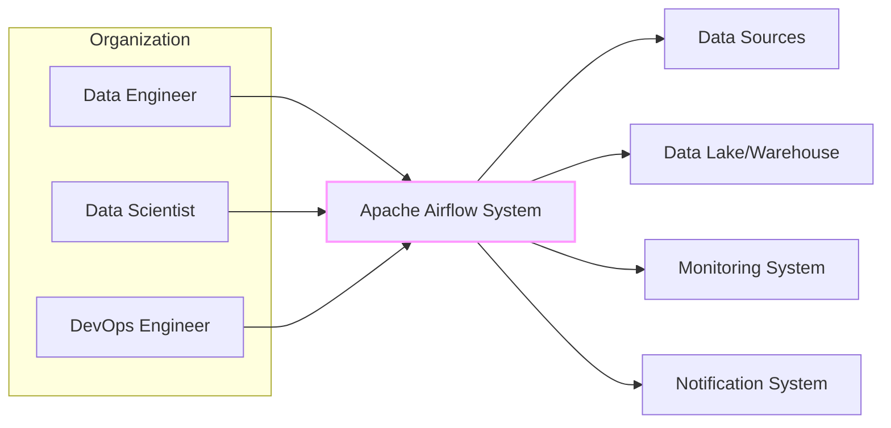
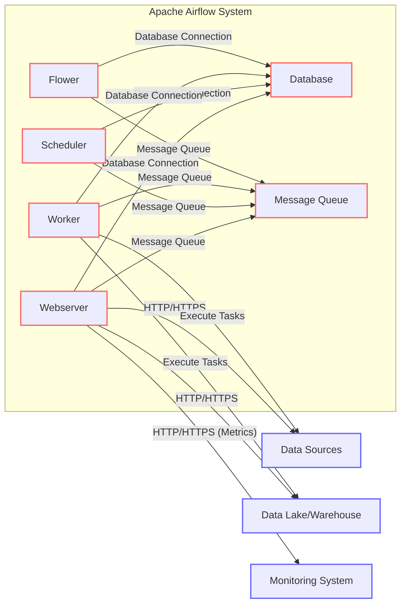
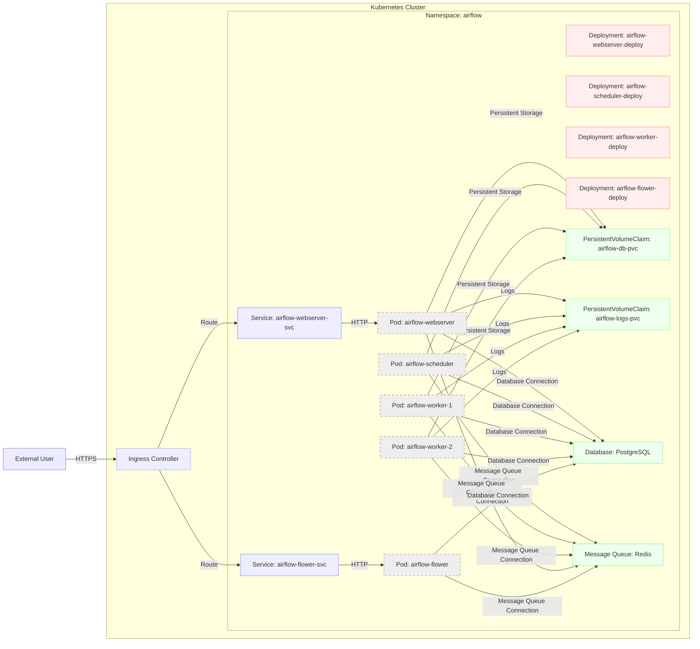
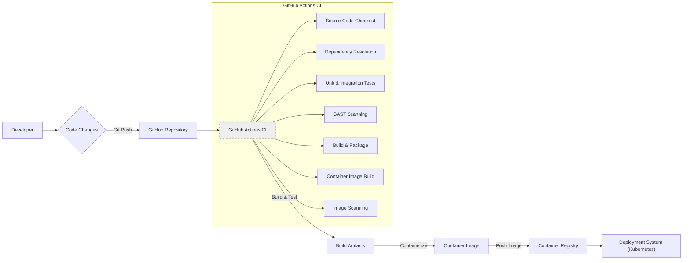

# BUSINESS POSTURE

The Apache Airflow project aims to provide a platform to programmatically author, schedule, and monitor workflows. It is designed to manage complex computational workflows and data pipelines.

Business priorities and goals for adopting Apache Airflow include:
- Automating data pipelines and ETL processes to improve efficiency and reduce manual effort.
- Orchestrating machine learning workflows for model training, deployment, and monitoring.
- Enhancing data reliability and consistency by automating data processing tasks.
- Improving observability and monitoring of complex workflows to ensure timely execution and identify failures.
- Enabling self-service data engineering capabilities for data scientists and analysts.

Most important business risks that need to be addressed:
- Data Integrity Risks: Incorrect or incomplete data processing due to workflow failures or misconfigurations can lead to flawed business decisions.
- Data Availability Risks: Downtime or unavailability of Airflow can disrupt critical data pipelines, impacting business operations and reporting.
- Data Security Risks: Unauthorized access to sensitive data processed by workflows or to the Airflow platform itself can lead to data breaches and compliance violations.
- Operational Risks: Complexity of managing and maintaining Airflow infrastructure and workflows can lead to operational inefficiencies and errors.
- Compliance Risks: Failure to meet regulatory compliance requirements (e.g., GDPR, HIPAA) due to insecure data processing or lack of auditability.

# SECURITY POSTURE

Existing security controls:
- security control: Role-Based Access Control (RBAC) - Implemented within Airflow Web UI and API to manage user permissions and access to resources (DAGs, connections, pools, etc.). Described in Airflow documentation and code.
- security control: Authentication - Implemented via various backend options (e.g., password, LDAP, OAuth) for user login to the Airflow Web UI and API. Configurable in `airflow.cfg` and documented.
- security control: Connections Encryption - Supports encryption for connections to external systems (databases, cloud services) using connection strings and parameters. Configurable when defining connections in Airflow UI or via code.
- security control: Logging and Auditing - Airflow logs workflow execution details, user actions, and system events, providing audit trails. Logs are stored in configured logging locations (local files, cloud storage, etc.). Configurable in `airflow.cfg` and documented.

Accepted risks:
- accepted risk: Vulnerabilities in third-party dependencies - Airflow relies on numerous Python packages, which may contain security vulnerabilities. Risk is partially mitigated by dependency scanning and updates.
- accepted risk: Misconfigurations - Incorrectly configured Airflow settings, permissions, or connections can lead to security weaknesses. Risk is mitigated by documentation and best practices.
- accepted risk: Insider threats - Malicious or negligent actions by authorized users can compromise the system. Risk is mitigated by RBAC, auditing, and security awareness training.

Recommended security controls:
- security control: Secrets Management - Implement a dedicated secrets management solution (e.g., HashiCorp Vault, AWS Secrets Manager) to securely store and manage sensitive credentials (API keys, database passwords) used in Airflow connections and DAGs.
- security control: Network Segmentation - Isolate Airflow components (webserver, scheduler, worker) and the underlying infrastructure within secure network segments to limit the impact of potential breaches.
- security control: Vulnerability Scanning - Regularly scan Airflow infrastructure and application dependencies for known vulnerabilities using automated tools.
- security control: Security Audits - Conduct periodic security audits and penetration testing to identify and address security weaknesses in Airflow deployments and configurations.
- security control: Incident Response Plan - Develop and maintain an incident response plan specifically for Airflow security incidents to ensure timely and effective handling of breaches or attacks.

Security requirements:
- Authentication:
    - Requirement: Securely authenticate users accessing the Airflow Web UI and API.
    - Requirement: Support multi-factor authentication (MFA) for enhanced user authentication.
    - Requirement: Implement service account authentication for Airflow components interacting with external systems.
- Authorization:
    - Requirement: Enforce fine-grained role-based access control (RBAC) to manage user permissions for DAGs, connections, and other Airflow resources.
    - Requirement: Implement authorization policies to control access to sensitive data and operations within workflows.
    - Requirement: Regularly review and update user roles and permissions to maintain least privilege access.
- Input Validation:
    - Requirement: Validate inputs to DAGs and operators to prevent injection attacks and ensure data integrity.
    - Requirement: Sanitize user-provided inputs in the Airflow Web UI to prevent cross-site scripting (XSS) vulnerabilities.
    - Requirement: Implement input validation for API requests to prevent malicious or malformed data from being processed.
- Cryptography:
    - Requirement: Encrypt sensitive data at rest, including database credentials, API keys, and other secrets stored within Airflow.
    - Requirement: Encrypt data in transit between Airflow components and external systems using TLS/SSL.
    - Requirement: Utilize strong cryptographic algorithms and key management practices for encryption and decryption operations.

# DESIGN

## C4 CONTEXT

Context Diagram Elements:

- Element:
    - Name: Data Engineer
    - Type: User
    - Description: Professionals responsible for designing, building, and maintaining data pipelines using Airflow.
    - Responsibilities: Creating and managing DAGs, defining workflows, monitoring pipeline execution, troubleshooting issues.
    - Security controls: Authenticated access to Airflow Web UI and API via RBAC.

- Element:
    - Name: Data Scientist
    - Type: User
    - Description: Professionals who utilize data pipelines orchestrated by Airflow for data analysis, model training, and experimentation.
    - Responsibilities: Triggering data pipelines, accessing processed data, monitoring workflow status relevant to their tasks.
    - Security controls: Authenticated access to Airflow Web UI and API via RBAC, potentially with restricted permissions compared to Data Engineers.

- Element:
    - Name: DevOps Engineer
    - Type: User
    - Description: Professionals responsible for deploying, managing, and maintaining the Airflow infrastructure and ensuring its availability and performance.
    - Responsibilities: Infrastructure provisioning, Airflow installation and configuration, monitoring system health, implementing security controls, managing deployments.
    - Security controls: Access to infrastructure management tools, potentially privileged access to Airflow configuration and underlying systems, authenticated access to Airflow Web UI and API via RBAC.

- Element:
    - Name: Apache Airflow System
    - Type: System
    - Description: The workflow orchestration platform that programmatically authors, schedules, and monitors data pipelines.
    - Responsibilities: DAG parsing and scheduling, task execution, workflow monitoring, logging, user interface, API access.
    - Security controls: Authentication, Authorization (RBAC), Input Validation, Cryptography (secrets management, connection encryption), Logging and Auditing.

- Element:
    - Name: Data Sources
    - Type: External System
    - Description: External systems that provide data to be processed by Airflow workflows. Examples include databases, APIs, cloud storage services, message queues.
    - Responsibilities: Providing data to Airflow pipelines, authenticating Airflow's access requests.
    - Security controls: Authentication mechanisms (API keys, passwords, tokens), authorization policies, network access controls.

- Element:
    - Name: Data Lake/Warehouse
    - Type: External System
    - Description: Centralized repositories where processed data from Airflow workflows is stored. Examples include cloud storage (S3, GCS, Azure Blob Storage), data warehouses (Snowflake, BigQuery, Redshift).
    - Responsibilities: Storing processed data, providing access to data for downstream applications and users, enforcing data access controls.
    - Security controls: Access control lists (ACLs), Identity and Access Management (IAM), encryption at rest and in transit.

- Element:
    - Name: Monitoring System
    - Type: External System
    - Description: Systems used to monitor the health and performance of Airflow and its workflows. Examples include Prometheus, Grafana, CloudWatch, Datadog.
    - Responsibilities: Collecting metrics and logs from Airflow, providing dashboards and alerts, enabling performance monitoring and troubleshooting.
    - Security controls: Secure API access, authentication and authorization for accessing monitoring data.

- Element:
    - Name: Notification System
    - Type: External System
    - Description: Systems used to send notifications about workflow status, failures, or alerts. Examples include email servers, Slack, PagerDuty.
    - Responsibilities: Sending notifications based on Airflow events, ensuring reliable delivery of notifications.
    - Security controls: Secure API access, authentication for sending notifications, potentially encryption of notification content.

## C4 CONTAINER

Container Diagram Elements:

- Element:
    - Name: Webserver
    - Type: Container
    - Description: Provides the user interface (UI) and API for interacting with Airflow. Handles user authentication, authorization, DAG management, workflow monitoring, and API requests.
    - Responsibilities: Serving the Airflow UI, handling API requests, managing user sessions, providing access control.
    - Security controls: Authentication (user login), Authorization (RBAC), Input Validation (UI inputs, API requests), HTTPS for UI and API access, potentially rate limiting to prevent abuse.

- Element:
    - Name: Scheduler
    - Type: Container
    - Description: Responsible for parsing DAG files, scheduling tasks based on defined schedules and dependencies, and triggering task execution.
    - Responsibilities: DAG parsing, task scheduling, workflow orchestration, managing task states.
    - Security controls: Access control to DAG files and configurations, secure communication with the database and message queue, input validation of DAG definitions.

- Element:
    - Name: Worker
    - Type: Container
    - Description: Executes the actual tasks defined in DAGs. Workers pull tasks from the message queue and execute them using configured executors.
    - Responsibilities: Task execution, interacting with external systems (data sources, data warehouses), logging task execution details.
    - Security controls: Secure communication with the message queue and database, isolation of task execution environments (e.g., using Docker), secure handling of credentials for external system access.

- Element:
    - Name: Database
    - Type: Container
    - Description: Stores Airflow metadata, including DAG definitions, task states, user information, connections, and logs. PostgreSQL or MySQL are commonly used.
    - Responsibilities: Persistent storage of Airflow metadata, providing data access to other Airflow components.
    - Security controls: Database access control (user permissions), encryption at rest, encryption in transit (TLS/SSL for database connections), regular backups.

- Element:
    - Name: Message Queue
    - Type: Container
    - Description: Used for communication between the Scheduler and Workers. The Scheduler enqueues tasks, and Workers dequeue and execute them. Celery or Redis are commonly used.
    - Responsibilities: Task queuing and distribution, asynchronous communication between Scheduler and Workers.
    - Security controls: Access control to the message queue, encryption in transit (if supported by the message queue), secure configuration of message queue brokers.

- Element:
    - Name: Flower
    - Type: Container
    - Description: An optional real-time monitor and web administrator for Celery. Provides insights into worker status, task queues, and task execution.
    - Responsibilities: Monitoring Celery workers and tasks, providing a UI for Celery monitoring.
    - Security controls: Authentication and authorization for accessing Flower UI, secure communication with the message queue and database.

## DEPLOYMENT

Deployment Architecture: Kubernetes

Deployment Diagram Elements (Kubernetes):

- Element:
    - Name: Kubernetes Cluster
    - Type: Infrastructure
    - Description: The container orchestration platform where Airflow is deployed. Provides scalability, resilience, and management for Airflow components.
    - Responsibilities: Container orchestration, resource management, service discovery, load balancing.
    - Security controls: Network policies, RBAC for Kubernetes API access, pod security policies/admission controllers, security monitoring.

- Element:
    - Name: Namespace: airflow
    - Type: Kubernetes Namespace
    - Description: A logical isolation boundary within the Kubernetes cluster dedicated to Airflow resources.
    - Responsibilities: Resource isolation, access control within the Airflow deployment.
    - Security controls: Kubernetes RBAC for namespace access, network policies to isolate namespace traffic.

- Element:
    - Name: Pod: airflow-webserver
    - Type: Kubernetes Pod
    - Description: Kubernetes Pod running the Airflow Webserver container.
    - Responsibilities: Serving the Airflow UI and API.
    - Security controls: Container security context, resource limits, network policies.

- Element:
    - Name: Pod: airflow-scheduler
    - Type: Kubernetes Pod
    - Description: Kubernetes Pod running the Airflow Scheduler container.
    - Responsibilities: DAG scheduling and task orchestration.
    - Security controls: Container security context, resource limits, network policies.

- Element:
    - Name: Pod: airflow-worker-1, airflow-worker-2
    - Type: Kubernetes Pod
    - Description: Kubernetes Pods running Airflow Worker containers. Scaled horizontally for task execution capacity.
    - Responsibilities: Executing tasks from the message queue.
    - Security controls: Container security context, resource limits, network policies, worker isolation.

- Element:
    - Name: Service: airflow-webserver-svc
    - Type: Kubernetes Service
    - Description: Kubernetes Service exposing the Airflow Webserver Pods within the cluster.
    - Responsibilities: Load balancing and service discovery for Webserver Pods.
    - Security controls: Network policies, service account access control.

- Element:
    - Name: Service: airflow-flower-svc
    - Type: Kubernetes Service
    - Description: Kubernetes Service exposing the Flower Pods within the cluster.
    - Responsibilities: Load balancing and service discovery for Flower Pods.
    - Security controls: Network policies, service account access control.

- Element:
    - Name: Deployment: airflow-webserver-deploy, airflow-scheduler-deploy, airflow-worker-deploy, airflow-flower-deploy
    - Type: Kubernetes Deployment
    - Description: Kubernetes Deployments managing the lifecycle and scaling of Airflow component Pods.
    - Responsibilities: Declarative management of Pod replicas, rolling updates, rollbacks.
    - Security controls: Deployment strategies, update policies, resource management.

- Element:
    - Name: PersistentVolumeClaim: airflow-db-pvc, airflow-logs-pvc
    - Type: Kubernetes PersistentVolumeClaim
    - Description: Requests for persistent storage for the Airflow Database and Logs.
    - Responsibilities: Persistent storage for Airflow metadata and logs across Pod restarts.
    - Security controls: Access control to persistent volumes, encryption at rest for persistent volumes.

- Element:
    - Name: Pod: airflow-flower
    - Type: Kubernetes Pod
    - Description: Kubernetes Pod running the Flower container.
    - Responsibilities: Monitoring Celery workers and tasks.
    - Security controls: Container security context, resource limits, network policies.

- Element:
    - Name: Database: PostgreSQL
    - Type: Database (Kubernetes managed or external)
    - Description: PostgreSQL database used for Airflow metadata storage. Can be deployed within Kubernetes or externally managed.
    - Responsibilities: Persistent storage of Airflow metadata.
    - Security controls: Database access control, encryption at rest and in transit, regular backups, database hardening.

- Element:
    - Name: Message Queue: Redis
    - Type: Message Queue (Kubernetes managed or external)
    - Description: Redis message queue used for task queuing and communication between Scheduler and Workers. Can be deployed within Kubernetes or externally managed.
    - Responsibilities: Task queuing and distribution.
    - Security controls: Access control to Redis, encryption in transit (if configured), secure Redis configuration.

- Element:
    - Name: Ingress Controller
    - Type: Kubernetes Ingress Controller
    - Description: Manages external access to Kubernetes services, routing external HTTPS traffic to the Airflow Webserver Service.
    - Responsibilities: External access management, TLS termination, routing.
    - Security controls: TLS configuration, ingress controller security hardening, rate limiting, Web Application Firewall (WAF).

- Element:
    - Name: External User
    - Type: User
    - Description: Users accessing the Airflow Web UI and API from outside the Kubernetes cluster.
    - Responsibilities: Interacting with Airflow for workflow management and monitoring.
    - Security controls: Authentication via Airflow Web UI, HTTPS for secure communication.

## BUILD

Build Process Description:

1. Developer: Developers write and modify Airflow code, including DAGs, operators, and core Airflow components.
2. Code Changes: Code changes are committed and pushed to the GitHub repository.
3. GitHub Repository: The central source code repository for the Airflow project.
4. GitHub Actions CI: GitHub Actions workflows are triggered on code changes (e.g., pull requests, pushes to main branch).
5. GitHub Actions CI - Source Code Checkout: CI pipeline starts by checking out the latest code changes from the repository.
6. GitHub Actions CI - Dependency Resolution: CI pipeline resolves project dependencies using package managers (e.g., pip for Python).
7. GitHub Actions CI - Unit & Integration Tests: Automated unit and integration tests are executed to verify code functionality and prevent regressions.
8. GitHub Actions CI - SAST Scanning: Static Application Security Testing (SAST) tools are used to scan the codebase for potential security vulnerabilities.
9. GitHub Actions CI - Build & Package: The project is built and packaged into distributable artifacts (e.g., Python packages, wheels).
10. GitHub Actions CI - Container Image Build: Dockerfiles are used to build container images for Airflow components (webserver, scheduler, worker).
11. GitHub Actions CI - Image Scanning: Container images are scanned for known vulnerabilities using container image scanning tools.
12. Build Artifacts: Build artifacts, including Python packages and container images, are produced by the CI pipeline.
13. Container Image: Container images for Airflow components are created.
14. Container Registry: Container images are pushed to a container registry (e.g., Docker Hub, GitHub Container Registry).
15. Deployment System (Kubernetes): The deployment system (e.g., Kubernetes) pulls the latest container images from the container registry to deploy or update Airflow components.

Build Process Security Controls:

- security control: Automated Build Process: Use of GitHub Actions for automated CI/CD pipelines ensures consistent and repeatable builds, reducing manual errors and improving security.
- security control: Source Code Management: Using GitHub for version control and code review provides traceability and helps prevent unauthorized code changes.
- security control: Unit and Integration Tests: Automated tests ensure code quality and reduce the risk of introducing vulnerabilities through code changes.
- security control: SAST Scanning: Static Application Security Testing (SAST) tools identify potential security vulnerabilities in the codebase early in the development lifecycle.
- security control: Dependency Scanning: Dependency scanning tools analyze project dependencies for known vulnerabilities, ensuring that vulnerable libraries are not included in the build.
- security control: Container Image Scanning: Container image scanning tools identify vulnerabilities in container images before deployment, reducing the risk of deploying vulnerable containers.
- security control: Secure Container Registry: Using a secure container registry with access controls and vulnerability scanning ensures the integrity and security of container images.
- security control: Code Signing/Artifact Signing: Signing build artifacts and container images can provide assurance of their authenticity and integrity.

# RISK ASSESSMENT

Critical business processes we are trying to protect:
- Data Pipeline Execution: Ensuring reliable and timely execution of data pipelines is critical for data availability, reporting, and downstream applications.
- Workflow Orchestration: Maintaining the integrity and availability of workflow orchestration is essential for automated data processing and business operations.
- Data Ingestion and Processing: Protecting the integrity and confidentiality of data ingested and processed by Airflow workflows is crucial for data quality and compliance.
- Monitoring and Alerting: Reliable monitoring and alerting are necessary for timely detection and response to workflow failures and system issues.

Data we are trying to protect and their sensitivity:
- Workflow Definitions (DAGs): DAGs may contain sensitive information such as connection details, API keys, and business logic. Sensitivity: Medium to High (depending on content).
- Connection Credentials: Database passwords, API keys, cloud service credentials stored in Airflow connections. Sensitivity: High.
- Logs: Airflow logs may contain sensitive data processed by workflows, system events, and user actions. Sensitivity: Medium to High (depending on content).
- Processed Data: Data processed by Airflow workflows can range from low to high sensitivity depending on the business context (e.g., PII, financial data, health records). Sensitivity: Variable, potentially High.
- Airflow Metadata: Database containing Airflow configurations, user information, and workflow states. Sensitivity: Medium.

# QUESTIONS & ASSUMPTIONS

Questions:
- What is the specific deployment environment for Airflow (cloud, on-premises, hybrid)?
- What are the specific data sources and data destinations that Airflow will interact with?
- What is the sensitivity level of the data being processed by Airflow workflows?
- Are there any specific compliance requirements (e.g., GDPR, HIPAA, PCI DSS) that need to be considered?
- What is the organization's risk appetite regarding security vulnerabilities and operational disruptions?
- What secrets management solution is currently in use or planned for adoption?
- What monitoring and alerting systems are currently in place?

Assumptions:
- Assumption: Airflow is deployed in a Kubernetes environment for scalability and resilience.
- Assumption: Security is a high priority for the Airflow deployment due to the sensitivity of data and business processes involved.
- Assumption: A secrets management solution will be implemented to securely manage sensitive credentials.
- Assumption: Standard security best practices will be followed for infrastructure and application security.
- Assumption: The organization has a DevOps team responsible for managing and maintaining the Airflow infrastructure.