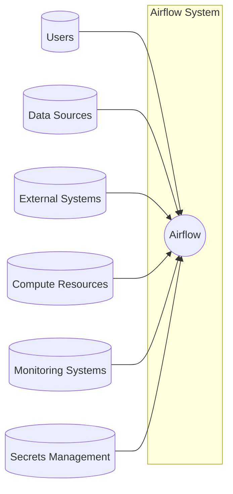
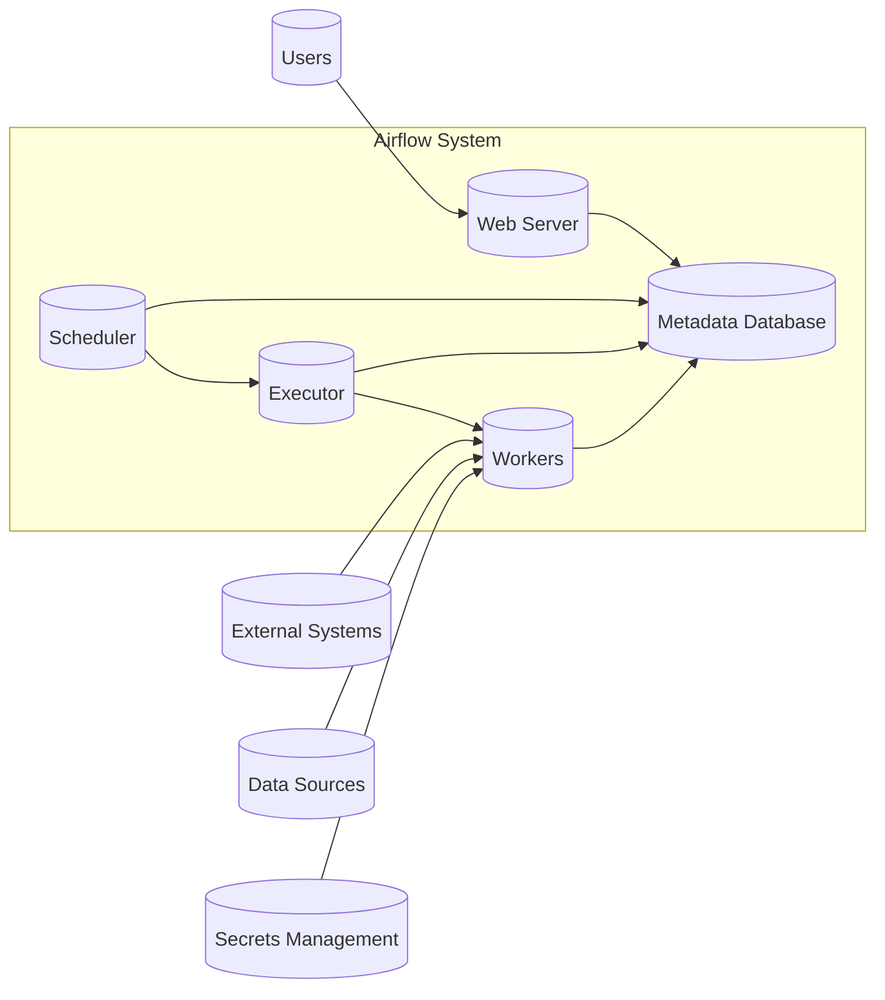
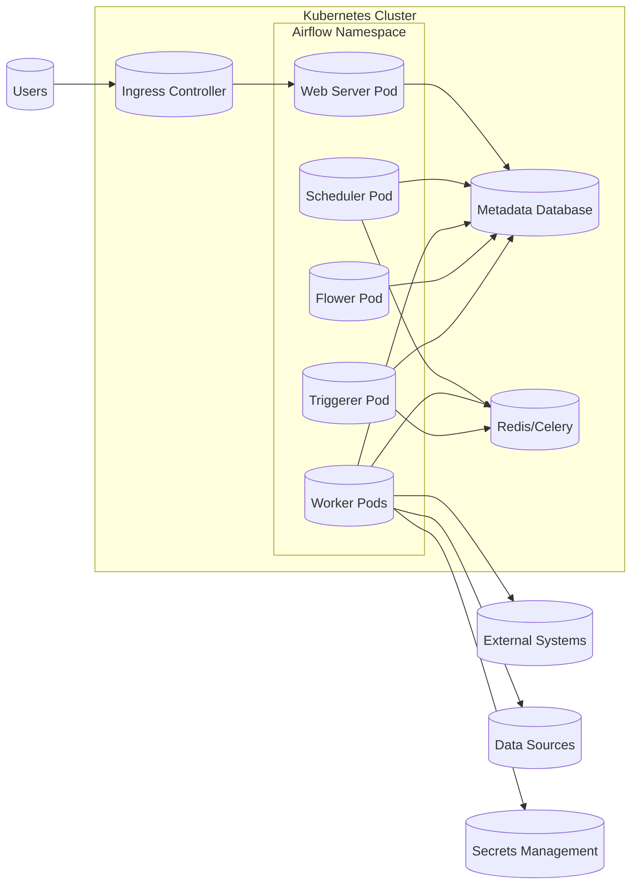
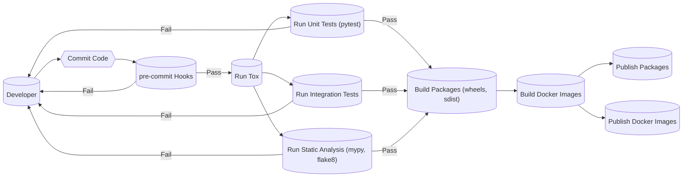

# BUSINESS POSTURE

Apache Airflow is a platform to programmatically author, schedule, and monitor workflows. Given its widespread use in orchestrating complex computational workflows, data pipelines, and ETL processes across various industries, the business posture can be characterized as follows:

Priorities and Goals:

*   Reliability: Ensure workflows are executed reliably and as scheduled.
*   Scalability: Handle increasing volumes of workflows and tasks as businesses grow.
*   Extensibility: Allow users to easily integrate with a wide variety of external systems and services.
*   Maintainability: Provide a codebase that is easy to understand, maintain, and contribute to.
*   Usability: Offer a user-friendly interface for managing and monitoring workflows.
*   Security: Protect sensitive data and credentials used within workflows.
*   Community: Foster a vibrant and active open-source community.

Business Risks:

*   Workflow Execution Failures: Unreliable workflow execution can lead to data loss, missed deadlines, and business disruptions.
*   Data Breaches: Exposure of sensitive data processed or managed by Airflow.
*   Scalability Bottlenecks: Inability to handle growing workflow demands can impact business operations.
*   Integration Issues: Difficulties in integrating with other systems can limit the utility of Airflow.
*   Operational Overhead: Complex setup and maintenance can increase operational costs.
*   Reputation damage: Security incidents or major bugs can damage the reputation of the project and the organizations using it.

# SECURITY POSTURE

Existing Security Controls:

*   security control: Authentication: Airflow supports various authentication backends (e.g., password, LDAP, OAuth). Described in Airflow documentation and configuration files.
*   security control: Authorization: Role-Based Access Control (RBAC) is available to manage user permissions. Described in Airflow documentation and configuration files.
*   security control: Secrets Management: Airflow can integrate with external secrets management systems (e.g., HashiCorp Vault, AWS Secrets Manager, GCP Secret Manager) to securely store and retrieve sensitive information. Described in Airflow documentation and configuration files.
*   security control: Input Validation: Airflow performs some input validation, particularly in the web interface and API. Implemented in the codebase.
*   security control: Encryption: Connections to external systems can be encrypted using TLS/SSL. Described in Airflow documentation and configuration files.
*   security control: Auditing: Airflow logs various events, including task execution, user actions, and configuration changes. Described in Airflow documentation and configuration files.
*   security control: Secure by default configurations. Described in Airflow documentation.
*   security control: Regular security releases and updates. Described in Airflow release notes.

Accepted Risks:

*   accepted risk: Complexity of configuration: Airflow's extensive configuration options can lead to misconfigurations if not carefully managed.
*   accepted risk: Dependence on external systems: Security vulnerabilities in integrated systems can impact Airflow's security.
*   accepted risk: Community-provided operators: The security of community-provided operators may vary.

Recommended Security Controls:

*   security control: Implement robust input validation for all user-supplied data, including DAG definitions and task parameters.
*   security control: Enforce the principle of least privilege for all users and services interacting with Airflow.
*   security control: Regularly audit Airflow's configuration and logs to detect and respond to security incidents.
*   security control: Implement network segmentation to isolate Airflow components and limit the impact of potential breaches.
*   security control: Use a dedicated, isolated environment for Airflow deployments.
*   security control: Implement regular vulnerability scanning and penetration testing.

Security Requirements:

*   Authentication:
    *   Support for multi-factor authentication (MFA).
    *   Integration with existing enterprise identity providers (e.g., SAML, OpenID Connect).
    *   Strong password policies.
*   Authorization:
    *   Fine-grained access control to DAGs, tasks, and resources.
    *   Ability to define custom roles and permissions.
    *   Audit trails for all authorization decisions.
*   Input Validation:
    *   Strict validation of all user-supplied data, including DAG definitions, task parameters, and connection configurations.
    *   Protection against common web vulnerabilities (e.g., XSS, SQL injection, CSRF).
*   Cryptography:
    *   Use of strong, industry-standard cryptographic algorithms and protocols.
    *   Secure storage of sensitive data at rest and in transit.
    *   Proper key management practices.

# DESIGN

## C4 CONTEXT

Element List:

*   Element:
    *   Name: Airflow
    *   Type: System
    *   Description: The Apache Airflow workflow management platform.
    *   Responsibilities: Scheduling, executing, and monitoring workflows.
    *   Security controls: Authentication, Authorization, Auditing, Secrets Management Integration.

*   Element:
    *   Name: Users
    *   Type: Person
    *   Description: Individuals who interact with Airflow to define, monitor, and manage workflows.
    *   Responsibilities: Defining DAGs, triggering runs, monitoring progress, troubleshooting issues.
    *   Security controls: Authentication, Authorization (RBAC).

*   Element:
    *   Name: Data Sources
    *   Type: System
    *   Description: Systems that provide data to be processed by Airflow workflows.
    *   Responsibilities: Storing and providing data.
    *   Security controls: Data encryption at rest and in transit, access controls.

*   Element:
    *   Name: External Systems
    *   Type: System
    *   Description: Systems that Airflow interacts with as part of workflows (e.g., APIs, databases, cloud services).
    *   Responsibilities: Performing specific tasks within workflows.
    *   Security controls: Authentication, Authorization, Encryption (TLS/SSL).

*   Element:
    *   Name: Compute Resources
    *   Type: System
    *   Description: Infrastructure where Airflow tasks are executed (e.g., Kubernetes cluster, cloud instances).
    *   Responsibilities: Providing compute power for task execution.
    *   Security controls: Network segmentation, access controls, resource isolation.

*   Element:
    *   Name: Monitoring Systems
    *   Type: System
    *   Description: Systems used to monitor the health and performance of Airflow itself (e.g., Prometheus, Grafana).
    *   Responsibilities: Collecting and visualizing metrics, alerting on issues.
    *   Security controls: Access controls, secure communication channels.

*   Element:
    *   Name: Secrets Management
    *   Type: System
    *   Description: Systems used to securely store and manage sensitive information (e.g., HashiCorp Vault, AWS Secrets Manager).
    *   Responsibilities: Providing secure access to credentials and secrets.
    *   Security controls: Encryption, access controls, audit trails.

## C4 CONTAINER

Element List:

*   Element:
    *   Name: Web Server
    *   Type: Web Application
    *   Description: Provides the user interface for interacting with Airflow.
    *   Responsibilities: Handling user requests, displaying DAGs and task status, managing users and permissions.
    *   Security controls: Authentication, Authorization (RBAC), Input Validation, Session Management.

*   Element:
    *   Name: Scheduler
    *   Type: Application
    *   Description: Responsible for scheduling DAGs and tasks.
    *   Responsibilities: Monitoring DAGs, triggering task execution, handling retries and failures.
    *   Security controls: Access controls, secure communication with other components.

*   Element:
    *   Name: Executor
    *   Type: Application
    *   Description: Determines how tasks are executed (e.g., sequentially, in parallel, on remote workers).
    *   Responsibilities: Managing task execution, distributing tasks to workers.
    *   Security controls: Secure communication with workers, resource isolation.

*   Element:
    *   Name: Metadata Database
    *   Type: Database
    *   Description: Stores metadata about DAGs, tasks, runs, and connections.
    *   Responsibilities: Persisting Airflow's state.
    *   Security controls: Database access controls, encryption at rest and in transit, regular backups.

*   Element:
    *   Name: Workers
    *   Type: Application
    *   Description: Execute the tasks defined in DAGs.
    *   Responsibilities: Running tasks, reporting status back to the scheduler.
    *   Security controls: Secure communication with the scheduler and external systems, access controls, input validation, secrets management.

*   Element:
    *   Name: Users
    *   Type: Person
    *   Description: Individuals who interact with Airflow to define, monitor, and manage workflows.
    *   Responsibilities: Defining DAGs, triggering runs, monitoring progress, troubleshooting issues.
    *   Security controls: Authentication, Authorization (RBAC).

*   Element:
    *   Name: External Systems
    *   Type: System
    *   Description: Systems that Airflow interacts with as part of workflows (e.g., APIs, databases, cloud services).
    *   Responsibilities: Performing specific tasks within workflows.
    *   Security controls: Authentication, Authorization, Encryption (TLS/SSL).

*   Element:
    *   Name: Data Sources
    *   Type: System
    *   Description: Systems that provide data to be processed by Airflow workflows.
    *   Responsibilities: Storing and providing data.
    *   Security controls: Data encryption at rest and in transit, access controls.

*   Element:
    *   Name: Secrets Management
    *   Type: System
    *   Description: Systems used to securely store and manage sensitive information (e.g., HashiCorp Vault, AWS Secrets Manager).
    *   Responsibilities: Providing secure access to credentials and secrets.
    *   Security controls: Encryption, access controls, audit trails.

## DEPLOYMENT

Possible deployment solutions:

1.  Single-Node Deployment: All Airflow components (web server, scheduler, executor, metadata database) run on a single machine. Suitable for development and small-scale deployments.
2.  Multi-Node Deployment: Airflow components are distributed across multiple machines. Provides better scalability and reliability.
3.  Kubernetes Deployment: Airflow components are deployed as containers within a Kubernetes cluster. Offers high scalability, fault tolerance, and resource efficiency. This is the most common and recommended approach for production.
4.  Cloud-Based Deployment: Using managed Airflow services offered by cloud providers (e.g., AWS MWAA, Google Cloud Composer, Astronomer). Simplifies deployment and management.

Chosen solution (for detailed description): Kubernetes Deployment

Element List:

*   Element:
    *   Name: Web Server Pod
    *   Type: Kubernetes Pod
    *   Description: Runs the Airflow web server.
    *   Responsibilities: Serving the web UI.
    *   Security controls: Authentication, Authorization, Network policies.

*   Element:
    *   Name: Scheduler Pod
    *   Type: Kubernetes Pod
    *   Description: Runs the Airflow scheduler.
    *   Responsibilities: Scheduling DAGs and tasks.
    *   Security controls: Network policies, service accounts.

*   Element:
    *   Name: Worker Pods
    *   Type: Kubernetes Pod
    *   Description: Run Airflow workers.
    *   Responsibilities: Executing tasks.
    *   Security controls: Network policies, service accounts, resource limits, secrets management integration.

*   Element:
    *   Name: Flower Pod
    *   Type: Kubernetes Pod
    *   Description: Runs Flower, a web-based tool for monitoring and administering Celery workers.
    *   Responsibilities: Monitoring Celery workers.
    *   Security controls: Authentication, Authorization, Network policies.

*   Element:
    *   Name: Triggerer Pod
    *   Type: Kubernetes Pod
    *   Description: Runs the Airflow triggerer, which is responsible for triggering deferred tasks.
    *   Responsibilities: Triggering deferred tasks.
    *   Security controls: Network policies, service accounts.

*   Element:
    *   Name: Metadata Database
    *   Type: Database (e.g., PostgreSQL, MySQL)
    *   Description: Stores Airflow metadata. Could be a managed database service (e.g., Cloud SQL, RDS) or a database running within the Kubernetes cluster.
    *   Responsibilities: Persisting Airflow's state.
    *   Security controls: Database access controls, encryption at rest and in transit, regular backups.

*   Element:
    *   Name: Redis/Celery
    *   Type: Message Queue (Redis) and Task Queue (Celery)
    *   Description: Used for communication between the scheduler and workers. Could be a managed service or deployed within Kubernetes.
    *   Responsibilities: Queuing tasks, managing worker communication.
    *   Security controls: Network policies, access controls, encryption.

*   Element:
    *   Name: Ingress Controller
    *   Type: Kubernetes Ingress Controller
    *   Description: Manages external access to the Airflow web server.
    *   Responsibilities: Routing traffic to the web server.
    *   Security controls: TLS termination, access controls, network policies.

*   Element:
    *   Name: External Systems
    *   Type: System
    *   Description: Systems that Airflow interacts with.
    *   Responsibilities: Varies depending on the system.
    *   Security controls: Authentication, Authorization, Encryption.

*   Element:
    *   Name: Data Sources
    *   Type: System
    *   Description: Systems providing data to Airflow.
    *   Responsibilities: Storing and providing data.
    *   Security controls: Access controls, encryption.

*   Element:
    *   Name: Secrets Management
    *   Type: System
    *   Description: System for managing secrets (e.g., Kubernetes Secrets, HashiCorp Vault).
    *   Responsibilities: Securely storing and providing secrets.
    *   Security controls: Encryption, access controls, audit trails.

*   Element:
    *   Name: Users
    *   Type: Person
    *   Description: Individuals who interact with Airflow to define, monitor, and manage workflows.
    *   Responsibilities: Defining DAGs, triggering runs, monitoring progress, troubleshooting issues.
    *   Security controls: Authentication, Authorization (RBAC).

## BUILD

The build process for Apache Airflow involves several steps, from development to packaging and distribution. It leverages tools like `tox`, `pytest`, and `pre-commit` for testing and code quality, and builds Docker images for containerized deployments.

Build Process Description:

1.  Developer: Developers write code and commit it to the repository.
2.  Commit Code: Code is committed to the version control system (Git).
3.  pre-commit Hooks: pre-commit hooks run automatically before each commit, enforcing code style, checking for common errors, and running linters.
    *   security control: Enforces coding standards and best practices.
    *   security control: Prevents committing secrets or sensitive information.
4.  Run Tox: Tox is used to create isolated virtual environments for testing against different Python versions and configurations.
    *   security control: Ensures consistent testing environments.
5.  Run Unit Tests (pytest): Pytest is used to run unit tests, verifying the functionality of individual components.
    *   security control: Detects bugs early in the development cycle.
6.  Run Integration Tests: Integration tests verify the interaction between different components of Airflow.
    *   security control: Ensures that components work together correctly.
7.  Run Static Analysis (mypy, flake8): Static analysis tools like mypy (type checking) and flake8 (style checking) are used to identify potential issues and enforce code quality.
    *   security control: Improves code quality and reduces the risk of vulnerabilities.
8.  Build Packages (wheels, sdist): If all tests pass, Python packages (wheels and source distributions) are built.
9.  Build Docker Images: Docker images are built for various Airflow components (web server, scheduler, worker, etc.).
    *   security control: Uses base images from trusted sources.
    *   security control: Minimizes the attack surface by including only necessary components.
10. Publish Packages: Python packages are published to PyPI (Python Package Index).
11. Publish Docker Images: Docker images are published to a container registry (e.g., Docker Hub, Quay.io).
    *   security control: Images are scanned for vulnerabilities before publishing.

# RISK ASSESSMENT

Critical Business Processes:

*   Data Pipeline Orchestration: Airflow is critical for orchestrating data pipelines, ensuring data is processed and delivered on time and accurately. Failure of this process can lead to data loss, incorrect data, and business disruptions.
*   Workflow Scheduling and Execution: Airflow schedules and executes workflows, which may include critical business operations. Failure of this process can lead to missed deadlines and operational inefficiencies.
*   ETL Processes: Airflow is often used for ETL (Extract, Transform, Load) processes, which are essential for data warehousing and business intelligence. Failure of ETL processes can impact decision-making and reporting.

Data Sensitivity:

*   DAG Definitions: May contain sensitive information such as connection strings, API keys, and credentials. Sensitivity: High.
*   Task Parameters: May include sensitive data passed to tasks. Sensitivity: Varies, potentially high.
*   Logs: May contain sensitive information from task execution. Sensitivity: Varies, potentially high.
*   Metadata Database: Stores information about DAGs, tasks, runs, and connections, which may include sensitive data. Sensitivity: High.
*   Data Processed by Workflows: Airflow workflows may process sensitive data, such as PII (Personally Identifiable Information), financial data, or health information. Sensitivity: Varies, potentially high.

# QUESTIONS & ASSUMPTIONS

Questions:

*   What specific compliance requirements (e.g., GDPR, HIPAA, PCI DSS) must Airflow deployments adhere to?
*   What are the specific threat models for the organizations using Airflow?
*   What are the existing security policies and procedures for the organizations using Airflow?
*   What level of access do different user roles require within Airflow?
*   What are the specific external systems that Airflow will integrate with, and what are their security postures?
*   What is the expected scale of Airflow deployments (number of DAGs, tasks, users)?

Assumptions:

*   BUSINESS POSTURE: Organizations using Airflow prioritize reliability, scalability, and security.
*   BUSINESS POSTURE: Organizations have a basic understanding of security best practices.
*   SECURITY POSTURE: Airflow will be deployed in a secure environment with appropriate network segmentation and access controls.
*   SECURITY POSTURE: Secrets management will be handled using a dedicated system (e.g., Kubernetes Secrets, HashiCorp Vault).
*   SECURITY POSTURE: Regular security audits and vulnerability assessments will be conducted.
*   DESIGN: The Kubernetes deployment model is the preferred approach for production deployments.
*   DESIGN: Airflow will be integrated with existing monitoring and logging systems.
*   DESIGN: The build process will include automated security checks.