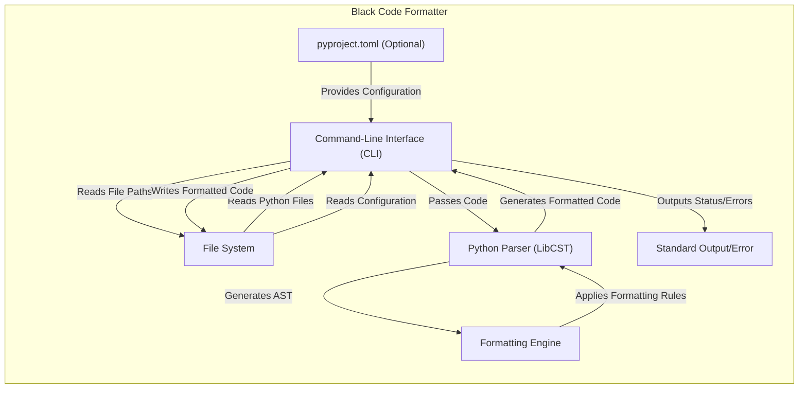

# Project Design Document: Black Code Formatter

**Version:** 1.1
**Date:** October 26, 2023
**Author:** AI Software Architect

## 1. Introduction

This document provides a high-level design overview of the Black code formatter project. It outlines the key components, data flow, and interactions within the system. This document serves as a foundation for subsequent threat modeling activities.

Black is a Python code formatter that enforces a consistent coding style. It aims to reduce stylistic disagreements among developers, allowing them to focus on the logic of their code. Black is opinionated and makes few configuration options available to the user.

## 2. Goals

*   Provide a consistent and automated way to format Python code.
*   Reduce stylistic debates in code reviews.
*   Improve code readability and maintainability.
*   Offer a simple and easy-to-use command-line interface.

## 3. Target Audience

This document is intended for:

*   Security engineers performing threat modeling.
*   Developers contributing to the Black project.
*   Individuals seeking a deeper understanding of Black's architecture.

## 4. System Architecture

Black primarily operates as a command-line tool. Its core functionality revolves around parsing Python code, applying formatting rules, and outputting the formatted code.

### 4.1. Key Components

*   Command-Line Interface (CLI): The entry point for users to interact with Black. It handles argument parsing, file input/output, and invoking the core formatting engine.
*   File System Interaction: Black reads Python files from the file system and writes the formatted output back to the file system (or standard output).
*   Python Parser (LibCST): Black utilizes the LibCST library to parse Python code into an Abstract Syntax Tree (AST). This allows for precise manipulation of the code structure.
*   Formatting Engine: The core logic of Black. It traverses the AST and applies the defined formatting rules. This involves decisions about line breaks, indentation, spacing, and other stylistic elements.
*   Configuration Handling (Minimal): Black has limited configuration options, typically managed through command-line flags or a `pyproject.toml` file.
*   Standard Output/Error Streams: Black uses standard output to print the formatted code and standard error for logging and error messages.

### 4.2. Data Flow

The typical data flow within Black is as follows:

1. Input: The user invokes the Black CLI, providing file paths or directories as input.
2. File Reading: The CLI reads the content of the specified Python files from the file system.
3. Parsing: The content of each file is passed to the LibCST parser, which generates an Abstract Syntax Tree (AST) representing the code structure.
4. Formatting: The AST is processed by the formatting engine. The engine applies the predefined formatting rules, modifying the AST.
5. Code Generation: The formatted AST is converted back into Python code.
6. Output: The formatted code is written back to the original file (if the `--in-place` flag is used) or printed to standard output.
7. Reporting: Black reports on the files it has formatted or any errors encountered.

### 4.3. External Interactions

*   File System: Black reads and writes files.
*   Standard Input/Output/Error: Black interacts with the user through these streams.
*   `pyproject.toml` (Optional): Black may read configuration from a `pyproject.toml` file.
*   Python Interpreter: Black runs within a Python interpreter and relies on standard Python libraries and the LibCST library.

## 5. Deployment Considerations

Black is typically deployed and used in the following ways:

*   Local Development: Developers run Black directly on their machines to format code before committing.
*   Continuous Integration (CI): Black is often integrated into CI pipelines to automatically format code or check for formatting violations.
*   Pre-commit Hooks: Black can be configured as a pre-commit hook to automatically format code before it is committed to version control.

## 6. Diagram

## 7. Security Considerations (Initial Thoughts)

While Black primarily focuses on code formatting, there are potential security considerations to keep in mind:

*   File System Access: Black requires read and write access to the file system. Malicious input or vulnerabilities could potentially lead to unintended file modifications or access.
*   Code Execution (Indirect): While Black doesn't execute the code it formats, vulnerabilities in the parsing or formatting logic could potentially be exploited if Black is used on untrusted code.
*   Dependency Management: Black relies on external libraries like LibCST. Vulnerabilities in these dependencies could impact Black.
*   Configuration Injection: If configuration files (`pyproject.toml`) are not handled securely, malicious actors might be able to inject harmful settings.
*   Denial of Service: Processing extremely large or complex files could potentially lead to performance issues or denial of service.

This document provides a foundational understanding of the Black code formatter. The information presented here will be crucial for conducting a thorough threat modeling exercise to identify and mitigate potential security risks.
