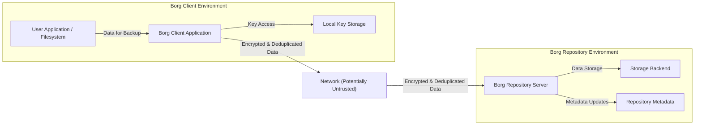

# Project Design Document: BorgBackup

**Version:** 1.1
**Date:** October 26, 2023
**Author:** AI Software Architect

## 1. Introduction

This document provides an enhanced design overview of the BorgBackup project, building upon the previous version. It details the system's architecture, key components, data flow, and security considerations with a focus on facilitating threat modeling activities.

### 1.1. Purpose

The primary purpose of this document is to provide a clear and comprehensive understanding of the BorgBackup system's design, specifically tailored for security analysis and threat modeling. It aims to equip security professionals with the necessary information to identify potential vulnerabilities and develop effective mitigation strategies.

### 1.2. Scope

This document comprehensively covers the core architecture and functionality of BorgBackup, including:

*   Client-side operations (backup, restore, prune, list, etc.).
*   Repository structure, organization, and maintenance.
*   Detailed explanation of data encryption and deduplication mechanisms.
*   Communication protocols and security considerations between client and repository.
*   Key generation, storage, and management practices.
*   Consideration of different repository access methods.

This document explicitly excludes:

*   In-depth code-level implementation details of the BorgBackup Python codebase.
*   Micro-benchmarking or detailed performance metrics.
*   Specific command-line interface usage instructions (beyond their functional purpose).
*   Highly specific and niche deployment scenarios (general patterns will be covered).

### 1.3. Target Audience

This document is primarily intended for:

*   Cybersecurity engineers and architects responsible for conducting threat modeling exercises.
*   Software developers actively contributing to the BorgBackup project.
*   System administrators involved in the deployment, configuration, and maintenance of BorgBackup infrastructure.

## 2. System Overview

BorgBackup (referred to as "Borg" hereafter) is a feature-rich, deduplicating backup program designed for efficiency and security. Its core functionalities include:

*   **Space-Efficient Storage:** Achieved through content-defined chunking and deduplication across backups.
*   **Strong Encryption:** Utilizes authenticated encryption to protect data confidentiality and integrity.
*   **Data Compression:** Optionally compresses data before encryption to further reduce storage footprint.
*   **Versatile Remote Backups:** Supports secure backups to remote repositories via SSH and other methods.
*   **Efficient Archive Access:** Backup archives can be mounted as virtual file systems for granular browsing and restoration.

## 3. System Architecture

The Borg system adheres to a client-server architecture where the client application resides on the machine being backed up, and the repository serves as the secure storage location for backup data.

### 3.1. High-Level Architecture Diagram

### 3.2. Component Description

*   **User Application / Filesystem:** Represents the source of data on the client machine targeted for backup operations.
*   **Borg Client Application:** The primary Borg executable running on the client system. Its core responsibilities encompass:
    *   **Data Acquisition:** Reading data streams from the filesystem.
    *   **Chunking:** Dividing data into variable-sized segments based on content.
    *   **Deduplication:** Identifying and referencing existing data chunks to avoid redundant storage.
    *   **Compression (Optional):** Applying compression algorithms to data chunks before encryption.
    *   **Encryption:** Encrypting data chunks and associated metadata using authenticated encryption.
    *   **Repository Communication:** Establishing secure connections and exchanging data with the Borg Repository Server.
    *   **Local Configuration Management:** Handling local settings and repository connection details.
    *   **Key Management (Client-Side):**  Accessing and utilizing stored repository keys.
*   **Local Key Storage:** Represents the secure location on the client machine where repository keys are stored (typically encrypted with a local passphrase).
*   **Network (Potentially Untrusted):** The communication pathway between the client and the repository. For remote repositories, this is commonly an SSH connection, which provides encryption and authentication.
*   **Borg Repository Server:** The component responsible for managing the backup repository. Its key responsibilities include:
    *   **Client Authentication:** Verifying the identity of connecting clients.
    *   **Data Reception:** Receiving encrypted and deduplicated data from clients.
    *   **Data Storage Management:** Organizing and storing data chunks and metadata within the storage backend.
    *   **Repository Metadata Management:** Maintaining indexes and information about stored backups.
    *   **Data Retrieval:** Serving data chunks during restore operations.
*   **Storage Backend:** The underlying storage system where the actual backup data resides. This can be:
    *   **Local Filesystem:** Direct storage on the repository server's local disks.
    *   **Remote Filesystem via SSH:** Storage on a remote server accessed through SSH.
    *   **Network Filesystem (NFS, SMB/CIFS):** Storage on shared network resources.
    *   **Object Storage (via third-party tools or plugins):** Services like AWS S3, Google Cloud Storage, etc.
    *   **WebDAV Server:** Storage accessible via the WebDAV protocol.
*   **Repository Metadata:**  Stores information about the repository structure, chunk indexes, archive manifests, and other essential data for managing backups.

### 3.3. Data Flow

#### 3.3.1. Backup Process (Detailed)

1. A user initiates a backup operation on the Borg Client, specifying the source data and target repository.
2. The Borg Client reads data from the designated source.
3. The client employs content-defined chunking to divide the data stream into variable-sized chunks.
4. For each generated chunk, the client calculates a cryptographic hash (e.g., SHA256).
5. The client queries the repository (or a local cache) to determine if a chunk with the same hash already exists.
    *   **If the chunk exists:** The client creates a reference to the existing chunk within the current backup archive's metadata.
    *   **If the chunk is new:** The client optionally compresses the chunk and then encrypts it using the repository key.
6. Encrypted new chunks and updated metadata (including chunk hashes, file metadata, and references) are transmitted to the Borg Repository Server over a secure channel (e.g., SSH).
7. The Borg Repository Server authenticates the client.
8. The server stores the received encrypted chunks in the storage backend and updates the repository index and metadata.

#### 3.3.2. Restore Process (Detailed)

1. A user initiates a restore operation on the Borg Client, specifying the archive to restore from and the destination.
2. The Borg Client connects to the Borg Repository Server and authenticates.
3. The client requests the necessary metadata for the specified archive, including the list of chunks required for the files to be restored.
4. The Borg Repository Server retrieves the requested metadata and the corresponding encrypted chunks from the storage backend.
5. The server transmits the encrypted chunks to the client.
6. The Borg Client decrypts the received chunks using the repository key.
7. The client reassembles the original files from the decrypted chunks based on the archive metadata.
8. The client writes the restored files to the specified destination on the local filesystem.

### 3.4. Key Management (In Depth)

Borg's security model heavily relies on robust cryptographic key management. Key aspects include:

*   **Repository Key Generation:** When a new repository is initialized, a unique, randomly generated master key is created. This key is fundamental for encrypting all data within the repository.
*   **Key Derivation from Passphrase:** The repository key is typically derived from a user-provided passphrase using a key derivation function (KDF) like Argon2. This ensures that the actual master key is not directly exposed.
*   **Secure Key Storage (Client-Side):** The information required to derive the repository key (e.g., the encrypted master key and KDF parameters) is stored securely on the client machine. This is often encrypted using a local passphrase or operating system-level key management facilities.
*   **Key Storage on Repository (Optional, Less Secure):** Borg allows storing the repository key directly on the repository server, but this significantly reduces security as a compromise of the server grants access to the key. This practice is generally discouraged.
*   **Authentication for Repository Access:** When connecting to a remote repository, Borg primarily relies on SSH key-based authentication to establish a secure and authenticated channel.
*   **Key Rotation:** While not a fully automated feature, Borg supports the ability to create new repositories with new keys, effectively allowing for key rotation over time.

## 4. Security Considerations (Expanded)

This section provides a more detailed examination of security aspects and potential vulnerabilities within the BorgBackup system.

### 4.1. Authentication and Authorization (Detailed)

*   **Client Authentication to Repository:** The Borg Repository Server must reliably authenticate clients to prevent unauthorized access to backup data. SSH key authentication is the recommended and most common method for remote repositories. Local repositories rely on filesystem permissions.
*   **Repository Access Control Mechanisms:** Permissions on the underlying storage backend are critical for enforcing access control and preventing unauthorized modification or deletion of backup data. Proper configuration of filesystem permissions or cloud storage IAM policies is essential.

### 4.2. Data Confidentiality (Detailed)

*   **End-to-End Encryption:** Borg provides end-to-end encryption, meaning data is encrypted on the client before transmission and remains encrypted at rest in the repository.
*   **Authenticated Encryption Algorithms:** Borg utilizes strong authenticated encryption algorithms (e.g., AES-CTR with HMAC-SHA256) to ensure both the confidentiality and integrity of the encrypted data. This prevents both unauthorized disclosure and tampering.
*   **Passphrase Strength and Security:** The security of the entire backup system hinges on the strength and secrecy of the repository passphrase. Weak or compromised passphrases can render the encryption ineffective.

### 4.3. Data Integrity (Detailed)

*   **Cryptographic Hashing for Deduplication and Verification:** Borg employs cryptographic hashes to uniquely identify data chunks, enabling deduplication. These hashes also serve as a mechanism to verify the integrity of data during backup and restore operations, ensuring that data has not been corrupted.
*   **Integrity Checks during Restore:** During the restore process, Borg verifies the integrity of the retrieved data chunks using the stored hashes, providing assurance that the restored data is identical to the original backed-up data.

### 4.4. Availability (Detailed)

*   **Repository Server Availability:** The continuous availability of the Borg Repository Server is crucial for performing backup and restore operations. Downtime can disrupt backup schedules and prevent data recovery.
*   **Storage Backend Resilience:** The resilience and availability of the underlying storage backend are paramount. Data loss or inaccessibility at the storage level can lead to backup failure or data loss. Implementing redundancy measures at the storage level (e.g., RAID, cloud storage replication) is recommended.

### 4.5. Potential Vulnerabilities (Comprehensive)

*   **Passphrase Compromise (Critical):** If the repository passphrase is compromised, an attacker gains the ability to decrypt all backup data, rendering the encryption useless. This is a critical vulnerability.
*   **Man-in-the-Middle Attacks (Mitigated by SSH):** While Borg encrypts data, vulnerabilities in the underlying transport protocol could potentially expose data. Using SSH for remote backups mitigates this risk through its own encryption and authentication mechanisms. However, vigilance against compromised SSH keys is necessary.
*   **Repository Server Compromise (High Risk):** If the Borg Repository Server is compromised, an attacker could potentially access, modify, or delete backup data, compromise repository keys (if stored there), or inject malicious data into backups.
*   **Client-Side Vulnerabilities (Moderate Risk):** Vulnerabilities in the Borg Client application could be exploited to gain access to the client machine, compromise local key storage, or manipulate the backup process. Keeping the client software updated is crucial.
*   **Storage Backend Vulnerabilities (Variable Risk):** Security vulnerabilities in the underlying storage backend (e.g., unpatched systems, misconfigurations) could compromise the integrity or confidentiality of the backup data. The risk level depends on the specific storage technology used.
*   **Insecure Key Management Practices (High Risk):** Insecure storage or handling of the repository key (e.g., storing it in plain text, using weak local passphrases) can lead to unauthorized access to backup data.
*   **Dependency Vulnerabilities (Moderate Risk):** Borg relies on various libraries and dependencies. Vulnerabilities in these dependencies could potentially be exploited. Regular security audits of dependencies are important.
*   **Denial of Service Attacks (Repository Server):** The Borg Repository Server could be targeted by denial-of-service attacks, preventing legitimate clients from accessing or managing backups. Implementing appropriate network security measures is necessary.
*   **Data Corruption (Storage Level):** While Borg has integrity checks, underlying storage issues could potentially lead to data corruption that might not be detectable by Borg itself.

## 5. Deployment Considerations (Expanded)

Borg offers flexibility in deployment, catering to various needs:

*   **Local Backups (Simplicity):** Backing up data to a local drive or a network share within a trusted network. This is the simplest setup but offers less protection against local disasters.
*   **Remote Backups via SSH (Security Focused):** Backing up data to a remote server accessible via SSH. This is a common and secure method, providing off-site backup and protection against local failures. Proper SSH key management is crucial.
*   **Backups to Cloud Storage (Scalability and Durability):** Utilizing third-party tools or plugins to store backups in cloud object storage services (e.g., Rclone with Borg). This offers scalability, durability, and geographic redundancy. Security considerations include properly configuring cloud storage access permissions.
*   **Centralized Backup Server (Enterprise Solution):** Deploying a dedicated Borg Repository Server to manage backups from multiple clients within an organization. This requires careful planning for server resources, security hardening, and access control.

## 6. Future Considerations

*   **Enhanced Web-based Management Interface:** Developing a more comprehensive web interface for repository management, monitoring, and reporting.
*   **Improved Integration with Key Management Systems (KMS):**  Strengthening integration with enterprise-grade KMS solutions for more robust key management and rotation.
*   **Expanded Support for Storage Backends:** Continuously adding support for new and emerging storage providers and protocols.
*   **Granular Access Control within Repositories:** Implementing more fine-grained access control mechanisms within a single repository to manage permissions for different backups or users.
*   **Built-in Data Redundancy/Replication:** Exploring options for incorporating built-in data redundancy or replication features at the repository level.
*   **Enhanced Monitoring and Alerting Capabilities:** Providing more detailed monitoring metrics and alerting mechanisms for backup status, potential issues, and security events.

## 7. Conclusion

This enhanced design document provides a comprehensive and detailed overview of the BorgBackup system, with a strong emphasis on its architecture, data flow, and security considerations. This information is crucial for effectively conducting threat modeling exercises and implementing appropriate security measures to safeguard valuable backup data. A thorough understanding of Borg's components, their interactions, and potential vulnerabilities is essential for mitigating risks and ensuring the integrity and confidentiality of backups.