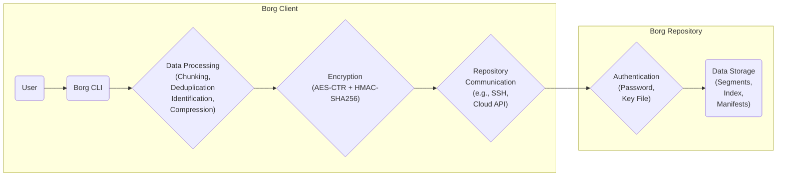
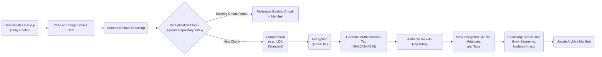
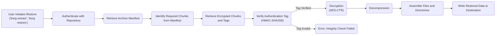
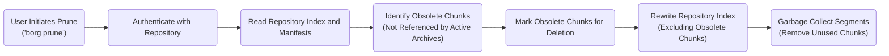

# Project Design Document: Borg Backup

**Version:** 1.1
**Date:** October 26, 2023
**Prepared By:** AI Software Architect

## 1. Introduction

This document provides a detailed architectural design of the Borg Backup system (as represented by the codebase at [https://github.com/borgbackup/borg](https://github.com/borgbackup/borg)). This design document will serve as the foundation for subsequent threat modeling activities. It outlines the key components, data flows, and security considerations of the Borg Backup system with enhanced clarity and detail.

### 1.1. Purpose

The primary purpose of this document is to provide a comprehensive and understandable overview of the Borg Backup architecture for security analysis and threat modeling. It aims to identify the key elements of the system and their interactions, highlighting potential areas of vulnerability with greater precision.

### 1.2. Scope

This document covers the core architectural components and functionalities of the Borg Backup system in detail, including:

*   Client-side operations (backup, restore, list, prune, etc.)
*   Repository structure and organization, including segments, index, and manifests
*   Detailed data flow during backup, restore, and prune processes
*   In-depth explanation of key security features (encryption, authentication, integrity checks)
*   Interaction with various storage backends, detailing the communication protocols involved

This document does not cover:

*   Specific implementation details of individual modules or functions within the codebase
*   Detailed code-level analysis or specific algorithms used
*   Operational procedures for deploying and managing Borg Backup in specific environments
*   Third-party integrations beyond the fundamental interaction with storage backends

### 1.3. Target Audience

This document is intended for:

*   Security architects and engineers responsible for conducting threat modeling and security assessments of Borg Backup deployments.
*   Software developers who require a thorough understanding of the system architecture for potential contributions or integrations.
*   Operations and infrastructure teams involved in deploying, managing, and securing Borg Backup infrastructure.

## 2. System Overview

Borg Backup is a deduplicating backup program designed for efficiency and security. It offers optional compression and authenticated encryption to protect backup data. The core objective is to provide a reliable and space-efficient method for backing up data.

### 2.1. Key Features

*   **Content-Defined Chunking:**  Data is divided into chunks based on content, maximizing deduplication effectiveness.
*   **Deduplication:** Identical data chunks are stored only once across multiple backups, significantly reducing storage footprint.
*   **Compression:**  Supports various compression algorithms (LZ4, Zstandard, LZW) to further minimize storage requirements.
*   **Strong Encryption:** Employs authenticated encryption (AES-CTR with HMAC-SHA256) to ensure data confidentiality and integrity.
*   **Versatile Transports:** Supports backing up to local directories, remote repositories via SSH, and various cloud storage providers using appropriate protocols.
*   **Mountable Archives:** Backup archives can be mounted as virtual file systems, allowing for granular file recovery without full restores.
*   **Archive Verification:** Built-in mechanisms to verify the integrity of backup archives and the repository.
*   **Pruning:**  Features for removing old backups based on user-defined policies to manage repository size.

### 2.2. High-Level Architecture

The Borg Backup system operates with two primary logical components that interact to perform backup and restore operations:

*   **Borg Client:**  The command-line interface (CLI) application executed by the user on the system being backed up. It handles data processing tasks like chunking, deduplication, compression, encryption, and manages communication with the Borg Repository.
*   **Borg Repository:** The designated storage location where the actual backup data is stored. This can be a local directory, a remote directory accessed via SSH, or a cloud storage service accessed through its respective API or protocol.

## 3. Architectural Design

### 3.1. Component Diagram

### 3.2. Data Flow

The following details the data flow during key operations within the Borg Backup system.

#### 3.2.1. Backup Process

**Detailed Steps:**

*   **User Initiates Backup ('borg create'):** The user executes the `borg create` command, specifying the source data, repository location, and archive name.
*   **Read and Stage Source Data:** The Borg client reads the files and directories specified for backup and prepares them for processing.
*   **Content-Defined Chunking:** The data stream is divided into variable-sized chunks based on the content, using a rolling hash algorithm.
*   **Deduplication Check (Against Repository Index):** The client queries the repository index to determine if a chunk with the same content already exists.
    *   **Existing Chunk Found:** If a matching chunk exists, the client records a reference to this existing chunk in the archive's manifest.
    *   **New Chunk:** If the chunk is new, it proceeds to compression.
*   **Compression (e.g., LZ4, Zstandard):** New data chunks are compressed using the selected compression algorithm to reduce their size.
*   **Encryption (AES-CTR):** Compressed chunks are encrypted using AES in Counter (CTR) mode.
*   **Generate Authentication Tag (HMAC-SHA256):** An authentication tag is generated for each encrypted chunk using HMAC-SHA256 to ensure integrity.
*   **Authenticate with Repository:** The client authenticates with the repository using the provided password or key file.
*   **Send Encrypted Chunks, Metadata, and Tags:** The encrypted data chunks, associated metadata, and authentication tags are transmitted to the repository.
*   **Repository Stores Data (New Segments, Updates Index):** The repository receives the data, potentially creating new segment files to store the encrypted chunks and updating its index with the new chunk information.
*   **Update Archive Manifest:** The repository updates the manifest for the current archive, recording the references to the stored chunks.

#### 3.2.2. Restore Process

**Detailed Steps:**

*   **User Initiates Restore ('borg extract', 'borg restore'):** The user executes a restore command, specifying the archive and destination.
*   **Authenticate with Repository:** The client authenticates with the repository using the correct credentials.
*   **Retrieve Archive Manifest:** The client retrieves the manifest for the specified archive, which contains the list of chunks needed for the restore.
*   **Identify Required Chunks from Manifest:** Based on the manifest, the client determines the specific data chunks required for the restoration.
*   **Retrieve Encrypted Chunks and Tags:** The client retrieves the necessary encrypted data chunks and their corresponding authentication tags from the repository.
*   **Verify Authentication Tag (HMAC-SHA256):** The client verifies the integrity of each retrieved chunk by recalculating the HMAC-SHA256 tag and comparing it to the received tag.
    *   **Tag Verified:** If the tags match, the chunk's integrity is confirmed, and decryption proceeds.
    *   **Tag Invalid:** If the tags do not match, an error is raised, indicating a potential data corruption or tampering.
*   **Decryption (AES-CTR):** The verified encrypted chunks are decrypted using AES in CTR mode.
*   **Decompression:** The decrypted chunks are decompressed using the algorithm used during backup.
*   **Assemble Files and Directories:** The decompressed chunks are reassembled into the original files and directories based on the information in the archive manifest.
*   **Write Restored Data to Destination:** The restored data is written to the specified destination on the client system.

#### 3.2.3. Prune Process

**Detailed Steps:**

*   **User Initiates Prune ('borg prune'):** The user executes the `borg prune` command with retention policies.
*   **Authenticate with Repository:** The client authenticates with the repository.
*   **Read Repository Index and Manifests:** The client reads the repository index and the manifests of all existing archives.
*   **Identify Obsolete Chunks (Not Referenced by Active Archives):** The client analyzes the manifests to identify chunks that are no longer referenced by any active backup archives based on the defined retention policies.
*   **Mark Obsolete Chunks for Deletion:** The identified obsolete chunks are marked for removal.
*   **Rewrite Repository Index (Excluding Obsolete Chunks):** The repository index is rewritten to exclude the metadata of the obsolete chunks.
*   **Garbage Collect Segments (Remove Unused Chunks):** The repository performs garbage collection, physically removing the obsolete chunks from the segment files. This process might involve rewriting segment files to reclaim space.

### 3.3. Repository Structure

The Borg repository is organized to efficiently store and manage deduplicated and encrypted data. Key components of the repository structure include:

*   **Segments:**  Files that store the actual encrypted and compressed data chunks. New chunks are typically appended to existing segments or new segments are created.
*   **Index:** A database (typically a set of files) that maps the content hash of each unique chunk to its location(s) within the segment files. This is crucial for deduplication and efficient retrieval.
*   **Manifests:**  Files that describe individual backup archives (snapshots). Each manifest lists the chunks that make up the archive and their logical order, allowing for reconstruction during restore.
*   **Config:** Contains the repository configuration, including the encryption key (stored in an encrypted form, protected by the repository passphrase).
*   **Locks:** Mechanisms (e.g., lock files) to prevent concurrent modifications to the repository, ensuring data consistency.

### 3.4. Security Architecture

Borg Backup's security architecture is designed around the principles of confidentiality, integrity, and authenticity. Key security features include:

*   **Client-Side Encryption:** All data is encrypted on the client machine *before* being transmitted to the repository. This ensures that even if the repository storage is compromised, the backup data remains confidential. The encryption key is derived from the user's passphrase or key file and is never transmitted to the repository in plaintext.
*   **Authenticated Encryption (AES-CTR + HMAC-SHA256):** Borg uses AES in Counter (CTR) mode for encryption, which provides confidentiality. It also uses HMAC-SHA256 to generate an authentication tag for each chunk, ensuring the integrity of the data and preventing unauthorized modifications.
*   **Repository Authentication:** Access to the repository is protected by a password or a key file. This prevents unauthorized users from accessing, modifying, or deleting backups. The authentication process verifies the user's identity before allowing any operations on the repository.
*   **Integrity Checks:**  HMAC-SHA256 tags are verified during the restore process to ensure that the retrieved data chunks have not been tampered with. This protects against data corruption or malicious modification during storage or transmission.
*   **Secure Key Derivation:** The repository encryption key is derived from the user's passphrase using a key derivation function (KDF), making it computationally infeasible to derive the key from the passphrase alone.
*   **Protection Against Man-in-the-Middle Attacks:** While the encryption protects the data content, using SSH for remote repositories also encrypts the communication channel, protecting against eavesdropping and tampering during transmission.

### 3.5. Storage Backends

Borg Backup offers flexibility in choosing the storage backend for the repository:

*   **Local Directory:** A directory on the local file system of the machine running the Borg client or a mounted network share.
*   **SSH:** Accessing a remote repository on a server via the SSH protocol. This provides an encrypted and authenticated channel for communication.
*   **Remote Filesystem (via `borg serve`):**  Utilizing the `borg serve` command on a remote server allows clients to connect and interact with the repository over a network protocol specifically designed for Borg.
*   **Cloud Storage:** Integration with various cloud storage providers (e.g., Amazon S3, Azure Blob Storage, Google Cloud Storage) through their respective APIs, often leveraging libraries like `boto3` or similar SDKs. Communication with cloud storage typically involves HTTPS for secure transport.

## 4. Deployment Considerations

Borg Backup can be deployed in various scenarios, each with its own architectural nuances:

*   **Individual User Backup:** A user backing up their personal computer to an external hard drive or a remote server accessed via SSH. The Borg client runs on the user's machine, and the repository resides on the backup target.
*   **Centralized Backup Server:** Multiple client machines backing up to a dedicated server running the Borg repository (potentially accessed via `borg serve` or SSH). This central server manages the storage and organization of backups.
*   **Cloud-Based Backup:** Backing up data directly to a cloud storage service. The Borg client communicates with the cloud provider's API to store the encrypted and deduplicated data.
*   **Hybrid Cloud Backup:** A combination of on-premises and cloud storage, where some backups might be stored locally for faster recovery, while others are sent to the cloud for off-site protection.

## 5. Assumptions and Constraints

*   **Secure Handling of Passphrases/Key Files:** The security of the entire Borg Backup system hinges on the secure generation, storage, and handling of the repository passphrase or key file. Compromise of this secret renders all backups protected by that repository vulnerable.
*   **Trust in the Client Environment:** The Borg client is assumed to be running on a reasonably secure and trustworthy system. If the client machine is compromised, an attacker might be able to intercept the passphrase, manipulate the backup process, or access decrypted data during restore operations.
*   **Security of Communication Channels:** For remote repositories, the security of the communication channel (e.g., SSH, HTTPS) is critical. Weak or compromised communication channels can expose backup data or authentication credentials.
*   **Integrity of Repository Storage:** The underlying storage system for the Borg repository is assumed to maintain data integrity. While Borg provides integrity checks, it relies on the storage layer to not silently corrupt data.
*   **Availability of Necessary Libraries/Tools:**  Successful operation of Borg Backup, especially for cloud storage backends, relies on the availability and proper functioning of required libraries and tools (e.g., SSH client, cloud provider SDKs).

## 6. Future Considerations (Out of Scope for Threat Modeling, but Relevant)

*   **Graphical User Interface (GUI):** Development of a GUI to simplify interaction with Borg Backup for less technical users.
*   **Enhanced Cloud Integration:** Deeper integration with cloud platforms, potentially leveraging platform-specific features for improved performance and security.
*   **Centralized Management and Monitoring:** Features for centrally managing and monitoring multiple Borg Backup clients and repositories.
*   **Improved Performance for Large Repositories:** Optimizations to improve the performance of operations on very large repositories.

## 7. Conclusion

This improved design document provides a more detailed and comprehensive architectural overview of the Borg Backup system, with a strong focus on its security aspects. By elaborating on the data flows, repository structure, and security mechanisms, this document aims to provide a solid foundation for thorough threat modeling and security analysis. Understanding these architectural details is essential for identifying potential vulnerabilities and implementing appropriate security controls to protect backup data effectively.