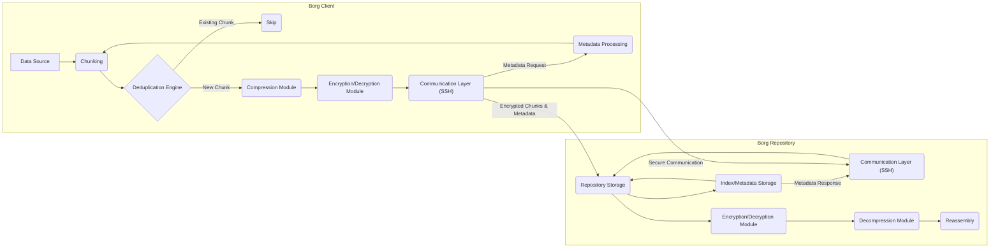

# Project Design Document: BorgBackup

**Version:** 1.1
**Date:** October 26, 2023
**Author:** AI Software Architect

## 1. Introduction

This document provides a detailed design overview of the BorgBackup project. It outlines the key components, their interactions, and the overall architecture of the system. This document serves as a foundation for understanding the system's structure and will be used as input for subsequent threat modeling activities.

### 1.1. Purpose

The primary purpose of this document is to provide a comprehensive architectural description of BorgBackup. This description will be used to identify potential security vulnerabilities and attack vectors during the threat modeling process. It aims to be sufficiently detailed for security analysis while remaining accessible to a broad technical audience.

### 1.2. Scope

This document covers the core architectural components and functionalities of BorgBackup, including:

*   Client-side operations (backup, restore, list, prune, etc.)
*   Repository structure and management (including locking mechanisms)
*   Deduplication mechanisms (chunking and indexing)
*   Encryption and authentication processes and key management
*   Communication protocols between client and repository (focus on SSH)
*   Metadata handling and storage within the repository

### 1.3. Target Audience

This document is intended for:

*   Security engineers and architects involved in threat modeling and security audits.
*   Software developers working on or contributing to the BorgBackup project, requiring a deep understanding of the architecture.
*   System administrators deploying, managing, and troubleshooting BorgBackup installations.

## 2. System Overview

BorgBackup is a deduplicating backup program. It aims to provide an efficient and secure way to back up data. Key features include:

*   **Content-Defined Chunking:** Data is split into variable-sized chunks based on content, improving deduplication effectiveness.
*   **Data Compression:**  Chunks are compressed using algorithms like zstd or LZ4 to minimize storage footprint.
*   **Cryptographic Authentication and Encryption:**  Data is encrypted using authenticated encryption (e.g., AES-OCB) ensuring both confidentiality and integrity.
*   **Secure Remote Backups:**  Primarily designed for secure remote backups over SSH, leveraging its security features.
*   **Mountable Archives:** Backups can be mounted as virtual file systems using FUSE, allowing for easy browsing and selective restoration.
*   **Repository Maintenance:** Features for repository maintenance like `borg check` and `borg compact`.

## 3. Architectural Design

The BorgBackup architecture is fundamentally a client-server model, with the client performing backup and restore operations against a repository.

### 3.1. Components

*   **Borg Client:** The user-facing application responsible for initiating and managing backup and restore operations. Key responsibilities include:
    *   **Data Acquisition:** Reading data from the specified source paths.
    *   **Chunking:** Dividing the input data stream into content-defined chunks.
    *   **Deduplication Identification:** Calculating chunk hashes and comparing them against a local cache and the repository index to identify existing chunks.
    *   **Compression:** Compressing new, unique data chunks.
    *   **Encryption:** Encrypting compressed data chunks and metadata.
    *   **Communication Management:** Establishing and managing secure communication with the Borg Repository.
    *   **Metadata Management (Client-Side):**  Maintaining temporary metadata about the backup process.
    *   **Restore Logic:**  Retrieving and reassembling chunks to restore data.
    *   **Archive Management:**  Creating, listing, and pruning archives within the repository.
*   **Borg Repository:** The storage backend for backups, responsible for securely storing and managing backup data. Key responsibilities include:
    *   **Chunk Storage:** Persistently storing unique, encrypted data chunks.
    *   **Metadata Storage (Repository-Side):** Maintaining the index of chunks, archive manifests, and other repository metadata.
    *   **Request Handling:** Processing requests from the Borg Client for storing and retrieving data.
    *   **Access Control Enforcement:**  Verifying the repository passphrase for access.
    *   **Locking Mechanisms:** Implementing locking to prevent concurrent modifications and ensure data consistency.
    *   **Integrity Verification:**  Potentially performing background checks on stored data integrity.
*   **Encryption/Decryption Module:** A logical module responsible for all cryptographic operations. Key functions include:
    *   **Encryption of Data Chunks:** Encrypting data chunks using authenticated encryption.
    *   **Decryption of Data Chunks:** Decrypting data chunks during restore.
    *   **Key Derivation:** Deriving encryption keys from the repository passphrase using a robust KDF.
    *   **Metadata Encryption/Decryption:** Encrypting sensitive metadata.
*   **Deduplication Engine:**  The core logic for identifying and managing duplicate data. Key functions include:
    *   **Chunk Hashing:** Calculating cryptographic hashes of data chunks.
    *   **Chunk Index Management:** Maintaining an index mapping chunk hashes to their storage locations within the repository.
    *   **Duplicate Detection:** Comparing chunk hashes to identify existing chunks.
*   **Compression Module:** Responsible for compressing and decompressing data chunks. Key functions include:
    *   **Compression:** Applying compression algorithms to data chunks before encryption.
    *   **Decompression:** Decompressing data chunks after decryption during restore.
*   **Communication Layer:** Handles the secure communication between the Borg Client and the Borg Repository.
    *   **SSH Transport:** Primarily relies on SSH for secure, authenticated communication, including encryption and integrity protection of the communication channel.
    *   **Protocol Implementation:** Implementing the specific Borg protocol for exchanging commands and data.
*   **Index/Metadata Storage:** The persistent storage for repository metadata. This includes:
    *   **Chunk Index:** Mapping chunk hashes to their physical locations and encryption information.
    *   **Archive Manifests:** Describing the file and directory structure of each backup archive.
    *   **Repository Configuration:** Storing repository-specific settings.
    *   **Lock Files:**  Managing locks to prevent concurrent access.

### 3.2. Interactions

The following describes the typical interactions between components during backup and restore operations, providing more detail than the previous version.

#### 3.2.1. Backup Process

1. The **Borg Client** is initiated with backup parameters (source paths, repository location, etc.).
2. The **Borg Client** establishes a secure connection with the **Borg Repository** via the **Communication Layer** (SSH), authenticating using the repository passphrase (or SSH keys).
3. The **Borg Client** reads data from the specified **Data Source**.
4. The **Chunking** module within the **Borg Client** splits the data into content-defined chunks.
5. The **Deduplication Engine** in the **Borg Client** calculates cryptographic hashes of each chunk.
6. The **Borg Client** consults a local chunk cache (if available) and queries the **Borg Repository's Index/Metadata Storage** (via the **Communication Layer**) to identify existing chunks.
7. For chunks not already present in the repository:
    *   The **Compression Module** compresses the unique chunk.
    *   The **Encryption/Decryption Module** encrypts the compressed chunk using keys derived from the repository passphrase.
8. The **Borg Client** sends the encrypted, unique chunks and metadata describing the new archive (including the manifest) to the **Borg Repository** via the **Communication Layer**.
9. The **Borg Repository** receives the data and metadata.
10. The **Borg Repository** stores the encrypted chunks in its **Chunk Storage**.
11. The **Borg Repository** updates its **Index/Metadata Storage** with information about the new chunks and the archive manifest. This includes mapping chunk hashes to their storage locations and recording the archive structure.
12. The **Borg Repository** releases any locks held during the write operation.

#### 3.2.2. Restore Process

1. The **Borg Client** is initiated with restore parameters (archive name, destination path, repository location, etc.).
2. The **Borg Client** establishes a secure connection with the **Borg Repository** via the **Communication Layer**.
3. The **Borg Client** authenticates to the **Borg Repository**.
4. The **Borg Client** requests the metadata (archive manifest) for the specified archive from the **Borg Repository**.
5. The **Borg Repository** retrieves the requested metadata from its **Index/Metadata Storage** and sends it to the **Borg Client**.
6. The **Borg Client** analyzes the manifest to determine the necessary chunks for the restore operation.
7. The **Borg Client** requests the required encrypted chunks from the **Borg Repository** via the **Communication Layer**.
8. The **Borg Repository** retrieves the requested encrypted chunks from its **Chunk Storage**.
9. The **Borg Repository** sends the encrypted chunks to the **Borg Client** via the **Communication Layer**.
10. The **Borg Client** receives the encrypted chunks.
11. The **Encryption/Decryption Module** decrypts the chunks using keys derived from the repository passphrase.
12. The **Compression Module** decompresses the chunks.
13. The **Borg Client** reassembles the chunks according to the archive manifest and writes the restored data to the specified destination.

### 3.3. Data Flow Diagram

## 4. Security Considerations

Security is a paramount design principle of BorgBackup. Key security features and considerations include:

*   **Authenticated Encryption (AEAD):** Borg uses authenticated encryption algorithms like AES-OCB, which provide both confidentiality (encryption) and integrity (authentication) of the data. This prevents unauthorized reading and modification of backup data.
*   **Strong Key Derivation:** The repository passphrase is used to derive strong encryption keys using a computationally expensive Key Derivation Function (KDF) such as Argon2id. This makes brute-forcing the passphrase significantly harder.
*   **Client-Side Encryption:** Encryption occurs on the client-side before data is transmitted over the network to the repository. This ensures that data is protected even if the communication channel or the repository itself is compromised.
*   **Integrity Verification:** Cryptographic hashes are used to verify the integrity of data chunks and archive manifests, ensuring that data has not been corrupted or tampered with.
*   **Secure Communication Channel:**  The primary method for accessing remote repositories is via SSH, which provides a secure and authenticated communication channel. Borg leverages SSH's encryption and authentication mechanisms.
*   **Repository Passphrase Protection:** The security of the entire backup system hinges on the secrecy and strength of the repository passphrase.
*   **Protection Against Man-in-the-Middle Attacks:** SSH helps protect against man-in-the-middle attacks during communication with remote repositories.

### 4.1. Authentication and Authorization

*   **Repository Passphrase Authentication:** Access to a Borg repository is primarily controlled by the repository passphrase. Providing the correct passphrase is required to perform any operations on the repository.
*   **SSH Key-Based Authentication (Remote Repositories):** When accessing remote repositories, SSH key-based authentication can be used as an alternative or supplement to passphrase-based authentication, enhancing security and convenience.
*   **No Granular User Permissions:** Borg does not implement granular user permissions within a repository. Anyone with the repository passphrase (or SSH access) has full access.
*   **Repository Locking:** Borg uses locking mechanisms to prevent concurrent access and modification of the repository, ensuring data consistency and preventing race conditions.

### 4.2. Encryption

*   **Encryption Algorithm Details:** Borg typically uses AES in OCB mode for authenticated encryption. The specific algorithm and parameters might be configurable.
*   **Key Derivation Process:** The key derivation process involves hashing the repository passphrase with a salt using Argon2id (or a similar KDF). The salt is stored in the repository metadata.
*   **Metadata Encryption:**  Sensitive metadata, such as archive manifests and chunk indexes, is also encrypted to protect its confidentiality.

### 4.3. Data Integrity

*   **Chunk Hash Verification:** During restore operations, the hashes of retrieved chunks are compared against the stored hashes in the metadata to ensure data integrity.
*   **Manifest Signing/Verification:** Archive manifests are cryptographically signed to prevent tampering.
*   **`borg check` Command:** The `borg check` command can be used to verify the integrity of the repository and its data.

### 4.4. Network Security

*   **Reliance on SSH:** Borg's security for remote repositories heavily relies on the proper configuration and security of the underlying SSH service.
*   **Port Forwarding:**  Care should be taken when using SSH port forwarding with Borg to avoid exposing the repository unnecessarily.

## 5. Deployment Considerations

BorgBackup offers flexibility in deployment:

*   **Local Repository:** Backing up data to a repository located on the same machine. This is the simplest setup but offers limited protection against local failures.
*   **Remote Repository via SSH:** Backing up to a remote server accessible via SSH. This is the most common and recommended deployment scenario, providing off-site backups.
*   **Borg Server (Experimental):**  An experimental Borg Server component allows for more controlled access and management of repositories, potentially offering features like access control lists in the future.
*   **Cloud Storage Integration (Indirect):** While Borg doesn't directly integrate with cloud storage APIs, repositories can be stored on cloud storage services by mounting them locally using tools like `rclone mount` or `sshfs`, leveraging their storage capabilities.
*   **Considerations for Multi-User Environments:** In multi-user environments, careful consideration must be given to repository access control and passphrase management.

## 6. Operational Considerations

*   **Repository Initialization:**  Properly initializing the repository with a strong passphrase is crucial.
*   **Passphrase Management:** Securely storing and managing the repository passphrase is essential. Losing the passphrase means losing access to the backups.
*   **Repository Maintenance (`borg check`, `borg compact`, `borg prune`):** Regular repository maintenance is important for ensuring data integrity, reclaiming space, and managing backup retention.
*   **Backup Scheduling:** Implementing a reliable backup scheduling mechanism (e.g., using cron or systemd timers) is necessary for consistent backups.
*   **Monitoring:** Monitoring backup operations and repository health is recommended.

## 7. Future Considerations

*   **Enhanced Access Control:** Implementing more granular access control mechanisms within repositories.
*   **Web-Based Management Interface:** Developing a web interface for easier management of repositories and backups.
*   **Multi-Factor Authentication for Repository Access:** Adding support for MFA to enhance repository security.
*   **Improved Key Management Solutions:** Exploring more advanced key management options beyond simple passphrases.
*   **Direct Cloud Storage Integration:**  Potentially adding direct integration with popular cloud storage providers.

This document provides a significantly more detailed and comprehensive overview of the BorgBackup architecture, with a strong focus on security aspects. This enhanced information will be invaluable for conducting thorough threat modeling and security assessments.