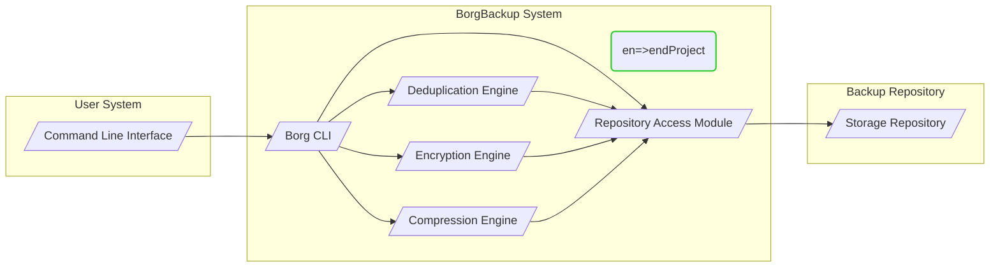
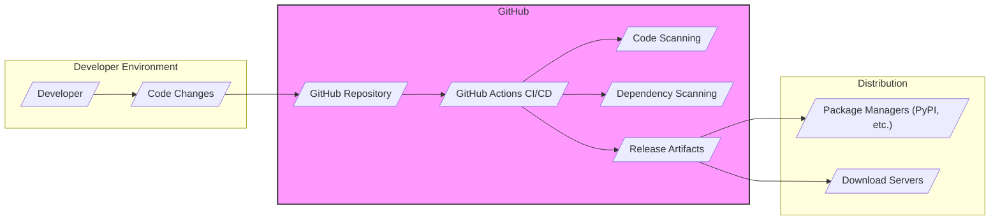

# BUSINESS POSTURE

This project, BorgBackup, addresses the critical business need for reliable and efficient data backup and recovery. Data loss can lead to significant business disruption, financial losses, and reputational damage. A robust backup solution is essential for business continuity, disaster recovery, and compliance with data protection regulations.

Business priorities for adopting BorgBackup include:
- Data Protection: Ensuring critical business data is securely backed up and can be reliably restored in case of data loss events such as hardware failures, software errors, accidental deletions, or cyberattacks.
- Business Continuity: Minimizing downtime and ensuring rapid recovery of operations by having readily available backups.
- Compliance: Meeting regulatory requirements related to data retention and recovery, such as GDPR, HIPAA, or industry-specific standards.
- Cost Efficiency: Optimizing storage utilization through deduplication and compression, reducing storage costs and network bandwidth usage.
- Security: Protecting backup data from unauthorized access, modification, or destruction, ensuring data confidentiality and integrity.

Most important business risks that need to be addressed:
- Data Loss: Failure to properly backup data or inability to restore backups in a timely manner, leading to loss of critical business information.
- Data Breach: Unauthorized access to backup data, potentially exposing sensitive business information or customer data.
- Data Corruption: Corruption of backup data during the backup process or while stored, rendering backups unusable for recovery.
- Ransomware Attacks: Ransomware targeting backup systems, encrypting or deleting backups and hindering recovery efforts.
- Operational Disruption: Downtime during backup and restore operations impacting business productivity.
- Compliance Violations: Failure to meet data protection regulations due to inadequate backup and recovery practices.

# SECURITY POSTURE

Existing security controls for the BorgBackup project, based on project documentation and common practices for backup solutions:
- security control: Encryption of backup data at rest using authenticated encryption (AES-CTR with HMAC-SHA256 or ChaCha20-Poly1305), described in Borg documentation.
- security control: Encryption of data in transit using SSH for repository access, described in Borg documentation.
- security control: Repository access control through SSH key-based authentication or password authentication, depending on repository setup, described in Borg documentation.
- security control: Integrity checks using HMAC-SHA256 or BLAKE2b-256 to ensure data integrity, described in Borg documentation.
- accepted risk: Reliance on user-managed encryption keys, potential for key loss or compromise if not handled securely.
- accepted risk: Potential vulnerabilities in underlying dependencies (e.g., Python, libraries) that could be exploited.
- accepted risk: Security of the infrastructure hosting the backup repository is outside the scope of BorgBackup itself and depends on user configuration.

Recommended security controls to implement:
- security control: Implement multi-factor authentication (MFA) for accessing backup repositories to enhance authentication security beyond passwords or SSH keys.
- security control: Conduct regular security audits and penetration testing of BorgBackup codebase and deployment configurations to identify and remediate potential vulnerabilities.
- security control: Implement automated vulnerability scanning of BorgBackup dependencies and incorporate into the development and release process.
- security control: Provide guidance and tools for secure key management practices, including key rotation, secure storage, and access control.
- security control: Implement data integrity monitoring and alerting to detect and respond to potential data corruption or tampering.
- security control: Implement robust logging and monitoring of backup operations and security events for auditing and incident response.

Security requirements for BorgBackup project:
- Authentication:
  - Requirement: Securely authenticate users or systems accessing backup repositories.
  - Details: Support for strong authentication mechanisms such as SSH keys and consider adding multi-factor authentication.
  - Implementation: SSH key authentication is currently supported. MFA should be considered for future implementation.
- Authorization:
  - Requirement: Control access to backup repositories and backup data based on user roles and permissions.
  - Details: Implement granular access control policies to restrict access to sensitive backup data.
  - Implementation: Repository access control is currently managed through SSH user permissions. More granular authorization within BorgBackup itself could be considered.
- Input Validation:
  - Requirement: Validate all user inputs and data received from external sources to prevent injection attacks and other input-related vulnerabilities.
  - Details: Thoroughly validate command-line arguments, configuration files, and data received from backup clients.
  - Implementation: Input validation should be rigorously applied throughout the codebase, especially in parsing user inputs and handling external data.
- Cryptography:
  - Requirement: Protect the confidentiality and integrity of backup data using strong cryptography.
  - Details: Utilize strong encryption algorithms for data at rest and in transit. Implement secure key management practices.
  - Implementation: BorgBackup currently uses strong encryption algorithms (AES, ChaCha20) and HMAC for data integrity. Key management practices should be further emphasized and potentially enhanced with tooling.

# DESIGN

## C4 CONTEXT

```mermaid
graph LR
    subgraph "Organization"
        User[/"User"/]
    end
    SystemBoundary(st=>startProject BorgBackup System)
        BorgBackup[/"BorgBackup"/]
    SystemBoundary(en=>endProject)
    subgraph "Backup Storage"
        BackupRepository[/"Backup Repository"/]
    end
    subgraph "Operating System"
        OS[/"Operating System"/]
    end
    subgraph "Network"
        Network[/"Network"/]
    end

    User -->|Initiates Backup and Restore Operations| BorgBackup
    BorgBackup -->|Stores and Retrieves Backup Data| BackupRepository
    BorgBackup -->|Operates within| OS
    BorgBackup -- Network
    User -- Network --> BorgBackup
    BackupRepository -- Network --> BorgBackup

    classDef project stroke:#32CD32,stroke-width:2px
    class SystemBoundary project
```

Elements of context diagram:
- Name: User
  - Type: Person
  - Description: Individuals or systems that use BorgBackup to create and restore backups. This could be system administrators, developers, or automated systems.
  - Responsibilities: Initiating backup and restore operations, configuring BorgBackup, managing backup schedules.
  - Security controls: User authentication to access systems running BorgBackup, access control to backup configurations.
- Name: BorgBackup System
  - Type: Software System
  - Description: The BorgBackup software itself, responsible for creating deduplicated and encrypted backups and restoring data from backups.
  - Responsibilities: Data backup, data deduplication, data compression, data encryption, data integrity verification, data restoration, repository management.
  - Security controls: Input validation, encryption at rest and in transit, integrity checks, access control to repository credentials.
- Name: Backup Repository
  - Type: External System
  - Description: Storage location where BorgBackup stores backup data. This could be local storage, network attached storage, cloud storage, or a dedicated backup server.
  - Responsibilities: Storing backup data, providing access to backup data for BorgBackup.
  - Security controls: Access control to storage, encryption at rest (if provided by storage solution), physical security of storage location, network security for remote storage.
- Name: Operating System
  - Type: Infrastructure
  - Description: The operating system on which BorgBackup is installed and executed.
  - Responsibilities: Providing runtime environment for BorgBackup, managing system resources, providing system-level security features.
  - Security controls: Operating system hardening, access control, patching, security monitoring.
- Name: Network
  - Type: Infrastructure
  - Description: The network infrastructure connecting users, BorgBackup system, and backup repository.
  - Responsibilities: Providing communication channel between components.
  - Security controls: Network segmentation, firewall, intrusion detection/prevention systems, network encryption (e.g., TLS/SSH).

## C4 CONTAINER



Elements of container diagram:
- Name: Borg CLI
  - Type: Application
  - Description: Command-line interface application that provides users with the ability to interact with BorgBackup, initiate backups, restores, and manage repositories.
  - Responsibilities: Command parsing, user input validation, orchestrating backup and restore operations, presenting results to the user.
  - Security controls: Input validation, secure handling of credentials, logging of user actions.
- Name: Deduplication Engine
  - Type: Component
  - Description: Component responsible for identifying and eliminating redundant data chunks during the backup process to optimize storage space.
  - Responsibilities: Data chunking, data hashing, deduplication logic, metadata management for deduplication.
  - Security controls: Secure hashing algorithms, integrity checks on deduplication metadata.
- Name: Encryption Engine
  - Type: Component
  - Description: Component responsible for encrypting and decrypting backup data to protect confidentiality.
  - Responsibilities: Encryption of data chunks, decryption of data chunks, key management (delegated to user and repository access module).
  - Security controls: Strong encryption algorithms (AES, ChaCha20), secure key derivation and handling, protection against cryptographic attacks.
- Name: Compression Engine
  - Type: Component
  - Description: Component responsible for compressing backup data to reduce storage space and network bandwidth usage.
  - Responsibilities: Data compression, data decompression.
  - Security controls: Use of efficient and secure compression algorithms.
- Name: Repository Access Module
  - Type: Component
  - Description: Component responsible for interacting with the backup repository, handling data storage and retrieval operations.
  - Responsibilities: Establishing connection to repository, data transfer to/from repository, repository metadata management, authentication and authorization for repository access.
  - Security controls: Secure communication protocols (SSH), repository authentication, access control to repository credentials, secure handling of repository connection details.
- Name: Storage Repository
  - Type: Data Store
  - Description: The actual storage location where backup data is stored. This could be a file system, object storage, or other storage systems.
  - Responsibilities: Persistent storage of backup data, providing access to stored data.
  - Security controls: Access control mechanisms provided by the storage system, encryption at rest (if provided by storage system), data integrity features of the storage system.

## DEPLOYMENT

Deployment architecture for BorgBackup can vary significantly depending on the user's needs and infrastructure. Common deployment scenarios include:

1. Local Backup: BorgBackup client and repository are on the same machine or local network storage.
2. Remote Backup to Server: BorgBackup client on a workstation/server backs up data to a remote BorgBackup server and repository.
3. Cloud Backup: BorgBackup client backs up data directly to cloud storage services (e.g., AWS S3, Azure Blob Storage) or cloud-based BorgBackup repository services.

We will describe the "Remote Backup to Server" deployment in detail as it represents a common and more complex scenario.

```mermaid
graph LR
    subgraph "Client Environment"
        ClientMachine[/"Client Machine"/]
        ClientOS[/"Client OS"/]
        ClientBorg[/"Borg Client"/]
    end
    subgraph "Network"
        NetworkInfra[/"Network Infrastructure"/]
    end
    subgraph "Backup Server Environment"
        BackupServer[/"Backup Server"/]
        ServerOS[/"Server OS"/]
        BorgServer[/"Borg Server"/]
        BackupStorage[/"Backup Storage"/]
    end

    ClientMachine -- NetworkInfra -- BackupServer
    ClientMachine --> ClientOS
    ClientOS --> ClientBorg
    BackupServer --> ServerOS
    ServerOS --> BorgServer
    BorgServer --> BackupStorage

    style NetworkInfra fill:#f9f,stroke:#333,stroke-width:2px
```

Elements of deployment diagram (Remote Backup to Server):
- Name: Client Machine
  - Type: Node
  - Description: The machine where data to be backed up resides. This could be a workstation, laptop, or server.
  - Responsibilities: Running the BorgBackup client, initiating backup operations, providing data to be backed up.
  - Security controls: Operating system security controls, endpoint security software, user authentication and authorization.
- Name: Client OS
  - Type: Software
  - Description: Operating system running on the client machine (e.g., Windows, Linux, macOS).
  - Responsibilities: Providing runtime environment for Borg client, managing system resources, providing system-level security features.
  - Security controls: Operating system hardening, access control, patching, security monitoring.
- Name: Borg Client
  - Type: Software
  - Description: BorgBackup client application installed on the client machine.
  - Responsibilities: Initiating backup operations, communicating with the backup server, encrypting and compressing data, transferring data to the server.
  - Security controls: Input validation, secure communication protocols (SSH), secure handling of credentials.
- Name: Network Infrastructure
  - Type: Infrastructure
  - Description: Network infrastructure connecting the client machine and the backup server.
  - Responsibilities: Providing network connectivity, ensuring network security.
  - Security controls: Firewalls, intrusion detection/prevention systems, network segmentation, network encryption (e.g., VPN, TLS/SSH).
- Name: Backup Server
  - Type: Node
  - Description: Dedicated server hosting the BorgBackup server component and the backup repository.
  - Responsibilities: Receiving backup data from clients, managing backup repository, providing access to backup data for restore operations.
  - Security controls: Server hardening, access control, security monitoring, intrusion detection/prevention systems, physical security of server location.
- Name: Server OS
  - Type: Software
  - Description: Operating system running on the backup server (e.g., Linux).
  - Responsibilities: Providing runtime environment for Borg server, managing system resources, providing system-level security features.
  - Security controls: Operating system hardening, access control, patching, security monitoring.
- Name: Borg Server
  - Type: Software
  - Description: BorgBackup server component running on the backup server. In many cases, BorgBackup operates in a client-serverless manner, and the "server" is simply the repository location accessed via SSH.
  - Responsibilities: Accepting connections from clients, managing repository access, storing backup data.
  - Security controls: Repository access control, secure handling of repository credentials, logging of server operations.
- Name: Backup Storage
  - Type: Infrastructure
  - Description: Physical or virtual storage where backup data is stored on the backup server.
  - Responsibilities: Persistent storage of backup data.
  - Security controls: Storage access control, encryption at rest (if provided by storage solution), data integrity features of the storage system, physical security of storage location.

## BUILD

BorgBackup project utilizes a robust and automated build process, primarily leveraging GitHub Actions for Continuous Integration and Continuous Delivery (CI/CD). The build process aims to ensure code quality, security, and reliable releases.



Elements of build diagram:
- Name: Developer
  - Type: Person
  - Description: Software developers contributing to the BorgBackup project.
  - Responsibilities: Writing code, committing changes, creating pull requests, participating in code reviews.
  - Security controls: Secure development practices, code review process, access control to the GitHub repository.
- Name: Code Changes
  - Type: Data
  - Description: Source code modifications made by developers.
  - Responsibilities: Representing new features, bug fixes, or security patches.
  - Security controls: Version control system (Git), code review process.
- Name: GitHub Repository
  - Type: Platform
  - Description: GitHub repository hosting the BorgBackup source code.
  - Responsibilities: Version control, code hosting, issue tracking, pull request management, triggering CI/CD pipelines.
  - Security controls: Access control, branch protection rules, audit logging, vulnerability scanning of repository infrastructure.
- Name: GitHub Actions CI/CD
  - Type: Service
  - Description: GitHub Actions workflows automating the build, test, and release process for BorgBackup.
  - Responsibilities: Automated building, testing, linting, security scanning, packaging, and releasing of BorgBackup.
  - Security controls: Secure workflow configurations, secret management, access control to workflows, audit logging.
- Name: Code Scanning
  - Type: Security Tool
  - Description: Automated static analysis security testing (SAST) tools integrated into the CI/CD pipeline to identify potential security vulnerabilities in the code.
  - Responsibilities: Static code analysis, vulnerability detection, reporting of security findings.
  - Security controls: Configuration of SAST tools, review and remediation of identified vulnerabilities.
- Name: Dependency Scanning
  - Type: Security Tool
  - Description: Automated dependency scanning tools integrated into the CI/CD pipeline to identify vulnerabilities in third-party libraries and dependencies used by BorgBackup.
  - Responsibilities: Dependency vulnerability scanning, reporting of vulnerable dependencies.
  - Security controls: Configuration of dependency scanning tools, updating vulnerable dependencies, vulnerability mitigation strategies.
- Name: Release Artifacts
  - Type: Data
  - Description: Build artifacts produced by the CI/CD pipeline, including compiled binaries, packages, and source code distributions.
  - Responsibilities: Representing releasable versions of BorgBackup.
  - Security controls: Signing of release artifacts, integrity checks (checksums), secure storage of release artifacts.
- Name: Package Managers (PyPI, etc.)
  - Type: Distribution Platform
  - Description: Package repositories like PyPI (Python Package Index) used to distribute BorgBackup packages.
  - Responsibilities: Hosting and distributing BorgBackup packages to users.
  - Security controls: Package signing, vulnerability scanning of package repository infrastructure.
- Name: Download Servers
  - Type: Distribution Platform
  - Description: Servers hosting direct downloads of BorgBackup binaries and source code.
  - Responsibilities: Providing direct download access to BorgBackup releases.
  - Security controls: Secure server configuration, access control, TLS/HTTPS for downloads.

# RISK ASSESSMENT

Critical business process we are trying to protect:
- Data Backup and Recovery: Ensuring the ability to reliably backup and restore critical business data is paramount for business continuity and disaster recovery. Failure in this process can lead to significant operational disruptions and data loss.

Data we are trying to protect and their sensitivity:
- Backup Data: This includes all data backed up using BorgBackup. The sensitivity of this data is highly variable and depends on what users choose to backup. It can range from low-sensitivity system configurations to highly sensitive business data, personal identifiable information (PII), financial records, intellectual property, and trade secrets.
- Repository Credentials and Encryption Keys: These are highly sensitive secrets that protect access to backup data and the confidentiality of the data itself. Compromise of these secrets can lead to unauthorized access, data breaches, and loss of data integrity.
- Backup Infrastructure Configuration: Configuration data for BorgBackup clients and servers, including repository locations, backup schedules, and access control settings. While less sensitive than backup data itself, unauthorized modification could disrupt backup operations or create security vulnerabilities.

# QUESTIONS & ASSUMPTIONS

Questions:
- What is the primary target user group for this design document? Is it for individual users, small businesses, or large enterprises? This will help tailor the security recommendations and risk assessment.
- Are there any specific compliance requirements that BorgBackup needs to adhere to (e.g., GDPR, HIPAA, PCI DSS)?
- What is the expected scale of deployment? How many clients and how much data are expected to be backed up?
- What are the acceptable levels of downtime for backup and restore operations?
- Are there any specific threat actors or attack vectors that are of particular concern?

Assumptions:
- BorgBackup is intended to protect critical business data and is a vital component of the organization's data protection strategy.
- Security is a high priority for users of BorgBackup, and they are concerned about data confidentiality, integrity, and availability.
- Users are expected to follow security best practices in deploying and configuring BorgBackup, including secure key management and access control.
- The deployment environment includes network infrastructure and operating systems that are also subject to security best practices and controls.
- The build and release process aims to maintain the security and integrity of the BorgBackup software supply chain.