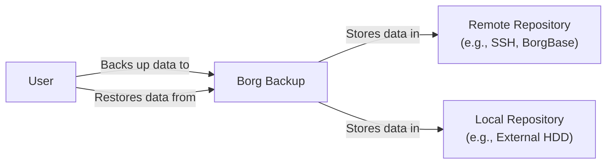
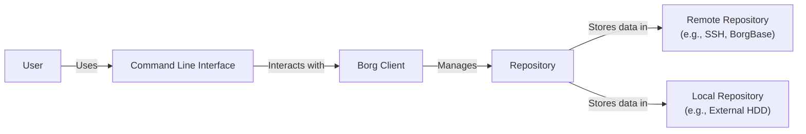
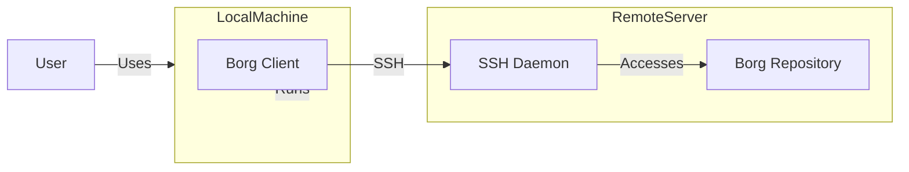
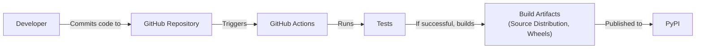

# BUSINESS POSTURE

BorgBackup (Borg) is a deduplicating backup program. Optionally, it supports compression and authenticated encryption. The main goal of Borg is to provide an efficient and secure way to back up data. It's used by individuals and organizations to protect their data from loss, corruption, and ransomware.

Business Priorities:

*   Data Protection: Ensuring the confidentiality, integrity, and availability of backed-up data.
*   Efficiency: Minimizing storage space and bandwidth usage through deduplication and compression.
*   Usability: Providing a user-friendly command-line interface and simple configuration.
*   Reliability: Ensuring backups are consistent and restorable.
*   Open Source: Maintaining a transparent and community-driven development process.

Business Goals:

*   Provide a reliable and secure backup solution for a wide range of users.
*   Minimize the cost of data storage and transfer.
*   Enable users to easily manage and restore their backups.
*   Foster a strong community around the project.

Most Important Business Risks:

*   Data Loss: Failure to properly back up or restore data, leading to permanent data loss.
*   Data Breach: Unauthorized access to backed-up data, potentially exposing sensitive information.
*   Data Corruption: Backups becoming corrupted and unusable.
*   Usability Issues: Difficulty in using the software, leading to improper backups or inability to restore.
*   Supply Chain Attack: Compromise of the software supply chain, leading to the distribution of malicious code.

# SECURITY POSTURE

Existing Security Controls:

*   security control: Authenticated Encryption: Borg uses authenticated encryption (AES-CTR with HMAC-SHA256 or ChaCha20-Poly1305) to protect the confidentiality and integrity of backed-up data. Implemented in Borg's cryptographic layer.
*   security control: Data Deduplication: Borg uses content-defined chunking to deduplicate data, reducing storage space and bandwidth usage. Implemented in Borg's chunking and repository layers.
*   security control: Compression: Borg supports various compression algorithms (lz4, zstd, zlib, lzma) to further reduce the size of backups. Implemented in Borg's chunking and repository layers.
*   security control: Access Control: Borg allows setting repository-level access control using append-only mode and client/server permissions. Described in Borg's documentation and implemented in the repository layer.
*   security control: Key Management: Borg uses key files to manage encryption keys. Users are responsible for securely storing these key files. Described in Borg's documentation.
*   security control: Open Source Code: The source code is publicly available on GitHub, allowing for community review and auditing.

Accepted Risks:

*   accepted risk: User Responsibility for Key Management: Users are responsible for the security of their encryption keys. Loss or compromise of a key can lead to data loss or unauthorized access.
*   accepted risk: Limited GUI: Borg is primarily a command-line tool, which may be a barrier for some users. There are third-party GUI frontends, but they are not officially part of the Borg project.
*   accepted risk: Single Point of Failure: If the repository is stored on a single device, that device becomes a single point of failure.
*   accepted risk: No built-in multi-factor authentication.

Recommended Security Controls:

*   security control: Implement regular security audits and penetration testing.
*   security control: Provide more detailed documentation and guidance on secure key management practices.
*   security control: Explore options for integrating with hardware security modules (HSMs) or key management services (KMS).
*   security control: Consider adding support for multi-factor authentication.

Security Requirements:

*   Authentication:
    *   All access to the repository must be authenticated using strong cryptographic keys.
    *   Support for different key types and strengths.
    *   Secure storage and management of encryption keys.
*   Authorization:
    *   Fine-grained access control to repositories (e.g., read-only, append-only, full access).
    *   Ability to restrict access based on client IP address or hostname.
*   Input Validation:
    *   Properly validate all user inputs, including file paths, repository URLs, and command-line options.
    *   Sanitize inputs to prevent command injection or other injection attacks.
*   Cryptography:
    *   Use strong, well-vetted cryptographic algorithms for encryption and authentication (e.g., AES-256, ChaCha20).
    *   Use authenticated encryption modes (e.g., AES-GCM, ChaCha20-Poly1305) to ensure both confidentiality and integrity.
    *   Properly manage cryptographic keys, including generation, storage, and rotation.
    *   Use secure random number generators.

# DESIGN

## C4 CONTEXT

Element Descriptions:

*   Element:
    *   Name: User
    *   Type: Person
    *   Description: A person who uses BorgBackup to back up and restore their data.
    *   Responsibilities: Initiates backups, restores, manages encryption keys, configures BorgBackup.
    *   Security controls: Manages encryption keys securely.

*   Element:
    *   Name: Borg Backup
    *   Type: Software System
    *   Description: The deduplicating backup program.
    *   Responsibilities: Deduplicates, compresses, encrypts, and stores data; manages backups and restores.
    *   Security controls: Authenticated encryption, data integrity checks, access control (append-only mode).

*   Element:
    *   Name: Remote Repository
    *   Type: External System
    *   Description: A remote server or service used to store backups (e.g., SSH server, BorgBase).
    *   Responsibilities: Stores backup data, provides access control.
    *   Security controls: SSH server security, BorgBase security measures, network security.

*   Element:
    *   Name: Local Repository
    *   Type: External System
    *   Description: A local storage device used to store backups (e.g., external hard drive).
    *   Responsibilities: Stores backup data.
    *   Security controls: Physical security of the device, disk encryption (if applicable).

## C4 CONTAINER

Element Descriptions:

*   Element:
    *   Name: User
    *   Type: Person
    *   Description: A person who uses BorgBackup to back up and restore their data.
    *   Responsibilities: Initiates backups, restores, manages encryption keys, configures BorgBackup.
    *   Security controls: Manages encryption keys securely.

*   Element:
    *   Name: Command Line Interface
    *   Type: Container
    *   Description: The user interface for interacting with BorgBackup.
    *   Responsibilities: Parses user commands, displays output, handles user input.
    *   Security controls: Input validation, sanitization.

*   Element:
    *   Name: Borg Client
    *   Type: Container
    *   Description: The core logic of BorgBackup.
    *   Responsibilities: Handles backup and restore operations, manages encryption, compression, and deduplication.
    *   Security controls: Authenticated encryption, data integrity checks, access control logic.

*   Element:
    *   Name: Repository
    *   Type: Container
    *   Description: The data storage format for Borg backups.
    *   Responsibilities: Stores chunks of data, manages metadata, enforces access control.
    *   Security controls: Access control (append-only mode), data integrity checks.

*   Element:
    *   Name: Remote Repository
    *   Type: External System
    *   Description: A remote server or service used to store backups (e.g., SSH server, BorgBase).
    *   Responsibilities: Stores backup data, provides access control.
    *   Security controls: SSH server security, BorgBase security measures, network security.

*   Element:
    *   Name: Local Repository
    *   Type: External System
    *   Description: A local storage device used to store backups (e.g., external hard drive).
    *   Responsibilities: Stores backup data.
    *   Security controls: Physical security of the device, disk encryption (if applicable).

## DEPLOYMENT

Possible Deployment Solutions:

1.  Local Backup: Borg installed on a local machine, backing up to an external hard drive.
2.  Remote Backup (SSH): Borg installed on a local machine, backing up to a remote server via SSH.
3.  Remote Backup (BorgBase): Borg installed on a local machine, backing up to BorgBase, a hosted service.
4.  Client/Server: Borg client installed on multiple machines, backing up to a central Borg server.

Chosen Solution (Remote Backup - SSH):

Element Descriptions:

*   Element:
    *   Name: Local Machine (Client)
    *   Type: Node
    *   Description: The machine where Borg is installed and initiated.
    *   Responsibilities: Runs Borg client, initiates backups and restores.
    *   Security controls: User authentication, SSH client configuration.

*   Element:
    *   Name: Remote Server (SSH)
    *   Type: Node
    *   Description: The remote server where the Borg repository is stored.
    *   Responsibilities: Runs SSH daemon, stores Borg repository.
    *   Security controls: SSH server security (key-based authentication, firewall), user account management.

*   Element:
    *   Name: Borg Client
    *   Type: Software
    *   Description: The BorgBackup client software.
    *   Responsibilities: Performs backup and restore operations.
    *   Security controls: Authenticated encryption, data integrity checks.

*   Element:
    *   Name: SSH Daemon
    *   Type: Software
    *   Description: The SSH server daemon.
    *   Responsibilities: Provides secure remote access to the server.
    *   Security controls: SSH key-based authentication, secure configuration.

*   Element:
    *   Name: Borg Repository
    *   Type: Data Store
    *   Description: The directory where Borg stores the backup data.
    *   Responsibilities: Stores backup data.
    *   Security controls: File system permissions, access control (append-only mode).

*   Element:
    *   Name: User
    *   Type: Person
    *   Description: A person who uses BorgBackup to back up and restore their data.
    *   Responsibilities: Initiates backups, restores, manages encryption keys, configures BorgBackup.
    *   Security controls: Manages encryption keys securely.

## BUILD

Borg's build process is primarily managed through standard Python packaging tools and GitHub Actions for continuous integration.

Build Process Description:

1.  Developers commit code to the GitHub repository.
2.  GitHub Actions is triggered on push and pull requests.
3.  The CI workflow performs the following steps:
    *   Checks out the code.
    *   Sets up the Python environment.
    *   Installs dependencies.
    *   Runs linters (e.g., flake8, mypy).
    *   Runs unit tests and integration tests.
    *   Builds source distributions and wheels.
4.  If all tests pass, the build artifacts (source distribution and wheels) are created.
5.  Release builds are manually triggered and publish the artifacts to PyPI (Python Package Index).

Security Controls:

*   security control: Code Review: All code changes are reviewed by other developers before being merged.
*   security control: Automated Testing: GitHub Actions runs a comprehensive test suite on every commit.
*   security control: Linters: Static analysis tools (flake8, mypy) are used to enforce code style and identify potential errors.
*   security control: Dependency Management: Dependencies are managed using `setup.cfg` and `requirements.txt`, and are regularly reviewed for security vulnerabilities.
*   security control: Signed Commits: Developers are encouraged to sign their commits using GPG keys.
*   security control: Two-Factor Authentication: Maintainers of the PyPI package are strongly encouraged to use two-factor authentication.

# RISK ASSESSMENT

Critical Business Processes:

*   Data Backup: The process of creating backups of data.
*   Data Restoration: The process of restoring data from backups.
*   Data Integrity Verification: The process of verifying the integrity of backups.

Data Sensitivity:

The data backed up by Borg can vary greatly in sensitivity, from non-sensitive personal files to highly confidential business data. The sensitivity of the data depends on the user and their specific use case. Borg itself treats all data as potentially sensitive and provides encryption to protect it.

Data to Protect:

*   User Data: Any data that users choose to back up using Borg. This can include personal files, documents, photos, videos, source code, databases, and more.
*   Borg Repository Metadata: Metadata about the backups, including file names, sizes, and timestamps.
*   Encryption Keys: The keys used to encrypt the backups.

# QUESTIONS & ASSUMPTIONS

Questions:

*   Are there any specific compliance requirements (e.g., GDPR, HIPAA) that apply to the data being backed up?
*   What is the expected growth rate of the data being backed up?
*   What is the recovery time objective (RTO) and recovery point objective (RPO) for the data?
*   Are there any existing backup solutions in place?
*   What is the budget for backup infrastructure and services?
*   What operating systems and platforms need to be supported?

Assumptions:

*   BUSINESS POSTURE: The primary goal is to provide a secure and reliable backup solution. Cost is a secondary consideration, but efficiency is important.
*   SECURITY POSTURE: Users are responsible for managing their own encryption keys. The Borg project prioritizes security and follows secure development practices.
*   DESIGN: The primary deployment model is a client-server architecture, with the client running on the user's machine and the server being either a remote SSH server or a local storage device. The build process is automated using GitHub Actions.