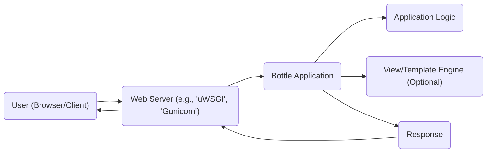
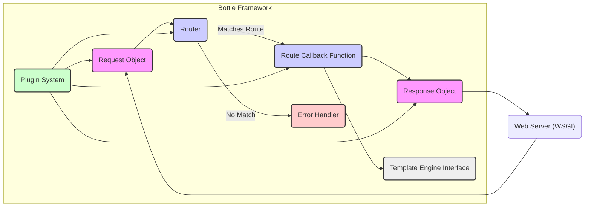

# Project Design Document: Bottle Web Framework

**Version:** 1.1
**Date:** October 26, 2023
**Author:** AI Software Architect

## 1. Introduction

This document provides a detailed design overview of the Bottle web framework (as represented by the project at https://github.com/bottlepy/bottle). This document aims to capture the key architectural components, data flow, and interactions within the framework. It will serve as a foundation for subsequent threat modeling activities.

Bottle is a lightweight WSGI micro web-framework for Python. It is designed to be fast, simple, and easy to use for building small web applications, APIs, and prototypes. Its core philosophy emphasizes minimalism and a single-file implementation.

## 2. Goals and Objectives

The primary goal of this document is to provide a comprehensive architectural description of Bottle suitable for threat modeling. Specific objectives include:

*   Clearly identifying the key components and their responsibilities.
*   Precisely mapping the data flow within the framework.
*   Thoroughly understanding the interactions between different components.
*   Highlighting potential areas of security concern based on the design with concrete examples.
*   Providing a clear and concise representation of the system's architecture using appropriate diagrams and descriptions.

## 3. System Architecture

### 3.1. High-Level Architecture

The following diagram illustrates the high-level architecture of a typical Bottle application deployment:

*   **User (Browser/Client):** Initiates HTTP requests to the web application, expecting a response.
*   **Web Server:**  Receives incoming HTTP requests from users and forwards them to the Bottle application via the WSGI (Web Server Gateway Interface). Examples include uWSGI and Gunicorn.
*   **Bottle Application:** The core of the framework, responsible for routing requests to the appropriate handlers, executing application logic, and generating HTTP responses.
*   **Application Logic:** User-defined Python code that handles specific routes and implements the business logic of the application.
*   **View/Template Engine (Optional):**  Used to render dynamic HTML or other content. Bottle supports integration with various template engines like Jinja2 or Mako.
*   **Response:** The HTTP response generated by the Bottle application, which is sent back to the web server and then to the user.

### 3.2. Detailed Architecture

The following diagram provides a more detailed view of the internal components and data flow within the Bottle framework:

*   **Request Object:**  Represents the incoming HTTP request. It encapsulates details like headers, parameters (query string, form data), the request body, and cookies.
*   **Router:**  The component responsible for matching incoming request paths and HTTP methods to defined routes. It uses URL patterns and dispatches requests to the appropriate callback functions.
*   **Route Callback Function:** The user-defined Python function associated with a specific route. This function contains the core application logic for handling requests to that route.
*   **Response Object:**  Used to construct the HTTP response that will be sent back to the client. This includes setting the response body, status code, and headers.
*   **Error Handler:**  Handles exceptions and errors that occur during request processing. It provides a mechanism to customize error responses and logging.
*   **Plugin System:**  Provides a way to extend Bottle's functionality through middleware, hooks, and other extensions. Plugins can intercept and modify requests and responses.
*   **Template Engine Interface:**  Provides an abstraction layer for interacting with different template engines (e.g., Jinja2, Mako, SimpleTemplate). This allows developers to use their preferred templating language.
*   **Web Server (WSGI):** The interface through which the external web server communicates with the Bottle application. Bottle itself acts as a WSGI application.

## 4. Data Flow

The typical data flow for a request within a Bottle application is as follows:

1. A **User** initiates an HTTP request (e.g., by clicking a link or submitting a form).
2. The **Web Server** receives the incoming HTTP request.
3. The **Web Server** passes the request information to the **Bottle Application** via the WSGI interface.
4. Bottle creates a **Request Object** to encapsulate all the details of the incoming request.
5. The **Router** examines the request path and HTTP method to find a matching route defined in the application.
6. If a matching route is found, the corresponding **Route Callback Function** is executed.
7. The **Route Callback Function** processes the request, potentially interacting with databases, external APIs, or other services.
8. The **Route Callback Function** may use the **Template Engine Interface** to render a dynamic HTML page or other content.
9. The **Route Callback Function** creates a **Response Object** containing the response data (body), HTTP headers (e.g., Content-Type), and the HTTP status code.
10. If no matching route is found, the **Error Handler** is invoked to generate an appropriate error response (e.g., a 404 Not Found page).
11. **Plugins** can intercept and modify the request before it reaches the route handler or the response before it's sent back.
12. The **Response Object** is passed back to the **Web Server** via the WSGI interface.
13. The **Web Server** sends the HTTP response back to the **User's** browser or client.

## 5. Key Components and Their Responsibilities

*   **Request Object:**
    *   Responsibility: Provides a structured way to access all information about the incoming HTTP request.
    *   Key Features: Access to headers, query parameters, form data, cookies, file uploads, request body.
*   **Router:**
    *   Responsibility: Maps incoming URLs and HTTP methods to specific handler functions.
    *   Key Features: Definition of routes using decorators or explicit methods, support for dynamic route parameters, matching based on HTTP methods.
*   **Route Callback Function:**
    *   Responsibility: Contains the core application logic for handling a specific type of request.
    *   Key Features: Receives the Request Object as input, performs necessary actions, and returns data that will be used to construct the Response Object.
*   **Response Object:**
    *   Responsibility:  Encapsulates the HTTP response that will be sent back to the client.
    *   Key Features: Setting the response body (string, bytes, or file-like object), setting HTTP status codes, adding custom headers, setting cookies, and handling redirects.
*   **Error Handler:**
    *   Responsibility: Manages exceptions and errors that occur during request processing.
    *   Key Features: Customization of error pages, logging of errors, handling specific exception types.
*   **Plugin System:**
    *   Responsibility: Provides a mechanism to extend and modify Bottle's behavior.
    *   Key Features: Implementing middleware for request preprocessing and response postprocessing, adding custom route decorators, integrating with external services.
*   **Template Engine Interface:**
    *   Responsibility:  Provides a consistent way to render dynamic content using various templating languages.
    *   Key Features: Integration with popular template engines, passing data to templates for rendering, generating HTML or other text-based output.

## 6. Security Considerations (Detailed)

Based on the architecture, several security considerations are important for applications built with Bottle:

*   **Input Validation:**
    *   Concern: Failure to validate user input can lead to various injection attacks (e.g., SQL injection if data is used in database queries, command injection if used in system commands, XSS if reflected in HTML).
    *   Mitigation: Implement robust input validation on all data received through the **Request Object**. Sanitize and escape data before using it in any potentially harmful context.
*   **Output Encoding:**
    *   Concern: Improper encoding of data in the **Response Object**, especially when rendering templates, can lead to Cross-Site Scripting (XSS) vulnerabilities.
    *   Mitigation: Use template engines with auto-escaping features enabled. Manually escape data when necessary before including it in HTML output.
*   **Cross-Site Request Forgery (CSRF):**
    *   Concern: Bottle does not provide built-in CSRF protection. Without it, malicious sites can trick authenticated users into performing unintended actions on the application.
    *   Mitigation: Implement CSRF protection using techniques like synchronizer tokens. Consider using third-party libraries or plugins for this.
*   **Routing Security:**
    *   Concern: Incorrectly configured routes can expose sensitive functionalities or data.
    *   Mitigation: Follow the principle of least privilege when defining routes. Ensure that only necessary endpoints are exposed and that access is properly controlled (often handled at the application logic level).
*   **Error Handling:**
    *   Concern: Verbose error messages displayed to users can reveal sensitive information about the application's internal workings, aiding attackers.
    *   Mitigation: Configure the **Error Handler** to log detailed errors but display generic error messages to users in production environments.
*   **Plugin Security:**
    *   Concern: Malicious or vulnerable plugins can introduce security flaws into the application.
    *   Mitigation: Carefully vet third-party plugins before using them. Keep plugins updated to patch known vulnerabilities.
*   **Session Management:**
    *   Concern: While Bottle doesn't handle sessions directly, applications built on it often implement their own or use external libraries. Insecure session management can lead to unauthorized access.
    *   Mitigation: Use secure session management practices, including using HTTPS, setting the `HttpOnly` and `Secure` flags on session cookies, and implementing session timeouts.
*   **Authentication and Authorization:**
    *   Concern: Bottle does not provide built-in authentication or authorization mechanisms. These are crucial for controlling access to resources.
    *   Mitigation: Implement authentication and authorization logic within the application or using middleware. Consider using established libraries for these purposes.
*   **Dependency Management:**
    *   Concern: Outdated dependencies can contain known security vulnerabilities.
    *   Mitigation: Regularly update Bottle and all its dependencies to the latest stable versions. Use tools to track and manage dependencies.
*   **HTTPS:**
    *   Concern: Transmitting sensitive data over HTTP exposes it to eavesdropping and man-in-the-middle attacks.
    *   Mitigation: Ensure that Bottle applications are served over HTTPS. This is typically configured at the web server level.
*   **Rate Limiting:**
    *   Concern: Lack of rate limiting can make the application vulnerable to denial-of-service (DoS) attacks.
    *   Mitigation: Implement rate limiting, often done at the web server or using middleware, to restrict the number of requests from a single IP address within a given time frame.

## 7. Deployment Considerations

Secure deployment of Bottle applications involves several key aspects:

*   **Web Server Configuration:**
    *   Importance: The web server acts as the entry point and its configuration significantly impacts security.
    *   Considerations: Disable unnecessary modules and features, configure appropriate timeouts, set up proper logging, and restrict access to sensitive files.
*   **Process Isolation:**
    *   Importance: Isolating the Bottle application process can limit the impact of security breaches.
    *   Considerations: Use containers (e.g., Docker) or virtual environments to isolate the application and its dependencies. Run the application with minimal privileges.
*   **Security Headers:**
    *   Importance: HTTP security headers provide instructions to the browser to enhance security.
    *   Considerations: Configure the web server to send security headers like `Content-Security-Policy`, `Strict-Transport-Security`, `X-Frame-Options`, `X-XSS-Protection`, and `X-Content-Type-Options`.
*   **Monitoring and Logging:**
    *   Importance: Monitoring and logging are crucial for detecting and responding to security incidents.
    *   Considerations: Implement comprehensive logging of application activity and errors. Set up monitoring tools to detect unusual patterns or suspicious behavior.
*   **Regular Security Audits:**
    *   Importance: Proactive security assessments can identify potential vulnerabilities.
    *   Considerations: Conduct regular security audits and penetration testing of the deployed application.

## 8. Future Considerations

This design document reflects the current understanding of the Bottle framework. Future developments or modifications to the framework could influence its architecture and security profile. Potential areas for future consideration include:

*   Exploring built-in middleware or functionalities for common security concerns like CSRF protection.
*   Enhancements to input validation and sanitization utilities within the core framework.
*   Providing more guidance or best practices for secure session management within the Bottle ecosystem.

This document serves as a crucial input for subsequent threat modeling exercises, which will delve deeper into potential vulnerabilities and the development of appropriate mitigation strategies.