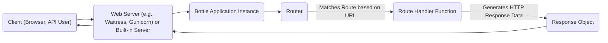
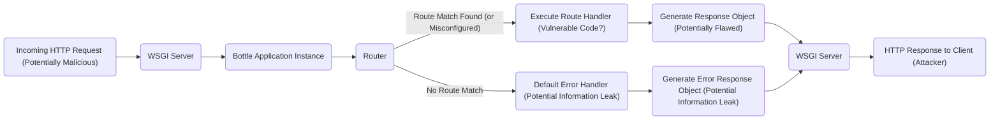
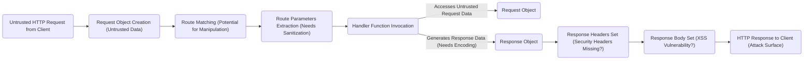

# Project Design Document: Bottle Microframework (Improved for Threat Modeling)

**Version:** 2.0
**Date:** October 26, 2023
**Author:** AI Software Architect

## 1. Introduction

This document provides an enhanced architectural overview of the Bottle Python web framework, specifically tailored for threat modeling activities. It details the key components, data flows, and interactions within the framework, highlighting aspects relevant to security vulnerabilities and potential attack vectors. This document builds upon the previous version with more explicit connections to security considerations.

## 2. Goals

*   Provide a clear and concise description of the Bottle framework's architecture, optimized for security analysis.
*   Identify key components and their responsibilities, with a focus on security-relevant functionalities.
*   Illustrate the flow of data within the framework, highlighting potential points of manipulation or interception.
*   Explicitly identify areas of security concern and provide context for subsequent threat modeling exercises.

## 3. System Overview

Bottle is a lightweight WSGI micro web-framework for Python, designed for simplicity and speed in building small web applications and APIs. Its minimal nature and single-file structure make it relatively easy to understand, which is beneficial for security analysis.

### 3.1. High-Level Architecture

**Components:**

*   **Client (Browser, API User):** The initiator of HTTP requests, representing a potential attacker.
*   **Web Server (e.g., Waitress, Gunicorn) or Built-in Server:**  The entry point for external requests. Its configuration and vulnerabilities are relevant to the overall security posture. The built-in server is particularly important for development-time security considerations.
*   **Bottle Application Instance:** The core of the framework, responsible for request processing and response generation. This is where application-specific logic resides and is a primary focus for security analysis.
*   **Router:**  Directs incoming requests to the appropriate handler function based on the URL. Misconfigurations or vulnerabilities in the routing mechanism can lead to unauthorized access.
*   **Route Handler Function:**  The application-defined code that processes the request and generates the response. This is a critical area for security vulnerabilities related to business logic and data handling.
*   **Response Object:** Encapsulates the HTTP response data (body, headers, status code). Improperly constructed responses can lead to security issues.

## 4. Detailed Design

### 4.1. Core Components and Security Relevance

*   **`Bottle()` Application Class:**
    *   Manages routes, middleware (plugins), and settings.
    *   *Security Relevance:* Incorrectly configured settings or vulnerable plugins can introduce security flaws. The order of middleware execution is also a security consideration.
    *   Provides methods for defining routes (`route()`, `get()`, `post()`, etc.).
    *   *Security Relevance:* Improperly defined routes can lead to unintended access or functionality exposure.
    *   Handles request dispatching to the appropriate handler.
    *   Manages error handling and custom error pages.
    *   *Security Relevance:* Verbose error messages can leak sensitive information. Insecure error handling can be exploited.
    *   Supports the concept of application stacks for modularity.

*   **Routing System:**
    *   Uses a pattern-matching mechanism to map URLs to handler functions.
    *   *Security Relevance:* Vulnerable to path traversal if not carefully implemented. Regular expression vulnerabilities in route patterns can lead to denial-of-service.
    *   Supports dynamic route parameters (e.g., `/user/<name>`).
    *   *Security Relevance:*  Input sanitization and validation are crucial for dynamic parameters to prevent injection attacks.
    *   Allows for custom route matching rules.
    *   Provides mechanisms for URL generation based on route names.

*   **Request Object:**
    *   Provides access to incoming request data.
    *   *Security Relevance:*  All data accessed through the request object is untrusted input and a potential source of vulnerabilities.
        *   URL parameters (query string). *Potential for injection attacks.*
        *   Request headers. *Potential for header injection or manipulation.*
        *   Request body (form data, JSON, etc.). *Primary target for various injection attacks.*
        *   Cookies. *Session hijacking and other cookie-based attacks.*
        *   Uploaded files. *Malicious file uploads and path traversal vulnerabilities.*
        *   Metadata about the request (method, path, etc.).

*   **Response Object:**
    *   Used to construct the HTTP response.
    *   *Security Relevance:* Improperly constructed responses can lead to vulnerabilities.
        *   Response body (string, bytes, file-like object). *Potential for XSS if not properly encoded.*
        *   Response status code.
        *   Response headers (including `Content-Type`, `Set-Cookie`, etc.). *Incorrect header settings can lead to security issues (e.g., missing security headers).*
        *   Mechanisms for setting cookies. *Insecure cookie attributes can be exploited.*

*   **Templating Engine Integration:**
    *   Supports various templating engines (e.g., Jinja2, Mako, SimpleTemplate).
    *   *Security Relevance:*  Vulnerable to server-side template injection (SSTI) if user-controlled data is directly embedded into templates without proper sanitization.
    *   Provides a `template()` function for rendering templates with data.

*   **Plugin System:**
    *   Allows extending Bottle's functionality through plugins.
    *   *Security Relevance:*  Third-party plugins can introduce vulnerabilities. Plugins often have broad access to the request/response lifecycle.
    *   Plugins can hook into the request/response lifecycle.

*   **Built-in Development Server:**
    *   A simple WSGI server for development and testing purposes.
    *   *Security Relevance:*  **Not intended for production use and has known security vulnerabilities.** Should be explicitly avoided in production environments.

### 4.2. Request Handling Flow (Security Focused)

**Detailed Steps with Security Considerations:**

1. **Incoming HTTP Request (Potentially Malicious):**  The client sends a request, which could be crafted to exploit vulnerabilities.
2. **WSGI Server:** The web server receives the request. Server vulnerabilities can be exploited before the request reaches the application.
3. **Bottle Application Instance:** The application receives the request. This is the first point where application-level security measures come into play.
4. **Router:** The router attempts to match the URL. A misconfigured router or vulnerabilities in the routing logic can lead to unintended handler execution.
5. **Execute Route Handler (Vulnerable Code?):** The matched handler function is executed. This is where most application-specific vulnerabilities reside (e.g., injection flaws, business logic errors).
6. **Default Error Handler (Potential Information Leak):** If no route matches, the error handler is invoked. Default error handlers can sometimes reveal sensitive information about the application's internals.
7. **Generate Response Object (Potentially Flawed):** The handler generates the response. Improper encoding or the inclusion of sensitive data can create vulnerabilities.
8. **Generate Error Response Object (Potential Information Leak):** The error handler generates an error response. Similar to the default error handler, this can leak information.
9. **WSGI Server:** The response is passed back to the server.
10. **HTTP Response to Client (Attacker):** The server sends the response back to the client, potentially revealing vulnerabilities or sensitive data.

### 4.3. Data Flow within a Request (Security Perspective)

**Data Elements with Security Implications:**

*   **Untrusted HTTP Request from Client:** All incoming data should be treated as potentially malicious.
*   **Request Object Creation (Untrusted Data):** The `Request` object encapsulates untrusted data.
*   **Route Matching (Potential for Manipulation):** Attackers might try to manipulate the URL to bypass security checks or access unauthorized resources.
*   **Route Parameters Extraction (Needs Sanitization):** Extracted parameters are untrusted input and must be sanitized and validated before use.
*   **Handler Function Invocation:** The handler receives untrusted data and is responsible for secure processing.
*   **Accesses Untrusted Request Data:**  Careless use of request data without proper validation is a primary source of vulnerabilities.
*   **Generates Response Data (Needs Encoding):** Data intended for the response body must be properly encoded to prevent XSS.
*   **Response Object:** The `Response` object carries potentially sensitive information.
*   **Response Headers Set (Security Headers Missing?):**  Absence of security headers (e.g., `Content-Security-Policy`, `Strict-Transport-Security`) can leave the application vulnerable.
*   **Response Body Set (XSS Vulnerability?):**  Dynamically generated content in the response body is a common target for XSS attacks.
*   **HTTP Response to Client (Attack Surface):** The final response is the attacker's view of the application and can reveal vulnerabilities.

## 5. Security Considerations (Detailed for Threat Modeling)

This section provides a more detailed breakdown of security considerations, explicitly linking them to potential threats.

*   **Input Validation:**
    *   *Threats:* Injection attacks (SQL, command, OS command, LDAP, etc.), cross-site scripting (XSS), path traversal.
    *   *Considerations:* Implement strict input validation on all data received from the `Request` object. Use whitelisting and parameterized queries.
*   **Output Encoding:**
    *   *Threats:* Cross-site scripting (XSS).
    *   *Considerations:*  Encode all dynamic data before embedding it in HTML templates. Use context-aware encoding.
*   **Session Management:**
    *   *Threats:* Session hijacking, session fixation.
    *   *Considerations:* Use secure session management practices. Set `HttpOnly`, `Secure`, and `SameSite` attributes on session cookies. Consider using a robust session management library or plugin.
*   **Cookie Security:**
    *   *Threats:* Cookie theft, cookie manipulation.
    *   *Considerations:*  Set appropriate cookie attributes (`HttpOnly`, `Secure`, `SameSite`). Avoid storing sensitive information in cookies if possible.
*   **Error Handling:**
    *   *Threats:* Information disclosure.
    *   *Considerations:* Implement custom error pages that do not reveal sensitive information. Log errors securely.
*   **Dependency Management:**
    *   *Threats:* Exploitation of known vulnerabilities in dependencies.
    *   *Considerations:* Keep Bottle and its dependencies updated. Regularly scan for known vulnerabilities.
*   **Built-in Server Security:**
    *   *Threats:*  Various vulnerabilities due to its development nature.
    *   *Considerations:* **Never use the built-in server in production.** Use a production-ready WSGI server like Waitress or Gunicorn.
*   **Plugin Security:**
    *   *Threats:* Introduction of vulnerabilities through malicious or poorly written plugins.
    *   *Considerations:* Carefully vet and review third-party plugins before using them. Keep plugins updated.
*   **Request Forgery (CSRF):**
    *   *Threats:* Unauthorized actions performed on behalf of a legitimate user.
    *   *Considerations:* Implement CSRF protection mechanisms (e.g., synchronizer tokens).
*   **File Upload Handling:**
    *   *Threats:* Malicious file uploads, remote code execution, path traversal.
    *   *Considerations:* Implement strict file type validation, sanitize file names, store uploaded files outside the web root, and consider using a dedicated file storage service.
*   **URL Redirection:**
    *   *Threats:* Phishing attacks, open redirects.
    *   *Considerations:* Avoid using user-supplied data in redirect URLs. If necessary, use a whitelist of allowed redirect destinations.
*   **Server-Side Template Injection (SSTI):**
    *   *Threats:* Remote code execution.
    *   *Considerations:* Avoid allowing user input to directly influence template rendering logic. Use templating engines securely and escape output appropriately.

## 6. Assumptions and Constraints

*   This design document focuses on the core functionalities of the Bottle framework.
*   Security implementations are primarily the responsibility of the application developer.
*   The specific web server used in production is assumed to be a secure and properly configured WSGI server.
*   This document assumes a basic understanding of common web application security vulnerabilities.

## 7. How to Use This Document for Threat Modeling

This document can be used as a basis for identifying potential threats to a Bottle application. Consider the following steps:

1. **Component Analysis:** For each component identified in the "System Overview" and "Detailed Design," brainstorm potential threats and vulnerabilities specific to that component.
2. **Data Flow Analysis:** Trace the data flow diagrams and identify points where data could be intercepted, manipulated, or corrupted. Consider the security implications of each data element.
3. **Security Considerations Review:**  Use the "Security Considerations" section as a checklist of potential vulnerabilities to investigate in the application's implementation.
4. **STRIDE Model Application:** Apply the STRIDE threat modeling methodology (Spoofing, Tampering, Repudiation, Information Disclosure, Denial of Service, Elevation of Privilege) to each component and data flow.
5. **Attack Surface Mapping:** Identify all potential entry points for attackers (e.g., URL endpoints, file upload mechanisms, API endpoints).

By systematically analyzing the architecture and data flows described in this document, developers and security professionals can effectively identify and mitigate potential security risks in Bottle-based applications.

## 8. Future Considerations

*   Detailed analysis of common Bottle middleware and their security implications.
*   Specific security hardening recommendations for Bottle applications.
*   Integration with security testing methodologies and tools.
