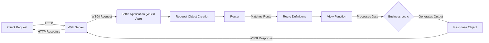

## Project Design Document: Bottle Web Framework (Improved)

**1. Introduction**

This document provides an enhanced design overview of the Bottle web framework, accessible at [https://github.com/bottlepy/bottle](https://github.com/bottlepy/bottle). This detailed description is specifically crafted to facilitate thorough threat modeling activities. It elaborates on the core architectural elements, data pathways, and deployment strategies inherent to the framework.

**2. Goals and Objectives**

*   **Primary Goal:** To furnish a precise and exhaustive understanding of the Bottle web framework's architecture and operational mechanisms.
*   **Specific Objectives:**
    *   Thoroughly delineate the fundamental components constituting the Bottle framework.
    *   Clearly illustrate the sequence of actions involved in processing incoming requests.
    *   Precisely map the movement of data within the framework's boundaries.
    *   Pinpoint critical areas that warrant focused attention during security assessments.
    *   Document prevalent deployment configurations and their implications.

**3. System Architecture**

Bottle is a lightweight Python web framework adhering to the WSGI (Web Server Gateway Interface) standard. Its design emphasizes simplicity, speed, and ease of use, making it suitable for developing small to medium-sized web applications and RESTful APIs.

*   **High-Level Architecture:**  This diagram illustrates the interaction between a client, the web server, and the Bottle application, highlighting the WSGI interface.

    ```mermaid
    graph LR
        A["Client (Browser, API Consumer)"] -- "HTTP Request" --> B("Web Server (e.g., uWSGI, Gunicorn)");
        B -- "WSGI Request" --> C("Bottle Application (WSGI Application)");
        C -- "Handles Request" --> D{"Router"};
        D -- "Route Match" --> E("View Function");
        E -- "Generates Response" --> F("Response Object");
        F -- "WSGI Response" --> B;
        B -- "HTTP Response" --> A;
    ```

*   **Detailed Component Architecture:** This diagram breaks down the internal components of the Bottle framework and their relationships.

    ```mermaid
    graph LR
        subgraph "Bottle Framework Core"
            A["Request Object"]
            B["Router"]
            C["Route Definitions"]
            D["View Functions"]
            E["Response Object"]
            F["Template Engine (Optional)"]
            G["Plugin System"]
            H["Error Handler"]
        end

        subgraph "WSGI Layer"
            I["WSGI Interface"]
        end

        subgraph "External Environment"
            J["Database (Optional)"]
            K["Static File Storage"]
            L["Middleware (Optional)"]
        end

        A -- "Created by" --> I
        I -- "Passes Request to" --> B
        B -- "Matches against" --> C
        B -- "Dispatches to" --> D
        D -- "Processes Request Data" --> E
        D -- "Renders Output via" --> F
        D -- "Extends Functionality via" --> G
        I -- "Handles Exceptions via" --> H
        E -- "Passed back through" --> I
        D -- "Interacts with" --> J
        B -- "Serves" --> K
        I -- "Wrapped by" --> L
    ```

**4. Key Components**

*   **Request Object:**
    *   Encapsulates an incoming HTTP request.
    *   Provides attributes and methods to access request headers, query parameters (GET), form data (POST, PUT), cookies, and uploaded files.
    *   Acts as the primary source of external input to the application.
*   **Router:**
    *   The central dispatcher responsible for mapping incoming request paths and HTTP methods to specific view functions.
    *   Maintains a collection of `Route Definitions`.
    *   Supports dynamic route segments (placeholders) and regular expressions for flexible pattern matching.
    *   Crucial for defining the application's API endpoints and handling different request types.
*   **Route Definitions:**
    *   Explicitly define the association between URL patterns and their corresponding handler functions (view functions).
    *   Can be declared using decorators (`@route('/path')`) or through explicit route registration methods.
    *   Include information about the HTTP methods the route handles (e.g., GET, POST).
*   **View Functions:**
    *   Standard Python functions that contain the core application logic for handling specific requests.
    *   Receive the `Request` object as input.
    *   Process the request data, potentially interacting with databases, external services, or the template engine.
    *   Return data that Bottle converts into an HTTP response (strings, dictionaries, `Response` objects).
*   **Response Object:**
    *   Represents the HTTP response to be sent back to the client.
    *   Allows setting the response body, HTTP status code, headers (including `Content-Type`, `Set-Cookie`), and cookies.
    *   Provides methods for redirecting the client to a different URL.
*   **Template Engine (Optional):**
    *   Enables the generation of dynamic web pages by embedding Python code within template files (e.g., HTML).
    *   Supports various template languages through plugins (e.g., Jinja2, Mako, Cheetah).
    *   Facilitates separation of presentation logic from application logic.
*   **Plugin System:**
    *   A powerful mechanism for extending Bottle's core functionality and adding middleware-like behavior.
    *   Plugins can hook into various stages of the request lifecycle (e.g., before request, after request, on error).
    *   Used for implementing features like authentication, authorization, database integration, request logging, and more.
*   **Error Handler:**
    *   Responsible for catching exceptions that occur during request processing.
    *   Allows defining custom error handlers for specific HTTP error codes or exception types.
    *   Provides a way to generate user-friendly error pages or API error responses.
*   **WSGI Interface:**
    *   Bottle itself is a WSGI application.
    *   This interface defines a standard way for web servers to communicate with Python web applications.
    *   Allows Bottle to be deployed with any WSGI-compliant server.

**5. Data Flow**

The journey of an HTTP request through the Bottle framework follows these steps:

1. **Client Initiates Request:** A client (web browser, API client) sends an HTTP request to the web server.
2. **Web Server Receives Request:** The web server (e.g., Nginx, Apache with mod_wsgi, uWSGI, Gunicorn) accepts the incoming request.
3. **WSGI Interface Invoked:** The web server, through its WSGI adapter, calls the Bottle application (which implements the WSGI protocol).
4. **Request Object Created:** Bottle creates a `Request` object, populating it with data from the WSGI environment (headers, parameters, etc.).
5. **Routing Decision:** The `Router` component examines the request path and HTTP method.
6. **Route Matching Process:** The `Router` iterates through the registered `Route Definitions` to find a matching pattern.
7. **View Function Execution:** Upon finding a match, the corresponding `View Function` is invoked, with the `Request` object as an argument.
8. **View Function Logic:** The `View Function` processes the request, potentially interacting with databases, external APIs, or the template engine.
9. **Response Object Generation:** The `View Function` returns data, which Bottle uses to construct a `Response` object (or the function directly returns a `Response` object).
10. **WSGI Response Generation:** Bottle converts the `Response` object into a WSGI-compatible response (status code, headers, body).
11. **Response Sent to Web Server:** The WSGI response is passed back to the web server.
12. **Web Server Sends Response:** The web server transmits the HTTP response back to the client.



**6. Security Considerations (For Threat Modeling)**

This section outlines potential security vulnerabilities and attack vectors relevant to the Bottle framework, intended to guide threat modeling efforts.

*   **Input Validation Vulnerabilities:**
    *   **Cross-Site Scripting (XSS):**  If user-provided data from the `Request` object (parameters, headers, cookies) is not properly sanitized before being included in HTML output (especially when using templates), it can lead to XSS vulnerabilities.
    *   **SQL Injection:** If user input is directly incorporated into SQL queries without proper parameterization or escaping, attackers could inject malicious SQL code.
    *   **Command Injection:** If user input is used to construct system commands without proper sanitization, attackers could execute arbitrary commands on the server.
    *   **Path Traversal:** Improper handling of user-supplied file paths could allow attackers to access files outside the intended directories.
*   **Authentication and Authorization Weaknesses:**
    *   **Insecure Session Management:** If sessions are not handled securely (e.g., weak session IDs, lack of HTTPS, no expiration), attackers could hijack user sessions.
    *   **Missing or Weak Authentication:** Lack of proper authentication mechanisms allows unauthorized access to application functionality.
    *   **Insufficient Authorization:** Even with authentication, inadequate authorization checks can allow users to access resources or perform actions they shouldn't.
*   **Routing and Endpoint Security:**
    *   **Insecure Direct Object References (IDOR):** If route parameters directly expose internal object IDs without proper authorization checks, attackers could access or modify unintended resources.
    *   **Mass Assignment:** If request data is directly mapped to internal data models without careful control, attackers could modify unintended fields.
*   **Template Engine Vulnerabilities:**
    *   **Server-Side Template Injection (SSTI):** If user input is directly embedded into template code without proper escaping, attackers could execute arbitrary code on the server.
*   **Plugin Security:**
    *   **Vulnerable Plugins:** Using outdated or poorly written plugins can introduce security vulnerabilities into the application.
    *   **Plugin Permissions:**  Understanding the permissions and capabilities of installed plugins is crucial.
*   **Error Handling and Information Disclosure:**
    *   **Verbose Error Messages:** Displaying detailed error messages to users can reveal sensitive information about the application's internal workings.
*   **Cross-Site Request Forgery (CSRF):** Lack of CSRF protection mechanisms can allow attackers to trick authenticated users into performing unintended actions.
*   **Denial of Service (DoS):**
    *   **Resource Exhaustion:**  Endpoints that perform computationally expensive operations or access large amounts of data without proper rate limiting or resource management could be targeted for DoS attacks.
*   **Dependency Vulnerabilities:**  Outdated or vulnerable dependencies used by Bottle or its plugins can introduce security risks.

**7. Deployment Considerations**

The security posture of a Bottle application is significantly influenced by its deployment environment.

*   **Development Server:** The built-in development server is **not suitable for production** due to its lack of security features and performance limitations.
*   **WSGI Servers (Production):**
    *   **uWSGI:** Offers robust features and performance but requires careful configuration for security.
    *   **Gunicorn:** A popular choice known for its simplicity and reliability.
    *   **Waitress:** A pure-Python option, suitable for simpler deployments.
    *   **Security Implications:**  Properly configuring the WSGI server (e.g., setting appropriate user permissions, limiting resource usage) is crucial.
*   **Reverse Proxies (Nginx, Apache):**
    *   Essential for handling SSL/TLS termination, protecting the application from direct internet exposure, and implementing security headers.
    *   Can provide features like rate limiting, request filtering, and web application firewall (WAF) integration.
*   **Containerization (Docker):**
    *   Provides isolation and consistency but requires careful image management and security scanning.
    *   Ensure the base image is secure and dependencies are up-to-date.
*   **Cloud Platforms (AWS, Google Cloud, Azure):**
    *   Offer various security services and configurations that can enhance the security of Bottle applications.
    *   Leveraging features like firewalls, identity and access management (IAM), and security monitoring is recommended.
*   **HTTPS:**  Enforcing HTTPS is paramount for protecting sensitive data transmitted between the client and the server.

**8. Technologies Used**

*   **Core Language:** Python
*   **WSGI Implementation:**  Bottle's core
*   **Optional Template Engines:** Jinja2, Mako, Cheetah, SimpleTemplate (built-in)
*   **Possible Dependencies (depending on application needs):**
    *   Database connectors (e.g., psycopg2, SQLAlchemy)
    *   Authentication libraries (e.g., Flask-Login, Authlib)
    *   Security libraries (e.g., cryptography)
    *   Other utility libraries

This improved design document provides a more comprehensive and security-focused overview of the Bottle web framework, intended to be a valuable resource for threat modeling and security assessments.