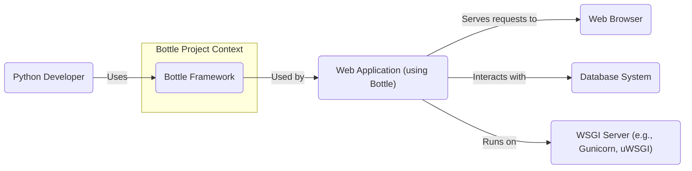
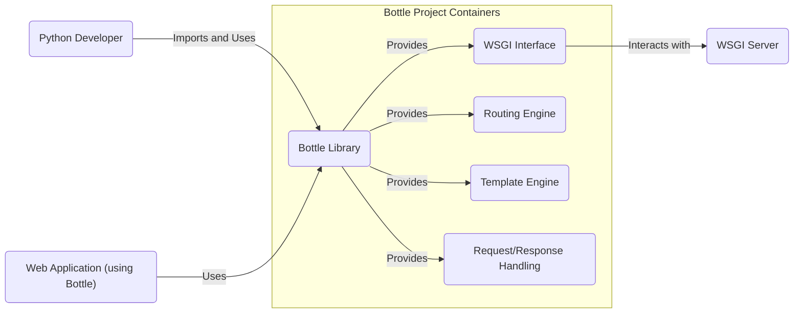
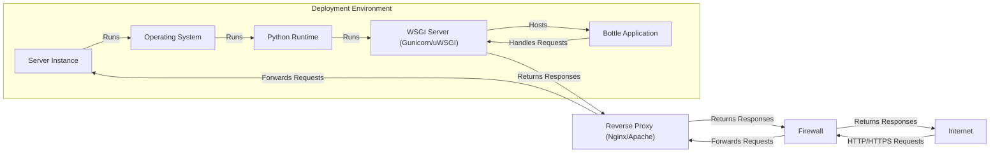
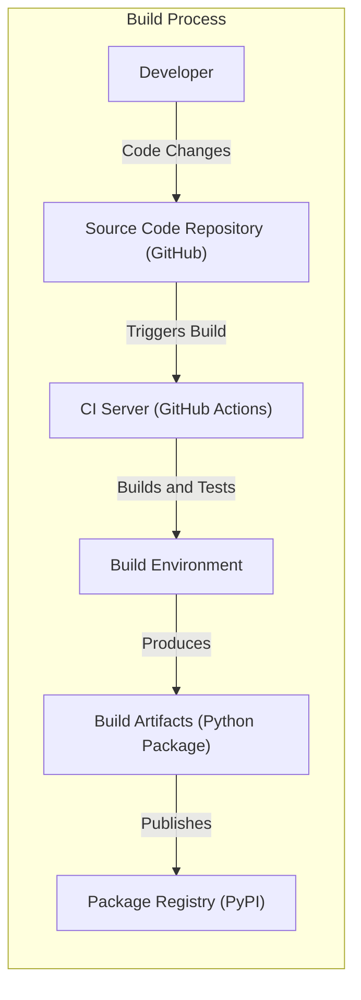

# BUSINESS POSTURE

This project is the Bottle Python web framework. Bottle is a micro web framework for Python that is designed to be fast, simple and lightweight. It is distributed as a single file module and has no dependencies other than the Python standard library.

The primary business goal of the Bottle project is to provide a user-friendly and efficient tool for Python developers to quickly build web applications and APIs. The framework prioritizes ease of use and minimal overhead, making it suitable for small to medium-sized projects, prototypes, and educational purposes.

Key business priorities include:
- Simplicity and ease of use for developers.
- Performance and efficiency for web applications.
- Stability and reliability of the framework.
- Active community support and maintenance.

Most important business risks that need to be addressed:
- Security vulnerabilities in the framework that could be exploited in applications built using Bottle.
- Lack of comprehensive features compared to larger frameworks, potentially limiting its applicability for complex projects.
- Dependency on the Python standard library, which might have its own vulnerabilities.
- Community support waning, leading to slower security updates and bug fixes.

# SECURITY POSTURE

Existing security controls:
- security control: Code review process by maintainers (inferred from open source nature and contribution model). Location: GitHub repository contribution guidelines and pull request reviews.
- security control: Unit and integration testing (inferred from standard software development practices). Location: Test suite within the GitHub repository.
- security control: Reliance on Python standard library security (implicitly inherits security features and vulnerabilities of the Python standard library). Location: Python documentation and standard library source code.

Accepted risks:
- accepted risk: Limited resources for dedicated security testing compared to larger frameworks.
- accepted risk: Potential for vulnerabilities due to the framework's simplicity and focus on core features.
- accepted risk: Reliance on community contributions for identifying and fixing security issues.

Recommended security controls:
- recommended security control: Implement automated Static Application Security Testing (SAST) in the CI/CD pipeline to identify potential vulnerabilities in the code.
- recommended security control: Conduct regular dependency checks to identify and update vulnerable dependencies (although Bottle has minimal dependencies, checking Python version and standard library is still relevant).
- recommended security control: Establish a clear process for reporting and handling security vulnerabilities, including a security policy and contact information.
- recommended security control: Consider incorporating fuzzing or dynamic analysis to discover runtime vulnerabilities.

Security requirements:
- Authentication: While Bottle itself does not provide built-in authentication mechanisms, applications built with Bottle will likely require authentication. Security Requirement: Applications using Bottle should implement robust authentication mechanisms to verify user identities.
- Authorization: Similarly, Bottle does not handle authorization. Security Requirement: Applications should implement proper authorization to control access to resources based on user roles and permissions.
- Input Validation: Bottle applications must handle user inputs securely to prevent injection attacks (e.g., SQL injection, Cross-Site Scripting). Security Requirement: All user inputs should be validated and sanitized to prevent common web vulnerabilities.
- Cryptography: Applications might need to use cryptography for secure data storage and communication (e.g., HTTPS, password hashing). Security Requirement: When handling sensitive data, applications should use strong cryptography algorithms and best practices.

# DESIGN

## C4 CONTEXT

Context Diagram Elements:

- Element:
    - Name: Bottle Framework
    - Type: Software System
    - Description: A lightweight Python web framework for building web applications and APIs.
    - Responsibilities: Provides core web framework functionalities like routing, request handling, templating, and WSGI interface.
    - Security controls: Code review, testing, secure coding practices.

- Element:
    - Name: Python Developer
    - Type: Person
    - Description: Software developers who use the Bottle framework to build web applications.
    - Responsibilities: Develops, tests, and deploys web applications using Bottle, responsible for application-level security.
    - Security controls: Secure development practices, input validation in applications, authentication and authorization implementation in applications.

- Element:
    - Name: Web Application (using Bottle)
    - Type: Software System
    - Description: Web applications built using the Bottle framework.
    - Responsibilities: Provides specific web functionalities to end-users, handles user requests, interacts with databases, and manages application-specific logic.
    - Security controls: Input validation, output encoding, authentication, authorization, session management, secure configuration.

- Element:
    - Name: Web Browser
    - Type: Software System
    - Description: Client application used by end-users to access web applications.
    - Responsibilities: Sends HTTP requests to web applications, renders HTML, executes JavaScript.
    - Security controls: Browser security features (e.g., Content Security Policy, Same-Origin Policy), user-managed security settings.

- Element:
    - Name: Database System
    - Type: External System
    - Description: Persistent data storage used by web applications.
    - Responsibilities: Stores and retrieves application data, ensures data integrity and availability.
    - Security controls: Access control lists, encryption at rest and in transit, database user management, regular security patching.

- Element:
    - Name: WSGI Server (e.g., Gunicorn, uWSGI)
    - Type: Software System
    - Description: Web Server Gateway Interface (WSGI) server that hosts and runs Python web applications.
    - Responsibilities: Receives HTTP requests from the internet, forwards them to the Bottle application, and returns responses to clients.
    - Security controls: Web server configuration (e.g., TLS/SSL configuration, request limits), security updates, access controls.

## C4 CONTAINER

Container Diagram Elements:

- Element:
    - Name: Bottle Library
    - Type: Library
    - Description: The core Bottle Python library, distributed as a single file.
    - Responsibilities: Provides all the core functionalities of the Bottle framework, including routing, request/response handling, templating, and WSGI interface.
    - Security controls: Code review, unit testing, SAST scanning during development.

- Element:
    - Name: WSGI Interface
    - Type: Interface
    - Description: The Web Server Gateway Interface that allows Bottle applications to communicate with WSGI servers.
    - Responsibilities: Standardizes communication between the Bottle framework and various WSGI servers.
    - Security controls: Adherence to WSGI standard, minimal attack surface as it's an interface.

- Element:
    - Name: Routing Engine
    - Type: Component
    - Description: Component responsible for mapping incoming HTTP requests to specific handler functions within the application.
    - Responsibilities: URL pattern matching, request dispatching.
    - Security controls: Protection against route injection vulnerabilities, proper handling of URL parameters.

- Element:
    - Name: Template Engine
    - Type: Component
    - Description: Component for rendering dynamic web pages by embedding Python code within templates.
    - Responsibilities: Template parsing, rendering, and output generation.
    - Security controls: Protection against template injection vulnerabilities, output encoding to prevent XSS.

- Element:
    - Name: Request/Response Handling
    - Type: Component
    - Description: Component that manages incoming HTTP requests and generates HTTP responses.
    - Responsibilities: Parsing requests, handling headers, cookies, and generating responses.
    - Security controls: Input validation, output encoding, handling of sensitive data in requests and responses.

## DEPLOYMENT

Deployment options for applications built with Bottle are varied, ranging from simple local deployments to complex cloud-based architectures. Common deployment environments include:

1. Local Development Server: Using Bottle's built-in development server for testing and development. Not recommended for production.
2. WSGI Server (Standalone): Deploying Bottle applications using standalone WSGI servers like Gunicorn or uWSGI, often behind a reverse proxy like Nginx or Apache.
3. Platform as a Service (PaaS): Deploying to platforms like Heroku, Google App Engine, or AWS Elastic Beanstalk, which handle infrastructure management.
4. Containerized Deployment (Docker/Kubernetes): Packaging Bottle applications in Docker containers and deploying them using container orchestration platforms like Kubernetes.
5. Serverless Functions: In some cases, Bottle applications (or parts of them) can be adapted to run as serverless functions on platforms like AWS Lambda or Google Cloud Functions.

Detailed Deployment Diagram (WSGI Server Standalone Deployment):

Deployment Diagram Elements (WSGI Server Standalone Deployment):

- Element:
    - Name: Internet
    - Type: Network
    - Description: Public network from which users access the web application.
    - Responsibilities: Provides connectivity for users to reach the application.
    - Security controls: Network security is outside the scope of the application deployment, but relies on general internet security.

- Element:
    - Name: Firewall
    - Type: Network Security Device
    - Description: Network firewall protecting the server infrastructure.
    - Responsibilities: Filters network traffic, blocks unauthorized access, and protects against network-based attacks.
    - Security controls: Firewall rules, intrusion detection/prevention systems.

- Element:
    - Name: Reverse Proxy (Nginx/Apache)
    - Type: Web Server
    - Description: Reverse proxy server sitting in front of the WSGI server.
    - Responsibilities: Handles TLS/SSL termination, load balancing, static file serving, and request forwarding to the WSGI server.
    - Security controls: TLS/SSL configuration, web server hardening, access controls, request filtering.

- Element:
    - Name: Server Instance
    - Type: Compute Instance (VM/Physical Server)
    - Description: Physical or virtual server hosting the application.
    - Responsibilities: Provides the underlying compute resources for the application.
    - Security controls: Operating system hardening, access controls, security monitoring, patching.

- Element:
    - Name: Operating System
    - Type: System Software
    - Description: Operating system running on the server instance (e.g., Linux).
    - Responsibilities: Manages system resources, provides system-level security features.
    - Security controls: OS hardening, user access management, security updates, logging and auditing.

- Element:
    - Name: Python Runtime
    - Type: System Software
    - Description: Python interpreter and standard library.
    - Responsibilities: Executes the Bottle application code.
    - Security controls: Keeping Python runtime updated with security patches.

- Element:
    - Name: WSGI Server (Gunicorn/uWSGI)
    - Type: Application Server
    - Description: WSGI server responsible for running the Bottle application.
    - Responsibilities: Hosts the Bottle application, handles request processing, and manages application lifecycle.
    - Security controls: WSGI server configuration, security updates, process isolation.

- Element:
    - Name: Bottle Application
    - Type: Software Application
    - Description: The web application built using the Bottle framework.
    - Responsibilities: Implements the application's business logic, handles user requests, and interacts with other systems.
    - Security controls: Application-level security controls (authentication, authorization, input validation, etc.), secure coding practices.

## BUILD

Build Process Description:

1. Developer writes code and commits changes to the Source Code Repository (GitHub).
2. Code changes in the repository trigger the CI Server (e.g., GitHub Actions).
3. CI Server sets up a Build Environment, which includes necessary dependencies (Python, build tools).
4. Build Environment performs the build process:
    - Fetches source code.
    - Runs linters and SAST scanners (recommended security control).
    - Executes unit and integration tests.
    - Builds the Python package (e.g., creates a wheel or source distribution).
5. Build Artifacts (Python package) are produced.
6. Build Artifacts are published to the Package Registry (PyPI) for distribution.

Build Diagram Elements:

- Element:
    - Name: Developer
    - Type: Person
    - Description: Software developer contributing to the Bottle project.
    - Responsibilities: Writes code, performs local testing, and commits changes.
    - Security controls: Secure coding practices, local development environment security.

- Element:
    - Name: Source Code Repository (GitHub)
    - Type: Code Repository
    - Description: GitHub repository hosting the Bottle project's source code.
    - Responsibilities: Version control, code collaboration, and triggering CI/CD pipelines.
    - Security controls: Access control (branch permissions, repository access), audit logs, vulnerability scanning of dependencies (GitHub Dependabot).

- Element:
    - Name: CI Server (GitHub Actions)
    - Type: CI/CD System
    - Description: Continuous Integration server used for automated build, test, and deployment processes.
    - Responsibilities: Automates build process, runs tests, performs security checks, and publishes artifacts.
    - Security controls: Secure CI/CD configuration, access control to CI/CD pipelines, secrets management, build environment isolation.

- Element:
    - Name: Build Environment
    - Type: Compute Environment
    - Description: Environment where the build process is executed (e.g., containerized build agents).
    - Responsibilities: Provides necessary tools and dependencies for building the project.
    - Security controls: Build environment isolation, hardened build images, access control, secure dependency management.

- Element:
    - Name: Build Artifacts (Python Package)
    - Type: Software Artifact
    - Description: Packaged software ready for distribution (e.g., Python wheel or source distribution).
    - Responsibilities: Contains the compiled/packaged code of the Bottle framework.
    - Security controls: Signing of artifacts (optional), integrity checks during build and distribution.

- Element:
    - Name: Package Registry (PyPI)
    - Type: Software Repository
    - Description: Python Package Index (PyPI) where Bottle packages are published and distributed.
    - Responsibilities: Hosts and distributes Python packages to users.
    - Security controls: PyPI security measures, package signing (optional), malware scanning.

# RISK ASSESSMENT

Critical business process we are trying to protect:
- Availability, integrity, and confidentiality of the Bottle framework itself.
- Security of applications built using the Bottle framework.
- Reputation and trust in the Bottle project.

Data we are trying to protect and their sensitivity:
- Source code of the Bottle framework: High sensitivity. Confidentiality and integrity are crucial to prevent unauthorized modifications or exposure of vulnerabilities.
- Build artifacts (Python packages): High sensitivity. Integrity is crucial to ensure users download legitimate and untampered packages.
- Vulnerability information: High sensitivity. Confidentiality is important until a fix is released to prevent exploitation.
- User data in applications built with Bottle: Sensitivity depends on the application. Bottle framework itself does not handle user data, but applications built with it will.

# QUESTIONS & ASSUMPTIONS

Questions:
- What is the current process for handling security vulnerabilities in Bottle? Is there a security policy or dedicated contact?
- Are there any existing automated security checks (SAST, dependency scanning) in the CI/CD pipeline?
- What is the process for releasing security updates?
- Is there any formal security testing or penetration testing performed on the Bottle framework?

Assumptions:
- BUSINESS POSTURE: The primary goal is to provide a secure, reliable, and easy-to-use micro web framework for Python developers.
- SECURITY POSTURE: The project relies on community contributions and standard open-source development practices for security. There is no dedicated security team or budget.
- DESIGN: The design is centered around a single-file library providing core web framework functionalities. Deployment is flexible and depends on the application built with Bottle. Build process involves standard Python packaging and distribution practices.