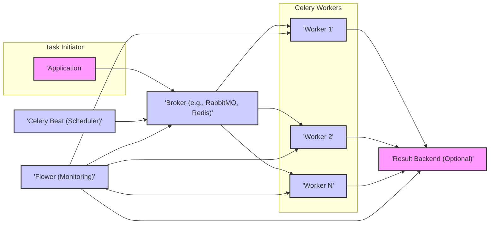

# Project Design Document: Celery - Distributed Task Queue

**Version:** 1.1
**Date:** October 26, 2023
**Author:** AI Software Architect

## 1. Introduction

This document details the architectural design of the Celery project, a distributed task queue facilitating asynchronous task or job execution via message passing. It emphasizes key components, their interactions, and data flow, specifically to support subsequent threat modeling activities.

## 2. Goals

The primary objectives of this design document are:

*   Clearly articulate the architecture of the Celery project.
*   Precisely identify the core components and their respective responsibilities.
*   Thoroughly describe the data flow within the Celery ecosystem.
*   Provide sufficient and relevant detail to enable effective threat modeling exercises.
*   Serve as a definitive reference for understanding the system's design and its security implications.

## 3. High-Level Architecture

Celery employs a distributed architecture involving several key actors that communicate to process tasks. The diagram below illustrates their high-level interactions:

## 4. Key Components

This section provides a detailed description of the core components within the Celery architecture:

*   **Task Initiator (Application):**
    *   The software application or service that needs to execute tasks asynchronously.
    *   Defines the specific tasks (functions or methods) to be performed.
    *   Utilizes the Celery client library to dispatch task messages to the message broker.
    *   May optionally retrieve the outcome of tasks from the result backend.

*   **Broker (Message Queue):**
    *   Serves as the central message transport, facilitating communication between task initiators and workers.
    *   Common examples include RabbitMQ and Redis.
    *   Receives task messages originating from initiators.
    *   Maintains a queue of tasks until workers are available to process them.
    *   Offers mechanisms for ensuring message persistence and reliable delivery.

*   **Celery Workers:**
    *   Independent processes or threads dedicated to executing tasks.
    *   Establish a connection to the message broker and actively listen for new task messages.
    *   Retrieve tasks from the queue for processing.
    *   Execute the logic defined within the task.
    *   Can be horizontally scaled by deploying additional worker instances to increase processing capacity.
    *   May optionally send task results to the configured result backend.

*   **Result Backend (Optional):**
    *   A persistent storage mechanism for saving the results of executed tasks.
    *   Enables task initiators to retrieve the status and outcome of asynchronous tasks.
    *   Common backend options include Redis, relational databases (e.g., PostgreSQL, MySQL), and file systems.
    *   Configuration settings determine if and for how long task results are stored.

*   **Celery Beat (Scheduler):**
    *   An optional scheduler component for executing tasks at predefined intervals.
    *   Runs as a separate process.
    *   Reads scheduled task definitions from a configuration source.
    *   Sends task messages to the broker at the specified times.

*   **Flower (Monitoring):**
    *   A web-based real-time monitor and management tool for Celery.
    *   Provides insights into worker status, task progress, and performance metrics.
    *   Connects to the broker and potentially the result backend to gather operational data.

## 5. Data Flow

The typical sequence of data flow within a Celery system is as follows:

1. **Task Creation and Submission:**
    *   The application (task initiator) invokes a Celery task function.
    *   The Celery client library serializes the task function and its arguments into a message format.
    *   This message is then transmitted to the configured message broker.

2. **Task Queuing:**
    *   The broker receives the incoming task message and places it in the designated queue.
    *   The message remains in the queue until a worker becomes available to handle it.

3. **Task Retrieval:**
    *   Idle Celery workers continuously poll the broker for new tasks.
    *   Upon detecting a new task message in the queue, a worker retrieves it.

4. **Task Execution:**
    *   The worker deserializes the task message to reconstruct the task function and its associated arguments.
    *   The worker then proceeds to execute the task function.

5. **Result Handling (Optional):**
    *   If a result backend is configured, the worker serializes the outcome of the task (either the return value or any exceptions raised).
    *   The serialized result is then sent to the result backend for persistent storage.

6. **Result Retrieval (Optional):**
    *   The application (task initiator) can query the result backend to check the status and retrieve the result of a previously submitted task.
    *   The result backend retrieves and returns the stored result.

7. **Scheduled Task Execution (using Celery Beat):**
    *   Celery Beat periodically consults its schedule.
    *   When a scheduled task's execution time is reached, Celery Beat generates a task message.
    *   This task message is sent to the broker, following the standard task processing flow.

8. **Monitoring (using Flower):**
    *   Flower establishes connections to the broker to observe task queues and worker activity in real-time.
    *   It may also connect to the result backend to track the completion and outcomes of tasks.
    *   Flower presents this collected information through a user-friendly web interface.

## 6. Security Considerations

This section outlines key security considerations relevant for threat modeling of the Celery project:

*   **Broker Security:**
    *   **Threat:** Unauthorized access to the message queue, potentially leading to task manipulation, eavesdropping, or denial of service.
    *   **Mitigation:** Implement strong authentication and authorization mechanisms for broker access. Enforce encrypted communication between clients and the broker using TLS/SSL. Properly configure access controls and permissions to restrict access to authorized entities only.

*   **Result Backend Security:**
    *   **Threat:** Unauthorized access to task results, potentially exposing sensitive information.
    *   **Mitigation:** Implement robust authentication and authorization for accessing the result backend. Encrypt data both at rest and in transit. Securely manage credentials used to access the backend.

*   **Task Serialization and Deserialization:**
    *   **Threat:** Insecure deserialization vulnerabilities if task arguments contain malicious or untrusted data, potentially leading to remote code execution.
    *   **Mitigation:** Use secure serialization formats and libraries. Carefully validate and sanitize task arguments before deserialization. Avoid deserializing data from untrusted sources.

*   **Worker Security:**
    *   **Threat:** Compromised worker environments could lead to unauthorized task execution or access to sensitive data processed by tasks.
    *   **Mitigation:** Secure the underlying operating system and dependencies of worker environments. Isolate worker processes to prevent interference. Implement secure handling of sensitive data within tasks (e.g., using secrets management).

*   **Communication Security:**
    *   **Threat:** Interception of communication between Celery components, potentially exposing task data or credentials.
    *   **Mitigation:** Enforce encryption for all communication channels between Celery components (workers, clients, broker, result backend) using TLS/SSL.

*   **Authentication and Authorization within Celery:**
    *   **Threat:** Unauthorized task submission or worker registration.
    *   **Mitigation:** Implement mechanisms for authenticating task initiators and workers if required. Implement authorization controls to restrict access to specific tasks or queues based on roles or permissions.

*   **Input Validation:**
    *   **Threat:** Maliciously crafted task arguments could cause unexpected behavior, errors, or security vulnerabilities.
    *   **Mitigation:** Thoroughly validate all task arguments on both the client and worker sides to prevent injection attacks or other input-related issues.

*   **Dependency Management:**
    *   **Threat:** Vulnerabilities in Celery's dependencies could be exploited.
    *   **Mitigation:** Regularly update Celery and its dependencies to patch known security vulnerabilities. Employ dependency scanning tools to identify and address potential risks.

*   **Monitoring and Logging:**
    *   **Threat:** Logs containing sensitive information could be exposed if not secured properly. Lack of secure logging can hinder incident response.
    *   **Mitigation:** Securely store and control access to logs. Implement robust logging practices to capture relevant security events. Establish alerting mechanisms for suspicious activities.

## 7. Deployment Considerations

*   **Infrastructure Requirements:** Requires a message broker (e.g., RabbitMQ, Redis) and optionally a result backend, each with its own security considerations.
*   **Worker Deployment:** Workers can be deployed on various platforms, each with different security implications (e.g., virtual machines, containers, serverless functions). Containerization can provide isolation, but container security is crucial.
*   **Scalability:** Scaling Celery horizontally involves deploying more workers, increasing the attack surface if not managed securely.
*   **Configuration Management:** Securely manage the configuration of Celery components, including connection strings, credentials, and task settings. Avoid storing sensitive information in plain text.
*   **Monitoring Setup:** Ensure the monitoring infrastructure (like Flower) is also secured to prevent unauthorized access to operational data.

## 8. Future Considerations

*   **Enhanced Security Features:** Explore implementing more advanced security features such as message signing and encryption at the application level for end-to-end security.
*   **Improved Monitoring and Observability:** Integrate with more comprehensive security monitoring and observability platforms for better threat detection and incident response.
*   **Support for Secure Credential Management:** Investigate and implement secure methods for managing and accessing credentials used by Celery components.

This document provides an enhanced and more detailed architectural design of the Celery project, specifically focusing on aspects relevant to threat modeling and security considerations.
