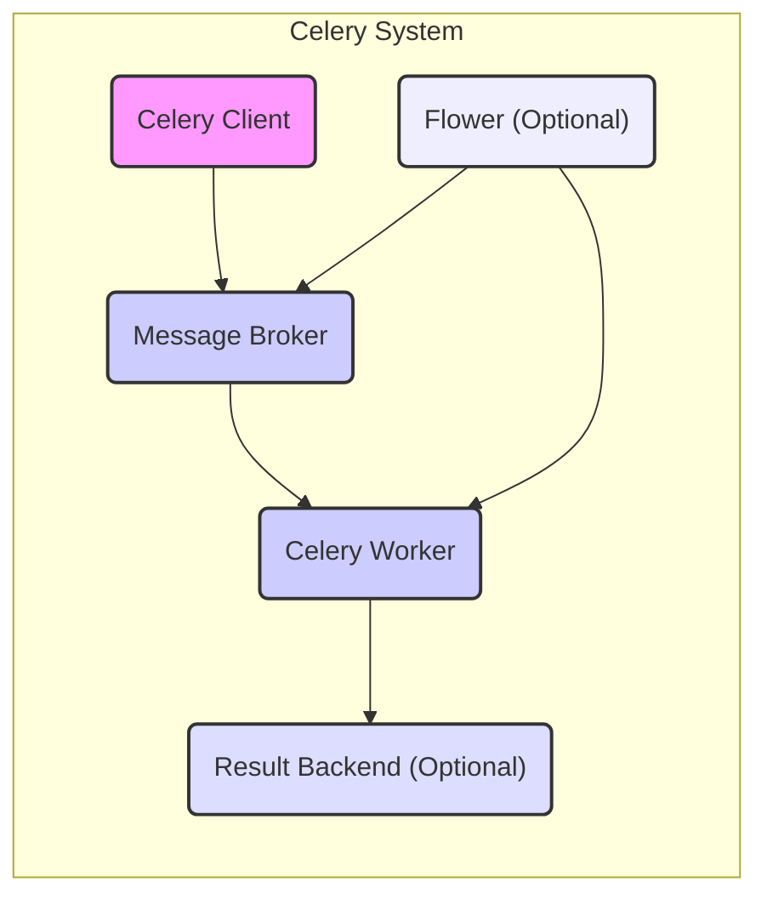
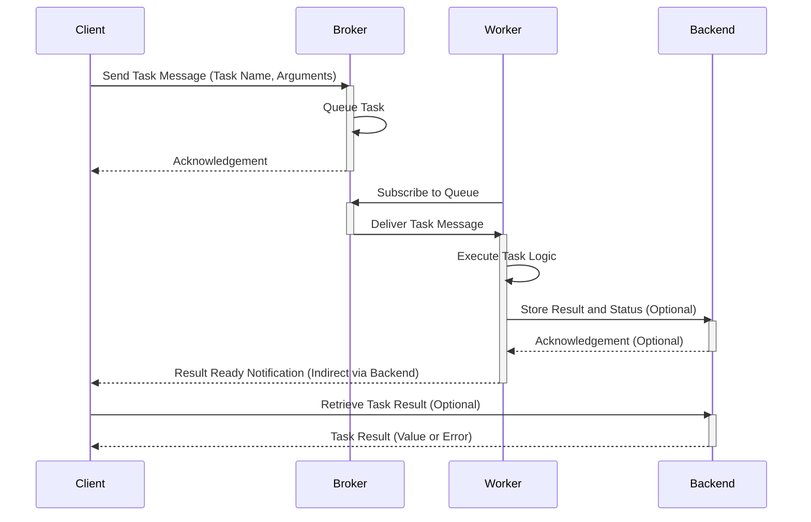

# Project Design Document: Celery Distributed Task Queue

**Version:** 1.1
**Date:** October 26, 2023
**Author:** AI Software Architect

## 1. Project Overview

Celery is a robust asynchronous task queue or job queue based on distributed message passing. It prioritizes real-time operation while also supporting task scheduling. Widely adopted in production environments, Celery handles the execution of millions of tasks daily. Given its distributed nature and reliance on message passing, security is a critical consideration for Celery deployments.

This document provides a detailed overview of the Celery architecture and its key components, specifically designed to facilitate thorough threat modeling and security analysis. It meticulously describes the system's structure, the flow of data, and the interactions between its constituent parts.

## 2. Goals and Objectives

*   To furnish a clear, comprehensive, and easily understandable description of the Celery architecture.
*   To precisely identify the core components of Celery and delineate their respective responsibilities.
*   To visually illustrate the data flow within the Celery system, highlighting key transmission points.
*   To serve as a foundational document for subsequent threat modeling exercises, enabling proactive security measures.
*   To empower stakeholders with a solid understanding of the system's design from a security-centric perspective.

## 3. Target Audience

*   Security Engineers responsible for identifying and mitigating potential threats.
*   Software Developers involved in building and maintaining applications using Celery.
*   System Architects designing and overseeing the infrastructure supporting Celery.
*   DevOps Engineers managing the deployment and operation of Celery clusters.

## 4. System Architecture

Celery employs a distributed architecture, relying on the interaction of several key components that communicate to process and manage asynchronous tasks.

### 4.1. Components

*   **Celery Client:** The application or service that initiates tasks. It constructs and dispatches task messages to the message broker. *Security Implication: Potential for injection vulnerabilities if task parameters are not handled securely.*
*   **Message Broker:**  The intermediary responsible for transporting task messages. Common implementations include RabbitMQ and Redis. It maintains a queue of tasks until a worker is available to process them. *Security Implication:  A critical point for access control and message integrity.*
*   **Celery Worker:** The processes that execute the actual tasks. They subscribe to the message broker, receive task messages, and perform the defined work. *Security Implication:  Requires secure handling of task data and dependencies.*
*   **Result Backend (Optional):** A storage mechanism for persisting the results of tasks. Common backends include Redis, databases (e.g., PostgreSQL), and file systems. *Security Implication: Needs robust access controls to protect task results.*
*   **Flower (Optional):** A web-based monitoring and administration tool for Celery clusters. *Security Implication:  Requires secure authentication and authorization to prevent unauthorized access and control.*

### 4.2. Component Interactions

The following diagram visually represents the interactions between the core components of the Celery system:

### 4.3. Detailed Component Descriptions

*   **Celery Client:**
    *   Primary responsibility is the definition and initiation of asynchronous tasks.
    *   Serializes task arguments and associated metadata into structured messages.
    *   Transmits these messages to the designated message broker.
    *   Does not directly participate in task execution.
    *   May optionally retrieve task results from the configured result backend.

*   **Message Broker:**
    *   Serves as a centralized communication hub for task messages within the Celery ecosystem.
    *   Implements message queuing and routing mechanisms to manage task distribution.
    *   Ensures reliable delivery of tasks to available workers.
    *   Offers message persistence capabilities, depending on the chosen broker and its configuration.
    *   Common implementations include RabbitMQ (utilizing AMQP) and Redis.

*   **Celery Worker:**
    *   Subscribes to the message broker to receive incoming task messages.
    *   Deserializes the received task messages to extract task details.
    *   Executes the core logic associated with the assigned task.
    *   Can be configured with varying levels of concurrency, managing the number of parallel processes or threads.
    *   Optionally sends the outcome and status of executed tasks to the designated result backend.

*   **Result Backend:**
    *   Provides a persistent storage solution for task results and their corresponding status.
    *   Enables clients to query and retrieve the status and final outcome of submitted tasks.
    *   Supports a diverse range of storage options to suit different needs.
    *   Typically stores information such as the unique task ID, its current status (e.g., pending, success, failure), the resulting value (if successful), and traceback information in case of errors.

*   **Flower:**
    *   Presents a user-friendly web interface for real-time monitoring of Celery workers, tasks, and queues.
    *   Facilitates the inspection of task progress and status in real-time.
    *   Offers administrative capabilities, allowing for the management of workers (e.g., graceful shutdown, restart).
    *   Connects to the message broker and potentially the result backend to gather and display relevant operational data.

## 5. Data Flow

The typical sequence of data flow within a Celery system involves the following steps:

1. A **Celery Client** initiates a task by invoking a defined Celery task function within the application code.
2. The Celery client serializes the task's name and its associated arguments into a structured message format.
3. This constructed message is then transmitted to the configured **Message Broker**.
4. The message broker receives the task message and places it in the appropriate queue.
5. One or more **Celery Workers** are actively subscribed to the message broker, listening for new task messages.
6. When a worker becomes available, the message broker delivers a task message to it.
7. The receiving worker deserializes the message to extract the task details and arguments.
8. The worker proceeds to execute the task logic based on the extracted information.
9. Optionally, upon completion (or failure), the worker sends the task's result and status to the configured **Result Backend**.
10. The Celery client can subsequently query the result backend to retrieve the outcome and status of the initiated task.
11. **Flower** can connect to both the message broker and the result backend to gather and display comprehensive monitoring information about the Celery cluster's activity.

## 6. Security Considerations (Detailed for Threat Modeling)

This section elaborates on potential security considerations, providing a foundation for a comprehensive threat modeling exercise.

*   **Message Broker Security:**
    *   **Authentication and Authorization:** Implement strong authentication mechanisms (e.g., username/password, certificates) to control access to the broker and prevent unauthorized clients or workers from connecting or consuming messages.
    *   **Transport Encryption:** Enforce encryption of communication between clients, workers, and the broker using TLS/SSL to protect message confidentiality and integrity during transit, preventing eavesdropping and man-in-the-middle attacks.
    *   **Broker Hardening:** Secure the broker infrastructure itself by following security best practices, including regular patching, access control lists, and network segmentation.
    *   **Queue Security:**  Consider access controls at the queue level to restrict which clients can publish to specific queues and which workers can consume from them.

*   **Celery Worker Security:**
    *   **Input Validation:**  Thoroughly validate and sanitize task arguments received from the message broker to prevent code injection vulnerabilities. Treat all external input as potentially malicious.
    *   **Dependency Management:**  Maintain a secure worker environment by carefully managing dependencies and regularly scanning for vulnerabilities in third-party libraries. Use tools like dependency checkers and vulnerability scanners.
    *   **Secure Data Handling:** Implement secure practices for handling sensitive data within tasks, including encryption at rest and in transit, and avoiding storing sensitive information in logs or temporary files.
    *   **Principle of Least Privilege:** Run worker processes with the minimum necessary privileges to reduce the impact of potential compromises.
    *   **Code Review:** Conduct regular code reviews of task implementations to identify potential security flaws.

*   **Result Backend Security:**
    *   **Access Control:** Implement robust access control mechanisms to restrict access to task results, ensuring only authorized clients can retrieve sensitive information.
    *   **Encryption at Rest:** Encrypt stored task results, especially if they contain sensitive data, to protect against unauthorized access in case of a data breach.
    *   **Data Integrity:** Implement measures to ensure the integrity of stored results, preventing tampering or modification.
    *   **Secure Configuration:**  Properly configure the result backend to follow security best practices.

*   **Communication Security:**
    *   **End-to-End Encryption:**  While transport encryption secures communication with the broker, consider end-to-end encryption of task payloads if they contain highly sensitive information that needs protection even within the broker.
    *   **Mutual Authentication:** Implement mutual authentication between components to verify the identity of both the sender and receiver, further strengthening communication security.

*   **Flower Security:**
    *   **Authentication and Authorization:**  Implement strong authentication (e.g., username/password, OAuth2) and authorization mechanisms to control access to the Flower web interface, preventing unauthorized monitoring and control.
    *   **HTTPS Enforcement:**  Enforce HTTPS for all communication with the Flower interface to protect against eavesdropping and session hijacking.
    *   **Input Sanitization:** Protect against cross-site scripting (XSS) and other web vulnerabilities by properly sanitizing user inputs within the Flower application.
    *   **Secure Deployment:** Deploy Flower in a secure environment, limiting network access and following security hardening guidelines.

*   **Task Serialization/Deserialization:**
    *   **Serialization Format Choice:** Carefully consider the security implications of the chosen serialization format. Formats like `pickle` can be vulnerable to arbitrary code execution if used with untrusted data. Prefer safer alternatives like JSON or consider signing serialized payloads.
    *   **Input Validation during Deserialization:** Implement checks and validation after deserializing task arguments to prevent exploitation of potential vulnerabilities in the deserialization process.

*   **Task Definition and Discovery:**
    *   **Secure Task Registration:** Ensure that only authorized tasks can be registered and executed. Implement mechanisms to prevent the execution of unintended or malicious tasks.
    *   **Task Name Validation:** Validate task names received from the broker to prevent the execution of arbitrary code through crafted task names.

## 7. Assumptions and Constraints

*   It is assumed that a supported message broker (e.g., RabbitMQ, Redis) is deployed, configured, and secured according to its respective best practices.
*   The specific configuration of Celery, including concurrency settings and the chosen serialization method, can significantly impact security. This document provides a general architectural overview.
*   The security of the underlying infrastructure, including servers, networks, and operating systems, is considered a prerequisite and is outside the direct scope of this document.
*   This document primarily focuses on the core Celery components. The security implications of any additional extensions, custom integrations, or third-party libraries used within tasks need to be assessed separately.
*   It is assumed that third-party libraries used within Celery tasks are vetted for security vulnerabilities and are kept up-to-date.

## 8. Future Considerations

*   Conduct detailed security analysis of specific message broker and result backend configurations to identify potential weaknesses.
*   Perform a thorough examination of different task serialization methods and their associated security implications, potentially recommending safer alternatives.
*   Develop and document security best practices for deploying and managing Celery in various environments, including cloud and on-premises deployments.
*   Integrate Celery deployments with security monitoring and logging systems to enable proactive threat detection and incident response.
*   Perform regular security audits and penetration testing of Celery deployments to identify and address potential vulnerabilities.
*   Consider applying formal threat modeling methodologies like STRIDE or attack trees to systematically analyze potential threats and vulnerabilities within the Celery system.