# BUSINESS POSTURE

The Celery project is a distributed task queue focused on real-time operation, but supporting scheduling as well. It is used to execute tasks asynchronously outside the main application flow. This improves application responsiveness and allows for processing of long-running or resource-intensive tasks in the background.

- Business Priorities:
  - Reliability: Tasks should be executed reliably, even in the face of failures.
  - Scalability: The system should be able to handle increasing task loads.
  - Performance: Tasks should be executed efficiently and with minimal latency.
  - Maintainability: The system should be easy to operate, monitor, and debug.

- Business Risks:
  - Task failures leading to data inconsistency or incomplete operations.
  - Performance bottlenecks due to inefficient task processing or infrastructure limitations.
  - Security vulnerabilities in task processing logic or infrastructure leading to data breaches or service disruption.
  - Operational complexity increasing management overhead and potential for human error.

# SECURITY POSTURE

- Security Controls:
  - security control: Secure coding practices are assumed to be followed during development. (Implemented by: Development team)
  - security control: Usage of standard message brokers like RabbitMQ or Redis, which have their own security features. (Implemented by: Infrastructure and deployment configuration)
  - security control: Code review process before merging code changes. (Implemented by: Development team and maintainers - described in project contribution guidelines)

- Accepted Risks:
  - accepted risk: Potential vulnerabilities in dependencies used by Celery. Mitigation is through dependency updates and vulnerability scanning.
  - accepted risk: Misconfiguration of message brokers or result backends leading to security issues. Mitigation is through infrastructure as code and security hardening guidelines.

- Recommended Security Controls:
  - security control: Implement static application security testing (SAST) in the CI/CD pipeline to identify potential vulnerabilities in the code.
  - security control: Implement dynamic application security testing (DAST) in a staging environment to identify runtime vulnerabilities.
  - security control: Regularly perform dependency scanning to identify and update vulnerable dependencies.
  - security control: Implement secret scanning to prevent accidental exposure of secrets in code or configuration.
  - security control: Enforce least privilege principle for Celery workers and related infrastructure components.
  - security control: Implement monitoring and alerting for security-related events, such as failed authentication attempts or unusual activity patterns.

- Security Requirements:
  - Authentication:
    - Requirement: Celery workers should authenticate to the message broker and result backend.
    - Requirement: Applications submitting tasks to Celery should authenticate if required by the message broker.
    - Requirement: Management interfaces (if any) for Celery should require strong authentication.
  - Authorization:
    - Requirement: Celery workers should be authorized to access specific queues or task types.
    - Requirement: Applications submitting tasks should be authorized to submit specific task types.
    - Requirement: Access to management interfaces should be restricted to authorized users.
  - Input Validation:
    - Requirement: Task payloads should be validated to prevent injection attacks and ensure data integrity.
    - Requirement: Inputs to Celery configuration and management interfaces should be validated.
  - Cryptography:
    - Requirement: Sensitive data in task payloads or results should be encrypted at rest and in transit if necessary.
    - Requirement: Communication channels between Celery components (e.g., worker to broker) should be encrypted if necessary.
    - Requirement: Secrets used for authentication or encryption should be securely managed and stored.

# DESIGN

## C4 CONTEXT

```mermaid
flowchart LR
    subgraph "Organization System"
        C(["Celery Project"])
    end
    U1["Developer"] --> C
    U2["Application"] --> C
    S1["Message Broker (e.g., RabbitMQ, Redis)"] <-- C
    S2["Result Backend (e.g., Redis, Database)"] <-- C
    S3["Monitoring System"] <-- C
    C --> U1
    C --> U2
    C --> S1
    C --> S2
    C --> S3
    style C fill:#f9f,stroke:#333,stroke-width:2px
```

- Context Diagram Elements:
  - - Name: Celery Project
    - Type: Software System
    - Description: A distributed task queue used to execute tasks asynchronously.
    - Responsibilities:
      - Receive tasks from applications.
      - Distribute tasks to workers.
      - Execute tasks using workers.
      - Store task results.
      - Provide monitoring and management capabilities.
    - Security controls:
      - Input validation of task payloads.
      - Authentication and authorization for task submission and management.
      - Secure communication with message broker and result backend.
  - - Name: Developer
    - Type: Person
    - Description: Software developers who use Celery to design and implement asynchronous tasks in their applications.
    - Responsibilities:
      - Define and implement Celery tasks.
      - Integrate Celery into applications.
      - Configure and deploy Celery workers and related infrastructure.
    - Security controls:
      - Secure coding practices when developing tasks.
      - Proper configuration of Celery and related components.
  - - Name: Application
    - Type: Software System
    - Description: Applications that use Celery to offload and process tasks asynchronously.
    - Responsibilities:
      - Submit tasks to Celery.
      - Retrieve task results from Celery.
      - Handle task failures and retries.
    - Security controls:
      - Authentication and authorization when submitting tasks.
      - Secure handling of task results.
  - - Name: Message Broker (e.g., RabbitMQ, Redis)
    - Type: Software System
    - Description: A message broker used by Celery to transport task messages between applications and workers.
    - Responsibilities:
      - Receive task messages from applications.
      - Queue task messages.
      - Deliver task messages to Celery workers.
    - Security controls:
      - Authentication and authorization for connections.
      - Encryption of message traffic.
      - Access control to message queues.
  - - Name: Result Backend (e.g., Redis, Database)
    - Type: Software System
    - Description: A storage system used by Celery to store task results and states.
    - Responsibilities:
      - Store task results and states.
      - Provide access to task results and states.
    - Security controls:
      - Access control to stored data.
      - Encryption of data at rest.
  - - Name: Monitoring System
    - Type: Software System
    - Description: A system used to monitor the health and performance of Celery and its components.
    - Responsibilities:
      - Collect metrics from Celery and related components.
      - Visualize metrics and provide dashboards.
      - Generate alerts for anomalies or errors.
    - Security controls:
      - Authentication and authorization for access to monitoring data and dashboards.
      - Secure collection and storage of monitoring data.

## C4 CONTAINER

```mermaid
flowchart LR
    subgraph "Celery Project"
        C1["Celery Client"]
        C2["Celery Worker"]
    end
    S1["Message Broker (e.g., RabbitMQ, Redis)"]
    S2["Result Backend (e.g., Redis, Database)"]
    C1 --> S1
    S1 --> C2
    C2 --> S2
    U1["Application"] --> C1
    U2["Monitoring System"] <-- C2
    style C1 fill:#f9f,stroke:#333,stroke-width:2px
    style C2 fill:#f9f,stroke:#333,stroke-width:2px
```

- Container Diagram Elements:
  - - Name: Celery Client
    - Type: Software Component
    - Description: A library integrated into applications to define and submit tasks to Celery.
    - Responsibilities:
      - Define Celery tasks.
      - Submit tasks to the message broker.
      - Retrieve task results from the result backend.
    - Security controls:
      - Input validation of task parameters before submission.
      - Securely handle credentials for message broker and result backend.
  - - Name: Celery Worker
    - Type: Software Component
    - Description: Processes that execute Celery tasks. Workers consume tasks from the message broker and execute the associated functions.
    - Responsibilities:
      - Connect to the message broker.
      - Consume tasks from queues.
      - Execute task functions.
      - Store task results in the result backend.
    - Security controls:
      - Authentication to message broker and result backend.
      - Authorization to access specific queues and tasks.
      - Secure execution environment for tasks (e.g., process isolation).
      - Input validation of task payloads received from the message broker.
      - Least privilege access to system resources.
  - - Name: Message Broker (e.g., RabbitMQ, Redis)
    - Type: Infrastructure Component
    - Description:  Responsible for message queuing and delivery between Celery clients and workers.
    - Responsibilities:
      - Reliable message queuing.
      - Message routing and delivery.
      - Persistence of messages (optional).
    - Security controls:
      - Access control lists (ACLs).
      - Authentication mechanisms (e.g., username/password, TLS certificates).
      - Encryption of data in transit (TLS/SSL).
  - - Name: Result Backend (e.g., Redis, Database)
    - Type: Infrastructure Component
    - Description: Stores task results and states, allowing clients to retrieve the outcome of tasks.
    - Responsibilities:
      - Persistent storage of task results.
      - Efficient retrieval of task results.
    - Security controls:
      - Access control lists (ACLs).
      - Authentication mechanisms.
      - Encryption of data at rest.

## DEPLOYMENT

Deployment Solution: Containerized deployment using Docker and Kubernetes in a cloud environment (e.g., AWS, GCP, Azure).

```mermaid
flowchart LR
    subgraph "Kubernetes Cluster"
        subgraph "Worker Node 1"
            D1(["Celery Worker Container"])
        end
        subgraph "Worker Node 2"
            D2(["Celery Worker Container"])
        end
        subgraph "Message Broker Node"
            D3(["Message Broker Container (e.g., RabbitMQ)"])
        end
        subgraph "Result Backend Node"
            D4(["Result Backend Container (e.g., Redis)"])
        end
    end
    U1["Application Instance"] --> D3
    D1 --> D3
    D2 --> D3
    D1 --> D4
    D2 --> D4
    U2["Monitoring System"] <-- D1
    U2["Monitoring System"] <-- D2
    U2["Monitoring System"] <-- D3
    U2["Monitoring System"] <-- D4
    style D1 fill:#f9f,stroke:#333,stroke-width:2px
    style D2 fill:#f9f,stroke:#333,stroke-width:2px
    style D3 fill:#f9f,stroke:#333,stroke-width:2px
    style D4 fill:#f9f,stroke:#333,stroke-width:2px
```

- Deployment Diagram Elements:
  - - Name: Celery Worker Container
    - Type: Container
    - Description: Docker container running Celery worker processes. Multiple instances can be deployed for scalability and redundancy.
    - Responsibilities:
      - Execute Celery tasks.
      - Connect to message broker and result backend.
      - Report metrics to monitoring system.
    - Security controls:
      - Container image scanning for vulnerabilities.
      - Least privilege user within the container.
      - Network policies to restrict container communication.
      - Resource limits to prevent resource exhaustion.
  - - Name: Message Broker Container (e.g., RabbitMQ)
    - Type: Container
    - Description: Docker container running a message broker service like RabbitMQ or Redis.
    - Responsibilities:
      - Message queuing and delivery.
      - Management of queues and exchanges.
    - Security controls:
      - Container image scanning for vulnerabilities.
      - Secure configuration of the message broker (e.g., disabling default accounts, enabling authentication).
      - Network policies to restrict access to the broker.
      - Encryption of data in transit (TLS/SSL).
  - - Name: Result Backend Container (e.g., Redis)
    - Type: Container
    - Description: Docker container running a result backend service like Redis or a database.
    - Responsibilities:
      - Storage of task results and states.
      - Data persistence.
    - Security controls:
      - Container image scanning for vulnerabilities.
      - Secure configuration of the result backend (e.g., enabling authentication, access control).
      - Network policies to restrict access to the backend.
      - Encryption of data at rest.
  - - Name: Kubernetes Cluster
    - Type: Infrastructure
    - Description: Kubernetes cluster providing orchestration and management for containers.
    - Responsibilities:
      - Container orchestration and scheduling.
      - Service discovery and load balancing.
      - Resource management and scaling.
    - Security controls:
      - Role-Based Access Control (RBAC) for cluster access.
      - Network policies to isolate namespaces and services.
      - Secrets management for sensitive data.
      - Regular security audits and updates of the Kubernetes cluster.
  - - Name: Worker Node 1, Worker Node 2, Message Broker Node, Result Backend Node
    - Type: Compute Instance
    - Description: Virtual machines or physical servers running within the Kubernetes cluster.
    - Responsibilities:
      - Provide compute resources for containers.
      - Network connectivity.
    - Security controls:
      - Operating system hardening.
      - Regular patching and updates.
      - Security monitoring and logging.
      - Network security groups/firewalls to restrict access.

## BUILD

```mermaid
flowchart LR
    subgraph "Developer Workstation"
        DEV["Developer"]
        CODE["Source Code"]
    end
    subgraph "CI/CD Pipeline (e.g., GitHub Actions)"
        SCM["Source Code Management (GitHub)"]
        BUILD["Build Stage"]
        TEST["Test Stage"]
        SCAN["Security Scan Stage"]
        PUBLISH["Publish Stage"]
        ARTIFACT["Build Artifacts (e.g., Docker Image)"]
    end
    DEV --> CODE
    CODE --> SCM
    SCM --> BUILD
    BUILD --> TEST
    TEST --> SCAN
    SCAN --> PUBLISH
    PUBLISH --> ARTIFACT
    style DEV fill:#ccf,stroke:#333,stroke-width:2px
    style CODE fill:#eee,stroke:#333,stroke-width:2px
    style ARTIFACT fill:#eee,stroke:#333,stroke-width:2px
    style BUILD fill:#f9f,stroke:#333,stroke-width:2px
    style TEST fill:#f9f,stroke:#333,stroke-width:2px
    style SCAN fill:#f9f,stroke:#333,stroke-width:2px
    style PUBLISH fill:#f9f,stroke:#333,stroke-width:2px
```



- Build Process Elements:
  - - Name: Developer
    - Type: Person
    - Description: Software developer writing and committing code changes.
    - Responsibilities:
      - Writing code.
      - Running local tests.
      - Committing code to SCM.
    - Security controls:
      - Secure coding practices.
      - Local security scans (e.g., IDE linters, SAST).
      - Secure workstation configuration.
  - - Name: Source Code
    - Type: Data
    - Description: Project source code managed in a version control system.
    - Responsibilities:
      - Storing code changes.
      - Tracking code history.
      - Facilitating collaboration.
    - Security controls:
      - Access control to the repository.
      - Branch protection rules.
      - Audit logging of code changes.
  - - Name: Source Code Management (GitHub)
    - Type: Service
    - Description: Platform for hosting and managing source code repositories.
    - Responsibilities:
      - Version control.
      - Collaboration features (pull requests, code reviews).
      - Triggering CI/CD pipelines.
    - Security controls:
      - Authentication and authorization for repository access.
      - Audit logging.
      - Security scanning features (e.g., Dependabot).
  - - Name: Build Stage
    - Type: CI/CD Stage
    - Description: Stage in the CI/CD pipeline that compiles code, builds artifacts (e.g., Docker images).
    - Responsibilities:
      - Compilation of code.
      - Dependency resolution.
      - Creation of build artifacts.
    - Security controls:
      - Secure build environment (e.g., isolated build agents).
      - Dependency vulnerability scanning.
      - Software Composition Analysis (SCA).
  - - Name: Test Stage
    - Type: CI/CD Stage
    - Description: Stage in the CI/CD pipeline that runs automated tests (unit, integration, etc.).
    - Responsibilities:
      - Automated testing of code changes.
      - Reporting test results.
    - Security controls:
      - Secure test environment.
      - Test data management (avoiding sensitive data in tests).
  - - Name: Security Scan Stage
    - Type: CI/CD Stage
    - Description: Stage in the CI/CD pipeline that performs security scans (SAST, DAST, secret scanning).
    - Responsibilities:
      - Static Application Security Testing (SAST).
      - Dynamic Application Security Testing (DAST).
      - Secret scanning.
      - Reporting security vulnerabilities.
    - Security controls:
      - Configuration of security scanning tools.
      - Integration with vulnerability management systems.
  - - Name: Publish Stage
    - Type: CI/CD Stage
    - Description: Stage in the CI/CD pipeline that publishes build artifacts to repositories (e.g., Docker registry).
    - Responsibilities:
      - Publishing build artifacts.
      - Versioning and tagging artifacts.
    - Security controls:
      - Secure artifact repository (access control, vulnerability scanning).
      - Signing and verification of artifacts.
  - - Name: Build Artifacts (e.g., Docker Image)
    - Type: Artifact
    - Description:  Output of the build process, ready for deployment.
    - Responsibilities:
      - Packaging application code and dependencies.
      - Providing a deployable unit.
    - Security controls:
      - Vulnerability scanning of artifacts.
      - Provenance tracking of artifacts.
      - Secure storage of artifacts.

# RISK ASSESSMENT

- Critical Business Processes:
  - Asynchronous task processing for core application functionalities (e.g., background jobs, data processing, email sending).
  - Reliable execution of scheduled tasks.
  - Maintaining application responsiveness by offloading long-running tasks.

- Data to Protect and Sensitivity:
  - Task Payloads: Sensitivity depends on the application. Payloads might contain sensitive user data, financial information, or personal identifiable information (PII). Sensitivity level can range from low to high depending on the application context.
  - Task Results: Similar sensitivity to task payloads, as results often reflect processed data from payloads.
  - Celery Configuration and Secrets: High sensitivity. Misconfiguration or exposure of secrets can lead to unauthorized access or service disruption.
  - Monitoring Data: Low to medium sensitivity. Can contain performance metrics and operational logs, which might reveal some system information.

# QUESTIONS & ASSUMPTIONS

- Questions:
  - What is the typical use case for Celery in the target environment? (e.g., specific types of tasks, scale of operations)
  - What message broker and result backend are currently used or planned to be used?
  - What are the specific security requirements and compliance standards that need to be met?
  - Are there any existing security policies or guidelines that need to be followed?
  - What is the organization's risk appetite regarding security vulnerabilities in open-source components?
  - What monitoring and logging systems are in place or planned for Celery?

- Assumptions:
  - Celery is used for asynchronous task processing to improve application performance and scalability.
  - Standard message brokers like RabbitMQ or Redis are used.
  - Basic security practices are followed during development and deployment.
  - The target environment is a cloud-based infrastructure.
  - Security is a relevant concern, and the organization is willing to invest in reasonable security controls.