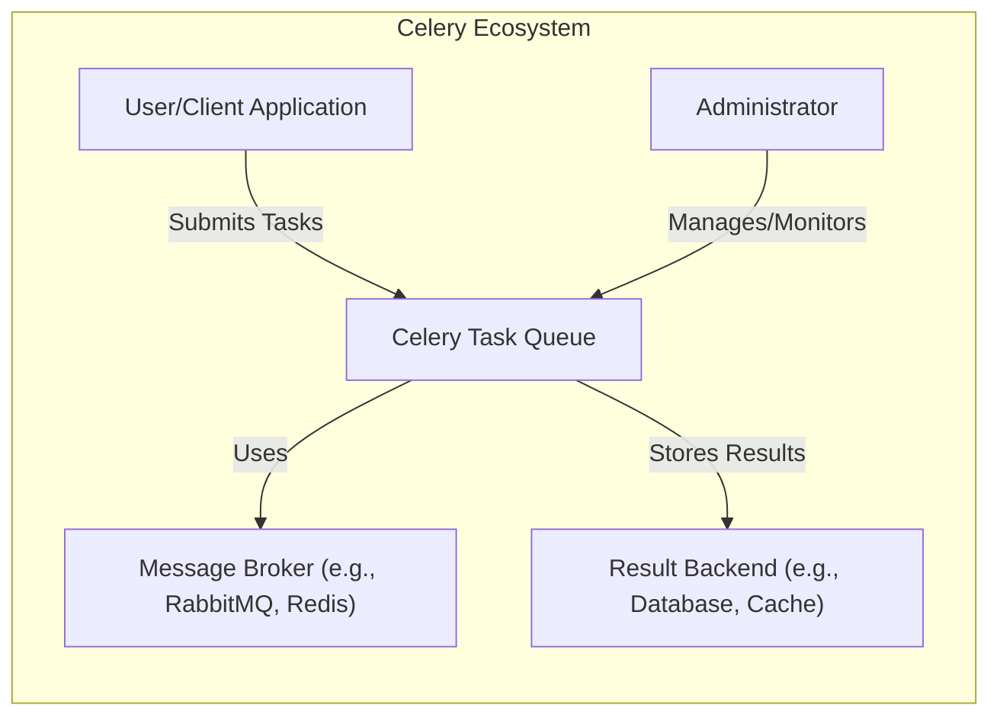
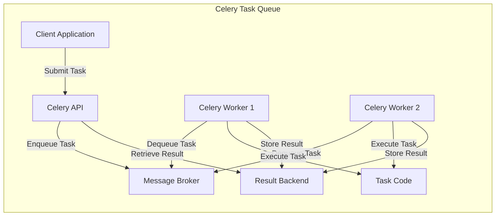
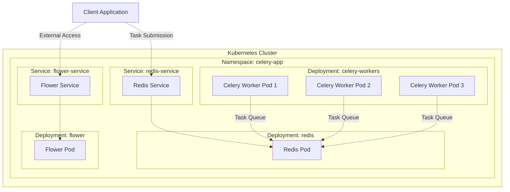
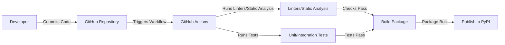

# BUSINESS POSTURE

Celery is a widely-used, open-source, distributed task queue. It allows applications to offload asynchronous work to worker processes, improving responsiveness and scalability. Based on the repository, the following business priorities and goals can be inferred:

*   Priorities:
    *   Reliability: Celery needs to be highly reliable, ensuring that tasks are executed as expected, even in the face of failures.
    *   Scalability: Celery must be able to handle a large volume of tasks and scale horizontally to accommodate increasing workloads.
    *   Maintainability: The codebase should be maintainable, allowing for bug fixes, new features, and ongoing development.
    *   Community Support: As an open-source project, fostering a strong community and providing support to users is crucial.
    *   Flexibility: Support various brokers (RabbitMQ, Redis, etc.) and result backends, catering to different infrastructure needs.
    *   Ease of Use: Provide a simple and intuitive API for developers to integrate and use Celery in their applications.

*   Goals:
    *   Provide a robust and efficient framework for asynchronous task execution.
    *   Enable developers to build scalable and responsive applications.
    *   Maintain a healthy and active open-source project.
    *   Support a wide range of use cases and deployment scenarios.

*   Business Risks:
    *   Task Loss: Failure to execute tasks reliably can lead to data loss, inconsistencies, or broken application workflows.
    *   Performance Bottlenecks: Inefficient task processing or broker communication can impact application performance.
    *   Security Vulnerabilities: Vulnerabilities in Celery or its dependencies could be exploited to compromise applications or data.
    *   Lack of Community Support: Insufficient community engagement can hinder development and user adoption.
    *   Complexity: Difficulty in configuring or using Celery can deter developers.
    *   Broker/Backend Failures: Dependence on external services (brokers, result backends) introduces points of failure.

# SECURITY POSTURE

*   Existing Security Controls:
    *   security control: Code Reviews: The project likely uses code reviews on GitHub to ensure code quality and identify potential security issues. (Described in GitHub repository's contribution guidelines and pull request process).
    *   security control: Testing: Celery has an extensive test suite, including unit and integration tests, which helps to prevent regressions and identify vulnerabilities. (Described in the `tests/` directory of the GitHub repository).
    *   security control: Dependency Management: The project uses `requirements.txt` and `setup.py` files to manage dependencies, allowing for tracking and updating of libraries. (Described in `requirements.txt` and `setup.py` in the GitHub repository).
    *   security control: Security Advisories: The project likely follows a process for handling security vulnerabilities, potentially including a security policy and a way to report vulnerabilities. (Potentially described in a `SECURITY.md` file or similar documentation, though not explicitly found in the provided repository link).
    *   security control: Use of linters and static analysis tools. (Described in configuration files like `.pre-commit-config.yaml`, `.flake8`, etc.).

*   Accepted Risks:
    *   accepted risk: Reliance on Third-Party Brokers: Celery relies on external message brokers (RabbitMQ, Redis, etc.), which introduces a dependency and potential security risks associated with those systems.
    *   accepted risk: Default Configuration: Celery may have default configurations that are not secure for all deployments, requiring users to configure security settings appropriately.
    *   accepted risk: Serialization: Celery uses serialization (e.g., pickle, JSON) to pass messages, which can be a security risk if not handled carefully.

*   Recommended Security Controls:
    *   security control: Implement a clear security policy and vulnerability disclosure process.
    *   security control: Regularly audit dependencies for known vulnerabilities.
    *   security control: Provide security hardening guides and best practices for deploying Celery in production environments.
    *   security control: Consider integrating with security scanning tools (SAST, DAST) in the CI/CD pipeline.
    *   security control: Enforce digitally signed packages.

*   Security Requirements:
    *   Authentication:
        *   Celery workers should authenticate with the message broker using strong credentials.
        *   If Celery is exposed via an API, appropriate authentication mechanisms (e.g., API keys, OAuth 2.0) should be used.
    *   Authorization:
        *   Access control should be implemented to restrict which users or systems can submit tasks, monitor queues, or perform administrative actions.
        *   Consider using broker-specific authorization mechanisms (e.g., RabbitMQ's user permissions).
    *   Input Validation:
        *   Task arguments should be validated to prevent injection attacks or other malicious input.
        *   Carefully consider the security implications of using serializers like pickle, which can be vulnerable to arbitrary code execution if untrusted data is deserialized. Prefer safer alternatives like JSON when possible.
    *   Cryptography:
        *   Sensitive data transmitted between Celery clients and workers should be encrypted in transit (e.g., using TLS/SSL for broker connections).
        *   Consider encrypting sensitive data at rest if stored in a result backend.
        *   Use cryptographically secure random number generators where needed.

# DESIGN

## C4 CONTEXT

*   Elements Description:
    *   Element:
        *   Name: User/Client Application
        *   Type: External System
        *   Description: An application or service that uses Celery to offload tasks for asynchronous execution.
        *   Responsibilities: Submits tasks to the Celery queue, optionally retrieves results.
        *   Security controls: Authenticates with the message broker (if required), validates task inputs, handles results securely.
    *   Element:
        *   Name: Celery Task Queue
        *   Type: System
        *   Description: The core Celery system, responsible for managing tasks, workers, and communication with the broker and backend.
        *   Responsibilities: Receives tasks from clients, distributes tasks to workers, manages task execution, stores results.
        *   Security controls: Enforces authentication and authorization (if configured), validates task inputs, uses secure communication channels.
    *   Element:
        *   Name: Message Broker (e.g., RabbitMQ, Redis)
        *   Type: External System
        *   Description: A message broker used by Celery to queue tasks and facilitate communication between clients and workers.
        *   Responsibilities: Stores tasks until they are consumed by workers, provides reliable message delivery.
        *   Security controls: Implements authentication and authorization, encrypts communication (TLS/SSL), provides access control mechanisms.
    *   Element:
        *   Name: Result Backend (e.g., Database, Cache)
        *   Type: External System
        *   Description: An optional backend used by Celery to store task results.
        *   Responsibilities: Stores task results, provides access to results for clients.
        *   Security controls: Implements authentication and authorization, encrypts data at rest and in transit (if applicable).
    *   Element:
        *   Name: Administrator
        *   Type: User
        *   Description: A user who manages and monitors the Celery system.
        *   Responsibilities: Configures Celery, monitors task queues, manages workers, troubleshoots issues.
        *   Security controls: Authenticates with strong credentials, uses secure communication channels, follows the principle of least privilege.

## C4 CONTAINER

*   Elements Description:
    *   Element:
        *   Name: Client Application
        *   Type: External System
        *   Description: An application or service that uses Celery to offload tasks.
        *   Responsibilities: Submits tasks to the Celery API, optionally retrieves results.
        *   Security controls: Authenticates with the Celery API (if required), validates task inputs, handles results securely.
    *   Element:
        *   Name: Celery API
        *   Type: API
        *   Description: The interface through which client applications interact with Celery.
        *   Responsibilities: Receives task submissions, enqueues tasks to the broker, provides access to task results.
        *   Security controls: Implements authentication and authorization (if configured), validates task inputs.
    *   Element:
        *   Name: Message Broker
        *   Type: External System
        *   Description: A message broker (e.g., RabbitMQ, Redis) used for task queuing.
        *   Responsibilities: Stores tasks until they are consumed by workers, provides reliable message delivery.
        *   Security controls: Implements authentication and authorization, encrypts communication (TLS/SSL), provides access control mechanisms.
    *   Element:
        *   Name: Celery Worker 1, Celery Worker 2
        *   Type: Worker Process
        *   Description: Instances of Celery worker processes that execute tasks.
        *   Responsibilities: Dequeues tasks from the broker, executes task code, stores results in the backend.
        *   Security controls: Authenticates with the broker, validates task inputs (if applicable), handles results securely.
    *   Element:
        *   Name: Task Code
        *   Type: Code Library
        *   Description: The code that defines the tasks to be executed by Celery workers.
        *   Responsibilities: Performs the desired operations defined by the task.
        *   Security controls: Follows secure coding practices, validates inputs, handles errors securely.
    *   Element:
        *   Name: Result Backend
        *   Type: External System
        *   Description: A backend (e.g., database, cache) used to store task results.
        *   Responsibilities: Stores task results, provides access to results for clients.
        *   Security controls: Implements authentication and authorization, encrypts data at rest and in transit (if applicable).

## DEPLOYMENT

*   Possible Deployment Solutions:
    *   Bare-metal servers
    *   Virtual machines (e.g., AWS EC2, Google Compute Engine)
    *   Containers (e.g., Docker)
    *   Container orchestration platforms (e.g., Kubernetes, Docker Swarm)
    *   Serverless platforms (limited applicability, but possible for specific tasks)

*   Chosen Deployment Solution: Containers orchestrated by Kubernetes.

*   Elements Description:
    *   Element:
        *   Name: Client Application
        *   Type: External System
        *   Description: Application submitting tasks to Celery.
        *   Responsibilities: Submits tasks, potentially retrieves results.
        *   Security controls: Network security to restrict access, authentication to Celery services if required.
    *   Element:
        *   Name: Celery Worker Pod 1, Celery Worker Pod 2, Celery Worker Pod 3
        *   Type: Kubernetes Pod
        *   Description: Pods running Celery worker containers.
        *   Responsibilities: Execute Celery tasks.
        *   Security controls: Container security (image scanning, minimal base image), network policies, resource limits.
    *   Element:
        *   Name: Redis Pod
        *   Type: Kubernetes Pod
        *   Description: Pod running the Redis container (message broker).
        *   Responsibilities: Stores and delivers messages (tasks).
        *   Security controls: Container security, network policies, authentication, potentially TLS.
    *   Element:
        *   Name: Flower Pod
        *   Type: Kubernetes Pod
        *   Description: Pod running Flower, a web-based monitoring tool for Celery.
        *   Responsibilities: Provides a UI for monitoring Celery.
        *   Security controls: Container security, network policies, authentication (Flower supports basic auth).
    *   Element:
        *   Name: Redis Service
        *   Type: Kubernetes Service
        *   Description: Kubernetes Service for Redis.
        *   Responsibilities: Provides a stable endpoint for accessing Redis.
        *   Security controls: Network policies to restrict access.
    *   Element:
        *   Name: Flower Service
        *   Type: Kubernetes Service
        *   Description: Kubernetes Service for Flower.
        *   Responsibilities: Provides a stable endpoint for accessing Flower.
        *   Security controls: Network policies, potentially Ingress with TLS termination and authentication.

## BUILD

*   Build Process:
    1.  Developer commits code to the GitHub repository.
    2.  A GitHub Actions workflow is triggered.
    3.  The workflow runs linters (e.g., flake8, black) and static analysis tools (e.g., bandit) to check code quality and security.
    4.  The workflow runs unit and integration tests.
    5.  If all checks and tests pass, the workflow builds the Celery package.
    6.  The package is published to PyPI (Python Package Index).

*   Security Controls:
    *   security control: Code reviews on GitHub before merging code.
    *   security control: Automated linting and static analysis in the CI pipeline.
    *   security control: Comprehensive unit and integration tests in the CI pipeline.
    *   security control: Dependency management using `requirements.txt` and `setup.py`.
    *   security control: Use of signed commits by developers.
    *   security control: Use of signed packages when publishing to PyPI.

# RISK ASSESSMENT

*   Critical Business Processes:
    *   Asynchronous task execution: Celery's primary function is to handle asynchronous tasks reliably and efficiently. Failure of this process can disrupt application functionality.
    *   Background processing: Many applications rely on Celery for background tasks like sending emails, processing images, or generating reports. Disruptions to these processes can impact user experience or business operations.

*   Data Protection:
    *   Task Data: Celery handles task data, which may contain sensitive information depending on the application's use case. The sensitivity of this data varies greatly depending on the application. Examples include:
        *   Low Sensitivity: Task IDs, timestamps, generic status messages.
        *   Medium Sensitivity: Usernames, email addresses (if used in task arguments).
        *   High Sensitivity: Personally Identifiable Information (PII), financial data, health information (if Celery is used in applications handling such data).
    *   Result Data: If Celery is configured to store task results, the result backend may contain sensitive data, mirroring the sensitivity levels of the task data.
    *   Broker Data: The message broker temporarily stores task data in transit. The sensitivity of this data is the same as the task data.

# QUESTIONS & ASSUMPTIONS

*   Questions:
    *   What specific message brokers and result backends are commonly used with Celery in production deployments? (Assumption: RabbitMQ and Redis are the most common choices.)
    *   What are the typical performance requirements and scaling needs for Celery deployments? (Assumption: Deployments vary widely, from small applications to large-scale systems.)
    *   Are there any specific compliance requirements (e.g., GDPR, HIPAA) that need to be considered for Celery deployments? (Assumption: Compliance requirements depend on the specific application and data handled by Celery.)
    *   What level of monitoring and alerting is typically implemented for Celery deployments? (Assumption: Monitoring tools like Flower and Prometheus are commonly used.)
    *   What is the process for handling security vulnerabilities in Celery and its dependencies? (Assumption: There is a process, but it may not be fully documented in the provided repository link.)

*   Assumptions:
    *   Business Posture: The primary goal is to provide a reliable and scalable distributed task queue.
    *   Security Posture: Security is a concern, but the project relies heavily on the security of external components (brokers, backends).
    *   Design: The design is flexible and supports various configurations and deployment scenarios. The provided diagrams represent a common and recommended setup.
    *   The provided GitHub repository is the main and official repository for the Celery project.
    *   Developers using Celery are responsible for securing their own task code and data.
    *   The Kubernetes deployment described is a representative example, and other deployment methods are possible.
    *   The build process described is based on common practices and may not reflect the exact implementation in the Celery project.