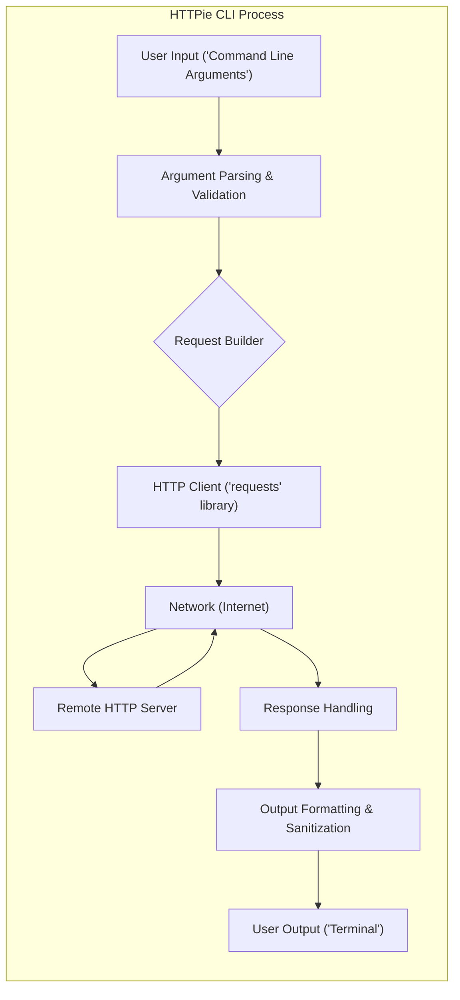
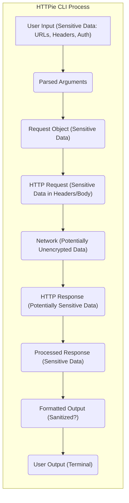

# Project Design Document: HTTPie CLI

**Version:** 1.1
**Date:** October 26, 2023
**Prepared By:** AI Software Architect

## 1. Introduction

This document provides a detailed design overview of the HTTPie command-line interface (CLI) application, focusing on aspects relevant to security and threat modeling. It outlines the key components, data flow, and external interactions of the system. This document serves as a foundation for identifying potential security vulnerabilities.

## 2. Goals

* Provide a clear and comprehensive architectural overview of the HTTPie CLI, emphasizing security-relevant aspects.
* Identify key components and their specific responsibilities in processing user input and handling network communication.
* Illustrate the flow of data, including potentially sensitive information, within the application.
* Highlight external dependencies and interactions, detailing potential security risks associated with each.
* Serve as a robust basis for identifying and analyzing potential security vulnerabilities during threat modeling exercises.

## 3. Scope

This document focuses on the core functionality of the HTTPie CLI involved in processing a single HTTP request-response cycle. This includes:

* Receiving and interpreting user input from the command line.
* Constructing and preparing HTTP requests, including header and body manipulation.
* Establishing network connections and transmitting requests.
* Receiving and parsing HTTP responses.
* Formatting and presenting the response to the user.

This document does not cover:

* Advanced features like plugin management or custom authentication handlers in detail.
* The intricate internal workings of the `requests` library or other underlying dependencies beyond their core function.
* Performance optimization strategies or non-security-related implementation details.

## 4. Architectural Overview

The HTTPie CLI architecture revolves around processing user commands to generate and handle HTTP traffic.

## 5. Component Details

This section provides a detailed description of each key component, highlighting their responsibilities and potential security implications.

* **User Input ('Command Line Arguments'):**
    * **Responsibility:**  Receives the command and parameters provided by the user. This includes the HTTP method, URL, headers, data, authentication details, and other options.
    * **Security Implications:** This is the primary entry point for potentially malicious input. Improperly sanitized or validated input can lead to command injection, argument injection, or other vulnerabilities.

* **Argument Parsing & Validation:**
    * **Responsibility:** Interprets the raw command-line arguments, validates their format and values against expected types and constraints, and converts them into a structured format for further processing.
    * **Security Implications:**  Robust validation is crucial to prevent malformed or malicious input from reaching other components. Insufficient validation can lead to unexpected behavior or vulnerabilities.

* **Request Builder:**
    * **Responsibility:** Constructs the HTTP request object based on the parsed and validated arguments. This involves setting the HTTP method, target URL, headers (including user-provided and default headers), request body (encoding data if necessary), and handling authentication credentials.
    * **Security Implications:**  Vulnerabilities can arise from improper handling of user-provided headers (e.g., header injection), insecure encoding of request bodies, or mishandling of authentication data.

* **HTTP Client ('requests' library):**
    * **Responsibility:**  Utilizes the `requests` library (or a similar HTTP client library) to manage the underlying network communication. This includes establishing connections, handling TLS/SSL encryption, sending the constructed HTTP request, and receiving the raw HTTP response.
    * **Security Implications:**  Reliance on a third-party library introduces potential vulnerabilities within that library. Improper configuration of the HTTP client (e.g., disabling certificate verification when it shouldn't be) can also create security risks.

* **Network (Internet):**
    * **Responsibility:**  Represents the external network infrastructure over which HTTP requests and responses are transmitted.
    * **Security Implications:** This is an untrusted environment. Data transmitted over the network without encryption is susceptible to eavesdropping and manipulation (Man-in-the-Middle attacks).

* **Remote HTTP Server:**
    * **Responsibility:** The external server that receives and processes the HTTP request sent by HTTPie and sends back an HTTP response.
    * **Security Implications:** The security of the remote server is outside the direct control of HTTPie. However, HTTPie's actions can trigger vulnerabilities on the server if crafted requests are sent.

* **Response Handling:**
    * **Responsibility:** Processes the raw HTTP response received from the server. This involves parsing the status code, headers, and body. It also handles potential network errors or exceptions during communication.
    * **Security Implications:**  Improper parsing of response headers could lead to vulnerabilities if malicious headers are present. Failure to handle errors gracefully could expose sensitive information.

* **Output Formatting & Sanitization:**
    * **Responsibility:** Formats the processed response data for display to the user in the terminal. This includes presenting headers, body, and status code in a readable format, potentially with syntax highlighting. Crucially, this component should also sanitize the output to prevent the terminal from interpreting malicious sequences.
    * **Security Implications:**  Failure to sanitize output can lead to terminal injection vulnerabilities, where specially crafted server responses can execute commands or manipulate the user's terminal.

* **User Output ('Terminal'):**
    * **Responsibility:** Displays the formatted response to the user in their command-line terminal.
    * **Security Implications:** The terminal itself can be a target for exploitation if the application outputs unsanitized data.

## 6. Data Flow Diagram

This diagram illustrates the flow of data, including potentially sensitive information, between the components of the HTTPie CLI.

## 7. External Interactions

The HTTPie CLI interacts with several external entities, each presenting potential security considerations.

* **Remote HTTP Servers:**
    * **Interaction:** Sends HTTP requests to and receives responses from these servers.
    * **Security Considerations:**  HTTPie can be used to interact with malicious servers, potentially exposing user data or triggering vulnerabilities. The security posture of the target server is outside HTTPie's control.

* **Operating System:**
    * **Interaction:** Relies on the OS for network access, file system operations (for features like file uploads or configuration file reading), and process management.
    * **Security Considerations:**  Vulnerabilities in the OS can be exploited by HTTPie or through HTTPie. Improper handling of file paths or permissions can lead to local file access vulnerabilities.

* **Command Line Interface (Shell):**
    * **Interaction:** Receives user input and displays output through the shell.
    * **Security Considerations:**  The shell environment can be a source of vulnerabilities (e.g., command injection if HTTPie doesn't properly sanitize input passed to shell commands).

* **Configuration Files (Optional):**
    * **Interaction:** May read configuration files to customize behavior or store credentials.
    * **Security Considerations:**  Storing sensitive information like API keys or passwords in plaintext configuration files is a significant security risk. Incorrect file permissions can also lead to unauthorized access.

* **Environment Variables:**
    * **Interaction:** May read environment variables for configuration or sensitive information.
    * **Security Considerations:**  Similar to configuration files, storing sensitive information in environment variables can be risky if the environment is not properly secured.

* **Standard Output (stdout) and Standard Error (stderr):**
    * **Interaction:** Writes output and error messages to these streams.
    * **Security Considerations:**  Unsanitized output to stdout can potentially be exploited if redirected or piped to other commands.

## 8. Security Considerations (Detailed)

This section expands on the high-level security considerations, providing more specific examples of potential threats.

* **Command Injection:**  If user-provided data (e.g., URLs, headers) is not properly sanitized before being used in system calls or executed as commands, attackers could inject malicious commands.
* **Argument Injection:**  Attackers might manipulate command-line arguments to inject unintended parameters or options that alter HTTPie's behavior in a harmful way.
* **Man-in-the-Middle (MITM) Attacks:**  Without proper TLS/SSL verification, attackers can intercept and modify communication between HTTPie and remote servers, potentially stealing credentials or injecting malicious content.
* **Credential Exposure:**
    * Storing credentials directly in command-line arguments is insecure.
    * Storing credentials in plaintext configuration files or environment variables poses a risk.
    * Improper handling of authentication headers during transmission can expose credentials.
* **Server-Side Vulnerabilities:**  HTTPie could be used to exploit vulnerabilities in remote servers by sending specially crafted requests (e.g., SQL injection, cross-site scripting payloads).
* **Local File Access Vulnerabilities:**
    * If file paths provided by the user are not properly validated, attackers could potentially access or upload unintended local files.
    * Insecure handling of temporary files could also create vulnerabilities.
* **Dependency Vulnerabilities:**  Vulnerabilities in the `requests` library or other dependencies could be exploited if not patched promptly.
* **Terminal Injection:**  If the output formatting component does not properly sanitize server responses, malicious servers could send data that, when displayed in the terminal, executes arbitrary commands or manipulates the user's terminal.
* **Header Injection:**  Attackers might inject malicious headers into HTTP requests, potentially leading to vulnerabilities on the server-side or in intermediary proxies.
* **Denial of Service (DoS):**  HTTPie could be used to launch DoS attacks against remote servers by sending a large number of requests.

## 9. Assumptions and Constraints

* It is assumed that the user has a basic understanding of command-line usage and HTTP concepts.
* The primary use case is interacting with standard HTTP servers over the internet.
* The `requests` library is the primary mechanism for handling HTTP communication.
* The application runs within the security context of the user executing it, and therefore has the privileges of that user.
* Users are expected to exercise caution when interacting with untrusted remote servers.
* Security best practices for handling sensitive data (e.g., not storing credentials in plaintext) are generally followed by users.

This document provides a more detailed and security-focused architectural overview of the HTTPie CLI. This information will be crucial for conducting a thorough threat modeling exercise to identify and mitigate potential security vulnerabilities.
