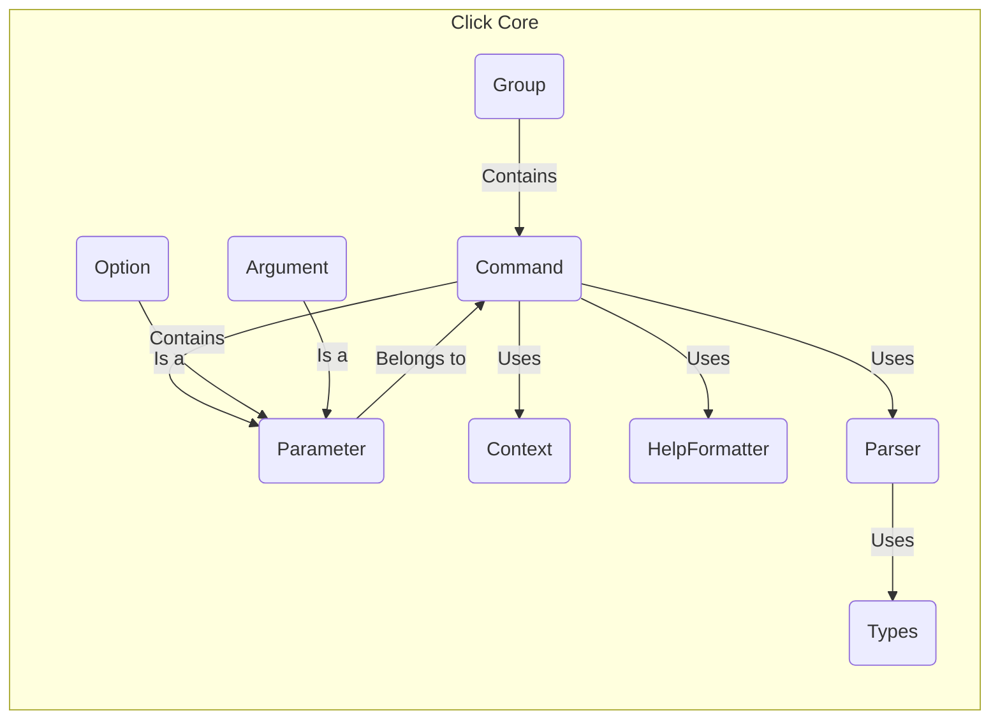
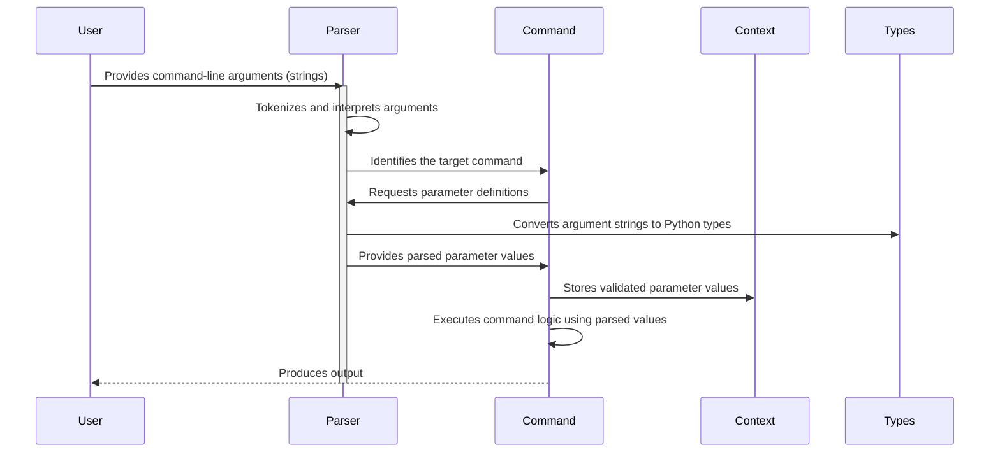

# Project Design Document: Click - Command-Line Interface Creation Library

**Version:** 1.1
**Date:** October 26, 2023
**Prepared By:** Gemini (AI Language Model)

## 1. Introduction

This document provides a detailed design overview of the Click Python library, a popular framework for building beautiful and composable command-line interfaces. This document is intended to serve as a foundation for subsequent threat modeling activities. It outlines the key architectural components, data flow, and external dependencies of Click. This revision aims to enhance clarity and provide more specific details relevant to security considerations.

## 2. Goals

*   Provide a comprehensive and refined description of Click's architecture and functionality.
*   Clearly identify key components and their interactions, emphasizing potential security boundaries.
*   Document the flow of data within the library with a focus on potential manipulation points.
*   Highlight potential areas of security concern with more specific examples for future threat modeling.

## 3. Scope

This document covers the core functionalities of the Click library as of the latest available information. It focuses on the library's internal structure and how it processes command-line input. It does not delve into specific applications built using Click, but rather the library itself. The scope for threat modeling based on this document will primarily focus on vulnerabilities arising from the processing of user-supplied command-line arguments and the library's internal mechanisms for handling them.

## 4. Target Audience

This document is intended for:

*   Security engineers performing threat modeling on applications using Click.
*   Developers who want a deeper understanding of Click's internal workings for secure development practices.
*   Architects designing systems that incorporate command-line interfaces built with Click, considering security implications.

## 5. High-Level Overview

Click is a Python package that provides a way to create command-line interfaces in a "Pythonic" way. It aims to make the process of writing command-line tools fun and easy with minimal boilerplate code. Key features include:

*   Automatic help page generation based on defined parameters.
*   Support for command nesting, allowing for complex CLI structures.
*   Support for various types of options (flags, values) and arguments (positional).
*   Interactive prompting for missing input, enhancing user experience.
*   Abstraction for file handling, simplifying file input/output operations.
*   Extensible support for custom parameter types, allowing for domain-specific input handling.

## 6. Architectural Design

Click's architecture is centered around the concepts of commands and parameters, providing a structured way to define and process command-line interactions. Here's a breakdown of the key components:

*   **`Command`:** Represents a single executable command in the CLI. It encapsulates the logic to be performed when the command is invoked.
*   **`Parameter`:** An abstract base class for representing command-line inputs. Concrete subclasses define specific types of inputs.
*   **`Context`:** An object that stores state information relevant to the current command execution. It acts as a container for parsed parameters and other contextual data, passed down through nested commands.
*   **`Group`:** A specialized `Command` that acts as a container for other `Command` objects, enabling the creation of nested command structures.
*   **`Option`:** A subclass of `Parameter` representing optional flags or value-based options (e.g., `--verbose`, `--name <value>`).
*   **`Argument`:** A subclass of `Parameter` representing positional arguments that must be provided in a specific order.
*   **`HelpFormatter`:** Responsible for generating human-readable help text for commands and their parameters, aiding user understanding.
*   **`Parser`:** The core component responsible for taking the raw command-line arguments (strings) and interpreting them based on the defined `Command` and `Parameter` structure.
*   **`Types`:** Defines mechanisms for converting raw string input from the command line into specific Python data types (e.g., integer, file object). This includes built-in types and the ability to define custom types.

## 7. Data Flow

The typical data flow within a Click application during command execution involves the following steps:

1. **User Input:** The user enters a command and its arguments/options in the command-line interface. This input is initially a sequence of strings.
2. **Parsing Initiation:** The Click application's entry point invokes the relevant `Command` or `Group`.
3. **Argument Parsing:** The `Parser` component receives the raw command-line arguments as a list of strings.
4. **Parameter Matching and Interpretation:** The `Parser` iterates through the defined `Parameter` objects associated with the invoked `Command` or `Group`. It attempts to match the provided strings to the defined options and arguments.
5. **Type Conversion:** The `Types` component is utilized to convert the string values from the command line into the expected Python data types based on the `Parameter` definitions. This step is crucial and a potential point for vulnerabilities if not handled correctly.
6. **Validation:**  `Parameter` objects may have associated validation logic (either built-in or custom) to ensure the converted input values meet specific criteria. This helps prevent unexpected behavior or errors.
7. **Context Population:**  Successfully parsed and validated parameter values are stored within the `Context` object. This object is then passed to the command's execution function.
8. **Command Invocation:** The appropriate `Command` function (defined by the developer) is called, with the populated `Context` and the parsed parameter values passed as arguments.
9. **Command Execution:** The core logic of the command is executed, potentially utilizing the parsed input values.
10. **Output Generation:** The command may produce output to the console, interact with files, or perform other actions based on its logic.

## 8. Security Considerations

Click, while simplifying CLI creation, introduces potential security considerations that developers must be aware of:

*   **Insufficient Input Validation:** If Click applications do not implement robust validation for user-provided arguments and options, they can be vulnerable to various attacks. For example:
    *   **Command Injection:** If user input is directly incorporated into shell commands executed via `subprocess` without proper sanitization, attackers could inject malicious commands.
    *   **Path Traversal:** If file paths are accepted as input without validation, attackers could access or modify files outside the intended scope.
    *   **SQL Injection:** If user input is used to construct SQL queries, attackers could manipulate the queries to gain unauthorized access or modify data.
*   **Type Conversion Vulnerabilities:** While Click provides type conversion, relying solely on the built-in types without careful consideration can lead to issues. For instance, converting a large string to an integer without bounds checking could lead to errors or unexpected behavior.
*   **Dependency Management:** Click relies on third-party libraries. Vulnerabilities in these dependencies could be exploited if not properly managed and updated. Supply chain attacks targeting dependencies are a growing concern.
*   **Information Disclosure through Error Messages:** Verbose or poorly handled error messages could reveal sensitive information about the application's internal workings or environment to an attacker.
*   **Abuse of File Handling Parameters:** If Click applications allow users to specify arbitrary file paths for reading or writing, this functionality could be abused to access sensitive files or overwrite critical data. Ensure proper permission checks and path sanitization.
*   **Denial of Service (DoS):**  Maliciously crafted input could potentially cause the application to consume excessive resources (CPU, memory), leading to a denial of service. This could involve providing extremely large input values or triggering computationally expensive operations.
*   **Default Values and Implicit Behavior:**  Carefully consider the default values assigned to parameters. If defaults are insecure or lead to unintended behavior, they could be exploited. Similarly, implicit behavior based on the absence of certain options should be thoroughly reviewed for security implications.

## 9. Dependencies

Click has a set of dependencies that provide supporting functionalities. Understanding these dependencies is crucial for assessing the overall attack surface:

*   **`attrs`:**  Used for defining classes in a concise way. Vulnerabilities in `attrs` could potentially impact Click.
*   **`colorama`:**  Provides cross-platform colored terminal output. While primarily a presentation library, its interaction with terminal output should be considered.
*   **`inifile`:**  Used for parsing INI configuration files. If Click applications utilize this indirectly, vulnerabilities in `inifile` could be relevant.
*   **`packaging`:**  Used for working with version strings. This is primarily for internal use but understanding its role is important for dependency management.
*   **`python-dateutil`:**  A powerful library for parsing date and time strings. If Click applications use this through custom types, its security is relevant.
*   **`rich`:**  Provides rich text formatting in the terminal. Similar to `colorama`, its interaction with output should be considered.
*   **`shellingham`:**  Used to detect the current shell. While seemingly benign, understanding how Click interacts with the shell environment is important for potential command injection scenarios.

*Note: The exact dependencies and their versions can be found in the `requirements.txt` or `pyproject.toml` file of the Click project.*

## 10. Deployment

Click is deployed as a library integrated within Python applications. When the application is executed from the command line, Click handles the parsing and routing of commands. The security of the deployed application depends on how Click is used and the security practices implemented by the application developer. No separate deployment of Click itself is typically required beyond its installation as a Python package within the application's environment.

## 11. Future Considerations

*   Detailed threat modeling exercises focusing on the identified security considerations.
*   Analysis of specific parameter types and their potential vulnerabilities, especially custom types.
*   Review of Click's error handling mechanisms and potential for information leakage.
*   Investigation into how Click applications interact with external systems and the security implications of those interactions.
*   Regular monitoring of Click's dependencies for known vulnerabilities and timely updates.

This document provides an enhanced and more detailed understanding of the Click library's design, specifically tailored for threat modeling purposes. It highlights potential areas of concern and serves as a valuable resource for security assessments of applications built using Click.
