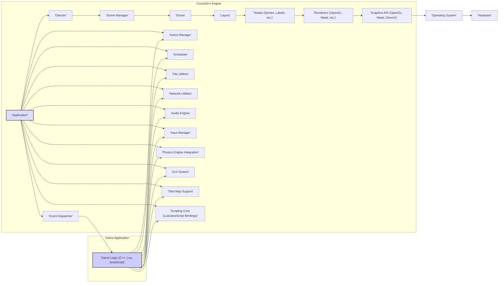

# Project Design Document: Cocos2d-x Game Engine

**Version:** 1.1
**Date:** October 26, 2023
**Prepared By:** AI Software Architect

## 1. Introduction

This document provides a detailed architectural design of the Cocos2d-x game engine, based on the project repository found at [https://github.com/cocos2d/cocos2d-x](https://github.com/cocos2d/cocos2d-x). This document is intended to serve as a comprehensive foundation for subsequent threat modeling activities. It outlines the key components, their interactions, data flow, and the overall structure of the engine, providing the necessary context for identifying potential security vulnerabilities.

## 2. Project Overview

Cocos2d-x is a mature, open-source, cross-platform game engine primarily written in C++, with robust support for scripting languages like Lua and JavaScript. It empowers developers to create high-performance 2D games, interactive simulations, educational applications, and other graphical experiences that can be deployed across a wide range of platforms, including iOS, Android, Windows, macOS, Linux, and web browsers.

The engine offers a comprehensive suite of features, including:

*   Sophisticated scene management for organizing game content.
*   Optimized sprite rendering with support for various texture formats and effects.
*   Advanced animation capabilities, including skeletal and frame-based animations.
*   Integration with popular physics engines like Box2D and Chipmunk for realistic object interactions.
*   A versatile audio engine for managing sound effects and background music.
*   Robust input handling for touch, keyboard, mouse, and accelerometer input.
*   Flexible networking capabilities supporting various protocols.
*   A customizable GUI system for creating user interfaces.
*   Extensive support for Tiled map editor files for designing complex game levels.
*   Particle system for creating visual effects.

## 3. Architectural Design

The Cocos2d-x architecture is designed with modularity and extensibility in mind, organized into distinct layers and components.

### 3.1. High-Level Architecture Diagram

### 3.2. Component Descriptions

*   **Game Application:** This encompasses the game-specific code developed by the game developer, typically implemented using C++, Lua, or JavaScript, leveraging the Cocos2d-x engine's provided APIs and functionalities.
*   **Application:** The central entry point and core manager of the Cocos2d-x engine. It handles the application lifecycle events, initializes the engine subsystems, and manages the main loop.
*   **Director:** A singleton object responsible for orchestrating the game's flow. It manages scene transitions, controls the frame rate, and provides methods for pausing and resuming the game.
*   **Scene Manager:**  Manages the stack of active scenes within the game, allowing for transitions between different game states (e.g., moving from a menu to the gameplay screen).
*   **Scene:** Represents a distinct and self-contained state of the game, such as the main menu, a gameplay level, or an options screen. It acts as a container for layers and nodes.
*   **Layers:**  Organizational units within a scene, used to group related game elements and apply specific behaviors or rendering properties. Layers facilitate the separation of concerns within a scene.
*   **Nodes:** The fundamental building blocks of the scene graph. They represent visual elements (sprites, labels, particle emitters), non-visual components (actions, timers), and serve as the basis for transformations and rendering.
*   **Renderers:** Responsible for the process of drawing the scene graph onto the screen. Cocos2d-x supports multiple renderers, adapting to the underlying graphics API available on the target platform (e.g., OpenGL, Metal, DirectX).
*   **Event Dispatcher:** A central mechanism for managing and dispatching events throughout the engine and to the game application. It handles various event types, including touch input, keyboard input, custom events, and accelerometer data.
*   **Action Manager:**  Manages time-based actions that modify the properties of nodes over time, such as movement, rotation, scaling, and fading.
*   **Scheduler:**  Provides a way to schedule functions to be executed at specific intervals or after a certain delay, enabling time-based game logic and updates.
*   **File Utilities:** Offers a set of utility functions for accessing and managing files and resources, including loading images, audio files, and configuration data.
*   **Network Utilities:** Provides classes and functionalities for network communication, including making HTTP requests, establishing WebSocket connections, and working with sockets for custom network protocols.
*   **Audio Engine:** Manages the playback of sound effects and background music, supporting various audio formats and providing controls for volume, panning, and looping.
*   **Input Manager:**  Handles input events from various sources, translating raw input data into engine-level events that can be processed by the game logic.
*   **Physics Engine Integration:**  Provides seamless integration with external physics engines like Box2D and Chipmunk, allowing developers to create realistic physics simulations within their games.
*   **GUI System:** Offers a collection of pre-built UI elements (buttons, labels, sliders, etc.) that developers can use to create interactive user interfaces within their games.
*   **Tiled Map Support:**  Enables the loading and rendering of maps created with the Tiled map editor, a popular tool for designing 2D game levels.
*   **Graphics API (OpenGL, Metal, DirectX):** The low-level graphics APIs that the renderers utilize to communicate with the GPU and perform drawing operations.
*   **Scripting Core (Lua/JavaScript Bindings):** Provides the necessary bindings and infrastructure to allow developers to write game logic using Lua or JavaScript, interacting with the core C++ engine.

### 3.3. Data Flow

The typical data flow within a Cocos2d-x application follows these key stages:

1. **Initialization Phase:** The `Application` object starts the engine, initializing core components like the `Director`, renderers, file systems, and input managers.
2. **Scene Management:** The `Director` loads the initial `Scene`, which sets up the initial game world and its elements.
3. **Input Processing:** The `Input Manager` receives raw input events from the operating system (e.g., touch events, keyboard presses).
4. **Event Dispatching:** The `Event Dispatcher` routes these input events to the appropriate `Nodes` or game logic components that are registered to handle them.
5. **Game Logic Execution:** Game logic, implemented in C++, Lua, or JavaScript, processes the received events, updates the game state, and triggers actions or changes.
6. **Action Updates:** The `Action Manager` updates the properties of `Nodes` based on the active actions applied to them, creating animations and dynamic effects.
7. **Scheduled Tasks:** The `Scheduler` executes functions that have been scheduled to run at specific times or intervals, handling recurring game logic or updates.
8. **Rendering Pipeline:** The `Renderer` traverses the scene graph, collecting the visual information from each `Node`. It then uses the underlying `Graphics API` to draw the scene onto the screen.
9. **Audio Output:** The `Audio Engine` plays sound effects and background music as directed by the game logic, interacting with the operating system's audio subsystem.
10. **Network Communication:** When necessary, the game logic utilizes the `Network Utilities` to send and receive data over the network, interacting with external servers or other clients.
11. **Resource Loading:** The `File Utilities` are used to load various game assets, such as images, audio files, and configuration files, from the device's storage.

### 3.4. Key Interactions

*   The **Game Application** interacts with the **Cocos2d-x Engine** primarily through its public APIs, allowing developers to create and manipulate game objects, respond to events, and control the overall game flow.
*   The **Director** acts as the central orchestrator, managing the game loop, scene transitions, and the overall lifecycle of the application.
*   **Nodes** are organized in a hierarchical scene graph, and the **Renderer** traverses this graph to determine what needs to be drawn on the screen.
*   The **Event Dispatcher** serves as a central hub for distributing events between different parts of the engine and the game application, enabling communication and interaction between components.
*   The **Renderer** directly interacts with the platform-specific **Graphics API** (OpenGL, Metal, DirectX) to perform the low-level drawing operations.
*   The **Network Utilities** facilitate communication with external systems using various network protocols.
*   The **Audio Engine** interacts with the operating system's audio subsystem to play sounds and music.
*   The **Scripting Core** allows the **Game Application** (written in Lua or JavaScript) to interact with the core C++ engine functionalities.

## 4. Security Considerations (For Threat Modeling)

This section highlights potential security considerations that will be the focus of the subsequent threat modeling process. These are potential areas of vulnerability that could be exploited.

*   **Asset Loading and Handling:**
    *   **Path Traversal:** Improper validation of file paths during asset loading could allow attackers to access arbitrary files on the device.
    *   **Malicious Assets:** Loading assets from untrusted sources could introduce malicious code or data that could compromise the game or the user's device.
    *   **Resource Exhaustion:**  Loading excessively large or numerous assets could lead to denial-of-service conditions.
*   **Input Handling:**
    *   **Injection Attacks:** Lack of proper input sanitization could make the game vulnerable to injection attacks if user input is used in scripting or system calls.
    *   **Denial of Service:** Malicious input could be crafted to crash the game or cause it to become unresponsive.
*   **Network Communication:**
    *   **Man-in-the-Middle Attacks:** Unencrypted network communication could allow attackers to intercept and modify data.
    *   **Data Tampering:**  Lack of integrity checks on network data could allow attackers to alter game state or user data.
    *   **Replay Attacks:**  Attackers could capture and replay network requests to gain an unfair advantage or cause unintended actions.
    *   **Server-Side Vulnerabilities:** If the game interacts with a backend server, vulnerabilities on the server could be exploited.
*   **Scripting Engine Security:**
    *   **Arbitrary Code Execution:** Vulnerabilities in the Lua or JavaScript bindings could allow attackers to execute arbitrary code on the user's device.
    *   **Sandbox Escapes:** If scripting is sandboxed, vulnerabilities could allow attackers to escape the sandbox and gain broader access.
*   **Third-Party Libraries and Dependencies:**
    *   **Known Vulnerabilities:** Using outdated or vulnerable third-party libraries could introduce security risks.
    *   **Supply Chain Attacks:**  Compromised dependencies could inject malicious code into the game.
*   **Build Process Security:**
    *   **Compromised Build Environment:** A compromised build environment could lead to the injection of malicious code during the build process.
    *   **Insecure Distribution Channels:** Distributing the game through insecure channels could allow attackers to tamper with the game files.
*   **Platform-Specific Vulnerabilities:**
    *   **Operating System Exploits:**  The game might be susceptible to vulnerabilities specific to the target operating system.
    *   **Permissions and Sandboxing:** Improperly configured permissions or sandbox restrictions could create security weaknesses.
*   **Data Storage:**
    *   **Insecure Storage of Sensitive Data:** Storing sensitive information (e.g., user credentials, in-app purchase data) insecurely could lead to data breaches.
    *   **Save Game Tampering:**  Lack of integrity checks on save game data could allow players to cheat or exploit the game.

## 5. Technologies Used

*   **Core Programming Language:** C++
*   **Scripting Languages:** Lua, JavaScript (via SpiderMonkey or V8)
*   **Graphics APIs:** OpenGL ES (for mobile), OpenGL (for desktop), Metal (for iOS/macOS), DirectX (for Windows)
*   **Build System:** CMake
*   **Supported Platforms:** iOS, Android, Windows, macOS, Linux, Web Browsers (via WebGL/Emscripten)
*   **Optional Physics Engines:** Box2D, Chipmunk
*   **Audio Libraries (Platform-Specific):** OpenAL, SimpleAudioEngine (platform wrappers)
*   **Networking Libraries (Platform-Specific):**  Standard socket libraries, HTTP client libraries
*   **GUI Library:** Cocos2d-x's built-in GUI system

## 6. Deployment Considerations

Cocos2d-x games can be deployed across various platforms, each with its own security model and distribution mechanisms:

*   **Mobile (iOS & Android):** Deployment involves building the application using platform-specific SDKs (Xcode for iOS, Android Studio/NDK for Android) and distributing through app stores (Apple App Store, Google Play Store). Security considerations include adhering to platform security guidelines, code signing, and protecting against reverse engineering.
*   **Desktop (Windows, macOS, Linux):** Deployment typically involves creating executable files for each platform. Security considerations include code signing (where applicable), protecting against tampering, and ensuring secure installation processes.
*   **Web Browsers:** Games are compiled to WebAssembly (Wasm) and JavaScript using Emscripten. Security considerations include adhering to web security best practices, protecting against cross-site scripting (XSS) and other web-based attacks.

## 7. Future Considerations

This design document provides a snapshot of the current Cocos2d-x architecture. Future enhancements and modifications may include:

*   More granular diagrams detailing the internal workings of specific subsystems (e.g., the rendering pipeline, the event dispatching mechanism).
*   Detailed descriptions of key data structures and algorithms used within the engine.
*   Formal specifications of inter-component communication protocols and data formats.
*   Integration of new rendering backends or graphics APIs.
*   Updates to scripting engine bindings and features.

This document serves as a vital resource for the upcoming threat modeling exercise, enabling a systematic identification and analysis of potential security vulnerabilities within the Cocos2d-x game engine.
