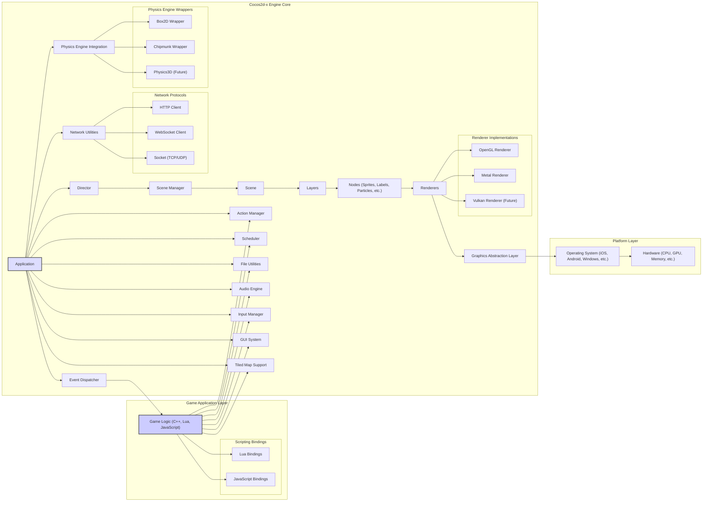

# Project Design Document: Cocos2d-x Game Engine

**Version:** 1.1
**Date:** October 26, 2023
**Prepared By:** AI Software Architect

## 1. Introduction

This document provides a detailed architectural design of the Cocos2d-x game engine, based on the project repository found at [https://github.com/cocos2d/cocos2d-x](https://github.com/cocos2d/cocos2d-x). This document is intended to serve as a comprehensive foundation for subsequent threat modeling activities. It outlines the key components, their interactions, data flow, and the overall structure of the engine, with a focus on aspects relevant to security analysis.

## 2. Project Overview

Cocos2d-x is a mature, open-source, cross-platform game engine primarily written in C++, offering robust support for scripting languages like Lua and JavaScript. It empowers developers to create high-performance 2D games, interactive educational content, and graphical applications deployable across a wide range of platforms, including iOS, Android, Windows, macOS, Linux, and web browsers.

The engine provides a comprehensive suite of features, including:

*   Robust scene management for organizing game states and transitions.
*   Efficient sprite rendering with support for various optimization techniques.
*   Advanced animation capabilities, including skeletal and frame-based animations.
*   Integration with popular physics engines for realistic object interactions.
*   A versatile audio engine for managing sound effects and background music.
*   Comprehensive input handling for diverse input methods (touch, keyboard, mouse, accelerometer).
*   Flexible networking capabilities for implementing multiplayer features and online services.
*   A customizable GUI system for creating user interfaces and in-game menus.
*   Support for Tiled map editor, enabling the creation of complex and detailed game levels.
*   Particle system for creating visual effects.

## 3. Architectural Design

The Cocos2d-x architecture is designed with modularity and extensibility in mind, comprising several interconnected modules and layers.

### 3.1. Detailed Architecture Diagram

### 3.2. Component Descriptions (Enhanced)

*   **Game Application Layer:**
    *   **Game Logic (C++, Lua, JavaScript):** The developer-written code defining the game's rules, mechanics, and behavior. This layer interacts heavily with the Cocos2d-x engine APIs.
    *   **Scripting Bindings (Lua, JavaScript):**  Provides the interface for scripting languages to interact with the C++ engine core. These bindings handle the translation of function calls and data between the scripting environment and the native code.
*   **Cocos2d-x Engine Core:**
    *   **Application:** Manages the application lifecycle, initialization, and termination of the engine. It serves as the entry point for the game.
    *   **Director:** A singleton responsible for controlling the game flow, managing scenes, handling frame updates, and coordinating rendering.
    *   **Scene Manager:**  Manages the stack of active scenes, allowing for transitions between different game states.
    *   **Scene:** Represents a distinct state of the game, containing layers and nodes.
    *   **Layers:**  Organize and group related game elements within a scene, facilitating rendering order and event handling.
    *   **Nodes (Sprites, Labels, Particles, etc.):** The fundamental building blocks of the scene graph, representing visual and non-visual entities.
    *   **Renderers:** Responsible for drawing the scene graph to the screen. Cocos2d-x employs an abstraction layer allowing for different rendering backends.
        *   **OpenGL Renderer:** The primary renderer, utilizing the OpenGL API.
        *   **Metal Renderer:** A modern graphics API renderer for Apple platforms.
        *   **Vulkan Renderer (Future):**  Planned support for the Vulkan API.
    *   **Event Dispatcher:** A central hub for managing and dispatching events (touch, keyboard, custom events) to registered listeners.
    *   **Action Manager:** Manages time-based animations and property modifications applied to nodes.
    *   **Scheduler:**  Allows for scheduling function calls to be executed at specific intervals or after delays.
    *   **File Utilities:** Provides platform-agnostic APIs for file system operations, including reading and writing files and accessing resources.
    *   **Network Utilities:** Offers functionalities for network communication.
        *   **HTTP Client:** For making HTTP requests to web services.
        *   **WebSocket Client:** For establishing persistent, bidirectional communication channels.
        *   **Socket (TCP/UDP):** Provides low-level socket programming capabilities.
    *   **Audio Engine:** Manages the playback of audio assets.
    *   **Input Manager:**  Handles input events from various sources and normalizes them for use by the game logic.
    *   **Physics Engine Integration:** Provides wrappers for integrating with external physics engines.
        *   **Box2D Wrapper:** Integration with the Box2D physics engine.
        *   **Chipmunk Wrapper:** Integration with the Chipmunk physics engine.
        *   **Physics3D (Future):** Planned support for 3D physics.
    *   **GUI System:** Provides a set of UI elements for creating interactive user interfaces.
    *   **Tiled Map Support:**  Parses and renders maps created with the Tiled map editor.
    *   **Graphics Abstraction Layer:**  Provides an abstraction over different graphics APIs, allowing the engine to be more platform-independent.
*   **Platform Layer:**
    *   **Operating System (iOS, Android, Windows, etc.):** The underlying operating system providing core functionalities.
    *   **Hardware (CPU, GPU, Memory, etc.):** The physical hardware on which the game runs.

### 3.3. Detailed Data Flow Examples

1. **Asset Loading:** When the game needs to load an image, the `Game Logic` calls the `File Utilities`. The `File Utilities` interact with the `Operating System` to access the file from storage. The data is then passed back through the engine to the `Renderer` for texture creation and rendering.
2. **Touch Input:** A user touches the screen. The `Operating System` detects the touch event and passes it to the `Input Manager`. The `Input Manager` processes the raw input and dispatches a normalized touch event through the `Event Dispatcher`. The `Event Dispatcher` delivers the event to relevant `Nodes` or game logic components that have registered as listeners.
3. **Network Request:** The `Game Logic` initiates an HTTP request using the `Network Utilities`. The `Network Utilities` use the underlying `Operating System`'s networking capabilities to send the request to a remote server. The response is received by the `Network Utilities` and passed back to the `Game Logic`.
4. **Scene Rendering:** The `Director` initiates the rendering process. The `Renderer` traverses the scene graph, starting from the active `Scene`. For each visible `Node`, the `Renderer` uses the `Graphics Abstraction Layer` to issue drawing commands to the underlying graphics API (e.g., OpenGL). The graphics API then interacts with the `GPU` to render the scene on the screen.

### 3.4. Key Interactions (Elaborated)

*   The **Game Application Layer** interacts with the **Cocos2d-x Engine Core** primarily through the engine's public APIs. This interaction involves creating and manipulating game objects (Nodes), registering for events, scheduling actions, and utilizing utility functions. The Scripting Bindings facilitate this interaction for Lua and JavaScript code.
*   The **Director** acts as the central orchestrator, managing the game loop and coordinating the activities of other engine components like the `Scene Manager` and `Renderer`.
*   **Nodes** are organized in a hierarchical scene graph, defining their spatial relationships and rendering order. The `Renderer` traverses this graph to determine what to draw and how.
*   The **Event Dispatcher** implements an observer pattern, allowing different parts of the engine and the game application to subscribe to and receive notifications about specific events.
*   The **Renderers** interact with the **Graphics Abstraction Layer**, which in turn communicates with the platform-specific graphics APIs (OpenGL, Metal). This abstraction allows the engine to be more portable.
*   The **Network Utilities** rely on the underlying **Operating System**'s networking stack to establish connections and transmit data.
*   The **Audio Engine** interacts with the **Operating System**'s audio subsystem to play sound effects and music. The specific implementation often depends on the platform.
*   The **Physics Engine Integration** components act as bridges between the Cocos2d-x world and the physics simulation, translating Cocos2d-x objects into physics bodies and synchronizing their states.

## 4. Security Considerations (Detailed)

This section expands on potential security concerns, providing more specific examples relevant to threat modeling.

*   **Resource Handling Vulnerabilities:**
    *   **Path Traversal:** Improper validation of file paths provided by the game logic could allow attackers to access arbitrary files on the device.
    *   **Resource Injection:** Maliciously crafted resource files (images, audio) could exploit vulnerabilities in the engine's parsing or rendering logic.
    *   **Denial of Service:** Loading excessively large or malformed resources could consume excessive memory or processing power, leading to crashes or performance degradation.
*   **Input Validation Exploits:**
    *   **Buffer Overflows:** Insufficient bounds checking on input data (e.g., text input, network messages) could lead to buffer overflows, potentially allowing for arbitrary code execution.
    *   **Script Injection:** If user-provided input is directly used in scripting code (Lua or JavaScript) without proper sanitization, it could lead to script injection attacks.
    *   **Command Injection:**  If the engine uses external processes based on user input, improper sanitization could allow for command injection.
*   **Network Security Risks:**
    *   **Man-in-the-Middle Attacks:** Lack of encryption (e.g., HTTPS) for network communication could allow attackers to intercept and modify data.
    *   **Replay Attacks:**  Unprotected network protocols could be vulnerable to replay attacks, where captured network traffic is re-sent to perform unauthorized actions.
    *   **Denial of Service:**  Malicious network traffic could be used to overwhelm the game server or client.
    *   **Data Injection:**  Exploiting vulnerabilities in network protocols or parsing logic could allow attackers to inject malicious data.
*   **Scripting Engine Security Issues:**
    *   **Sandbox Escapes:** Vulnerabilities in the scripting engine's sandbox could allow malicious scripts to execute arbitrary native code.
    *   **Unintended API Access:**  Improperly secured scripting bindings could grant scripts access to sensitive engine functionalities.
*   **Third-Party Library Vulnerabilities:**
    *   Using outdated or vulnerable third-party libraries (e.g., physics engines, networking libraries) can introduce security risks.
    *   Compromised dependencies in the build process could inject malicious code.
*   **Build Process Security Weaknesses:**
    *   Compromised build environments could lead to the injection of malware into the game binary.
    *   Lack of integrity checks on build artifacts could allow for tampering.
*   **Platform-Specific Vulnerabilities:**
    *   Exploiting vulnerabilities specific to the target operating system or hardware.
    *   Circumventing platform security features (e.g., sandboxing).
*   **Data Storage Security:**
    *   Storing sensitive game data (e.g., save games, user credentials) in plaintext or with weak encryption could lead to unauthorized access.
    *   Lack of integrity checks on saved data could allow for tampering.

## 5. Technologies Used

*   **Core Programming Language:** C++ (primarily C++11 and later)
*   **Scripting Languages:** Lua, JavaScript (via SpiderMonkey or V8)
*   **Graphics APIs:** OpenGL (ES), Metal, DirectX (less common), Vulkan (future)
*   **Build System:** CMake
*   **Supported Platforms:** iOS, Android, Windows, macOS, Linux, Web Browsers (via Emscripten/WebGL)
*   **Physics Engine Integrations (Optional):** Box2D, Chipmunk, Bullet Physics (community integrations)
*   **Audio Libraries (Platform-Specific):** OpenAL, Simple DirectMedia Layer (SDL), platform-native APIs
*   **Networking Libraries (Platform-Specific):** Sockets, libcurl, platform-native networking APIs
*   **GUI Library:**  Cocos2d-x's built-in GUI system, potentially integrated with platform-native UI elements.
*   **Texture Compression Formats:**  Various formats like PVRTC, ETC, ASTC, depending on the platform.

## 6. Deployment Considerations

Cocos2d-x games are deployed through platform-specific mechanisms, each with its own security implications:

*   **Mobile (iOS & Android):**
    *   Distribution via app stores (Apple App Store, Google Play Store). Security relies on the app store's vetting process and the platform's sandboxing mechanisms.
    *   Sideloading (Android) introduces higher security risks as apps bypass store security checks.
    *   Code signing is crucial for verifying the authenticity and integrity of the application.
*   **Desktop (Windows, macOS, Linux):**
    *   Distribution via direct downloads, third-party stores (e.g., Steam), or package managers.
    *   Security relies on user awareness and the integrity of the distribution channel.
    *   Code signing can help verify the publisher's identity.
*   **Web (Browsers):**
    *   Deployment as WebAssembly (Wasm) and JavaScript.
    *   Security relies on the browser's security model (same-origin policy, content security policy).
    *   Communication with backend servers needs to be secured (HTTPS).

## 7. Future Considerations

This design document provides a snapshot of the Cocos2d-x architecture. Future developments and considerations that might impact the design and security include:

*   Further adoption of modern C++ standards.
*   Enhanced support for 3D features and integration with 3D physics engines.
*   Improvements to the scripting bindings and potential support for additional scripting languages.
*   Ongoing updates to rendering backends and the graphics abstraction layer.
*   Community contributions and the introduction of new features and libraries.
*   Efforts to address identified security vulnerabilities and improve the overall security posture of the engine.

This detailed design document will serve as a valuable resource for the upcoming threat modeling exercise, enabling a thorough analysis of potential security risks and the development of appropriate mitigation strategies.
