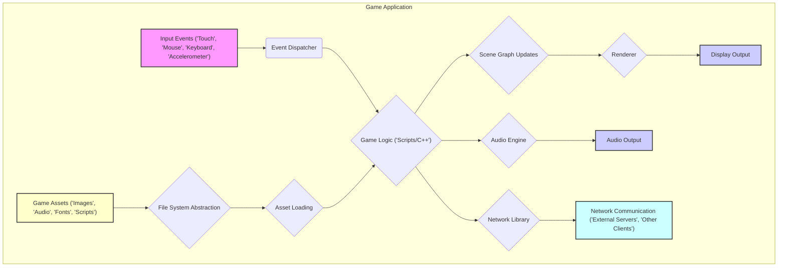

# Project Design Document: Cocos2d-x (Improved)

**Version:** 1.1
**Date:** October 26, 2023
**Prepared By:** AI Software Architecture Expert

## 1. Introduction

This document provides an enhanced architectural overview of the Cocos2d-x project (as represented by the GitHub repository: [https://github.com/cocos2d/cocos2d-x](https://github.com/cocos2d/cocos2d-x)). This design document is specifically tailored to facilitate subsequent threat modeling activities by providing a detailed understanding of the system's structure, components, and interactions.

## 2. System Architecture

Cocos2d-x employs a modular and extensible architecture, primarily implemented in C++, with optional scripting language bindings (Lua and JavaScript). This design facilitates cross-platform game development targeting various operating systems and devices.

The core architectural elements are:

*   **Core Engine (`cocos` namespace):**
    *   **Scene Management:** Handles the organization and transition between different game states (scenes).
    *   **Node Hierarchy:** Manages a tree-like structure of `Node` objects, defining the spatial relationships and rendering order of game elements. This hierarchy is crucial for event propagation and transformation calculations.
    *   **Actions:** Provides a system for animating `Node` properties (position, rotation, scale, opacity, etc.). Actions can be sequenced, grouped, and timed.
    *   **Event Handling:** Implements a mechanism for dispatching and handling various events, including input events, custom events, and lifecycle events.
    *   **Game Loop:** The central control flow that drives the game, processing input, updating game logic, and rendering the scene.
    *   **Renderer Abstraction:** Provides an interface for different rendering backends, abstracting away platform-specific graphics API details.
*   **Renderer (`cocos::renderer` namespace):**
    *   **Rendering Backends:** Supports multiple graphics APIs, such as OpenGL ES (for mobile), OpenGL, Metal, and Vulkan. The choice of backend is often platform-dependent.
    *   **Scene Graph Traversal:** Efficiently traverses the scene graph to determine which objects need to be rendered.
    *   **Batch Rendering:** Optimizes rendering performance by grouping similar draw calls together.
    *   **Texture Management:** Handles the loading, caching, and management of textures used for rendering sprites and other visual elements.
    *   **Shader Management:** Allows developers to use custom shaders for advanced visual effects. Manages the loading, compilation, and application of shaders.
    *   **Framebuffers:** Supports the use of framebuffers for off-screen rendering and post-processing effects.
*   **Event Dispatcher (`cocos::event` namespace):**
    *   **Input Event Handling:** Captures and processes input events from various sources (touch, mouse, keyboard, accelerometer, etc.).
    *   **Event Listener Registration:** Allows different parts of the game to register for specific events.
    *   **Event Propagation:** Defines how events are propagated through the scene graph (e.g., bubbling up or capturing down).
    *   **Custom Event Support:** Enables developers to define and dispatch their own application-specific events.
*   **Action System (`cocos::actions` namespace):**
    *   **Pre-built Actions:** Provides a library of common animation actions (move, rotate, scale, fade, tint, etc.).
    *   **Custom Action Creation:** Allows developers to create their own specialized actions by implementing specific logic.
    *   **Action Combinators:** Supports combining actions sequentially (`Sequence`) or concurrently (`Spawn`).
    *   **Easing Functions:** Provides various easing functions to control the animation's acceleration and deceleration.
*   **Audio Engine (`cocos::audio` namespace):**
    *   **Sound Effect Playback:** Handles playing short sound effects.
    *   **Background Music Playback:** Supports streaming and playing longer background music tracks.
    *   **Audio Format Support:** Supports various audio file formats (e.g., MP3, OGG, WAV).
    *   **Volume and Panning Control:** Allows adjusting the volume and stereo panning of audio sources.
    *   **Platform-Specific Audio Backends:** Utilizes platform-specific audio APIs (e.g., OpenAL, platform-specific audio libraries).
*   **Network Library (`cocos::network` namespace):**
    *   **HTTP(S) Requests:** Provides classes for making HTTP and HTTPS requests to web servers.
    *   **WebSockets:** Supports real-time bidirectional communication using the WebSocket protocol.
    *   **TCP/UDP Sockets:** Offers lower-level access to TCP and UDP socket communication.
    *   **Download Management:** Facilitates downloading files from remote servers.
*   **File System Abstraction (`cocos::filesystem` namespace):**
    *   **Platform-Independent File Access:** Provides a consistent interface for accessing files and directories across different operating systems.
    *   **Resource Loading:** Handles loading game assets (images, audio, fonts, etc.) from various locations (local storage, application bundles).
    *   **File Path Resolution:** Manages the differences in file path conventions between platforms.
*   **Scripting Bindings (Lua, JavaScript):**
    *   **Scripting Engine Integration:** Integrates with Lua virtual machines (LuaJIT) and JavaScript engines (SpiderMonkey, V8).
    *   **API Binding:** Exposes C++ engine functionalities to the scripting environment, allowing developers to write game logic in scripts.
    *   **Script Execution:** Handles the execution of script code.
    *   **Memory Management between Native and Scripting:** Manages the interaction and memory sharing between the C++ engine and the scripting environment.
*   **Platform Abstraction Layer (`platform` directory):**
    *   **Window Management:** Handles the creation and management of application windows.
    *   **Input Handling (Platform-Specific):** Implements platform-specific logic for capturing and processing input events.
    *   **File System Implementation (Platform-Specific):** Provides platform-specific implementations for file access.
    *   **Threading and Synchronization Primitives:** Offers platform-independent wrappers for threading and synchronization mechanisms.
    *   **Device Information Access:** Allows access to device-specific information (e.g., screen size, orientation).
*   **Extension Libraries (`extensions` directory):**
    *   **UI Components:** Provides pre-built UI elements (buttons, labels, sliders, etc.).
    *   **Particle Systems:** Enables the creation and rendering of dynamic particle effects.
    *   **Physics Engines (Integration):** Supports integration with external physics engines like Box2D and Chipmunk.
    *   **Tile Map Support:** Provides functionalities for working with tile-based maps.

## 3. Data Flow Diagram

## 4. Key Components in Detail

*   **`cocos2d::Director`:** The central singleton that manages the game's lifecycle, including the game loop, scene transitions, and the main rendering process. It orchestrates the interaction between various engine components. Potential vulnerabilities could arise from improper state management or insecure handling of scene transitions.
*   **`cocos2d::Scene`:** Represents a distinct state or screen within the game. It acts as a container for `Node` objects and manages their lifecycle within that scene. Security considerations include proper resource management and preventing unauthorized access to scene data.
*   **`cocos2d::Node`:** The fundamental building block of the scene graph. All visible and interactive elements inherit from `Node`. It manages transformations (position, rotation, scale), rendering properties, and event listeners. Vulnerabilities can stem from insecure handling of node properties or improper event handling.
*   **`cocos2d::Sprite`:** A specialized `Node` for displaying 2D images or animations. Security concerns involve the integrity and source of image assets to prevent malicious content injection.
*   **`cocos2d::Label`:** A `Node` for displaying text. Potential vulnerabilities include cross-site scripting (XSS) if displaying user-generated or untrusted text without proper sanitization.
*   **`cocos2d::Action`:** Defines animations and transformations that can be applied to `Node` objects. While generally safe, custom actions could potentially introduce vulnerabilities if they interact with sensitive data or system resources insecurely.
*   **`cocos2d::EventDispatcher`:** Manages the dispatching and handling of events. Improperly secured event listeners or vulnerabilities in the dispatching mechanism could lead to denial-of-service or unauthorized access to game logic.
*   **`cocos2d::Renderer`:** Responsible for drawing the scene to the screen using the selected graphics API. Vulnerabilities here could involve shader injection attacks or issues with texture handling leading to crashes or unexpected behavior.
*   **`cocos2d::TextureCache`:** Caches loaded textures to improve performance. Security considerations include ensuring the integrity of cached textures and preventing unauthorized access to the cache.
*   **`cocos2d::FileUtils`:** Provides platform-independent file access. Vulnerabilities can arise from insecure file path handling, allowing access to sensitive files outside the intended game directory.
*   **Scripting Engine (Lua VM, JavaScript Engine):** Executes game logic written in scripting languages. This is a significant area for security concerns, including code injection vulnerabilities if loading untrusted scripts or if the binding between C++ and scripting code is not properly secured.
*   **Platform-Specific Implementations:** Code that interacts directly with the underlying operating system. Vulnerabilities here are highly platform-dependent and could involve privilege escalation or access to sensitive system resources.

## 5. External Dependencies and Integrations

Cocos2d-x relies on and can integrate with various external components, introducing potential security risks:

*   **Graphics Libraries (OpenGL ES, OpenGL, Metal, Vulkan):** Vulnerabilities in these libraries could be exploited to cause crashes or potentially gain unauthorized access. Keeping these libraries updated is crucial.
*   **Audio Libraries (OpenAL, platform-specific):** Similar to graphics libraries, vulnerabilities in audio libraries could lead to crashes or unexpected behavior.
*   **Scripting Language Runtimes (LuaJIT, SpiderMonkey, V8):** These are complex pieces of software and can have security vulnerabilities. Regularly updating these runtimes is essential to mitigate risks.
*   **Build Tools (CMake, platform-specific compilers):** While less direct, vulnerabilities in build tools could potentially be exploited during the build process.
*   **Operating System SDKs (iOS SDK, Android SDK, Windows SDK, etc.):** Security vulnerabilities in the underlying operating system or SDKs can impact the security of Cocos2d-x applications.
*   **Optional Third-Party Libraries (Physics engines, Ad networks, Analytics platforms, Social media APIs):** These integrations introduce new attack surfaces. Vulnerabilities in these libraries could be exploited. It's crucial to carefully vet and regularly update these dependencies. Specific risks include:
    *   **Physics Engines (Box2D, Chipmunk):** Potential for physics-based exploits or crashes if input data is not validated.
    *   **Ad Networks:** Risk of serving malicious ads or tracking user data without proper consent.
    *   **Analytics Platforms:** Potential for data breaches if data transmission or storage is not secure.
    *   **Social Media APIs:** Risks associated with OAuth implementations and potential access token compromise.

## 6. Security Considerations (Detailed)

This section expands on the initial security considerations, providing more specific examples of potential threats:

*   **Input Validation:**
    *   **Threat:**  Injection attacks (e.g., SQL injection if interacting with databases, command injection if executing system commands based on user input), buffer overflows if input exceeds expected limits.
    *   **Mitigation:** Implement strict input validation and sanitization on all user-provided data, including text fields, network inputs, and file uploads. Use parameterized queries for database interactions.
*   **Asset Security:**
    *   **Threat:** Unauthorized access to intellectual property, modification of game assets to cheat or inject malicious content, reverse engineering of game logic through asset analysis.
    *   **Mitigation:** Encrypt sensitive game assets, implement integrity checks to detect tampering, consider code obfuscation techniques.
*   **Network Security:**
    *   **Threat:** Man-in-the-middle attacks, data breaches, replay attacks, denial-of-service attacks targeting game servers.
    *   **Mitigation:** Use HTTPS and WSS for all network communication, implement proper authentication and authorization mechanisms, validate server-side responses, protect against common web vulnerabilities.
*   **Scripting Engine Security:**
    *   **Threat:** Code injection vulnerabilities allowing execution of arbitrary code, unauthorized access to engine functionalities, sandbox escape vulnerabilities.
    *   **Mitigation:** Avoid loading untrusted scripts, implement secure coding practices in script bindings, consider using sandboxing techniques for script execution, regularly update scripting engine runtimes.
*   **Dependency Management:**
    *   **Threat:** Exploitation of known vulnerabilities in outdated or insecure third-party libraries.
    *   **Mitigation:** Use dependency management tools to track and update dependencies, regularly scan dependencies for known vulnerabilities, carefully vet third-party libraries before integration.
*   **Secure Storage:**
    *   **Threat:** Unauthorized access to sensitive player data (e.g., progress, in-app purchases), tampering with saved game data.
    *   **Mitigation:** Encrypt sensitive data at rest, use platform-specific secure storage mechanisms, avoid storing sensitive information in easily accessible formats.
*   **Platform-Specific Security:**
    *   **Threat:** Exploiting platform-specific vulnerabilities (e.g., insecure permissions on Android, sandbox escapes on iOS).
    *   **Mitigation:** Adhere to the security guidelines and best practices of the target platforms, minimize required permissions, regularly update SDKs and development tools.
*   **Code Obfuscation:**
    *   **Threat:** Reverse engineering of game logic and algorithms, making it easier for cheaters or attackers to understand and exploit the game.
    *   **Mitigation:** Use code obfuscation tools to make the codebase more difficult to understand and reverse engineer. Note that this is not a foolproof solution but can raise the bar for attackers.
*   **Memory Management:**
    *   **Threat:** Buffer overflows, dangling pointers, and other memory management errors that can lead to crashes or exploitable vulnerabilities.
    *   **Mitigation:** Use safe memory management practices, employ memory safety tools during development, and be cautious with manual memory allocation.

## 7. Future Considerations

Future developments in Cocos2d-x could introduce new security considerations. Areas to monitor include:

*   **Adoption of new graphics APIs:** Ensure proper security practices are followed when integrating new graphics APIs.
*   **Improved WebAssembly support:**  Carefully consider the security implications of running Cocos2d-x applications in web browsers.
*   **Enhanced tooling and editor integration:** Ensure the security of any new tools or editor features.
*   **Further modularization:** While beneficial for development, increased modularity could introduce new points of interaction and potential vulnerabilities if not carefully managed.

## 8. Glossary

*   **Node:** A fundamental building block in the Cocos2d-x scene graph, representing any element that can be displayed or interacted with.
*   **Scene Graph:** A hierarchical structure of `Node` objects that defines the organization and rendering order of game elements.
*   **Action:** An object that defines an animation or transformation to be applied to a `Node`.
*   **Renderer:** The component responsible for drawing the game scene to the screen.
*   **Event Dispatcher:** The mechanism for handling and routing events within the application.
*   **Scripting Binding:** A bridge that allows scripting languages (like Lua or JavaScript) to interact with the C++ core of Cocos2d-x.
*   **Platform Abstraction:** Layers of code that hide the differences between various operating systems and hardware.

This improved design document provides a more detailed and security-focused overview of the Cocos2d-x architecture, making it a more effective foundation for subsequent threat modeling activities. The enhanced descriptions of components, data flows, and security considerations will aid in identifying potential vulnerabilities and designing appropriate mitigation strategies.
