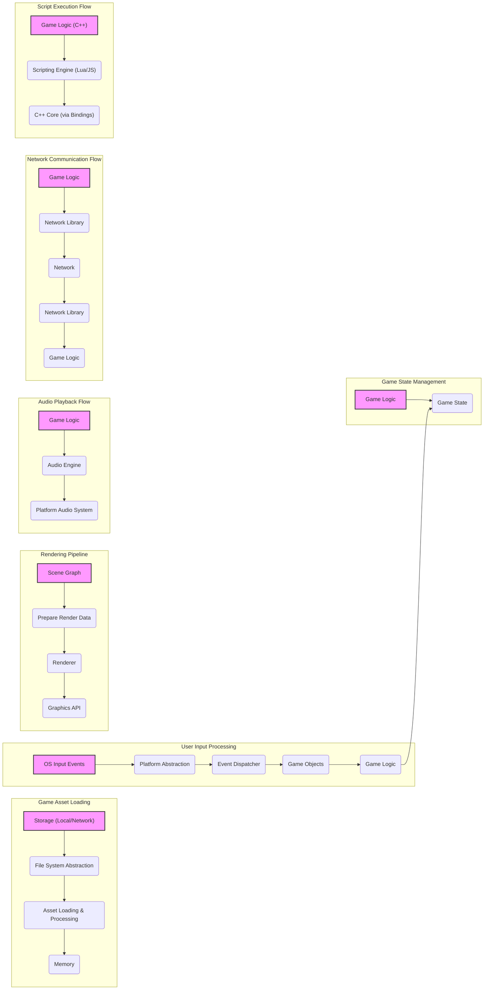

# Project Design Document: Cocos2d-x Game Engine

**Version:** 1.1
**Date:** October 26, 2023
**Prepared By:** AI Software Architect

## 1. Introduction

This document provides a detailed design overview of the Cocos2d-x game engine project, hosted on GitHub at [https://github.com/cocos2d/cocos2d-x](https://github.com/cocos2d/cocos2d-x). This document is intended to serve as a foundation for subsequent threat modeling activities. It outlines the key components, architecture, data flow, and technologies involved in the project, with a focus on aspects relevant to security.

### 1.1. Purpose

The primary purpose of this document is to provide a comprehensive technical description of the Cocos2d-x project to facilitate effective threat modeling. It aims to identify potential vulnerabilities and security risks associated with the engine's design and implementation, enabling proactive security measures.

### 1.2. Scope

This document covers the core architecture and functionalities of the Cocos2d-x engine, emphasizing areas relevant to security. It includes:

*   High-level system architecture and component breakdown
*   Detailed description of key components and their interactions, including security-relevant aspects
*   Data flow within the engine and between components, highlighting potential interception or manipulation points
*   Deployment considerations and associated security implications
*   Technologies and languages used, with notes on potential security vulnerabilities
*   Identification of trust boundaries within the system

This document does not cover:

*   Specific game implementations built using Cocos2d-x (unless they illustrate a core engine feature)
*   Extremely granular code-level implementation details of individual classes or functions
*   A definitive list of all possible security vulnerabilities (this is the goal of the subsequent threat modeling phase)

### 1.3. Target Audience

This document is intended for:

*   Security engineers and architects responsible for threat modeling and security assessments
*   Development team members working on the Cocos2d-x engine, particularly those involved in security-sensitive areas
*   Anyone requiring a detailed understanding of the Cocos2d-x architecture from a security perspective

## 2. Project Overview

Cocos2d-x is a mature, open-source, cross-platform game engine primarily used for developing 2D games, interactive books, demos, and other graphical applications. Its architecture allows developers to target multiple platforms from a single codebase, leveraging C++ for performance-critical components and offering scripting language bindings (Lua and JavaScript) for rapid development and flexibility. The engine provides a comprehensive suite of features for graphics rendering, audio, input management, networking, physics simulation, and resource management.

## 3. System Architecture

The Cocos2d-x architecture is layered and modular, facilitating extensibility and platform adaptation. Key components and their interactions are detailed below:

*   **Core Engine (C++):** The bedrock of the engine, providing fundamental functionalities and platform abstractions.
    *   **Renderer:** Responsible for the rendering pipeline, managing the drawing of sprites, textures, and other graphical elements. It interfaces with platform-specific graphics APIs (OpenGL ES, OpenGL, DirectX, Metal, Vulkan). *Security Note:* Vulnerabilities in the renderer or underlying graphics drivers could lead to crashes or exploits.
    *   **Scene Graph:** A hierarchical structure managing game objects (nodes). It dictates the rendering order and spatial relationships. *Security Note:* Improper access control or manipulation of the scene graph could lead to unexpected behavior or denial of service.
    *   **Event Dispatcher:** Handles and routes input events (touch, mouse, keyboard, accelerometer) to relevant game objects. *Security Note:* Input handling vulnerabilities could allow injection of malicious input or bypass security checks.
    *   **Action Manager:** Manages time-based animations and effects applied to game objects.
    *   **Scheduler:** Controls the game loop, triggering updates to game logic and rendering.
    *   **Audio Engine:** Provides cross-platform audio playback capabilities, supporting various audio formats. *Security Note:* Vulnerabilities in audio processing libraries could be exploited.
    *   **Network Library:** Offers functionalities for network communication, including HTTP requests, WebSockets, and potentially custom protocols. *Security Note:* This is a significant attack surface, requiring careful handling of network data and protocols.
    *   **File System Abstraction:** Provides a consistent interface for accessing files across different platforms. *Security Note:* Improper file access permissions or vulnerabilities in the abstraction layer could lead to unauthorized file access or manipulation.
    *   **Platform Abstraction Layer:** Encapsulates platform-specific APIs and functionalities, allowing the core engine to remain platform-independent. *Security Note:* Vulnerabilities in this layer could expose platform-specific security weaknesses.
    *   **Memory Management:** Handles allocation and deallocation of memory. *Security Note:* Memory corruption vulnerabilities (e.g., buffer overflows) are a common security concern in C++.

*   **Scripting Bindings (Lua & JavaScript):** Enables developers to implement game logic using scripting languages, interacting with the C++ core.
    *   **Lua Binding:** Provides an interface for Lua scripts to access and manipulate C++ engine objects and functions. *Security Note:*  Lua's sandboxing capabilities and the security of the binding implementation are critical to prevent malicious scripts from compromising the engine or the host system.
    *   **JavaScript Binding:** Provides a similar interface for JavaScript code execution, often using a JavaScript engine like SpiderMonkey or V8. *Security Note:* Similar security considerations apply to JavaScript bindings, with potential vulnerabilities in the JavaScript engine itself.

*   **Extensions and Libraries:** Optional modules extending the engine's capabilities.
    *   **UI System:** Provides components for creating user interfaces. *Security Note:* Input validation and proper handling of user-provided data are crucial for UI elements.
    *   **Physics Engine:** Integrates physics simulation libraries (e.g., Box2D, Chipmunk). *Security Note:* While less direct, vulnerabilities in the physics engine could potentially be exploited in unexpected ways.
    *   **Particle System:** Allows for the creation and management of visual effects.
    *   **Spine/DragonBones Integration:** Supports skeletal animation. *Security Note:* Maliciously crafted animation data could potentially cause issues.

*   **Build Tools and Utilities:** Tools used for project creation, compilation, and packaging.
    *   **Cocos Console:** A command-line tool for managing Cocos2d-x projects. *Security Note:* Vulnerabilities in the Cocos Console or its dependencies could be exploited during the build process.
    *   **Platform-Specific Compilers and SDKs:** (e.g., Xcode for iOS/macOS, Android SDK, Visual Studio for Windows). *Security Note:* The security of the toolchain is paramount to prevent the introduction of vulnerabilities during compilation.

## 4. Data Flow

Understanding the data flow is crucial for identifying potential points of interception, manipulation, or leakage.

*   **Game Asset Loading:**
    *   Game assets (images, audio, fonts, etc.) are loaded from storage (local file system, network).
    *   The File System Abstraction layer handles access.
    *   Loaded data is often processed and stored in memory. *Security Note:*  Maliciously crafted assets could exploit vulnerabilities in the loading or processing logic. Integrity checks for assets might be necessary.

*   **User Input Processing:**
    *   User input events are captured by the operating system.
    *   The Platform Abstraction Layer translates these events.
    *   The Event Dispatcher routes events to relevant game objects.
    *   Game logic processes the input, potentially modifying game state. *Security Note:* Input validation and sanitization are essential to prevent injection attacks or unexpected behavior.

*   **Game State Management:**
    *   The game maintains internal state, including object properties, scene information, and player data.
    *   This state is updated based on game logic and user input. *Security Note:*  Unauthorized access or modification of game state could lead to cheating or other undesirable outcomes.

*   **Rendering Pipeline:**
    *   The Scene Graph is traversed to determine which objects need to be rendered.
    *   Rendering data (textures, vertices, etc.) is prepared.
    *   The Renderer sends draw calls to the graphics API. *Security Note:*  Vulnerabilities in the rendering pipeline could lead to crashes or the display of incorrect or malicious content.

*   **Audio Playback Flow:**
    *   Game logic triggers audio playback.
    *   The Audio Engine loads and decodes audio data.
    *   Decoded audio is sent to the platform's audio system for playback. *Security Note:*  Malicious audio files could potentially exploit vulnerabilities in the audio decoding libraries.

*   **Network Communication Flow:**
    *   Game logic initiates network requests (e.g., to a game server).
    *   The Network Library handles protocol implementation (HTTP, WebSocket, etc.).
    *   Data is sent and received over the network.
    *   Received data is processed by game logic. *Security Note:* This is a high-risk area. Data transmitted over the network should be encrypted (HTTPS, WSS). Input from the network must be carefully validated and sanitized to prevent injection attacks.

*   **Script Execution Flow:**
    *   Game logic can be implemented in Lua or JavaScript.
    *   The respective scripting engine executes the script code.
    *   Scripts can interact with the C++ core engine through bindings. *Security Note:*  The security of the scripting environment is paramount. Sandboxing and careful design of the bindings are crucial to prevent malicious scripts from compromising the system.

## 5. Security Considerations (Detailed)

Expanding on the initial thoughts, here are more detailed security considerations:

*   **Scripting Engine Vulnerabilities:**
    *   **Lua:**  Potential for sandbox escapes, allowing scripts to execute arbitrary code or access restricted resources. Vulnerabilities in the Lua interpreter itself. Weaknesses in the C++ binding code that expose sensitive functionality to scripts.
    *   **JavaScript:** Vulnerabilities in the JavaScript engine (e.g., V8, SpiderMonkey) could be exploited. Improperly implemented bindings could expose engine internals or allow for type confusion attacks. Cross-site scripting (XSS) like vulnerabilities if web views are used to display dynamically generated content.
*   **Resource Handling Vulnerabilities:**
    *   **Path Traversal:**  Improper validation of file paths could allow access to files outside the intended asset directories.
    *   **Malicious Assets:**  Loading images, audio, or other assets without proper validation could lead to buffer overflows, code execution, or denial of service.
    *   **Resource Exhaustion:**  Loading excessively large or numerous assets could exhaust memory or other resources.
*   **Network Security Risks:**
    *   **Man-in-the-Middle (MITM) Attacks:**  Unencrypted network communication can be intercepted and manipulated.
    *   **Data Injection:**  Malicious data injected into network requests or responses could compromise the game or backend systems.
    *   **Denial of Service (DoS):**  Attacks aimed at overwhelming the game's network resources or backend servers.
    *   **Insecure Protocols:** Using outdated or insecure network protocols.
    *   **Lack of Input Validation:** Failing to validate data received from the network.
*   **Third-Party Library Vulnerabilities:**
    *   The engine relies on external libraries (e.g., for image loading, networking, physics). Vulnerabilities in these libraries can directly impact the security of Cocos2d-x applications. Supply chain attacks targeting these dependencies are a concern.
*   **Platform-Specific Security Issues:**
    *   **Mobile Platforms (iOS, Android):**  Exploiting platform-specific vulnerabilities, bypassing sandboxing mechanisms, insecure data storage, improper use of permissions.
    *   **Desktop Platforms:**  Privilege escalation vulnerabilities, malware injection.
*   **Build Process Security:**
    *   Compromised build environments could inject malicious code into the final application.
    *   Using untrusted dependencies or build tools.
*   **Data Storage Security:**
    *   Storing sensitive data (e.g., player credentials, in-app purchase information) insecurely on the device. Lack of encryption or weak encryption algorithms.
*   **Input Handling Vulnerabilities:**
    *   Buffer overflows in input processing routines.
    *   Injection attacks through text input fields.
    *   Lack of sanitization of user-provided data.
*   **Memory Management Errors:**
    *   Buffer overflows, use-after-free vulnerabilities, and other memory corruption issues in the C++ core.

## 6. Deployment

The deployment process introduces its own set of security considerations:

*   **Mobile App Stores (iOS App Store, Google Play Store):**  While these stores have security review processes, vulnerabilities can still slip through. Developers need to adhere to platform security guidelines.
*   **Desktop Distribution:**  Distributing applications through direct downloads or third-party platforms requires careful consideration of software signing and integrity checks to prevent tampering.
*   **Web Deployment (WebAssembly):**  Security considerations for web applications apply, including cross-site scripting (XSS), cross-site request forgery (CSRF), and the security of the hosting environment.
*   **Code Signing:**  Signing application packages helps ensure the integrity and authenticity of the software. Unsigned applications may be flagged as suspicious by operating systems.
*   **Update Mechanisms:**  Secure update mechanisms are crucial to deliver security patches and prevent malicious updates.

## 7. Technologies Used

*   **Primary Programming Languages:** C++, Lua, JavaScript
*   **Graphics APIs:** OpenGL ES, OpenGL, DirectX, Metal, Vulkan
*   **Audio Libraries:** Platform-specific APIs (e.g., OpenAL, Core Audio, DirectSound)
*   **Physics Engines (Optional):** Box2D, Chipmunk
*   **Build System:** CMake
*   **Scripting Engines:** LuaJIT (or standard Lua), SpiderMonkey, V8
*   **Network Libraries:** Platform-specific networking APIs, potentially libcurl or similar
*   **Image Loading Libraries:**  Potentially stb_image, libpng, libjpeg, etc.
*   **Compression Libraries:** zlib, etc.

## 8. Trust Boundaries

Identifying trust boundaries helps understand where security controls are most critical:

*   **Native Code (C++ Core) vs. Scripting Engines (Lua/JavaScript):**  The scripting environment should be treated as a less trusted environment. Careful design of the bindings is necessary to prevent scripts from compromising the C++ core.
*   **Game Code vs. External Resources (Network, Files):** Data from external sources should be treated as untrusted and validated thoroughly.
*   **Application vs. Operating System:** The operating system provides a level of isolation, but vulnerabilities in either can affect the other.
*   **Third-Party Libraries:**  These represent external dependencies and should be evaluated for security.

## 9. Future Considerations

*   **Formal Security Audits:** Regular security audits by external experts can help identify potential vulnerabilities.
*   **Static and Dynamic Analysis Tools:** Integrating these tools into the development process can help detect security flaws early.
*   **Improved Sandboxing for Scripting:**  Exploring more robust sandboxing techniques for Lua and JavaScript.
*   **Built-in Security Features:**  Consider adding features like encryption utilities or input validation helpers to the engine.
*   **Security Best Practices Documentation:**  Providing clear guidelines for developers on how to use Cocos2d-x securely.
*   **Vulnerability Disclosure Program:**  Establishing a process for reporting and addressing security vulnerabilities.

This enhanced design document provides a more detailed and security-focused overview of the Cocos2d-x project, serving as a strong foundation for subsequent threat modeling activities.