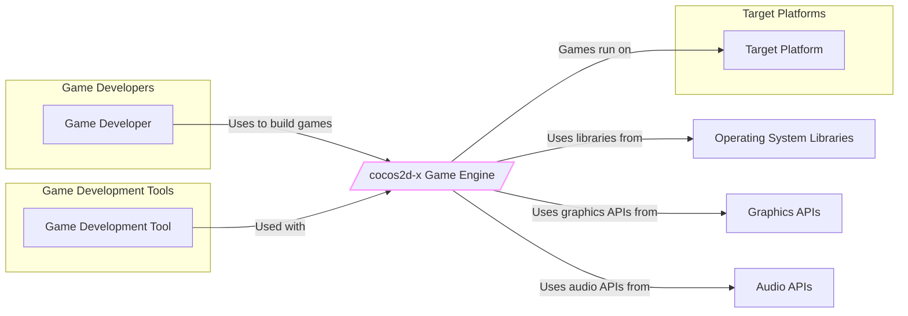
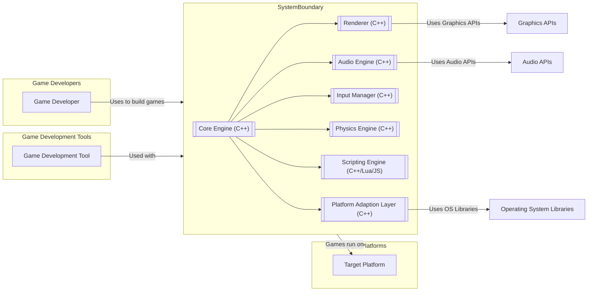
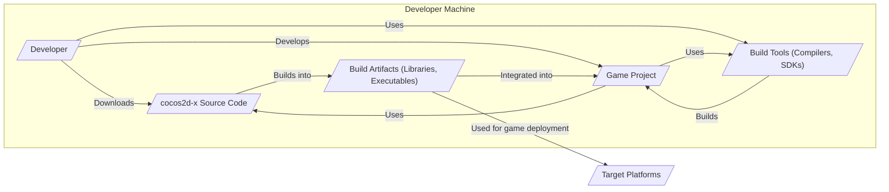
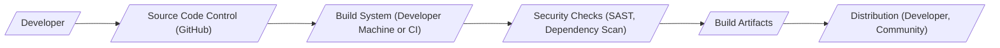

# BUSINESS POSTURE

- Business Priorities and Goals
  - Provide a robust, cross-platform game engine for developers to create 2D and 3D games.
  - Foster a large and active community of developers around the engine.
  - Enable developers to easily deploy games to multiple platforms, reducing development time and cost.
  - Maintain the engine as open-source and freely available to developers.

- Business Risks
  - Security vulnerabilities in the engine could be exploited in games built with cocos2d-x, leading to potential game exploits, cheating, or denial of service.
  - Lack of timely security updates and patches could erode developer trust and community confidence.
  - Supply chain attacks targeting the engine's dependencies or build process could compromise the engine itself and games built with it.
  - Reputational damage if the engine is perceived as insecure or unreliable.

# SECURITY POSTURE

- Existing Security Controls
  - security control: Code reviews are likely conducted by maintainers and community contributors as part of the pull request process. (Location: GitHub Pull Request process)
  - security control: Issue tracking system is used to report and manage bugs, including potential security vulnerabilities. (Location: GitHub Issues)
  - security control: Open-source nature allows for community scrutiny and contribution to identify and fix security issues. (Location: Open Source Community)
  - accepted risk: Reliance on community contributions for security vulnerability identification and patching may lead to delays in addressing critical issues.
  - accepted risk: Potential for vulnerabilities to be introduced by community contributors who may not have sufficient security expertise.

- Recommended Security Controls
  - recommended security control: Implement automated Static Application Security Testing (SAST) tools in the CI/CD pipeline to identify potential code-level vulnerabilities.
  - recommended security control: Integrate Dependency Scanning tools to identify and manage vulnerabilities in third-party libraries used by the engine.
  - recommended security control: Establish a clear and public vulnerability disclosure policy and process to encourage responsible reporting of security issues.
  - recommended security control: Conduct regular security audits and penetration testing of the engine by security experts.
  - recommended security control: Provide security guidelines and best practices documentation for developers using cocos2d-x to build games securely.

- Security Requirements
  - Authentication: Not directly applicable to the game engine itself. Authentication is typically implemented within games built using cocos2d-x, and the engine should provide functionalities to support secure authentication mechanisms if needed by game developers.
  - Authorization: Similar to authentication, authorization is primarily a concern for games built with cocos2d-x. The engine should offer features that allow developers to implement robust authorization logic within their games.
  - Input Validation: The engine must handle various types of input (user input, network data, file data) securely. Input validation should be implemented at multiple levels within the engine to prevent common vulnerabilities like buffer overflows, injection attacks, and cross-site scripting (if applicable to web-based games).
  - Cryptography: The engine should provide well-vetted and easy-to-use cryptographic libraries and functions for game developers to implement secure features such as data encryption, secure communication, and integrity checks. This includes support for common cryptographic algorithms and protocols.

# DESIGN

- C4 CONTEXT

- C4 CONTEXT Elements

  - Element:
    - Name: Game Developer
    - Type: User
    - Description: Developers who use cocos2d-x to create games.
    - Responsibilities: Develop games using the engine, integrate assets, implement game logic, and deploy games to target platforms.
    - Security controls: Responsible for secure coding practices within their game development, including secure handling of user data and game assets.

  - Element:
    - Name: cocos2d-x Game Engine
    - Type: System
    - Description: Open-source, cross-platform game engine.
    - Responsibilities: Provides core functionalities for game development, including rendering, input handling, audio, physics, and scripting.
    - Security controls: Implements security controls within the engine code to prevent vulnerabilities, and provides secure functionalities for game developers to use.

  - Element:
    - Name: Target Platform
    - Type: External System
    - Description: Operating systems and hardware platforms where games built with cocos2d-x are deployed and run (e.g., iOS, Android, Windows, macOS, Web Browsers).
    - Responsibilities: Provides the runtime environment for games, including operating system functionalities, hardware resources, and security features of the platform.
    - Security controls: Platform-level security controls such as operating system security features, sandboxing, and app store security reviews.

  - Element:
    - Name: Game Development Tool
    - Type: External System
    - Description: Software tools used in conjunction with cocos2d-x for game development, such as IDEs, code editors, asset creation tools, and debugging tools.
    - Responsibilities: Provides tools to facilitate game development workflow, asset management, and debugging.
    - Security controls: Security of development tools themselves, and secure integration with the game engine development environment.

  - Element:
    - Name: Operating System Libraries
    - Type: External System
    - Description: Standard libraries provided by the operating system that cocos2d-x relies on.
    - Responsibilities: Provide fundamental system functionalities.
    - Security controls: Security controls implemented by the operating system.

  - Element:
    - Name: Graphics APIs
    - Type: External System
    - Description: Graphics Application Programming Interfaces (APIs) like OpenGL, DirectX, Vulkan used by cocos2d-x for rendering.
    - Responsibilities: Handle graphics rendering operations.
    - Security controls: Security controls implemented by the graphics API and drivers.

  - Element:
    - Name: Audio APIs
    - Type: External System
    - Description: Audio Application Programming Interfaces (APIs) used by cocos2d-x for audio playback and processing.
    - Responsibilities: Handle audio operations.
    - Security controls: Security controls implemented by the audio API and drivers.

- C4 CONTAINER

- C4 CONTAINER Elements

  - Element:
    - Name: Core Engine (C++)
    - Type: Container
    - Description: The central component of cocos2d-x, providing core functionalities and managing other engine modules. Implemented in C++.
    - Responsibilities: Manages game loop, scene management, resource management, event handling, and coordination between different engine modules.
    - Security controls: Input validation within core functionalities, secure resource handling, and memory management to prevent vulnerabilities like buffer overflows.

  - Element:
    - Name: Renderer (C++)
    - Type: Container
    - Description: Responsible for rendering graphics in 2D and 3D. Implemented in C++ and utilizes graphics APIs.
    - Responsibilities: Handles scene graph traversal, rendering algorithms, shader management, and interaction with graphics APIs (OpenGL, DirectX, Vulkan).
    - Security controls: Secure shader compilation and execution, protection against shader injection attacks, and proper handling of graphics resources to prevent memory leaks or corruption.

  - Element:
    - Name: Audio Engine (C++)
    - Type: Container
    - Description: Manages audio playback, mixing, and effects. Implemented in C++ and utilizes platform-specific audio APIs.
    - Responsibilities: Loads and plays audio assets, manages audio channels, applies audio effects, and interacts with audio APIs.
    - Security controls: Secure audio file parsing to prevent vulnerabilities from malicious audio files, and proper handling of audio resources.

  - Element:
    - Name: Input Manager (C++)
    - Type: Container
    - Description: Handles user input from various sources (keyboard, mouse, touch, gamepad). Implemented in C++.
    - Responsibilities: Captures and processes input events, dispatches input events to game logic, and provides input abstraction.
    - Security controls: Input validation to prevent injection attacks through input fields (if used in UI elements), and secure handling of input events.

  - Element:
    - Name: Physics Engine (C++)
    - Type: Container
    - Description: Provides physics simulation capabilities (collision detection, rigid body dynamics). Implemented in C++ and may integrate with external physics libraries.
    - Responsibilities: Simulates physics interactions between game objects, handles collision detection and response, and provides physics-based movement.
    - Security controls: Secure integration with external physics libraries, and prevention of physics-related exploits (e.g., physics engine manipulation for cheating).

  - Element:
    - Name: Scripting Engine (C++/Lua/JS)
    - Type: Container
    - Description: Enables scripting game logic using languages like Lua or JavaScript. Implemented in C++ with bindings to scripting languages.
    - Responsibilities: Executes game scripts, provides scripting APIs to access engine functionalities, and allows for rapid game development and prototyping.
    - Security controls: Secure execution of scripts, sandboxing of script environments to prevent access to sensitive engine internals or system resources, and protection against script injection attacks.

  - Element:
    - Name: Platform Adaption Layer (C++)
    - Type: Container
    - Description: Provides an abstraction layer to handle platform-specific differences and APIs. Implemented in C++.
    - Responsibilities: Adapts engine functionalities to different operating systems and hardware platforms, handles platform-specific input, file system access, and system calls.
    - Security controls: Secure handling of platform-specific APIs, protection against platform-specific vulnerabilities, and secure file system access control.

- DEPLOYMENT

- Deployment Options
  - Developers download the cocos2d-x engine source code or pre-built binaries.
  - Developers use the engine locally on their development machines to create games.
  - Games are built and packaged for target platforms (iOS, Android, Windows, macOS, Web Browsers).
  - Games are deployed to app stores (Apple App Store, Google Play Store), distribution platforms (Steam, Itch.io), or web servers for browser-based games.

- Detailed Deployment (Developer Environment and Build Process)

- DEPLOYMENT Elements

  - Element:
    - Name: Developer
    - Type: Person
    - Description: Software developer using cocos2d-x.
    - Responsibilities: Develops game code, integrates assets, builds and tests the game.
    - Security controls: Secure coding practices, secure development environment, and responsible handling of credentials and sensitive data.

  - Element:
    - Name: cocos2d-x Source Code
    - Type: Software
    - Description: The source code of the cocos2d-x game engine.
    - Responsibilities: Provides the codebase for the engine, which is compiled and used to build games.
    - Security controls: Code reviews, vulnerability scanning, access control to the source code repository (GitHub).

  - Element:
    - Name: Build Tools (Compilers, SDKs)
    - Type: Software
    - Description: Software development tools required to compile and build cocos2d-x and games (e.g., C++ compilers, platform SDKs).
    - Responsibilities: Compile source code, link libraries, and package applications for target platforms.
    - Security controls: Ensuring the integrity and security of build tools themselves, and using trusted sources for tool downloads.

  - Element:
    - Name: Game Project
    - Type: Software
    - Description: The game being developed by the developer, which uses the cocos2d-x engine.
    - Responsibilities: Contains game-specific code, assets, and configurations.
    - Security controls: Secure coding practices within the game project, input validation, authorization, and secure data handling within the game.

  - Element:
    - Name: Build Artifacts (Libraries, Executables)
    - Type: Software
    - Description: Compiled libraries and executable files produced by the build process, which are part of the final game application.
    - Responsibilities: Provide the runtime components of the game, including the engine libraries and game code.
    - Security controls: Ensuring the integrity of build artifacts, code signing, and protection against tampering.

  - Element:
    - Name: Target Platforms
    - Type: Infrastructure
    - Description: Platforms where the game is deployed and run (e.g., iOS devices, Android devices, Windows PCs, web browsers).
    - Responsibilities: Provide the runtime environment for the game.
    - Security controls: Platform-level security controls, app store security reviews, and user device security.

- BUILD

- BUILD Elements

  - Element:
    - Name: Developer
    - Type: Person
    - Description: Developer contributing code to cocos2d-x.
    - Responsibilities: Writes code, submits pull requests, and may perform local builds.
    - Security controls: Secure development environment, code review participation, and adherence to secure coding practices.

  - Element:
    - Name: Source Code Control (GitHub)
    - Type: Software Service
    - Description: GitHub repository hosting the cocos2d-x source code.
    - Responsibilities: Version control, code collaboration, pull request management, and access control to the codebase.
    - Security controls: Access control (authentication and authorization), audit logging, and GitHub's security features.

  - Element:
    - Name: Build System (Developer Machine or CI)
    - Type: Software
    - Description: System used to compile and build cocos2d-x (can be developer's local machine or a Continuous Integration system).
    - Responsibilities: Automates the build process, compiles source code, runs tests, and generates build artifacts.
    - Security controls: Secure build environment, access control to build system, and integrity checks of build tools and dependencies.

  - Element:
    - Name: Security Checks (SAST, Dependency Scan)
    - Type: Software
    - Description: Automated security scanning tools integrated into the build process (e.g., Static Application Security Testing, Dependency Scanning).
    - Responsibilities: Identify potential security vulnerabilities in the code and dependencies during the build process.
    - Security controls: Configuration and maintenance of security scanning tools, and remediation of identified vulnerabilities.

  - Element:
    - Name: Build Artifacts
    - Type: Software
    - Description: Compiled libraries, headers, and other files that constitute the cocos2d-x engine distribution.
    - Responsibilities: Provide the distributable components of the engine for developers to use.
    - Security controls: Integrity checks of build artifacts, secure storage and distribution of artifacts, and potentially code signing.

  - Element:
    - Name: Distribution (Developer, Community)
    - Type: Process
    - Description: Process of making build artifacts available to developers and the community.
    - Responsibilities: Distribute engine binaries, source code, and documentation.
    - Security controls: Secure distribution channels (e.g., official website, GitHub releases), integrity checks of distributed artifacts (e.g., checksums), and protection against supply chain attacks.

# RISK ASSESSMENT

- Critical Business Processes
  - Providing a secure and reliable game engine to developers.
  - Maintaining the reputation and trust of the cocos2d-x project within the game development community.
  - Ensuring the continued adoption and use of cocos2d-x for game development.

- Data to Protect and Sensitivity
  - Source code of the cocos2d-x engine: High sensitivity (Intellectual Property, Confidentiality, Integrity, Availability). Compromise could lead to unauthorized modifications, theft of IP, and introduction of vulnerabilities.
  - Build artifacts (compiled engine libraries): Medium sensitivity (Integrity, Availability). Compromise could lead to distribution of malicious or vulnerable engine versions.
  - Project infrastructure (GitHub repository, build systems): Medium sensitivity (Availability, Integrity, Confidentiality). Compromise could disrupt development, introduce malicious code, or expose project information.
  - Community and developer data (GitHub accounts, forum data): Low to Medium sensitivity (Confidentiality, Integrity, Availability). Depending on the data collected and stored by the project's online presence.

# QUESTIONS & ASSUMPTIONS

- Questions
  - What is the process for handling security vulnerability reports for cocos2d-x? Is there a dedicated security team or point of contact?
  - Are there any existing security testing practices in place, such as penetration testing or security audits?
  - What is the expected level of security expertise among developers using cocos2d-x? Should security documentation and tools be geared towards beginners or experienced developers?
  - Are there specific types of games or industries that cocos2d-x is primarily targeting? This could influence the threat model (e.g., games handling sensitive user data).

- Assumptions
  - The primary security concern is vulnerabilities within the cocos2d-x engine code that could be exploited in games built with it.
  - The cocos2d-x project operates with limited resources for dedicated security efforts, relying heavily on community contributions and open-source security best practices.
  - Games built with cocos2d-x are diverse in genre and complexity, and security requirements will vary depending on the specific game.
  - The target audience for this design document includes security-conscious developers, project maintainers, and potentially security researchers interested in contributing to the project's security.