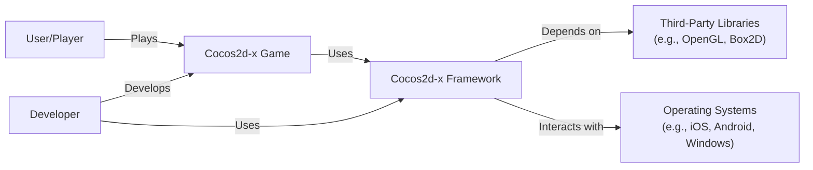
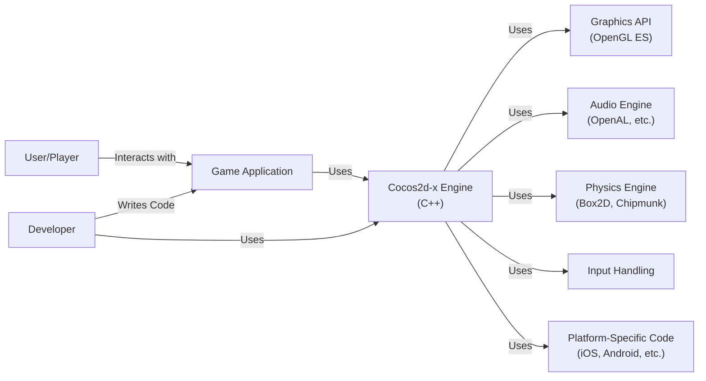
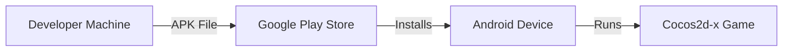
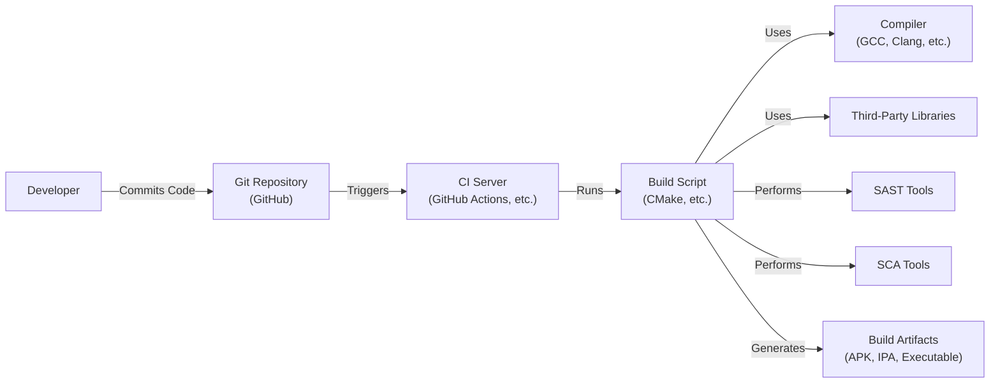

# BUSINESS POSTURE

Business Priorities and Goals:

*   Provide a free, open-source, cross-platform game development framework.
*   Maintain a large and active community of developers.
*   Ensure ease of use and rapid development capabilities.
*   Support a wide range of platforms and devices.
*   Enable developers to create high-performance 2D games.
*   Facilitate the creation of games that can be easily monetized.

Business Risks:

*   Malicious actors could exploit vulnerabilities in the framework to compromise games built with it, potentially impacting a large number of users.
*   The open-source nature of the project makes it susceptible to malicious contributions or forks that could harm the reputation and trustworthiness of the framework.
*   Lack of robust security practices could lead to intellectual property theft or unauthorized modification of the framework.
*   Failure to address security concerns could lead to decreased adoption by developers and damage the project's reputation.
*   Inability to secure the build and distribution process could lead to compromised releases.

# SECURITY POSTURE

Existing Security Controls:

*   security control: Code reviews are performed, although the consistency and depth may vary (mentioned throughout the repository's contribution guidelines).
*   security control: Community involvement in identifying and reporting issues (implicit in the open-source nature).
*   security control: Use of CMake for build configuration, which can help manage dependencies (described in build documentation).

Accepted Risks:

*   accepted risk: Reliance on community contributions for security improvements and vulnerability identification.
*   accepted risk: Potential for vulnerabilities due to the complexity of the codebase and the wide range of supported platforms.
*   accepted risk: Limited formal security testing and auditing.

Recommended Security Controls:

*   Implement static application security testing (SAST) tools in the CI/CD pipeline.
*   Implement dynamic application security testing (DAST) for runtime vulnerability analysis.
*   Conduct regular security audits and penetration testing.
*   Establish a formal vulnerability disclosure program.
*   Provide security training for core contributors.
*   Implement Software Composition Analysis (SCA) to manage vulnerabilities in third-party dependencies.
*   Use code signing for releases.

Security Requirements:

*   Authentication: Not directly applicable to the framework itself, but guidance should be provided to developers on implementing secure authentication mechanisms in their games.
*   Authorization: Not directly applicable to the framework itself, but guidance should be provided to developers on implementing secure authorization mechanisms in their games.
*   Input Validation: The framework should provide robust input validation mechanisms to prevent common vulnerabilities like buffer overflows and injection attacks.  This is crucial for handling user input, file loading, and network communication.
*   Cryptography: The framework should provide secure cryptographic primitives for common tasks like data encryption, hashing, and digital signatures.  Guidance should be provided on using these primitives securely.

# DESIGN

## C4 CONTEXT

Element Descriptions:

*   Element:
    *   Name: User/Player
    *   Type: Person
    *   Description: The end-user who plays games created with Cocos2d-x.
    *   Responsibilities: Interacts with the game.
    *   Security controls: None directly applicable. Relies on the security of the game and the underlying platform.

*   Element:
    *   Name: Cocos2d-x Game
    *   Type: Software System
    *   Description: A game built using the Cocos2d-x framework.
    *   Responsibilities: Provides game logic, rendering, and user interaction.
    *   Security controls: Implemented by the game developer, using Cocos2d-x's features and following security best practices.

*   Element:
    *   Name: Cocos2d-x Framework
    *   Type: Software System
    *   Description: The core game development framework.
    *   Responsibilities: Provides APIs for graphics, audio, input, physics, and other game development functionalities.
    *   Security controls: Input validation, secure use of third-party libraries, secure coding practices (as much as possible within the framework).

*   Element:
    *   Name: Third-Party Libraries
    *   Type: Software System
    *   Description: External libraries used by Cocos2d-x (e.g., OpenGL, Box2D).
    *   Responsibilities: Provide specific functionalities like graphics rendering or physics simulation.
    *   Security controls: Relies on the security of the individual libraries. Cocos2d-x should use secure versions and configurations.

*   Element:
    *   Name: Developer
    *   Type: Person
    *   Description: The person who creates games using Cocos2d-x.
    *   Responsibilities: Develops the game logic, integrates assets, and uses the Cocos2d-x framework.
    *   Security controls: Follows secure coding practices, uses secure development tools, and implements appropriate security measures within the game.

*   Element:
    *   Name: Operating Systems
    *   Type: Software System
    *   Description: The underlying operating systems on which the games run (iOS, Android, Windows, etc.).
    *   Responsibilities: Provides the platform and environment for the game to execute.
    *   Security controls: Relies on the security features of the operating system. Cocos2d-x should be compatible with the security models of supported OSes.

## C4 CONTAINER

Element Descriptions:

*   Element:
    *   Name: User/Player
    *   Type: Person
    *   Description: The end-user who plays the game.
    *   Responsibilities: Interacts with the game application.
    *   Security controls: None directly applicable.

*   Element:
    *   Name: Game Application
    *   Type: Container (Application)
    *   Description: The specific game built using Cocos2d-x.
    *   Responsibilities: Implements game logic, user interface, and overall game experience.
    *   Security controls: Implemented by the game developer, following secure coding practices and utilizing Cocos2d-x's security features.

*   Element:
    *   Name: Cocos2d-x Engine (C++)
    *   Type: Container (Library)
    *   Description: The core engine of Cocos2d-x, written in C++.
    *   Responsibilities: Provides the main framework functionalities for game development.
    *   Security controls: Input validation, secure handling of resources, safe memory management.

*   Element:
    *   Name: Graphics API (OpenGL ES)
    *   Type: Container (Library)
    *   Description: The graphics rendering API used by Cocos2d-x.
    *   Responsibilities: Handles rendering of 2D and 3D graphics.
    *   Security controls: Relies on the security of the OpenGL ES implementation. Cocos2d-x should use it securely.

*   Element:
    *   Name: Audio Engine (OpenAL, etc.)
    *   Type: Container (Library)
    *   Description: The audio engine used for playing sounds and music.
    *   Responsibilities: Manages audio playback and effects.
    *   Security controls: Relies on the security of the underlying audio engine.

*   Element:
    *   Name: Physics Engine (Box2D, Chipmunk)
    *   Type: Container (Library)
    *   Description: The physics engine used for simulating physics interactions.
    *   Responsibilities: Handles collision detection, physics calculations, and object movement.
    *   Security controls: Relies on the security of the chosen physics engine.

*   Element:
    *   Name: Input Handling
    *   Type: Container (Component)
    *   Description: Module for handling user input (touch, keyboard, mouse, etc.).
    *   Responsibilities: Processes user input events and passes them to the game logic.
    *   Security controls: Input validation to prevent injection attacks and other input-related vulnerabilities.

*   Element:
    *   Name: Platform-Specific Code (iOS, Android, etc.)
    *   Type: Container (Component)
    *   Description: Code that interacts directly with the underlying operating system.
    *   Responsibilities: Provides platform-specific implementations for certain functionalities.
    *   Security controls: Adheres to the security guidelines and best practices of each platform.

*   Element:
    *   Name: Developer
    *   Type: Person
    *   Description: The person developing the game.
    *   Responsibilities: Writes the game code and uses the Cocos2d-x engine.
    *   Security controls: Follows secure coding practices.

## DEPLOYMENT

Possible Deployment Solutions:

1.  **Mobile (iOS/Android):**  Games are packaged as IPA (iOS) or APK (Android) files and distributed through app stores (Apple App Store, Google Play Store) or through ad-hoc distribution methods.
2.  **Desktop (Windows/macOS/Linux):** Games are packaged as executables or platform-specific installers.
3.  **Web (HTML5):** Games are compiled to JavaScript and WebAssembly, and deployed to a web server.

Chosen Deployment Solution (Mobile - Android):

Element Descriptions:

*   Element:
    *   Name: Developer Machine
    *   Type: Infrastructure Node
    *   Description: The computer used by the developer to build and package the game.
    *   Responsibilities: Compiles the code, packages assets, and creates the APK file.
    *   Security controls: Secure development environment, code signing, secure build process.

*   Element:
    *   Name: Google Play Store
    *   Type: Infrastructure Node
    *   Description: The official app store for Android devices.
    *   Responsibilities: Distributes the game to users, handles updates, and provides a platform for discovery.
    *   Security controls: Google Play Store's security measures (app scanning, developer verification, etc.).

*   Element:
    *   Name: Android Device
    *   Type: Infrastructure Node
    *   Description: A mobile device running the Android operating system.
    *   Responsibilities: Runs the Cocos2d-x game.
    *   Security controls: Android operating system security features (sandboxing, permissions, etc.).

*   Element:
    *   Name: Cocos2d-x Game
    *   Type: Software System
    *   Description: The game running on the Android device.
    *   Security controls: Implemented by the game developer, following secure coding practices and utilizing Cocos2d-x's security features.

## BUILD

Build Process Description:

1.  **Code Commit:** The developer commits code changes to the Git repository (GitHub).
2.  **CI Trigger:** The commit triggers a build process on a CI server (e.g., GitHub Actions, Jenkins).
3.  **Build Script Execution:** The CI server executes a build script (e.g., CMake).
4.  **Compilation:** The build script uses a compiler (e.g., GCC, Clang) to compile the source code.
5.  **Dependency Management:** The build script manages and links third-party libraries.
6.  **Security Analysis:**
    *   **SAST:** Static Application Security Testing tools are run to analyze the source code for vulnerabilities.
    *   **SCA:** Software Composition Analysis tools are run to identify vulnerabilities in third-party dependencies.
7.  **Artifact Generation:** The build script generates the final build artifacts (e.g., APK for Android, IPA for iOS, executable for desktop platforms).

Security Controls in Build Process:

*   **Version Control (Git):** Tracks code changes and allows for auditing.
*   **CI/CD (GitHub Actions, Jenkins):** Automates the build process and ensures consistency.
*   **SAST Tools:** Identify vulnerabilities in the source code.
*   **SCA Tools:** Identify vulnerabilities in third-party dependencies.
*   **Code Signing (Recommended):** Ensures the integrity and authenticity of the build artifacts.

# RISK ASSESSMENT

Critical Business Processes:

*   Game development and distribution.
*   Community engagement and support.
*   Maintenance and updates of the framework.

Data to Protect:

*   **Source Code (Sensitivity: Medium):**  The framework's source code is publicly available, but unauthorized modifications or malicious forks could harm the project's reputation.
*   **Third-Party Library Dependencies (Sensitivity: Medium to High):** Vulnerabilities in these dependencies could be exploited in games built with Cocos2d-x.
*   **User Data (Sensitivity: Varies):**  This depends on the specific games built with Cocos2d-x.  The framework itself doesn't directly handle user data, but games built with it might. Developers are responsible for securing user data within their games.
*   **Build Artifacts (Sensitivity: High):**  Compromised build artifacts could lead to widespread distribution of malicious code.

# QUESTIONS & ASSUMPTIONS

Questions:

*   What is the current level of security awareness among the core contributors and the wider community?
*   Are there any existing security audits or penetration tests that have been performed on Cocos2d-x?
*   What is the process for handling security vulnerabilities reported by the community?
*   Are there any specific platform security requirements that need to be considered (e.g., iOS App Store Review Guidelines)?
*   What is the budget and resource allocation for security improvements?

Assumptions:

*   BUSINESS POSTURE: The project prioritizes being open-source and community-driven.
*   SECURITY POSTURE: There is a basic level of security awareness, but formal security practices are limited.
*   DESIGN: The framework relies heavily on C++ and third-party libraries. The build process is automated to some extent, but security checks may not be comprehensive.