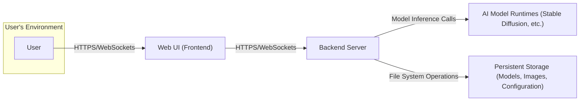
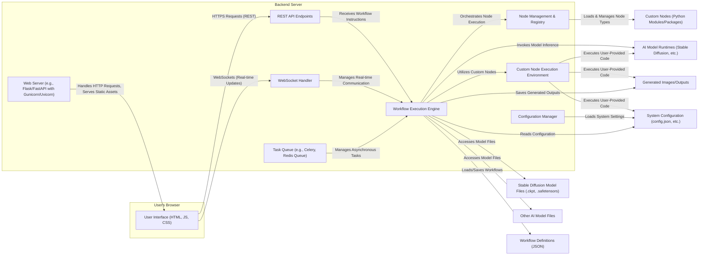

# Project Design Document: ComfyUI

**Version:** 1.1
**Date:** October 26, 2023
**Author:** AI Software Architect

## 1. Introduction

This document provides an enhanced and detailed design overview of the ComfyUI project, an open-source node-based interface for Stable Diffusion and other generative AI workflows. This document aims to clearly articulate the system's architecture, components, and data flow to facilitate subsequent threat modeling activities and provide a deeper understanding of the system.

## 2. Goals and Objectives

*   Provide a comprehensive and refined description of the ComfyUI system architecture.
*   Identify key components and their interactions with greater detail.
*   Outline the data flow within the system with more specific examples.
*   Serve as a robust foundation for identifying potential security vulnerabilities during threat modeling.
*   Document the system in a clear, understandable, and more detailed manner for both technical and non-technical stakeholders.

## 3. System Architecture

ComfyUI employs a client-server architecture with a web-based user interface. The core functionality resides in the backend, which manages the execution of node-based workflows.

### 3.1. High-Level Architecture

### 3.2. Detailed Architecture

The following diagram provides a more granular view of the system's components and their interactions, including specific responsibilities:

## 4. Key Components

*   **User Interface (Frontend):**
    *   Implemented using standard web technologies (HTML, CSS, JavaScript), likely with a framework like React or Vue.js.
    *   Provides an interactive, drag-and-drop node-based editor for visually constructing and managing complex AI workflows.
    *   Facilitates real-time interaction with the backend via both RESTful API calls for state changes and WebSocket connections for asynchronous updates and streaming data.
    *   Displays progress updates, intermediate results, and final generated outputs to the user.

*   **Web Server (Backend):**
    *   Typically implemented using a robust Python web framework such as Flask or FastAPI, often deployed with a production-ready WSGI server like Gunicorn or Uvicorn.
    *   Serves the static assets for the user interface (HTML, CSS, JavaScript).
    *   Acts as the entry point for all client requests, routing them to the appropriate handlers.
    *   Manages WebSocket connections, enabling bidirectional communication for real-time updates and interactions.

*   **Workflow Execution Engine:**
    *   The central component responsible for interpreting and executing the defined node-based workflows.
    *   Parses the workflow graph (typically represented in JSON) and orchestrates the execution of individual nodes in the correct order, respecting dependencies.
    *   Manages the flow of data (tensors, images, text, etc.) between connected nodes.
    *   Handles error conditions and provides mechanisms for logging and debugging workflow executions.

*   **Node Management & Registry:**
    *   Responsible for discovering, loading, and managing the available node types within the ComfyUI environment.
    *   Maintains a registry of all available nodes, including their input and output specifications, and associated Python code.
    *   Provides an interface for the Workflow Execution Engine to instantiate and configure specific node instances within a workflow.
    *   Handles the loading of both built-in nodes and user-defined custom nodes.

*   **REST API Endpoints:**
    *   Provides a set of programmatic interfaces for interacting with the ComfyUI backend over HTTP.
    *   Allows external applications or scripts to perform actions such as:
        *   Submitting new workflows for execution.
        *   Retrieving the status of running workflows.
        *   Fetching generated outputs.
        *   Managing workflow definitions.
    *   Typically uses standard HTTP methods (GET, POST, PUT, DELETE) and data formats (JSON).

*   **WebSocket Handler:**
    *   Manages persistent, bidirectional communication channels between the frontend and backend.
    *   Used for pushing real-time updates from the backend to the frontend, such as:
        *   Progress updates during workflow execution.
        *   Intermediate image previews.
        *   Error notifications.
    *   May also be used for sending interactive commands from the frontend to the backend.

*   **Custom Node Execution Environment:**
    *   Provides an isolated environment for executing user-provided Python code within custom nodes.
    *   This environment needs careful management to mitigate security risks associated with executing arbitrary code. Considerations include:
        *   Resource limits (CPU, memory, time).
        *   Restricted access to system resources.
        *   Dependency management and potential conflicts.

*   **Task Queue:**
    *   An optional but often used component (e.g., Celery with Redis or RabbitMQ) for managing asynchronous tasks, particularly the execution of workflows.
    *   Allows the web server to quickly acknowledge workflow submission requests and offload the actual execution to worker processes.
    *   Improves responsiveness and scalability of the system.

*   **Configuration Manager:**
    *   Responsible for loading and managing system-wide configuration settings.
    *   Reads configuration from files (e.g., JSON, YAML) or environment variables.
    *   Provides access to settings related to model paths, resource limits, security configurations, etc.

*   **AI Model Runtimes (Stable Diffusion, etc.):**
    *   The underlying software libraries and frameworks (e.g., PyTorch, TensorFlow) used to load and execute the AI models.
    *   Responsible for performing the computationally intensive operations required for model inference.
    *   May run on CPU, GPU, or other specialized hardware.

*   **Persistent Storage:**
    *   Used for storing various types of data persistently:
        *   **AI Model Files:** Large files containing the weights and architecture of the AI models.
        *   **Generated Images/Outputs:** The final and intermediate results produced by the workflows.
        *   **Workflow Definitions:** Saved workflow graphs in a structured format (e.g., JSON).
        *   **Custom Nodes:** Python modules or packages containing the code for user-defined nodes.
        *   **System Configuration:** Settings and parameters for the ComfyUI instance.

## 5. Data Flow

A typical workflow execution in ComfyUI involves the following detailed steps:

1. The **User** interacts with the **Web UI** to design a workflow by adding, connecting, and configuring nodes. This workflow definition is represented as a graph structure.
2. Upon user initiation (e.g., clicking "Run"), the **Web UI** sends the workflow definition (typically in JSON format) to the **Backend Server** via an **HTTPS POST request** to a designated API endpoint.
3. The **Web Server** receives the request and passes the workflow definition to the **Workflow Execution Engine**.
4. The **Workflow Execution Engine** parses the workflow graph and identifies the starting nodes.
5. For each node, the engine checks if its input data dependencies are met. If not, it waits for the preceding nodes to complete.
6. When a node is ready to execute, the engine retrieves the necessary input data from the outputs of connected upstream nodes or from persistent storage.
7. If the node requires an **AI Model**, the engine interacts with the **AI Model Runtime** to load the specified model from **Persistent Storage**.
8. The engine then invokes the code associated with the node, which may be a built-in function or a user-defined function within a **Custom Node**.
9. **Custom Nodes** are executed within the **Custom Node Execution Environment**, potentially with resource constraints and security sandboxing.
10. The node performs its designated operation, such as loading an image, processing text, performing model inference, or saving an output.
11. The output data produced by the node is stored in memory and made available to subsequent nodes that depend on it.
12. During execution, the **Workflow Execution Engine** may send progress updates and intermediate results back to the **Web UI** via **WebSocket** connections for real-time feedback to the user.
13. This process continues until all nodes in the workflow have been successfully executed.
14. The final outputs of the workflow (e.g., generated images) are typically saved to **Persistent Storage**.
15. The **Backend Server** sends a notification to the **Web UI** (via WebSocket or a subsequent API call) indicating the completion of the workflow.
16. The **Web UI** then displays the final results to the **User**.
17. The **Task Queue** (if implemented) manages the queuing and execution of workflows asynchronously, allowing the web server to handle multiple requests concurrently. The **Workflow Execution Engine** acts as a worker in this queue.
18. The **Configuration Manager** provides settings to various components throughout the execution process, such as model paths and resource limits.

## 6. Security Considerations (Detailed)

This section expands on potential areas of security concern, providing more specific examples and potential mitigation strategies.

*   **Input Validation:**
    *   **Threat:** Malicious users could inject arbitrary code or commands through input fields in the Web UI or via API calls, leading to remote code execution or other vulnerabilities.
    *   **Mitigation:** Implement robust input validation and sanitization on the backend for all data received from the frontend and external sources. Use parameterized queries or prepared statements to prevent SQL injection if a database is used. Validate data types, formats, and ranges.
*   **Authentication and Authorization:**
    *   **Threat:** Unauthorized users could access or modify ComfyUI resources or execute workflows.
    *   **Mitigation:** Implement strong authentication mechanisms (e.g., username/password, API keys, OAuth 2.0). Enforce authorization policies to control access to specific functionalities and data based on user roles or permissions.
*   **Custom Node Security:**
    *   **Threat:** Malicious custom nodes could execute arbitrary code on the server, potentially compromising the entire system or accessing sensitive data.
    *   **Mitigation:** Implement sandboxing techniques (e.g., using containers or restricted execution environments) for custom node execution. Consider code review processes or automated security scanning for custom nodes. Limit the permissions and access rights of custom node execution environments.
*   **Dependency Management:**
    *   **Threat:** Vulnerabilities in third-party libraries used by ComfyUI or custom nodes could be exploited.
    *   **Mitigation:** Regularly update dependencies to their latest secure versions. Use dependency scanning tools to identify and address known vulnerabilities. Employ a virtual environment to isolate project dependencies.
*   **Data Storage Security:**
    *   **Threat:** Sensitive data, such as API keys, model files, or user-generated content, could be exposed if storage is not properly secured.
    *   **Mitigation:** Implement appropriate file system permissions to restrict access to sensitive files. Encrypt sensitive data at rest. Secure access to cloud storage services if used.
*   **Network Security:**
    *   **Threat:** Communication channels could be intercepted or manipulated, leading to data breaches or man-in-the-middle attacks.
    *   **Mitigation:** Enforce HTTPS for all communication between the frontend and backend. Secure WebSocket connections (WSS). Implement network segmentation and firewalls to restrict access to the ComfyUI server.
*   **Model Security:**
    *   **Threat:** Maliciously crafted AI models could be used to generate harmful content or trigger unintended behavior.
    *   **Mitigation:** Implement mechanisms to verify the integrity and source of AI models. Consider using trusted model repositories. Implement content filtering or moderation for generated outputs.
*   **Denial of Service (DoS):**
    *   **Threat:** Attackers could overwhelm the ComfyUI server with excessive requests, making it unavailable to legitimate users.
    *   **Mitigation:** Implement rate limiting on API endpoints. Use a robust web server and consider deploying behind a load balancer. Implement input validation to prevent resource-intensive operations.

## 7. Deployment

ComfyUI offers flexibility in deployment options, each with its own security implications:

*   **Local Installation:**
    *   Typically for individual use on a personal computer.
    *   Security relies on the user's local system security.
    *   Less exposed to external threats unless port forwarding is enabled.
*   **Server Deployment (Single Instance):**
    *   Deployed on a single server, accessible via a web browser.
    *   Requires careful configuration of the server's operating system, firewall, and web server.
    *   Authentication and authorization are crucial for controlling access.
*   **Server Deployment (Containerized - e.g., Docker):**
    *   Deployment within Docker containers provides isolation and simplifies management.
    *   Security depends on the security of the container image and the container runtime environment.
    *   Network policies and resource limits can be enforced at the container level.
*   **Cloud Deployment (e.g., AWS, Azure, GCP):**
    *   Leverages cloud provider's infrastructure and security services.
    *   Requires careful configuration of cloud security settings (e.g., network security groups, IAM roles).
    *   Scalability and high availability can be achieved.
*   **Deployment behind a Reverse Proxy:**
    *   Using a reverse proxy (e.g., Nginx, Apache) can enhance security by providing features like SSL termination, load balancing, and request filtering.

The chosen deployment method significantly impacts the attack surface and the specific security controls that need to be implemented.

## 8. Future Considerations

*   **Enhanced User Management:** Implementing more granular role-based access control (RBAC) and integration with external authentication providers (e.g., LDAP, Active Directory).
*   **Improved Custom Node Security:** Exploring more advanced sandboxing techniques, such as using WebAssembly or secure enclaves, for custom node execution. Implementing a marketplace with verified and signed custom nodes.
*   **API Security Enhancements:** Implementing API authentication standards like OAuth 2.0, adding API rate limiting and request throttling, and providing comprehensive API documentation with security considerations.
*   **Auditing and Logging:** Implementing detailed logging of user actions, workflow executions, and system events for security monitoring, intrusion detection, and forensic analysis. Integrating with security information and event management (SIEM) systems.
*   **Security Scanning and Vulnerability Management:** Integrating automated security scanning tools into the development and deployment pipeline to identify and address vulnerabilities proactively.
*   **Content Moderation for Generated Outputs:** Implementing mechanisms to detect and filter potentially harmful or inappropriate content generated by the AI models.

This enhanced document provides a more in-depth understanding of the ComfyUI project's design and incorporates more specific details relevant to security considerations. It serves as a more robust foundation for conducting a thorough threat model.