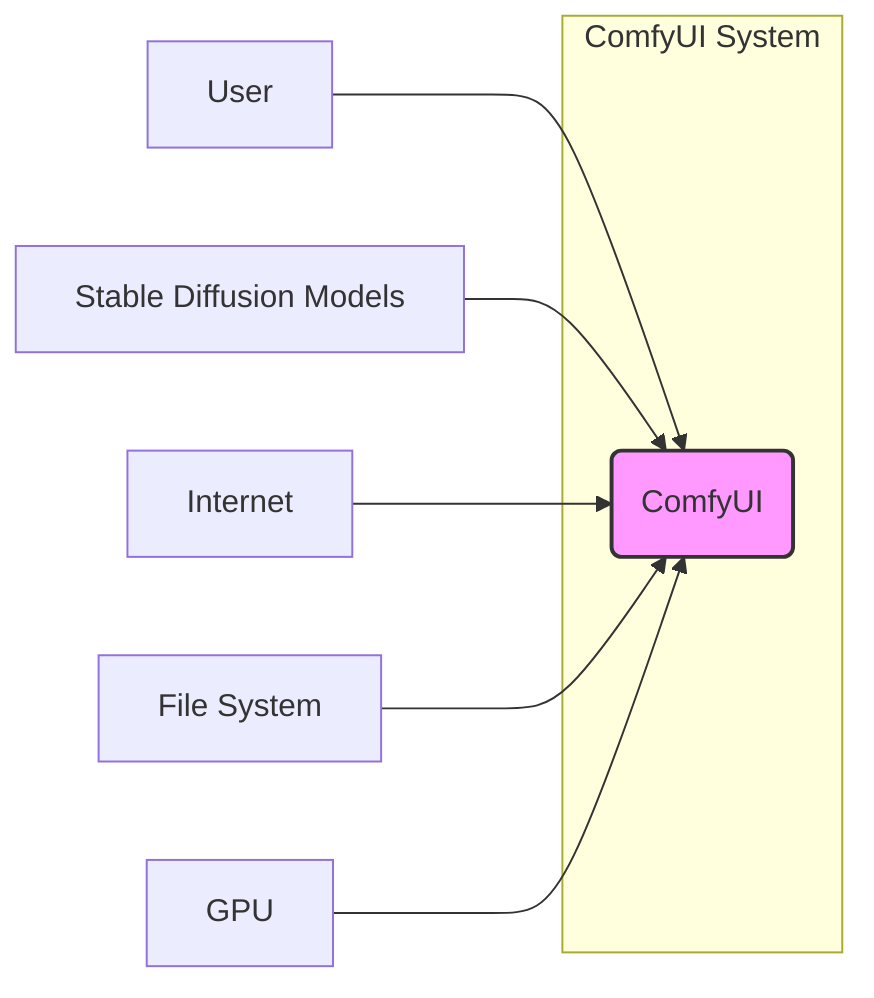
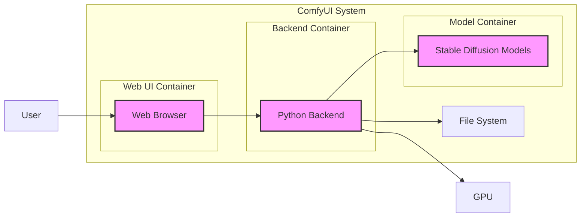
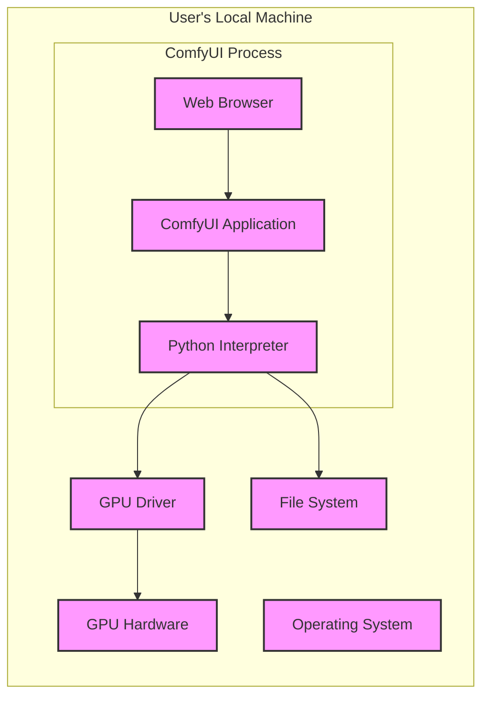

# BUSINESS POSTURE

- Business Priorities and Goals:
  - Enable users to create and manipulate images using Stable Diffusion models in a flexible and customizable way.
  - Provide a powerful and efficient user interface for complex Stable Diffusion workflows.
  - Foster a community around Stable Diffusion experimentation and creative image generation.
  - Support research and development in the field of generative models.

- Business Risks:
  - Misuse of generated content for malicious purposes (e.g., deepfakes, misinformation).
  - Exposure of sensitive data if used in enterprise environments without proper security measures.
  - Legal and ethical concerns related to AI-generated content and copyright.
  - Reputational damage if the platform is associated with harmful or illegal activities.
  - Dependence on open-source community contributions for maintenance and updates, which can be unpredictable.

# SECURITY POSTURE

- Existing Security Controls:
  - security control: Open-source code review by community (described in GitHub repository and community contributions).
  - security control: Standard GitHub security features (described in GitHub platform documentation).
  - security control: Reliance on underlying Python and library security (described in Python and library documentation).
  - accepted risk: Vulnerabilities in dependencies due to open-source nature and rapid development.
  - accepted risk: Lack of formal security audits and penetration testing.
  - accepted risk: Potential for user-introduced vulnerabilities through custom workflows and nodes.

- Recommended Security Controls:
  - security control: Implement automated dependency scanning to identify and address known vulnerabilities in libraries.
  - security control: Introduce static application security testing (SAST) tools in the build process to detect potential code-level vulnerabilities.
  - security control: Provide guidelines and best practices for users on secure workflow design and node usage.
  - security control: Establish a process for reporting and addressing security vulnerabilities.
  - security control: Consider implementing input validation and sanitization in core components to mitigate injection attacks.

- Security Requirements:
  - Authentication:
    - Requirement: For multi-user deployments, implement authentication to control access to the ComfyUI instance and workflows.
    - Requirement: Support standard authentication mechanisms (e.g., username/password, API keys).
  - Authorization:
    - Requirement: Implement authorization to manage user permissions and access control to specific features or workflows, especially in multi-user environments.
    - Requirement: Define roles and permissions for different user types (e.g., admin, user, read-only).
  - Input Validation:
    - Requirement: Validate user inputs to prevent injection attacks (e.g., prompt injection, command injection).
    - Requirement: Sanitize user-provided data before processing and displaying it.
  - Cryptography:
    - Requirement: Protect sensitive data at rest and in transit using appropriate encryption methods.
    - Requirement: Securely store and manage API keys and other secrets.
    - Requirement: Use HTTPS for all communication to protect data in transit.

# DESIGN

## C4 CONTEXT



- Context Diagram Elements:
  - Element:
    - Name: User
    - Type: Person
    - Description: Individuals who interact with ComfyUI to create and manipulate images using Stable Diffusion models. Users can range from hobbyists to researchers and artists.
    - Responsibilities: Provide prompts, configure workflows, and interact with the ComfyUI interface to generate images.
    - Security controls: User authentication and authorization (if implemented), secure password management (if applicable), responsible use of the platform.
  - Element:
    - Name: ComfyUI
    - Type: Software System
    - Description: The Stable Diffusion GUI and backend that provides a node-based interface for creating and executing complex image generation workflows.
    - Responsibilities: Workflow management, Stable Diffusion model execution, image generation, user interface provision, API endpoint provision.
    - Security controls: Input validation, authorization, authentication (optional), secure configuration management, dependency scanning, SAST.
  - Element:
    - Name: Stable Diffusion Models
    - Type: External System / Data Store
    - Description: Pre-trained machine learning models that are used by ComfyUI to generate images. These models are typically downloaded from external sources or provided by the user.
    - Responsibilities: Image generation based on prompts and input parameters provided by ComfyUI.
    - Security controls: Model integrity verification (e.g., checksums), secure model storage, access control to model files.
  - Element:
    - Name: Internet
    - Type: External System / Network
    - Description: The public internet, used for downloading models, accessing online resources, and potentially for remote access to ComfyUI.
    - Responsibilities: Providing access to external resources, enabling communication for updates and model downloads.
    - Security controls: HTTPS for communication, firewall, network security monitoring.
  - Element:
    - Name: File System
    - Type: External System / Data Store
    - Description: Local or network file system where ComfyUI stores configurations, workflows, generated images, and potentially downloaded models.
    - Responsibilities: Persistent storage of data, providing access to files for ComfyUI.
    - Security controls: File system permissions, access control lists, data encryption at rest (optional).
  - Element:
    - Name: GPU
    - Type: Infrastructure / Hardware
    - Description: Graphics Processing Unit used to accelerate the computationally intensive Stable Diffusion model execution within ComfyUI.
    - Responsibilities: Providing computational power for image generation.
    - Security controls: Physical security of the GPU hardware, driver security updates.

## C4 CONTAINER



- Container Diagram Elements:
  - Element:
    - Name: Web Browser
    - Type: Container - Client-side Application
    - Description: The user interface of ComfyUI, running in a web browser. It allows users to interact with workflows, configure settings, and view generated images.
    - Responsibilities: Rendering user interface, handling user input, communicating with the Python Backend.
    - Security controls: Browser security features, secure communication (HTTPS) with the backend, client-side input validation.
  - Element:
    - Name: Python Backend
    - Type: Container - Server-side Application
    - Description: The core logic of ComfyUI, implemented in Python. It manages workflows, executes Stable Diffusion models, and interacts with the file system and GPU.
    - Responsibilities: Workflow execution, model loading and execution, image generation, API endpoint provision, data processing.
    - Security controls: Input validation, authorization (if implemented), secure configuration management, dependency scanning, SAST, secure API design.
  - Element:
    - Name: Stable Diffusion Models
    - Type: Container - Data Store
    - Description: Local storage for Stable Diffusion models used by the Python Backend. These models are accessed during image generation.
    - Responsibilities: Storing pre-trained models, providing models to the Python Backend for execution.
    - Security controls: Access control to model files, model integrity verification.
  - Element:
    - Name: File System
    - Type: Container - Data Store
    - Description: Local or network file system used for storing configurations, workflows, generated images, and potentially downloaded models.
    - Responsibilities: Persistent storage of data.
    - Security controls: File system permissions, access control lists, data encryption at rest (optional).
  - Element:
    - Name: GPU
    - Type: Infrastructure
    - Description: Graphics Processing Unit used by the Python Backend for accelerated computation.
    - Responsibilities: Providing computational resources for model execution.
    - Security controls: Physical security, driver security updates.

## DEPLOYMENT

- Deployment Options:
  - Local Desktop Deployment: ComfyUI runs directly on the user's local machine (Windows, Linux, macOS). This is the most common deployment for individual users and experimentation.
  - Cloud Deployment (Single Instance): ComfyUI is deployed as a single instance on a cloud virtual machine (e.g., AWS EC2, Google Compute Engine, Azure VM). This allows for access from anywhere and potentially utilizes cloud GPUs.
  - Cloud Deployment (Containerized): ComfyUI is containerized (e.g., Docker) and deployed on container orchestration platforms like Kubernetes or cloud container services (e.g., AWS ECS, Google Kubernetes Engine, Azure Kubernetes Service). This enables scalability and easier management.

- Detailed Deployment (Local Desktop Deployment):



- Deployment Diagram Elements (Local Desktop Deployment):
  - Element:
    - Name: Operating System
    - Type: Infrastructure - Operating System
    - Description: User's desktop operating system (Windows, Linux, macOS) that provides the environment for running ComfyUI.
    - Responsibilities: Process management, resource allocation, providing system libraries and services.
    - Security controls: OS security updates, user account management, firewall, anti-malware software.
  - Element:
    - Name: Python Interpreter
    - Type: Software - Runtime Environment
    - Description: Python runtime environment required to execute the ComfyUI Python backend.
    - Responsibilities: Executing Python code, managing Python libraries and dependencies.
    - Security controls: Keeping Python interpreter updated with security patches, using virtual environments to isolate dependencies.
  - Element:
    - Name: ComfyUI Application
    - Type: Software - Application
    - Description: The ComfyUI Python application code, including the backend logic and web server.
    - Responsibilities: Workflow management, model execution, image generation, serving the web UI.
    - Security controls: Application-level security controls (input validation, authorization if implemented), secure configuration.
  - Element:
    - Name: Web Browser
    - Type: Software - Application
    - Description: User's web browser used to access the ComfyUI web interface.
    - Responsibilities: Rendering the UI, interacting with the user, communicating with the ComfyUI backend.
    - Security controls: Browser security features, secure browsing practices.
  - Element:
    - Name: GPU Driver
    - Type: Software - Driver
    - Description: GPU drivers required for the Python interpreter to communicate with the GPU hardware.
    - Responsibilities: Enabling communication between software and GPU, managing GPU resources.
    - Security controls: Keeping GPU drivers updated with security patches, downloading drivers from official sources.
  - Element:
    - Name: GPU Hardware
    - Type: Infrastructure - Hardware
    - Description: Physical GPU hardware used for accelerated computation.
    - Responsibilities: Providing computational power for model execution.
    - Security controls: Physical security of the hardware.
  - Element:
    - Name: File System
    - Type: Infrastructure - Data Storage
    - Description: Local file system on the user's machine.
    - Responsibilities: Storing ComfyUI application files, configurations, models, and generated images.
    - Security controls: File system permissions, user access control.

## BUILD

```mermaid
graph LR
    A[Developer] --> B{Code Changes}
    B --> C[GitHub Repository]
    C --> D{GitHub Actions Workflow}
    D --> E[Build Environment]
    E --> F{Dependency Resolution & Build}
    F --> G[Security Checks (SAST, Dependency Scan)]
    G --> H{Artifact Storage (GitHub Releases)}
    H --> I[Distribution (PyPI, GitHub)]
    style D fill:#f9f,stroke:#333,stroke-width:2px
    style E fill:#f9f,stroke:#333,stroke-width:2px
    style F fill:#f9f,stroke:#333,stroke-width:2px
    style G fill:#f9f,stroke:#333,stroke-width:2px
    style H fill:#f9f,stroke:#333,stroke-width:2px
```

- Build Process Description:
  - Developer makes code changes and commits them to the GitHub repository.
  - GitHub Actions workflow is triggered upon code changes (e.g., push, pull request).
  - Build environment is provisioned (e.g., using GitHub Actions runners).
  - Dependencies are resolved and the project is built.
  - Security checks are performed:
    - Static Application Security Testing (SAST) to identify potential code vulnerabilities.
    - Dependency scanning to identify known vulnerabilities in used libraries.
  - Build artifacts (e.g., Python packages, distributions) are created.
  - Artifacts are stored in GitHub Releases and distributed via platforms like PyPI (Python Package Index) or directly from GitHub.

- Build Process Security Controls:
  - security control: Automated build process using GitHub Actions to ensure consistency and reproducibility.
  - security control: Source code hosted on GitHub, providing version control and transparency.
  - security control: Dependency management using `pip` and `requirements.txt` or similar, allowing for tracking and management of project dependencies.
  - security control: Security checks integrated into the CI/CD pipeline:
    - security control: SAST scanning to detect code-level vulnerabilities.
    - security control: Dependency vulnerability scanning to identify vulnerable dependencies.
  - security control: Code review process (though not explicitly automated in the build process diagram, it's a crucial security control in software development).
  - security control: Secure artifact storage in GitHub Releases.
  - security control: Distribution via trusted platforms like PyPI (if applicable) and GitHub.
  - security control: Principle of least privilege applied to build environment and CI/CD pipelines.

# RISK ASSESSMENT

- Critical Business Processes:
  - Core business process is enabling users to generate images using Stable Diffusion.
  - Availability and functionality of ComfyUI are critical for users who rely on it for creative or research tasks.
  - Integrity of generated images is important for maintaining user trust and avoiding misuse.

- Data Sensitivity:
  - User Prompts: Can contain sensitive or personal information depending on the user and use case. Sensitivity level depends on the context of use.
  - Generated Images: Can be sensitive depending on the content. May contain personal data, copyrighted material, or other sensitive information. Sensitivity level depends on the content and use case.
  - Workflows: Can contain intellectual property or proprietary configurations. Sensitivity level depends on the user and workflow content.
  - Models: Stable Diffusion models themselves are generally publicly available, but custom models or fine-tuned models might be considered sensitive intellectual property. Sensitivity level depends on the model and its origin.
  - Configuration Data: May contain API keys or other credentials if users integrate external services. These are highly sensitive.

# QUESTIONS & ASSUMPTIONS

- Questions:
  - Is ComfyUI intended for single-user or multi-user deployments? (Assumption: Primarily single-user, but multi-user deployments are possible).
  - Are there plans to implement user authentication and authorization in the future?
  - What is the intended use case in terms of data sensitivity? (Assumption: Varies widely depending on the user, ranging from public domain images to potentially sensitive content).
  - Are there any specific compliance requirements that ComfyUI needs to adhere to? (Assumption: No specific compliance requirements are explicitly stated for the open-source project itself, but users in specific industries might have their own requirements).
  - What are the priorities for security enhancements in the project roadmap?

- Assumptions:
  - ComfyUI is primarily used by individual users or small teams for research, creative work, and experimentation.
  - Security is currently focused on community-driven code review and standard open-source development practices.
  - No formal security audits or penetration testing have been conducted.
  - Deployment is mostly local desktop-based, but cloud deployments are also possible.
  - The project is open-source and relies on community contributions for development and maintenance.