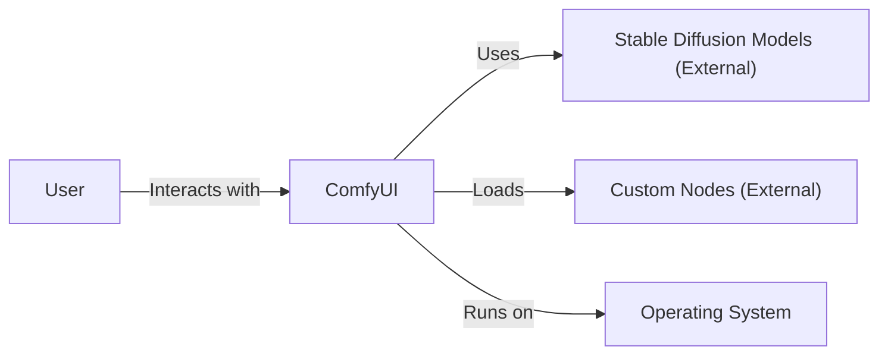
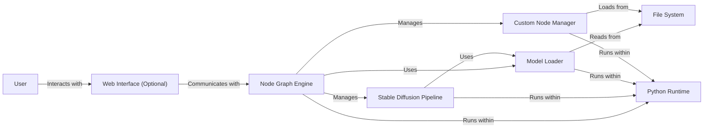
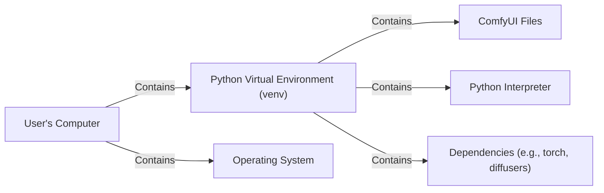
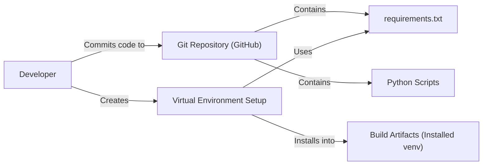

Okay, let's create a design document for the ComfyUI project.

# BUSINESS POSTURE

ComfyUI is a modular, graph/node-based Stable Diffusion GUI.  It appears to be targeted towards researchers, artists, and enthusiasts who want a high degree of control and flexibility over the image generation process.  It's likely a project driven by a community of power users, rather than a commercial product (at least in its current form).  This suggests a higher tolerance for complexity and a focus on features over strict usability for beginners.

Priorities:

*   Flexibility and Control:  Provide users with granular control over every aspect of the Stable Diffusion pipeline.
*   Extensibility:  Allow users to easily add new nodes, models, and features.
*   Reproducibility:  Enable users to precisely recreate image generation workflows.
*   Community-Driven Development:  Foster a community of users who contribute to the project's development.

Goals:

*   Become the leading node-based GUI for Stable Diffusion.
*   Enable advanced image generation techniques not easily accessible in other GUIs.
*   Facilitate research and experimentation with Stable Diffusion.

Business Risks:

*   Usability Challenges: The complexity of the node-based interface may deter less technical users.
*   Maintenance Overhead:  The highly modular design could lead to a large number of dependencies and potential compatibility issues.
*   Lack of Formal Support: As a community-driven project, there may be limited formal support or documentation.
*   Security Vulnerabilities:  The reliance on external models and custom nodes introduces potential security risks if not carefully managed. This is the most significant risk.
*   Scalability: The current architecture may not scale efficiently for very large or complex workflows.

# SECURITY POSTURE

Existing Security Controls:

*   security control: Dependency Management: The project uses `requirements.txt` for Python dependencies, indicating some level of dependency management. (Located in the root of the repository).
*   security control: Basic Input Validation: Some level of input validation is likely present in the node processing logic, but this needs to be verified. (Likely distributed throughout the codebase, particularly in `nodes.py` and related files).
*   security control: Execution in Isolated Environment: The recommendation to use a virtual environment (venv) provides some isolation and reduces the risk of system-wide contamination. (Mentioned in the installation instructions).

Accepted Risks:

*   accepted risk: Reliance on Third-Party Models: The project heavily relies on user-provided Stable Diffusion models, which may contain malicious code or produce unexpected outputs.
*   accepted risk: Custom Node Execution:  The ability to create and use custom nodes introduces a significant risk of arbitrary code execution if users install untrusted nodes.
*   accepted risk: Limited Security Auditing:  As an open-source project, it's unlikely that ComfyUI has undergone extensive security auditing.
*   accepted risk: Local File Access: The application likely requires read/write access to local files for loading models and saving images, which could be exploited.

Recommended Security Controls:

*   security control: Implement a strict sandboxing mechanism for custom node execution. This could involve using technologies like WebAssembly, containers (Docker), or dedicated virtual machines.
*   security control: Introduce a node signing and verification system to ensure that only trusted nodes can be loaded.
*   security control: Implement comprehensive input validation and sanitization for all user-provided data, including node parameters, file paths, and model inputs.
*   security control: Conduct regular security audits and penetration testing to identify and address vulnerabilities.
*   security control: Provide clear security guidelines and warnings to users about the risks of using untrusted models and nodes.
*   security control: Implement a Content Security Policy (CSP) if a web interface is used to limit the resources that can be loaded and executed.
*   security control: Consider using a more secure method for managing dependencies, such as Poetry or Pipenv, which provide lock files for reproducible builds.

Security Requirements:

*   Authentication: Not directly applicable, as ComfyUI appears to be a desktop application. However, if a web interface or API is exposed, authentication should be implemented using strong, industry-standard methods (e.g., OAuth 2.0, OpenID Connect).
*   Authorization: If user roles or permissions are introduced, authorization should be enforced using a robust mechanism (e.g., role-based access control). For now, the primary authorization concern is limiting the capabilities of custom nodes.
*   Input Validation: All user inputs, including node parameters, file paths, and model inputs, must be strictly validated and sanitized to prevent injection attacks and other vulnerabilities.  This includes checking data types, lengths, and allowed characters.
*   Cryptography: If sensitive data is stored or transmitted, appropriate cryptographic techniques (e.g., encryption, hashing) should be used.  This is less of a concern for the core functionality but might be relevant for extensions or integrations.
*   Output Encoding: If outputting to a web interface, proper output encoding should be used to prevent cross-site scripting (XSS) vulnerabilities.

# DESIGN

## C4 CONTEXT

Element Descriptions:

*   Element:
    *   Name: User
    *   Type: Person
    *   Description: A person interacting with ComfyUI to generate images.
    *   Responsibilities: Provides inputs, configures nodes, initiates image generation, views results.
    *   Security controls: N/A (External to the system)

*   Element:
    *   Name: ComfyUI
    *   Type: Software System
    *   Description: The node-based GUI application for Stable Diffusion.
    *   Responsibilities: Manages the node graph, executes the Stable Diffusion pipeline, displays results, handles user interaction.
    *   Security controls: Input validation, sandboxing (recommended), node signing (recommended).

*   Element:
    *   Name: Stable Diffusion Models (External)
    *   Type: External System
    *   Description: Pre-trained Stable Diffusion models used for image generation.
    *   Responsibilities: Provide the core image generation capabilities.
    *   Security controls: N/A (External to the system, but ComfyUI should treat them as untrusted).

*   Element:
    *   Name: Custom Nodes (External)
    *   Type: External System
    *   Description: User-created or third-party nodes that extend ComfyUI's functionality.
    *   Responsibilities: Provide additional image processing or manipulation capabilities.
    *   Security controls: Sandboxing (recommended), node signing (recommended).

*   Element:
    *   Name: Operating System
    *   Type: External System
    *   Description: The underlying operating system on which ComfyUI runs.
    *   Responsibilities: Provides the runtime environment for ComfyUI.
    *   Security controls: OS-level security controls (e.g., file permissions, user accounts).

## C4 CONTAINER

Element Descriptions:

*   Element:
    *   Name: User
    *   Type: Person
    *   Description: A person interacting with ComfyUI.
    *   Responsibilities: Provides inputs, configures nodes, initiates image generation, views results.
    *   Security controls: N/A (External to the system)

*   Element:
    *   Name: Web Interface (Optional)
    *   Type: Web Application
    *   Description: Provides a web-based interface for interacting with ComfyUI. This may or may not be present, depending on how ComfyUI is launched.
    *   Responsibilities: Renders the node graph, handles user input, displays results.
    *   Security controls: Input validation, output encoding, CSP (recommended).

*   Element:
    *   Name: Node Graph Engine
    *   Type: Python Module
    *   Description: Core component that manages the node graph and its execution.
    *   Responsibilities: Creates, connects, and executes nodes; manages data flow between nodes.
    *   Security controls: Input validation, sandboxing (for custom nodes).

*   Element:
    *   Name: Stable Diffusion Pipeline
    *   Type: Python Module
    *   Description: Implements the Stable Diffusion image generation process.
    *   Responsibilities: Executes the various stages of the Stable Diffusion pipeline (text encoding, diffusion, decoding).
    *   Security controls: Input validation (for model inputs).

*   Element:
    *   Name: Model Loader
    *   Type: Python Module
    *   Description: Loads Stable Diffusion models from the file system.
    *   Responsibilities: Reads model files, parses model data, loads models into memory.
    *   Security controls: Input validation (for model files).

*   Element:
    *   Name: Custom Node Manager
    *   Type: Python Module
    *   Description: Loads and manages custom nodes.
    *   Responsibilities: Discovers custom nodes, loads node code, manages node dependencies.
    *   Security controls: Sandboxing (recommended), node signing (recommended).

*   Element:
    *   Name: File System
    *   Type: External System
    *   Description: The local file system used to store models, custom nodes, and output images.
    *   Responsibilities: Provides persistent storage.
    *   Security controls: OS-level file permissions.

*   Element:
    *   Name: Python Runtime
    *   Type: Runtime Environment
    *   Description: The Python interpreter and associated libraries.
    *   Responsibilities: Executes the Python code.
    *   Security controls: N/A (External to the system, but should be kept up-to-date).

## DEPLOYMENT

Possible Deployment Solutions:

1.  Local Installation (venv):  The recommended approach, using a Python virtual environment.
2.  Docker Container:  Packaging ComfyUI and its dependencies into a Docker container for isolation and portability.
3.  Cloud-Based VM:  Running ComfyUI on a virtual machine in the cloud (e.g., AWS EC2, Google Compute Engine).

Chosen Solution (Detailed): Local Installation (venv)

Element Descriptions:

*   Element:
    *   Name: User's Computer
    *   Type: Physical Machine
    *   Description: The user's local computer.
    *   Responsibilities: Hosts the ComfyUI installation.
    *   Security controls: OS-level security controls.

*   Element:
    *   Name: Python Virtual Environment (venv)
    *   Type: Isolated Environment
    *   Description: A self-contained directory that contains a Python installation and project-specific dependencies.
    *   Responsibilities: Isolates ComfyUI from the system-wide Python installation.
    *   Security controls: Provides isolation, reduces the risk of conflicts with other Python projects.

*   Element:
    *   Name: ComfyUI Files
    *   Type: Files
    *   Description: The ComfyUI source code and related files.
    *   Responsibilities: Contains the application logic.
    *   Security controls: N/A

*   Element:
    *   Name: Python Interpreter
    *   Type: Executable
    *   Description: The Python interpreter within the virtual environment.
    *   Responsibilities: Executes the Python code.
    *   Security controls: N/A

*   Element:
    *   Name: Dependencies (e.g., torch, diffusers)
    *   Type: Libraries
    *   Description: The Python libraries required by ComfyUI.
    *   Responsibilities: Provide necessary functionality.
    *   Security controls: Dependency management (requirements.txt), vulnerability scanning (recommended).

*   Element:
    *   Name: Operating System
    *   Type: Operating System
    *   Description: The underlying operating system.
    *   Responsibilities: Provides the base platform.
    *   Security controls: OS-level security controls.

## BUILD

Build Process Description:

1.  Developer: The developer writes and modifies the Python code and other project files.
2.  Git Repository (GitHub): The code is stored in a Git repository on GitHub. This provides version control and collaboration features.
3.  requirements.txt: This file lists the Python dependencies required by ComfyUI.
4.  Python Scripts: These are the core source code files of ComfyUI.
5.  Virtual Environment Setup: The developer (or user) creates a Python virtual environment (venv) and installs the dependencies listed in `requirements.txt` using `pip install -r requirements.txt`.
6.  Build Artifacts (Installed venv): The "build artifact" in this case is the populated virtual environment, ready to run ComfyUI. There isn't a traditional compilation step for Python.

Security Controls:

*   security control: Version Control (Git): Using Git allows for tracking changes, identifying who made specific modifications, and reverting to previous versions if necessary.
*   security control: Dependency Management (requirements.txt):  Specifying dependencies in `requirements.txt` helps ensure that the correct versions of libraries are used.
*   security control: Manual Code Review:  As an open-source project, code changes are likely reviewed by other developers before being merged. This helps catch potential security issues.

Recommended Security Controls:

*   security control: Automated Dependency Scanning:  Integrate a tool like Dependabot (GitHub) or Snyk to automatically scan dependencies for known vulnerabilities.
*   security control: Static Analysis:  Incorporate a static analysis tool (e.g., Bandit, Pylint with security plugins) into the development workflow to identify potential security issues in the Python code.
*   security control: Code Signing: While not strictly a "build" step for Python, consider signing releases of ComfyUI to ensure their integrity.

# RISK ASSESSMENT

Critical Business Processes:

*   Image Generation: The core process of generating images using Stable Diffusion.
*   Workflow Management: Creating, saving, and loading image generation workflows.
*   Custom Node Integration: Extending ComfyUI's functionality with custom nodes.

Data Sensitivity:

*   Stable Diffusion Models:  These models are generally considered intellectual property, and their unauthorized distribution could be a concern. Sensitivity: Medium.
*   User-Provided Inputs (Prompts, Images):  These may contain personal information or copyrighted material. Sensitivity: Low to Medium, depending on the user's input.
*   Generated Images:  The output images may have copyright implications or contain sensitive content, depending on the user's prompts and models. Sensitivity: Low to High, depending on the content.
*   Custom Node Code:  This code could contain malicious logic or vulnerabilities. Sensitivity: High.
*   Configuration Files: May contain API keys or other sensitive information if integrations are used. Sensitivity: Medium to High.

# QUESTIONS & ASSUMPTIONS

Questions:

*   Are there any plans to add a web interface or API to ComfyUI? (This significantly impacts the security requirements.)
*   What is the intended level of support for custom nodes? (This drives the need for sandboxing and other security measures.)
*   Are there any specific compliance requirements (e.g., GDPR, CCPA) that need to be considered?
*   What mechanisms are in place for reporting and handling security vulnerabilities?
*   Is there a process for reviewing and approving custom nodes before they are made publicly available?

Assumptions:

*   BUSINESS POSTURE: ComfyUI is primarily a community-driven project with a focus on flexibility and power users, rather than a commercial product with strict security requirements.
*   SECURITY POSTURE: There is currently limited formal security auditing or testing. The project relies heavily on the user to manage the risks associated with third-party models and custom nodes.
*   DESIGN: The architecture is modular and extensible, but this also introduces complexity and potential security risks. The primary deployment method is a local installation using a Python virtual environment. There is no built-in authentication or authorization mechanism.