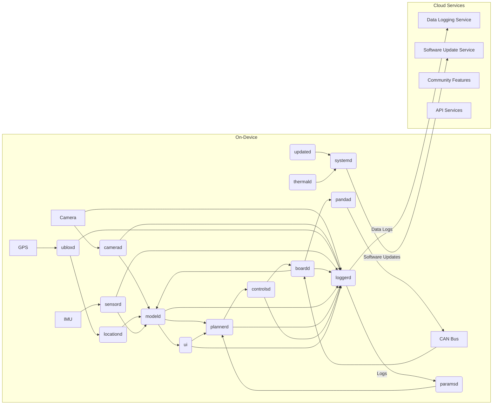
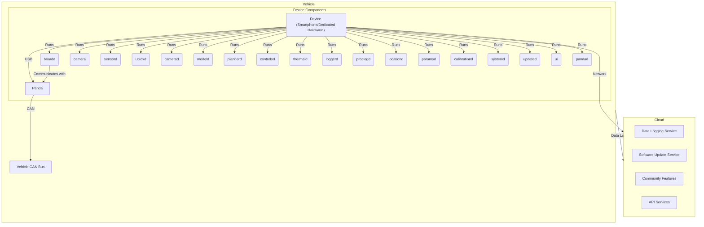

## Project Design Document: openpilot - An Open Source Advanced Driver Assistance System (ADAS)

**Document Version:** 1.1
**Date:** October 26, 2023
**Prepared By:** AI Software Architect

### 1. Introduction

This document provides an enhanced architectural design of the openpilot project, an open-source Advanced Driver Assistance System (ADAS) developed by comma.ai. Building upon the initial design, this version offers greater detail and clarity, specifically tailored for effective threat modeling. It aims to provide a comprehensive understanding of the system's components, data flow, deployment, and key security considerations.

### 2. Project Overview

openpilot is a sophisticated open-source driver assistance system delivering features such as Adaptive Cruise Control (ACC) and Lane Keeping Assist System (LKAS) to a range of compatible vehicles. It operates on commodity hardware, typically a smartphone or a dedicated device running the openpilot software, and interfaces with the vehicle's CAN bus via a specialized harness. The project's open nature encourages community involvement and continuous improvement through extensive data logging and analysis.

### 3. Goals and Objectives

*   Develop and maintain a functional, reliable, and safe open-source ADAS solution.
*   Serve as a platform for research and development in the field of autonomous driving technologies.
*   Cultivate a vibrant community for collaborative development and iterative improvement.
*   Expand compatibility to a wider array of vehicle models.
*   Continuously enhance the performance, robustness, and security of the system.

### 4. Target Audience

This document is primarily intended for:

*   Security architects and engineers tasked with performing threat modeling and security assessments.
*   Software developers actively contributing to the openpilot codebase.
*   System architects designing integrations with or extensions to the openpilot system.
*   Technical individuals seeking an in-depth understanding of the openpilot's architectural design and operational principles.

### 5. Scope

This document comprehensively covers the core architectural elements of openpilot, including:

*   Detailed descriptions of on-device software components and their interdependencies.
*   A thorough representation of data flow pathways within the system.
*   An explanation of the interaction mechanisms with the vehicle's CAN bus.
*   An overview of the role and function of supporting cloud services.
*   A description of the user interface elements and their interaction with the system.

This document explicitly excludes:

*   Fine-grained details of the specific machine learning models employed.
*   Low-level implementation details of individual algorithms.
*   Vehicle-specific hardware configurations and installation procedures.
*   The internal architecture and workings of the underlying Android operating system.

### 6. System Architecture

The openpilot system is architecturally divided into two main segments: the software components residing on the in-vehicle device and the supporting cloud-based services.

#### 6.1 On-Device Components

This section details the software modules that execute on the device installed within the vehicle.

*   **`boardd`:**  This is the low-level hardware abstraction layer, acting as the primary interface to the device's hardware. It manages communication with sensors (camera, GPS, IMU), facilitates interaction with the CAN bus via the Panda, and controls actuators.
*   **`camera`:**  This module is responsible for capturing raw image data from the vehicle's camera(s).
*   **`sensord`:**  This service aggregates data from various sensors integrated into the device, such as the GPS receiver and the Inertial Measurement Unit (IMU).
*   **`ubloxd`:**  This component specifically handles communication with the u-blox GPS module, decoding and processing GPS data.
*   **`camerad`:**  Building upon the raw camera input, `camerad` manages the camera stream, performs initial image processing tasks like rectification and undistortion, and prepares the data for downstream modules.
*   **`modeld`:**  This critical module hosts and executes the neural network models responsible for perception tasks. These include lane detection, traffic light and sign recognition, object detection (vehicles, pedestrians, etc.), and estimating road geometry.
*   **`plannerd`:**  Leveraging the perception data from `modeld` and the vehicle's current state, `plannerd` is responsible for high-level decision making. It plans the vehicle's trajectory, determines appropriate speeds, and generates control targets.
*   **`controlsd`:**  This module implements the core control algorithms. It takes the planned trajectory from `plannerd` and translates it into specific commands for the vehicle's actuators (steering, throttle, brakes) via the CAN bus.
*   **`thermald`:**  This service monitors the device's internal temperature and manages cooling mechanisms (e.g., fan control) to ensure optimal operating conditions.
*   **`loggerd`:**  A crucial component for data collection and analysis. `loggerd` records a wide range of system information, including raw sensor data, processed perception outputs, planning decisions, control commands, and system logs.
*   **`proclogd`:**  This utility monitors and logs the resource usage (CPU, memory, etc.) of various processes running on the device, aiding in performance analysis and debugging.
*   **`locationd`:**  This service provides comprehensive location services by integrating and processing data from the GPS module (`ubloxd`) and potentially other sources.
*   **`paramsd`:**  This module manages the system's parameters and configuration settings, allowing for dynamic adjustments and persistent storage of preferences.
*   **`calibrationd`:**  This component handles the crucial task of calibrating the camera and other sensors, ensuring accurate perception and system performance.
*   **`systemd`:**  This is the system-level service manager, responsible for starting, stopping, and managing other services on the device.
*   **`updated`:**  This module manages the process of downloading and installing software updates for the openpilot system, ensuring the device is running the latest version.
*   **`ui`:**  This component provides the user interface displayed on the device screen, offering visual feedback to the driver, displaying system status, and allowing for limited user interaction.
*   **`pandad`:**  This module acts as the software interface to the Panda, a hardware device specifically designed for secure and reliable communication with the vehicle's CAN bus. It enforces security measures and provides a controlled gateway for sending and receiving CAN messages.

#### 6.2 Cloud Services

These are the backend services that provide essential support and functionality to the openpilot ecosystem.

*   **Data Logging Service:** This service receives and securely stores the extensive data logs uploaded by `loggerd` from user devices. This vast dataset is invaluable for research, development, performance analysis, and identifying potential issues.
*   **Software Update Service:**  This service hosts and distributes new versions of the openpilot software to user devices, ensuring users have access to the latest features, improvements, and security patches.
*   **Community Features:**  This encompasses services that support community engagement, such as user profiles, leaderboards for driving performance metrics, and platforms for sharing driving data and experiences (with appropriate anonymization).
*   **API Services:**  This provides a set of Application Programming Interfaces (APIs) that allow authorized external applications and services to interact with the openpilot ecosystem, enabling functionalities like data access, remote monitoring (potentially), and integration with other platforms.

### 7. Data Flow

The following describes the primary pathways and transformations of data within the openpilot system:

*   **Sensor Data Acquisition:**
    *   The vehicle's camera captures continuous video streams.
    *   The GPS module provides precise location and time information.
    *   The IMU measures the device's acceleration and angular velocity.
    *   The vehicle's CAN bus transmits real-time vehicle state information (speed, steering angle, brake status, etc.).
*   **Perception Processing:**
    *   `camerad` receives raw image data from the `camera` module.
    *   `camerad` performs image processing to enhance and prepare the data.
    *   `modeld` utilizes the processed images, along with GPS and IMU data from `sensord` and `locationd`, to execute its neural network models.
    *   `modeld` outputs perception results, including detected lane lines, identified objects (vehicles, pedestrians, traffic signs), and estimations of road geometry.
*   **Planning and Decision Making:**
    *   `plannerd` receives the perception data from `modeld` and the current vehicle state from the CAN bus (via `boardd`).
    *   `plannerd` analyzes this information to determine the desired trajectory, target speed, and necessary control actions.
*   **Control Execution:**
    *   `controlsd` receives the planned actions from `plannerd`.
    *   `controlsd` translates these high-level plans into specific control commands for the vehicle's actuators (steering, throttle, brakes).
*   **Actuator Control:**
    *   `boardd` receives the control commands from `controlsd`.
    *   `boardd`, through the `pandad` interface, securely transmits these commands to the vehicle's CAN bus.
    *   The vehicle's electronic control units (ECUs) receive the CAN messages and actuate the steering, throttle, and brakes accordingly.
*   **Data Logging and Telemetry:**
    *   `loggerd` continuously collects data from various components, including raw sensor data, processed perception outputs, planning decisions, control commands, system logs, and performance metrics.
    *   Periodically, or under specific conditions, `loggerd` uploads the collected data logs to the Data Logging Service in the cloud for analysis and storage.
*   **User Interface Interaction:**
    *   The `ui` module receives information about the system's state, perception outputs, and planned actions.
    *   `ui` displays relevant information to the driver, such as detected lane lines, identified objects, warnings, and system status.
    *   Limited driver inputs through the UI are relayed to the appropriate components, such as acknowledging warnings or initiating specific actions.

### 8. Deployment Diagram

The openpilot system has components deployed in two primary environments: within the vehicle itself and within the cloud infrastructure supporting the ecosystem.

### 9. Security Considerations

This section highlights key security considerations relevant to the openpilot project, providing a foundation for more detailed threat modeling activities.

*   **Trust Boundaries:**
    *   **Vehicle CAN Bus Interface:** The boundary between the openpilot device and the vehicle's internal network (CAN bus) is a critical trust boundary. Unauthorized or malicious messages injected onto the CAN bus could compromise vehicle safety and functionality.
    *   **Device-Cloud Communication:** The communication channel between the openpilot device and the cloud services represents another significant trust boundary. Data transmitted across this boundary needs to be protected against eavesdropping and tampering.
    *   **On-Device Component Isolation:**  While running on the same device, the isolation and privilege separation between different software components (e.g., `controlsd` vs. `ui`) is important to prevent a compromise in one component from affecting others.
    *   **Operating System Boundary:** The boundary between the openpilot software and the underlying operating system (typically Android) needs consideration, as vulnerabilities in the OS could potentially be exploited to compromise the openpilot system.
*   **Data Classification and Sensitivity:**
    *   **Raw Sensor Data (Camera, GPS, IMU):** Highly sensitive as it can reveal driving patterns, routes, and potentially personal information. Unauthorized access or modification could have privacy implications.
    *   **Vehicle State Data (Speed, Steering, etc.):** Critically sensitive. Manipulation of this data, either by injecting false information or preventing legitimate data, could lead to dangerous vehicle behavior.
    *   **User Account Data:** Includes user credentials and personal information, requiring protection against unauthorized access and misuse.
    *   **System Logs and Diagnostic Data:** May contain sensitive information about system operation, potential vulnerabilities, and user behavior. Access should be restricted.
    *   **Calibration Data:** Crucial for accurate system performance. Tampering with calibration data could degrade safety and reliability.
*   **Authentication and Authorization:**
    *   **Device Authentication to Cloud:** Mechanisms to securely authenticate the openpilot device when connecting to cloud services are essential to prevent unauthorized data uploads or access to services.
    *   **Cloud API Authorization:** Access to cloud APIs should be strictly controlled through robust authorization mechanisms to prevent unauthorized access to data and functionality.
    *   **Potential for Local Access Control:** Consider the need for local access controls on the device itself to prevent unauthorized modification of settings or software.
*   **Communication Security:**
    *   **Secure Communication Protocols:**  Ensuring that communication between the device and the cloud utilizes secure protocols like HTTPS to protect data in transit.
    *   **CAN Bus Security:**  Implementing security measures to protect the CAN bus from malicious injections, potentially through the use of the Panda's security features.
*   **Software Update Security:**
    *   **Secure Update Mechanisms:**  Employing secure update processes with cryptographic signing to guarantee the integrity and authenticity of software updates, preventing the installation of malicious software.
*   **Privacy Considerations:**
    *   **Data Anonymization and Aggregation:** Implementing techniques to anonymize and aggregate collected data to protect user privacy while still enabling valuable research and development.
    *   **Compliance with Privacy Regulations:** Adhering to relevant privacy regulations regarding the collection, storage, and use of user data.
*   **Physical Security:**
    *   **Device Tampering:**  Considering the risk of physical tampering with the device and implementing measures to detect or mitigate such attempts.
*   **Open Source Security:**
    *   **Community Code Review:** Leveraging the open-source nature of the project to encourage community review and identification of potential vulnerabilities.
    *   **Regular Security Audits:**  Conducting periodic security audits and penetration testing to proactively identify and address security weaknesses.

### 10. Future Considerations

*   Expanding compatibility to a wider range of vehicle makes and models, necessitating robust and adaptable CAN bus interfaces.
*   Integration of advanced driver monitoring systems (DMS) to enhance safety and driver engagement.
*   Continuous improvement of perception and planning algorithms through ongoing research and development.
*   Enhancement of cloud services with more sophisticated analytics, remote diagnostics, and personalized features.
*   Formal and rigorous security audits and penetration testing conducted by independent security experts.

### 11. Glossary

*   **ADAS:** Advanced Driver Assistance System
*   **ACC:** Adaptive Cruise Control
*   **LKAS:** Lane Keeping Assist System
*   **CAN Bus:** Controller Area Network bus, a standard communication protocol used within vehicles.
*   **ECU:** Electronic Control Unit, a generic term for any of the embedded systems within a vehicle that control one or more of the electrical systems or subsystems.
*   **EON:**  An earlier generation of dedicated hardware specifically designed for running the openpilot software.
*   **Panda:** A specialized hardware device developed by comma.ai to provide a secure and controlled interface for communicating with a vehicle's CAN bus.
*   **IMU:** Inertial Measurement Unit, a sensor that measures a body's specific force, angular rate, and sometimes the orientation of the body, using a combination of accelerometers, gyroscopes, and sometimes magnetometers.
