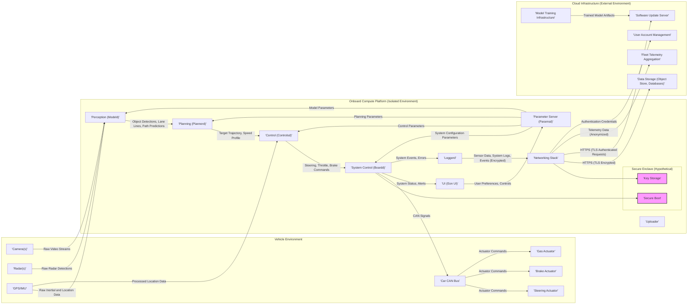
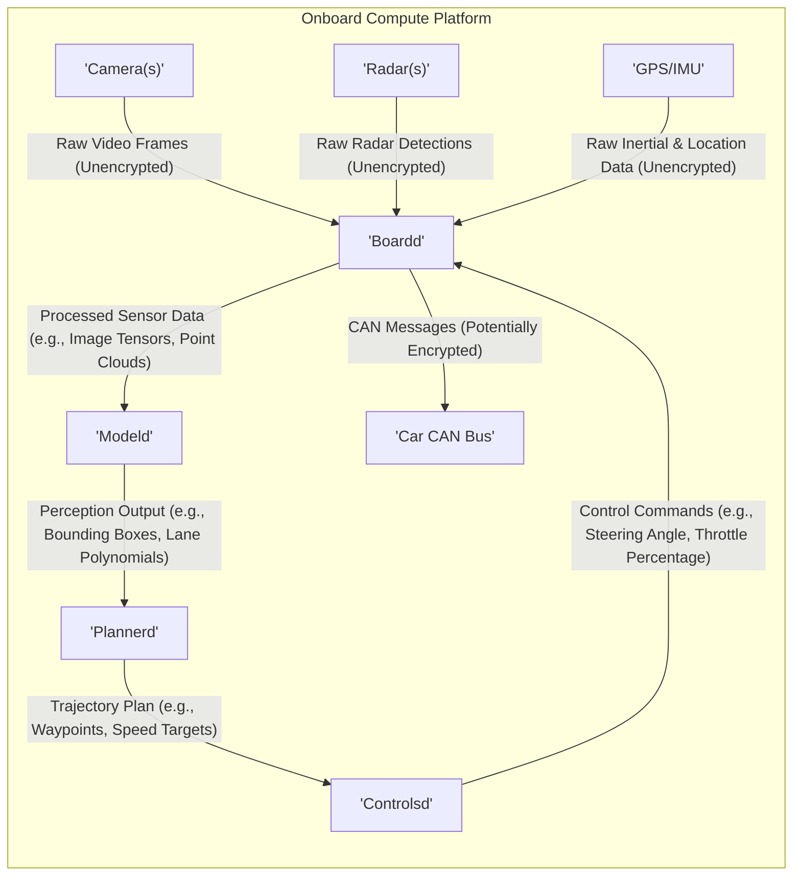
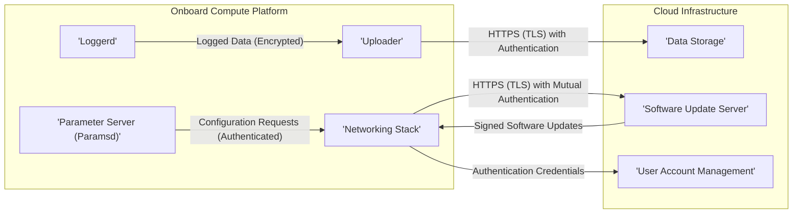

# Project Design Document: Openpilot (Improved)

**Version:** 2.0
**Date:** October 26, 2023
**Prepared By:** AI Software Architect

## 1. Introduction

This document provides an enhanced architectural design of the openpilot project, an open-source advanced driver-assistance system (ADAS) by comma.ai. This revised document offers greater detail and clarity to facilitate a more comprehensive and effective threat modeling process. It builds upon the previous version by elaborating on component functionalities, data flow specifics, and security considerations.

## 2. Goals and Objectives

The primary goal remains to provide a clear and detailed architectural description of openpilot specifically for threat modeling. Improved objectives include:

*   Providing more granular descriptions of key components and their security-relevant functionalities.
*   Precisely mapping the types of data flowing within the system and across its boundaries.
*   Clarifying the interactions and dependencies between different modules, highlighting potential trust boundaries.
*   Identifying critical interfaces, communication channels, and data storage locations with a security lens.
*   Offering enhanced visual representations of the system architecture and data flows.

## 3. High-Level Architecture

Openpilot's architecture is distributed across the vehicle, an onboard compute platform, and cloud infrastructure. Understanding these boundaries is crucial for threat modeling.

## 4. Detailed Component Description

This section provides a more detailed breakdown of each component, emphasizing security-relevant aspects.

*   **Vehicle Environment Components:**
    *   **Camera(s):** Provide visual input. Vulnerable to spoofing or obstruction.
    *   **Radar(s):** Provide distance and velocity measurements. Susceptible to jamming or spoofing.
    *   **GPS/IMU:** Provide location and orientation. Vulnerable to GPS spoofing.
    *   **Car CAN Bus:** The central nervous system of the vehicle. Unauthorized access can lead to critical control manipulation. Requires robust access control and message authentication.
    *   **Steering, Brake, Gas Actuators:**  Physical interfaces for controlling the vehicle. Compromise here has direct safety implications.

*   **Onboard Compute Platform Components (Running in a potentially hostile environment):**
    *   **System Control (Boardd):**  Manages hardware interfaces, sensor data acquisition, and actuator control. A critical component requiring strong security measures to prevent unauthorized control. Responsible for enforcing safety limits.
    *   **Perception (Modeld):**  Runs neural networks for environment understanding. Vulnerable to adversarial attacks on the models or input data.
    *   **Planning (Plannerd):**  Generates driving trajectories. Compromise could lead to unsafe or unpredictable behavior.
    *   **Control (Controlsd):**  Calculates control commands. Directly impacts vehicle behavior. Requires rigorous validation and safety checks.
    *   **Loggerd:** Logs sensitive data. Requires secure storage and access controls, including encryption at rest.
    *   **Uploader:** Transmits data to the cloud. Requires secure and authenticated communication channels (HTTPS with TLS).
    *   **UI (Eon UI):**  Provides user interaction. Vulnerable to UI redressing or malicious input.
    *   **Parameter Server (Paramsd):** Stores configuration parameters. Unauthorized modification could destabilize the system. Requires access controls.
    *   **Networking Stack:** Manages network communication. Requires secure protocols and firewall configurations.
    *   **Secure Enclave (Hypothetical):**  A dedicated secure area for storing cryptographic keys and performing sensitive operations like secure boot. This enhances trust and security.
        *   **Key Storage:** Securely stores cryptographic keys used for encryption, authentication, and signing.
        *   **Secure Boot:** Ensures that only authorized software can run on the device, preventing the execution of malicious code.

*   **Cloud Infrastructure Components (Managed in a data center environment):**
    *   **Data Storage:** Stores vast amounts of sensor data, logs, and model data. Requires robust security measures to protect against unauthorized access and data breaches, including encryption at rest and in transit.
    *   **Model Training Infrastructure:** Used to train and validate deep learning models. Requires secure access controls and protection against data poisoning.
    *   **Software Update Server:** Distributes software updates to the onboard devices. Requires secure signing of updates to prevent malicious code injection.
    *   **Fleet Telemetry Aggregation:** Collects anonymized data from deployed devices. Requires careful consideration of privacy implications and data anonymization techniques.
    *   **User Account Management:** Manages user accounts and authentication for accessing cloud services. Requires strong password policies and multi-factor authentication.

## 5. Data Flow Diagrams

These diagrams provide more detailed views of data flow, highlighting sensitive data and communication channels.

### 5.1. Enhanced Core Driving Loop with Data Types

### 5.2. Detailed Cloud Interaction with Security Considerations

## 6. Key Technologies (with Security Implications)

*   **Programming Languages:** Python (potential for vulnerabilities), C++ (memory safety concerns), Go (memory safe, good for networking).
*   **Deep Learning Frameworks:** PyTorch (potential for model manipulation, adversarial attacks).
*   **Operating System:** Custom Linux (security hardening is crucial, regular patching required).
*   **Communication Protocols:** CAN bus (lacks inherent security, requires additional security measures), TCP/IP (vulnerable to attacks if not configured correctly), HTTP(S) (HTTPS provides encryption and authentication).
*   **Data Storage:** Cloud-based object storage (requires robust access control, encryption at rest and in transit), Databases (SQL injection risks, access control).
*   **Cryptography:**  Usage of TLS for communication, potential for encryption at rest. Key management is critical.

## 7. Deployment Model

Openpilot is deployed on a dedicated onboard compute device within a supported vehicle. The physical security of the device is a concern. Network connectivity introduces attack vectors. Secure pairing and authentication are necessary.

## 8. Security Considerations (Expanded)

This section expands on the initial security considerations, providing more specific examples and potential threats.

*   **Data Security:**
    *   **Threats:** Data breaches in the cloud, unauthorized access to logs on the device, tampering with sensor data.
    *   **Mitigations:** Encryption at rest and in transit, strong access controls, data loss prevention mechanisms.
*   **Communication Security:**
    *   **Threats:** Man-in-the-middle attacks, eavesdropping, replay attacks.
    *   **Mitigations:** Use of HTTPS with TLS, mutual authentication, secure key exchange mechanisms.
*   **Software Integrity:**
    *   **Threats:** Installation of malicious software, tampering with critical system files.
    *   **Mitigations:** Secure boot, code signing, integrity checks, regular software updates.
*   **Access Control:**
    *   **Threats:** Unauthorized access to sensitive system components, modification of configuration parameters.
    *   **Mitigations:** Role-based access control, strong authentication mechanisms, principle of least privilege.
*   **Vehicle Control Security:**
    *   **Threats:** Remote exploitation leading to unauthorized control of steering, braking, or acceleration. CAN bus injection attacks.
    *   **Mitigations:** Input validation, rate limiting, anomaly detection, CAN bus security measures (e.g., message authentication).
*   **Privacy:**
    *   **Threats:** Collection and misuse of personal driving data, lack of transparency.
    *   **Mitigations:** Data anonymization, clear privacy policies, user consent mechanisms, data minimization.
*   **Supply Chain Security:**
    *   **Threats:** Compromised hardware or software components introduced during manufacturing or development.
    *   **Mitigations:**  Vendor vetting, secure development practices, hardware security modules.
*   **Adversarial Attacks on Perception:**
    *   **Threats:**  Crafting malicious inputs (e.g., stickers on stop signs) to fool the perception system.
    *   **Mitigations:** Robust training data, adversarial training techniques, sensor fusion.

## 9. Assumptions and Constraints

*   The onboard compute platform is assumed to be a single, relatively isolated unit, although physical access is a concern.
*   Cloud infrastructure is assumed to be managed by reputable providers with their own security measures.
*   This document focuses on the logical architecture and does not delve into the intricacies of specific hardware implementations.

## 10. Future Considerations

*   Detailed threat modeling using methodologies like STRIDE.
*   Security architecture diagrams highlighting trust boundaries and security controls.
*   Detailed security requirements for each component.
*   Incident response plan for security breaches.
*   Regular security audits and penetration testing.

This improved design document provides a more comprehensive and security-focused view of the openpilot architecture, enabling a more thorough and effective threat modeling process. The added details on data types, communication channels, and potential threats will be valuable in identifying and mitigating security risks.