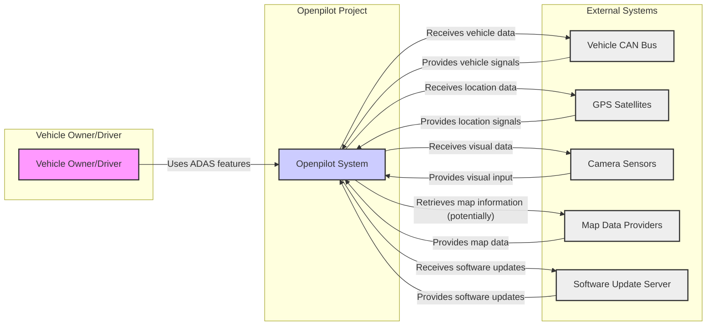
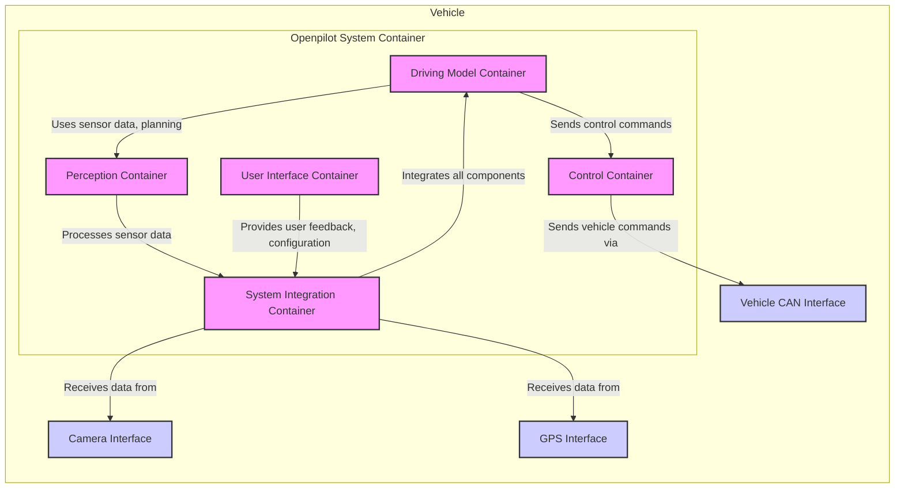

# BUSINESS POSTURE

- Business Priorities and Goals:
  - Primary goal: To provide an open-source advanced driver-assistance system (ADAS) that enhances vehicle safety and convenience.
  - Secondary goal: To foster a community of developers and researchers to contribute to and improve ADAS technology.
  - Tertiary goal: To demonstrate the feasibility and potential of open-source approaches in safety-critical automotive systems.

- Business Risks:
  - Safety risks: Malfunctions or vulnerabilities in openpilot could lead to accidents, injuries, or fatalities. This is the most critical risk due to the safety-critical nature of ADAS.
  - Reputational risks: Negative incidents or security breaches could damage the reputation of the openpilot project and the organizations or individuals involved.
  - Legal and liability risks: Accidents or incidents caused by openpilot could lead to legal liabilities for developers, contributors, and users.
  - Adoption risks: Limited adoption by the general public due to safety concerns, complexity, or lack of official support from car manufacturers.
  - Community sustainability risks: Dependence on volunteer contributions and the potential for community fragmentation or lack of maintenance.

# SECURITY POSTURE

- Existing Security Controls:
  - security control: Open-source code review process (described in GitHub contribution guidelines and pull request reviews).
  - security control: Use of GitHub for version control and collaboration, providing transparency and auditability of code changes.
  - security control: Community-driven security vulnerability reporting and patching (implicitly through open-source nature).
  - security control: Code linters and static analysis tools are likely used by developers (though not explicitly documented in the provided context, it's a common practice in software development).
  - security control: Reliance on the underlying operating system and hardware security features of the devices openpilot runs on.
  - accepted risk: Dependence on community vigilance for identifying and reporting security vulnerabilities.
  - accepted risk: Potential for vulnerabilities to exist in dependencies and third-party libraries used by openpilot.
  - accepted risk: Limited formal security testing and penetration testing due to the open-source and community-driven nature of the project.

- Recommended Security Controls:
  - security control: Implement automated security scanning in the CI/CD pipeline, including SAST and dependency vulnerability scanning.
  - security control: Establish a formal security vulnerability disclosure and response process.
  - security control: Conduct regular security audits and penetration testing by security experts.
  - security control: Implement input validation and sanitization at all interfaces, especially when interacting with vehicle systems and external data sources.
  - security control: Strengthen access controls and authorization mechanisms within the openpilot software to prevent unauthorized actions.
  - security control: Implement secure coding practices and guidelines, and provide security training to developers.

- Security Requirements:
  - Authentication:
    - Requirement: While direct user authentication to openpilot software might not be applicable in a running vehicle, authentication is crucial for development and deployment processes.
    - Requirement: Secure authentication for developers accessing development infrastructure (e.g., GitHub, build servers).
  - Authorization:
    - Requirement: Implement authorization mechanisms within openpilot to control access to sensitive functionalities and vehicle control commands.
    - Requirement: Role-based access control for development and deployment environments.
  - Input Validation:
    - Requirement: Rigorous input validation for all data received from vehicle sensors (cameras, CAN bus, GPS), external sources (maps, weather data), and user interfaces (if any).
    - Requirement: Sanitize inputs to prevent injection attacks and ensure data integrity.
  - Cryptography:
    - Requirement: Use cryptography to protect sensitive data in transit and at rest, such as communication with backend services (if any) and potentially stored configuration data.
    - Requirement: Securely manage cryptographic keys and certificates.
    - Requirement: Consider code signing for releases to ensure integrity and authenticity.

# DESIGN

## C4 CONTEXT



- Context Diagram Elements:
  - Element:
    - Name: Vehicle Owner/Driver
    - Type: Person
    - Description: The end-user who owns or drives the vehicle equipped with openpilot and benefits from its ADAS features.
    - Responsibilities: Operate the vehicle, engage and disengage openpilot, monitor system performance, and maintain awareness of driving conditions.
    - Security controls: Responsible driving practices, understanding system limitations, and proper engagement/disengagement procedures.
  - Element:
    - Name: Openpilot System
    - Type: Software System
    - Description: The open-source advanced driver-assistance system software that runs on compatible hardware within a vehicle.
    - Responsibilities: Perceive the environment using sensors, plan driving actions, control vehicle actuators (steering, throttle, brakes), and provide driver assistance features.
    - Security controls: Input validation, authorization within the system, secure communication with vehicle systems, software update mechanisms, and robust error handling.
  - Element:
    - Name: Vehicle CAN Bus
    - Type: System
    - Description: The Controller Area Network bus within the vehicle, used for communication between electronic control units (ECUs), including sensors and actuators.
    - Responsibilities: Transmit vehicle signals and control commands between different vehicle components.
    - Security controls: Vehicle manufacturer's security measures to protect the CAN bus from unauthorized access and manipulation (beyond openpilot's direct control).
  - Element:
    - Name: GPS Satellites
    - Type: System
    - Description: Global Positioning System satellites providing location data to the vehicle.
    - Responsibilities: Provide accurate location and time information.
    - Security controls: GPS signal integrity and availability (vulnerable to jamming and spoofing, but openpilot relies on sensor fusion and redundancy).
  - Element:
    - Name: Camera Sensors
    - Type: System
    - Description: Cameras mounted on the vehicle providing visual input to the openpilot system.
    - Responsibilities: Capture images and video of the vehicle's surroundings.
    - Security controls: Physical security of cameras, data integrity of captured images, and protection against camera tampering.
  - Element:
    - Name: Map Data Providers
    - Type: External System
    - Description: Services providing map data for navigation and localization (potentially used by openpilot for enhanced features).
    - Responsibilities: Provide accurate and up-to-date map information.
    - Security controls: Secure communication channels for retrieving map data, data integrity of received map information, and protection against malicious map data injection.
  - Element:
    - Name: Software Update Server
    - Type: External System
    - Description: Server infrastructure used to distribute software updates for the openpilot system.
    - Responsibilities: Securely store and distribute software updates, authenticate update requests, and ensure update integrity.
    - Security controls: Secure server infrastructure, authentication and authorization for update distribution, code signing of updates, and secure communication channels for updates.

## C4 CONTAINER



- Container Diagram Elements:
  - Element:
    - Name: Driving Model Container
    - Type: Software Container (Process/Module)
    - Description: Contains the driving model logic, including path planning, decision-making, and behavior arbitration.
    - Responsibilities: Generate driving commands based on perception data and system state, plan safe and efficient trajectories, and manage driving behavior.
    - Security controls: Input validation of perception data, robust logic to prevent unsafe driving decisions, and internal authorization for critical functions.
  - Element:
    - Name: Perception Container
    - Type: Software Container (Process/Module)
    - Description: Processes sensor data from cameras, GPS, and potentially other sensors to understand the vehicle's environment.
    - Responsibilities: Object detection, lane detection, road segmentation, localization, and environment mapping.
    - Security controls: Input validation of sensor data, sensor data fusion techniques for redundancy and error detection, and protection against sensor spoofing or manipulation.
  - Element:
    - Name: Control Container
    - Type: Software Container (Process/Module)
    - Description: Responsible for translating driving commands into vehicle control actions (steering, throttle, brakes) via the CAN bus.
    - Responsibilities: Vehicle control, actuator management, and safety monitoring of control actions.
    - Security controls: Authorization to send control commands to the CAN bus, safety checks on control commands before execution, and fail-safe mechanisms in case of errors.
  - Element:
    - Name: System Integration Container
    - Type: Software Container (Process/Module)
    - Description: Integrates all other containers, manages data flow, system initialization, and overall system coordination.
    - Responsibilities: System startup, shutdown, inter-process communication, data management, logging, and monitoring.
    - Security controls: Secure inter-process communication, system-level access controls, logging and auditing of system events, and secure configuration management.
  - Element:
    - Name: User Interface Container
    - Type: Software Container (Process/Module)
    - Description: Provides a user interface (if any) for system configuration, monitoring, and feedback.
    - Responsibilities: Display system status, allow user configuration (within safe limits), and provide alerts and warnings.
    - Security controls: Authentication and authorization for user interface access, input validation of user inputs, and protection against UI-based attacks.
  - Element:
    - Name: Vehicle CAN Interface
    - Type: Interface
    - Description: Software interface for communicating with the vehicle's CAN bus.
    - Responsibilities: Send and receive CAN messages, translate between openpilot's internal data format and CAN bus protocols.
    - Security controls: CAN bus communication security (as provided by the vehicle), and filtering of CAN messages to prevent unauthorized commands.
  - Element:
    - Name: Camera Interface
    - Type: Interface
    - Description: Software interface for receiving data from camera sensors.
    - Responsibilities: Capture images and video streams from cameras, pre-process camera data (e.g., calibration, distortion correction).
    - Security controls: Secure camera data acquisition, data integrity checks, and protection against camera data manipulation.
  - Element:
    - Name: GPS Interface
    - Type: Interface
    - Description: Software interface for receiving data from GPS receiver.
    - Responsibilities: Acquire GPS location data, parse GPS messages, and provide location information to the system.
    - Security controls: GPS data validation, and potentially sensor fusion with other location sources to mitigate GPS spoofing.

## DEPLOYMENT

- Deployment Architecture Options:
  - Option 1: Embedded System Deployment - Openpilot runs directly on a dedicated embedded hardware device installed in the vehicle. This is the most common deployment scenario.
  - Option 2: Cloud-Connected Deployment - Openpilot connects to cloud services for data logging, remote monitoring, and potentially map data or software updates.
  - Option 3: Development/Simulation Environment - Openpilot runs in a simulated environment for development, testing, and validation.

- Detailed Deployment Architecture (Option 1: Embedded System Deployment):

```mermaid
flowchart LR
    subgraph "Vehicle Environment"
        A[Embedded Hardware Device]
        subgraph "Operating System"
            B[Operating System (e.g., Linux)]
        end
        subgraph "Openpilot Software"
            C[Openpilot Containers]
        end
        D[Vehicle CAN Bus]
        E[Camera Sensors]
        F[GPS Receiver]
    end

    A -- "Runs" --> B
    B -- "Runs" --> C
    A -- "Connects to" --> D
    A -- "Connects to" --> E
    A -- "Connects to" --> F
    C -- "Interacts with" --> D
    C -- "Interacts with" --> E
    C -- "Interacts with" --> F

    style A fill:#ccf,stroke:#333,stroke-width:2px
    style B fill:#eee,stroke:#333,stroke-width:2px
    style C fill:#f9f,stroke:#333,stroke-width:2px
    style D fill:#eee,stroke:#333,stroke-width:2px
    style E fill:#eee,stroke:#333,stroke-width:2px
    style F fill:#eee,stroke:#333,stroke-width:2px
```

- Deployment Diagram Elements:
  - Element:
    - Name: Embedded Hardware Device
    - Type: Hardware Device
    - Description: A dedicated hardware device (e.g., comma three, comma two) installed in the vehicle to run the openpilot software.
    - Responsibilities: Provide computational resources, interfaces to vehicle sensors and actuators, and a secure execution environment for openpilot.
    - Security controls: Hardware security features of the device, secure boot process, and physical security of the device within the vehicle.
  - Element:
    - Name: Operating System (e.g., Linux)
    - Type: Software
    - Description: The operating system running on the embedded hardware device, providing system services and managing hardware resources.
    - Responsibilities: Resource management, process isolation, security features, and device driver support.
    - Security controls: OS-level security features (e.g., access controls, kernel hardening), regular security updates, and secure OS configuration.
  - Element:
    - Name: Openpilot Containers
    - Type: Software Containers
    - Description: The set of software containers (Driving Model, Perception, Control, etc.) that constitute the openpilot application.
    - Responsibilities: Implement the ADAS functionalities as described in the Container Diagram.
    - Security controls: Container isolation, least privilege principles for container processes, and security controls within each container as described previously.
  - Element:
    - Name: Vehicle CAN Bus
    - Type: Network
    - Description: The vehicle's CAN bus network.
    - Responsibilities: Vehicle communication network.
    - Security controls: Vehicle manufacturer's CAN bus security.
  - Element:
    - Name: Camera Sensors
    - Type: Hardware
    - Description: Vehicle camera sensors.
    - Responsibilities: Capture visual data.
    - Security controls: Physical security of cameras.
  - Element:
    - Name: GPS Receiver
    - Type: Hardware
    - Description: GPS receiver in the vehicle.
    - Responsibilities: Provide location data.
    - Security controls: GPS signal reception integrity.

## BUILD

```mermaid
flowchart LR
    subgraph "Developer Environment"
        A[Developer]
        B[Code Repository (GitHub)]
    end
    subgraph "CI/CD Pipeline (GitHub Actions)"
        C[Build Automation (GitHub Actions)]
        D[Static Analysis Tools (SAST, Linters)]
        E[Dependency Scanning]
        F[Unit Tests]
        G[Integration Tests]
        H[Build Artifacts]
    end
    subgraph "Distribution"
        I[Software Update Server]
    end

    A -- "Code Changes" --> B
    B -- "Triggers" --> C
    C -- "Runs" --> D
    C -- "Runs" --> E
    C -- "Runs" --> F
    C -- "Runs" --> G
    C -- "Produces" --> H
    H -- "Published to" --> I

    style A fill:#f9f,stroke:#333,stroke-width:2px
    style B fill:#ccf,stroke:#333,stroke-width:2px
    style C fill:#ccf,stroke:#333,stroke-width:2px
    style D fill:#eee,stroke:#333,stroke-width:2px
    style E fill:#eee,stroke:#333,stroke-width:2px
    style F fill:#eee,stroke:#333,stroke-width:2px
    style G fill:#eee,stroke:#333,stroke-width:2px
    style H fill:#eee,stroke:#333,stroke-width:2px
    style I fill:#ccf,stroke:#333,stroke-width:2px
```

- Build Process Elements:
  - Element:
    - Name: Developer
    - Type: Person
    - Description: Software developers contributing to the openpilot project.
    - Responsibilities: Write code, commit changes, and contribute to the project.
    - Security controls: Secure development practices, code review participation, and adherence to security guidelines.
  - Element:
    - Name: Code Repository (GitHub)
    - Type: System
    - Description: GitHub repository hosting the openpilot source code.
    - Responsibilities: Version control, code collaboration, and source code management.
    - Security controls: Access controls to the repository, branch protection rules, and audit logging of code changes.
  - Element:
    - Name: Build Automation (GitHub Actions)
    - Type: System
    - Description: GitHub Actions workflows automating the build, test, and release process.
    - Responsibilities: Automated build execution, running security checks, and generating build artifacts.
    - Security controls: Secure configuration of CI/CD pipelines, access controls to CI/CD workflows, and secrets management for build processes.
  - Element:
    - Name: Static Analysis Tools (SAST, Linters)
    - Type: Tool
    - Description: Static analysis security testing tools and code linters used to identify potential vulnerabilities and code quality issues.
    - Responsibilities: Automated code analysis for security flaws and coding standard violations.
    - Security controls: Regularly updated tool versions and configuration to detect latest vulnerability patterns.
  - Element:
    - Name: Dependency Scanning
    - Type: Tool
    - Description: Tools to scan project dependencies for known vulnerabilities.
    - Responsibilities: Identify vulnerable dependencies and alert developers to update or mitigate them.
    - Security controls: Regularly updated vulnerability databases and automated scanning in the CI/CD pipeline.
  - Element:
    - Name: Unit Tests
    - Type: Process
    - Description: Automated unit tests to verify the functionality of individual code components.
    - Responsibilities: Ensure code correctness and prevent regressions.
    - Security controls: Tests covering security-relevant functionalities and edge cases.
  - Element:
    - Name: Integration Tests
    - Type: Process
    - Description: Automated integration tests to verify the interaction between different components.
    - Responsibilities: Ensure proper integration and system-level functionality.
    - Security controls: Tests covering security aspects of component interactions.
  - Element:
    - Name: Build Artifacts
    - Type: Data
    - Description: Compiled binaries, installation packages, and other build outputs.
    - Responsibilities: Deployable software artifacts.
    - Security controls: Code signing of artifacts to ensure integrity and authenticity, secure storage of build artifacts.
  - Element:
    - Name: Software Update Server
    - Type: System
    - Description: Server for distributing software updates.
    - Responsibilities: Securely distribute software updates to users.
    - Security controls: Secure server infrastructure, authentication and authorization for update distribution, and integrity checks of updates.

# RISK ASSESSMENT

- Critical Business Processes:
  - Safe vehicle operation: The most critical process is ensuring the safe operation of vehicles using openpilot. Failures in this process can lead to accidents and injuries.
  - Software updates: Secure and reliable software updates are crucial for delivering bug fixes, security patches, and new features without compromising system integrity.
  - Community contributions: Maintaining a healthy and secure community contribution process is important for the long-term sustainability and security of the project.

- Data Sensitivity:
  - Vehicle sensor data (camera, CAN, GPS): High sensitivity. Compromise or manipulation of this data can directly impact safety and vehicle control.
  - Location data: Moderate sensitivity. Location data can reveal user driving patterns and habits.
  - System logs and diagnostics: Low to moderate sensitivity. Logs may contain operational information that could be used for debugging or analysis, but could also reveal system vulnerabilities if exposed.
  - User configuration data: Low sensitivity. User preferences and configuration settings are generally not highly sensitive.

# QUESTIONS & ASSUMPTIONS

- Questions:
  - What is the intended deployment environment for openpilot (specific hardware, vehicle types)?
  - Are there any specific regulatory compliance requirements for openpilot (e.g., automotive safety standards)?
  - What is the process for handling security vulnerabilities reported by the community?
  - Are there any plans for formal security audits or penetration testing?
  - What is the strategy for managing cryptographic keys and sensitive configuration data within openpilot?

- Assumptions:
  - Assumption: Openpilot is primarily intended for research and development purposes, with a focus on safety and open collaboration.
  - Assumption: Security is a high priority for the openpilot project, given the safety-critical nature of ADAS.
  - Assumption: The open-source community plays a significant role in identifying and addressing security vulnerabilities.
  - Assumption: Deployment is primarily on embedded Linux-based systems within vehicles.
  - Assumption: Software updates are distributed through a dedicated update server.