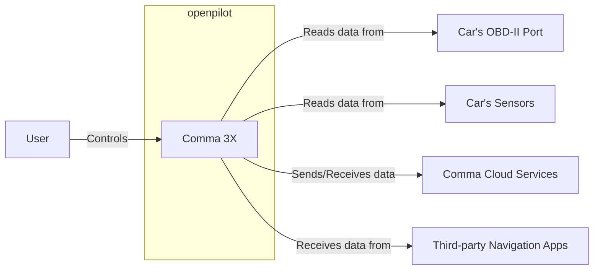
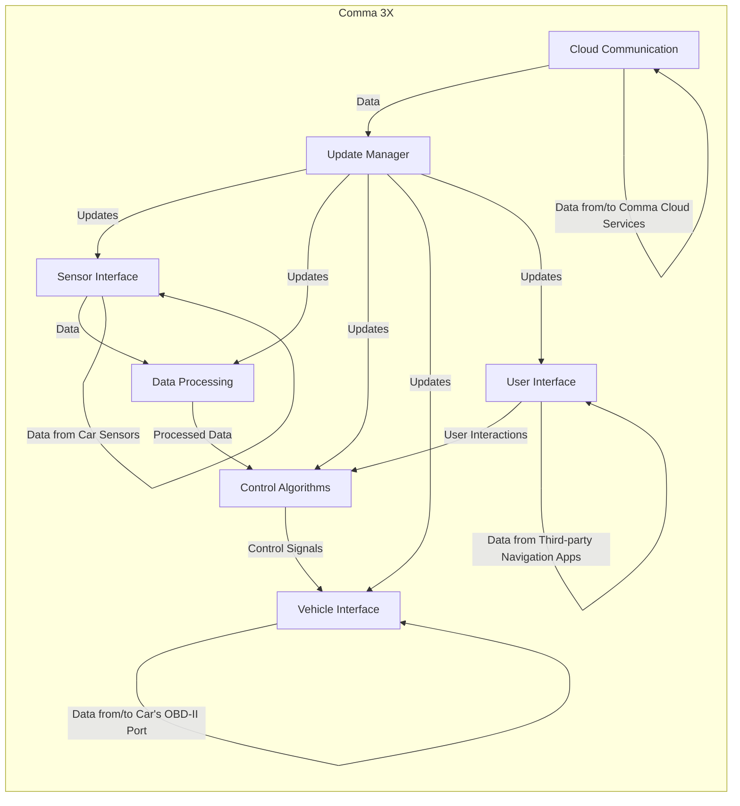
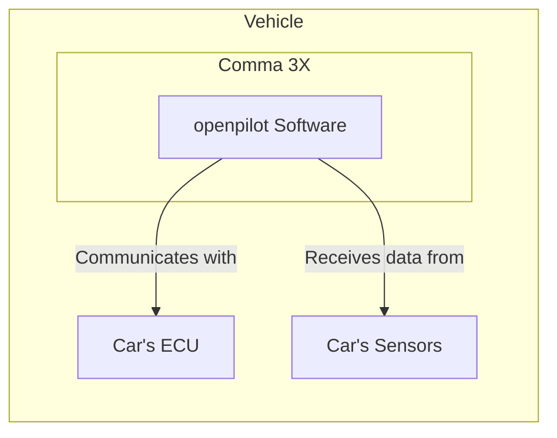

# BUSINESS POSTURE

Business Priorities and Goals:

*   Provide a commercially viable, advanced driver-assistance system (ADAS) that surpasses existing OEM offerings in terms of functionality and performance.
*   Maintain an open-source codebase to foster community contributions and rapid innovation.
*   Offer a system that is compatible with a wide range of vehicle makes and models.
*   Ensure the safety and reliability of the system, given its direct control over vehicle steering, acceleration, and braking.
*   Monetize through hardware sales (Comma 3X device) and potentially through subscription services for advanced features.
*   Build a strong brand reputation and community trust.

Most Important Business Risks:

*   Safety incidents (accidents, injuries, or fatalities) caused by malfunctions or misuse of OpenPilot. This is by far the most significant risk, potentially leading to legal liabilities, reputational damage, and regulatory intervention.
*   Security vulnerabilities that could allow malicious actors to compromise the system and control a vehicle remotely.
*   Failure to maintain compatibility with a sufficiently broad range of vehicles, limiting market reach.
*   Inability to keep pace with technological advancements in the ADAS space, leading to obsolescence.
*   Negative public perception or regulatory scrutiny due to the open-source nature of the project and the potential for user modifications.
*   Supply chain disruptions affecting the availability of hardware components.
*   Infringement of intellectual property rights of other companies.

# SECURITY POSTURE

Existing Security Controls:

*   security control: Code review process (mentioned in contribution guidelines). Location: GitHub repository and pull request process.
*   security control: Use of memory-safe languages (Python, C++) to mitigate memory corruption vulnerabilities. Location: Source code.
*   security control: Community-driven security audits and bug bounty programs (implied by the open-source nature). Location: GitHub issues and community forums.
*   security control: Over-the-air (OTA) updates for rapid deployment of security patches. Location: Update mechanism described in documentation.
*   security control: Driver monitoring system to ensure driver attentiveness and prevent misuse. Location: Described in documentation and implemented in code.
*   security control: Limited attack surface due to the dedicated hardware device (Comma 3X). Location: Hardware design.
*   security control: Data encryption at rest and in transit (assumed, but needs verification). Location: Needs verification.
*   security control: Input sanitization and validation (assumed, but needs verification). Location: Needs verification.

Accepted Risks:

*   accepted risk: Reliance on community contributions for security audits and bug fixes.
*   accepted risk: Potential for user modifications to introduce vulnerabilities.
*   accepted risk: Limited formal security certifications compared to OEM systems.
*   accepted risk: The inherent risks associated with controlling safety-critical vehicle functions.

Recommended Security Controls:

*   Implement a formal Software Bill of Materials (SBOM) to track all software components and dependencies.
*   Conduct regular static and dynamic application security testing (SAST and DAST).
*   Establish a formal vulnerability disclosure program.
*   Implement a robust code signing mechanism for OTA updates.
*   Perform penetration testing to identify and address vulnerabilities.
*   Develop a comprehensive threat model for the system.
*   Implement secure boot and secure element on the Comma 3X device.
*   Enhance input validation and sanitization throughout the codebase.
*   Implement runtime application self-protection (RASP) capabilities.

Security Requirements:

*   Authentication:
    *   The Comma 3X device should authenticate to cloud services securely.
    *   OTA updates should be authenticated and verified before installation.
*   Authorization:
    *   Access to sensitive vehicle controls should be restricted to authorized components and processes.
    *   User modifications should be restricted to prevent unauthorized access to safety-critical functions.
*   Input Validation:
    *   All inputs from sensors, user interfaces, and external sources should be rigorously validated to prevent injection attacks and unexpected behavior.
    *   CAN bus messages should be validated for authenticity and integrity.
*   Cryptography:
    *   Sensitive data should be encrypted at rest and in transit.
    *   Cryptographic keys should be managed securely.
    *   Strong cryptographic algorithms should be used.

# DESIGN

## C4 CONTEXT



Element Descriptions:

*   1.  Name: User
    *   Type: Person
    *   Description: The driver of the vehicle.
    *   Responsibilities: Monitors the system, provides input, and takes control when necessary.
    *   Security controls: Driver monitoring system.

*   2.  Name: Comma 3X
    *   Type: Hardware Device
    *   Description: The main hardware device running OpenPilot.
    *   Responsibilities: Processes sensor data, executes control algorithms, communicates with the vehicle and cloud services.
    *   Security controls: Secure boot (recommended), secure element (recommended), limited attack surface, OTA updates.

*   3.  Name: Car's OBD-II Port
    *   Type: Interface
    *   Description: The On-Board Diagnostics port of the vehicle.
    *   Responsibilities: Provides access to vehicle data and control signals.
    *   Security controls: Input validation (recommended), CAN bus message filtering (recommended).

*   4.  Name: Car's Sensors
    *   Type: Hardware
    *   Description: The vehicle's built-in sensors (cameras, radar, etc.).
    *   Responsibilities: Provide data about the vehicle's surroundings.
    *   Security controls: Input validation (recommended).

*   5.  Name: Comma Cloud Services
    *   Type: External System
    *   Description: Cloud services provided by Comma.ai.
    *   Responsibilities: Provides OTA updates, data logging, and potentially other services.
    *   Security controls: Authentication, authorization, data encryption (assumed).

*   6.  Name: Third-party Navigation Apps
    *   Type: External System
    *   Description: Navigation applications used for routing.
    *   Responsibilities: Provide navigation data to OpenPilot.
    *   Security controls: Input validation (recommended).

## C4 CONTAINER



Element Descriptions:

*   1.  Name: Sensor Interface
    *   Type: Software Component
    *   Description: Handles communication with the vehicle's sensors.
    *   Responsibilities: Reads and preprocesses sensor data.
    *   Security controls: Input validation.

*   2.  Name: Data Processing
    *   Type: Software Component
    *   Description: Processes sensor data to create a model of the environment.
    *   Responsibilities: Object detection, lane detection, path planning.
    *   Security controls: Input validation, anomaly detection (recommended).

*   3.  Name: Control Algorithms
    *   Type: Software Component
    *   Description: Executes control algorithms to steer, accelerate, and brake the vehicle.
    *   Responsibilities: Maintains safe following distance, lane keeping, adaptive cruise control.
    *   Security controls: Runtime monitoring (recommended), fail-safe mechanisms.

*   4.  Name: Vehicle Interface
    *   Type: Software Component
    *   Description: Handles communication with the vehicle's control systems.
    *   Responsibilities: Sends control signals to the vehicle via the OBD-II port.
    *   Security controls: Input validation, CAN bus message filtering (recommended), output sanitization.

*   5.  Name: Cloud Communication
    *   Type: Software Component
    *   Description: Handles communication with Comma Cloud Services.
    *   Responsibilities: Sends data logs, receives OTA updates.
    *   Security controls: Authentication, authorization, data encryption.

*   6.  Name: User Interface
    *   Type: Software Component
    *   Description: Provides information to the driver and receives input.
    *   Responsibilities: Displays system status, warnings, and allows driver input.
    *   Security controls: Input validation.

*   7.  Name: Update Manager
    *   Type: Software Component
    *   Description: Manages over-the-air (OTA) updates.
    *   Responsibilities: Downloads, verifies, and installs updates.
    *   Security controls: Code signing, authentication, integrity checks.

## DEPLOYMENT

Possible Deployment Solutions:

1.  On-Premise (Comma 3X Device): The primary deployment environment is the Comma 3X device itself, which is installed in the vehicle.
2.  Cloud (Comma Cloud Services): Some components, such as OTA update servers and data logging services, are deployed in the cloud.
3.  Hybrid: A combination of on-premise and cloud deployments.

Chosen Solution (Detailed Description): On-Premise (Comma 3X Device)



Element Descriptions:

*   1.  Name: openpilot Software
    *   Type: Software
    *   Description: The OpenPilot software stack.
    *   Responsibilities: Runs on the Comma 3X device and controls the vehicle.
    *   Security controls: All previously mentioned security controls for the software components.

*   2.  Name: Car's ECU
    *   Type: Hardware
    *   Description: The vehicle's Electronic Control Unit.
    *   Responsibilities: Controls various vehicle functions.
    *   Security controls: Limited access via OBD-II port, input validation (recommended).

*   3.  Name: Car's Sensors
    *   Type: Hardware
    *   Description: The vehicle's sensors.
    *   Responsibilities: Provide data to OpenPilot.
    *   Security controls: Input validation (recommended).

## BUILD

The build process for OpenPilot is complex and involves multiple tools and steps. It leverages SCons, a Python-based build system. The build process can vary depending on the target platform (e.g., the Comma 3X device, a simulator, or a development environment).

```mermaid
graph LR
    A[Developer] --> B[GitHub Repository]
    B -- Pull Request --> C[Code Review]
    C -- Approved --> D[Automated Build (SCons)]
    D -- Builds --> E[openpilot Binaries]
    D -- Runs --> F[Linters]
    D -- Runs --> G[Static Analysis Tools]
    F -- Results --> H[Build Status]
    G -- Results --> H
    E --> I[OTA Update Server]
    I --> J[Comma 3X Device]
```

Security Controls in Build Process:

*   Code Review: All code changes are subject to review before being merged.
*   Linters: Code linters are used to enforce coding style and identify potential errors.
*   Static Analysis Tools: Static analysis tools (e.g., Cppcheck, Clang-Tidy) are used to detect potential bugs and security vulnerabilities. (Needs verification from the repository).
*   Automated Build: The build process is automated using SCons, ensuring consistency and reproducibility.
*   OTA Updates: The build artifacts are deployed to Comma 3X devices via over-the-air updates.

Recommended Security Controls:

*   Integrate SAST tools into the build pipeline.
*   Implement Software Composition Analysis (SCA) to identify vulnerabilities in third-party dependencies.
*   Generate and track a Software Bill of Materials (SBOM).
*   Implement code signing for build artifacts.

# RISK ASSESSMENT

Critical Business Processes:

*   Safe and reliable operation of the OpenPilot system.
*   Maintaining user trust and confidence.
*   Compliance with relevant regulations.
*   Continuous development and improvement of the system.

Data Sensitivity:

*   Vehicle sensor data (cameras, radar, etc.): Potentially sensitive, as it can reveal information about the vehicle's surroundings and driving patterns. Medium sensitivity.
*   Vehicle control data: Highly sensitive, as it directly affects the vehicle's movement.
*   User data (driving logs, preferences): Potentially sensitive, depending on the specific data collected. Medium sensitivity.
*   OTA update packages: Highly sensitive, as they can be used to modify the system's behavior.

# QUESTIONS & ASSUMPTIONS

Questions:

*   What specific static analysis tools are currently used in the build process?
*   What is the exact encryption mechanism used for data at rest and in transit?
*   What are the specific details of the input validation and sanitization procedures?
*   Is there a formal vulnerability disclosure program in place?
*   What are the specific details of the driver monitoring system's implementation and effectiveness?
*   Are there any existing security certifications or audits performed on OpenPilot?
*   What is the process for managing cryptographic keys?
*   What are the specific details of the CAN bus message filtering implementation?
*   How are third-party dependencies managed and vetted for security vulnerabilities?
*   What is the process for handling security incidents?

Assumptions:

*   BUSINESS POSTURE: The primary business goal is to provide a safe and reliable ADAS system while fostering community involvement.
*   SECURITY POSTURE: Basic security measures are in place, but there is room for improvement. The open-source nature of the project introduces both security benefits (community audits) and risks (user modifications).
*   DESIGN: The system relies heavily on the Comma 3X device and communicates with the vehicle via the OBD-II port. OTA updates are a critical component of the system. The build process is automated, but the specific security controls need further clarification.