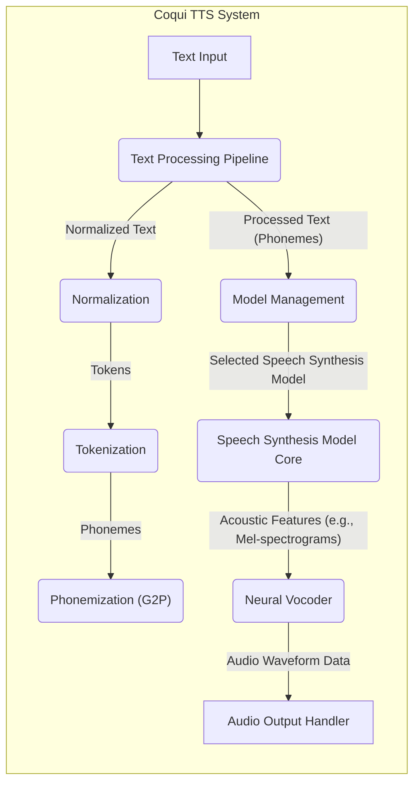

## Project Design Document: Coqui TTS (Improved)

**1. Introduction**

This document provides an enhanced and more detailed design overview of the Coqui TTS project, an open-source text-to-speech library. The primary purpose remains to meticulously outline the system's architecture, components, data flow, and key functionalities. This refined design will serve as a robust foundation for subsequent threat modeling activities, enabling a more comprehensive and targeted security assessment of the project.

**2. Goals and Scope**

*   **Goal:** To provide a clear, comprehensive, and technically accurate design description of the Coqui TTS project, specifically tailored for security analysis.
*   **Scope:** This document covers the core logical components and functionalities of the Coqui TTS library as represented in the linked GitHub repository. It focuses on the software architecture, data transformations, and interactions involved in the text-to-speech conversion process. While deployment contexts are considered, the specific details of individual deployment environments are outside the primary scope. Similarly, the intricacies of individual model architectures are mentioned but not exhaustively detailed at the code level.

**3. Target Audience**

This document is intended for a technical audience, including:

*   Security engineers and architects responsible for conducting threat modeling, penetration testing, and security audits of the Coqui TTS project.
*   Software developers contributing to the Coqui TTS project who require a deeper understanding of the system architecture and its security implications.
*   System architects and DevOps engineers involved in deploying and managing applications that integrate the Coqui TTS library.
*   Technical users and integrators of the Coqui TTS library who need detailed insight into its internal workings for debugging or customization.

**4. System Overview**

Coqui TTS is a sophisticated Python-based library designed to synthesize natural-sounding speech from textual input. It achieves this by leveraging trained machine learning models, primarily deep learning models, to perform the complex text-to-speech conversion. The library offers functionalities for loading and managing pre-trained models, programmatically generating speech from text input, and potentially fine-tuning existing models with custom data. The fundamental process involves receiving text, meticulously processing it through a series of stages, and finally outputting a digital audio waveform that represents the synthesized speech.

**5. Architectural Design**

The Coqui TTS library can be logically decomposed into the following interconnected components and their interactions:

*   **Text Input Interface:**
    *   The entry point for receiving the textual data intended for speech synthesis.
    *   Accepts text strings as input, potentially from various sources within an application or system.
    *   May include basic input validation or sanitization steps.

*   **Text Processing Pipeline:**
    *   A series of modules responsible for transforming the raw input text into a format suitable for the speech synthesis model.
    *   Comprises several sub-stages:
        *   **Normalization:** Converts the input text into a standardized format (e.g., expanding abbreviations, converting numbers to words, handling special characters).
        *   **Tokenization:** Breaks down the normalized text into individual linguistic units (words, sub-word units, or characters).
        *   **Phonemization (Grapheme-to-Phoneme - G2P):** Converts the tokens into their corresponding phonetic representations. This may involve:
            *   **Lexicon Lookup:** Consulting a pre-defined dictionary of word pronunciations.
            *   **G2P Model:** Utilizing a machine learning model trained to predict pronunciations based on spelling.
        *   **Text Analysis (Optional):** May include additional linguistic analysis, such as part-of-speech tagging or prosody prediction, to enhance the synthesized speech.

*   **Model Management Subsystem:**
    *   Handles the loading, caching, and selection of pre-trained speech synthesis models and vocoders.
    *   Provides mechanisms for:
        *   Locating model files on the local file system or remote storage.
        *   Loading model weights and configurations into memory.
        *   Switching between different models or model versions.

*   **Speech Synthesis Model Core:**
    *   The central component responsible for generating acoustic features (e.g., mel-spectrograms) from the processed phonetic representation of the text.
    *   Typically implemented using deep neural network architectures, such as:
        *   Sequence-to-Sequence models with attention mechanisms (e.g., Tacotron 2).
        *   Transformer-based architectures.
        *   Flow-based models.
    *   Receives the phonetic sequence as input and outputs a sequence of acoustic features.

*   **Neural Vocoder Module:**
    *   Responsible for converting the acoustic features generated by the speech synthesis model into raw audio waveforms.
    *   Crucial for generating high-fidelity and natural-sounding speech.
    *   Commonly employs neural network architectures like:
        *   Autoregressive models (e.g., WaveRNN).
        *   Generative Adversarial Networks (GANs) (e.g., MelGAN, Parallel WaveGAN).
        *   Flow-based models (e.g., HiFi-GAN).

*   **Audio Output Handler:**
    *   Manages the delivery of the generated audio waveform.
    *   Provides functionalities for:
        *   Saving the audio to various file formats (e.g., WAV, MP3, OGG).
        *   Playing the audio through the system's audio output devices.
        *   Streaming the audio data for real-time applications.

*   **Application Programming Interface (API) / Command Line Interface (CLI):**
    *   Provides interfaces for users and other applications to interact with the Coqui TTS library's functionalities.
    *   The API allows programmatic access to the text-to-speech capabilities within Python code.
    *   The CLI enables direct execution of speech synthesis tasks from the command line.

**6. Data Flow Diagram**

**7. Data Storage**

*   **Speech Synthesis Models (Weights and Configurations):**
    *   Stored as files on the local file system or potentially accessed from remote storage locations (e.g., cloud object storage).
    *   File formats commonly used include `.pth`, `.bin`, or model-specific formats.

*   **Vocoder Models (Weights and Configurations):**
    *   Stored similarly to speech synthesis models, as files on local or remote storage.

*   **Configuration Files (YAML, JSON, etc.):**
    *   Store settings related to model paths, audio parameters (sampling rate, etc.), language settings, and other library configurations.

*   **Lexicons/Pronunciation Dictionaries (Text Files, Databases):**
    *   Used by the phonemization module to look up pronunciations of words.

*   **Temporary Data (In-Memory):**
    *   Intermediate representations of text and audio during the synthesis process, such as:
        *   Normalized text strings.
        *   Tokenized text sequences.
        *   Phoneme sequences.
        *   Acoustic feature representations (e.g., mel-spectrograms).
        *   Raw audio waveform data before final output.

**8. Security Considerations (Detailed for Threat Modeling)**

This section expands on the initial security considerations, providing more specific examples and potential threats for a comprehensive threat model.

*   **Model Security:**
    *   **Model Tampering/Corruption:** Malicious modification of pre-trained model files could lead to the generation of incorrect, nonsensical, or even harmful speech. This could occur if the storage location lacks proper access controls or integrity checks.
    *   **Model Poisoning (if Training is Involved):** If users can contribute to the training of models (e.g., through fine-tuning), malicious actors could inject biased or backdoor-containing data, leading to compromised models.
    *   **Unauthorized Access and Distribution of Models:** Protecting the confidentiality of proprietary or commercially sensitive models from unauthorized access, copying, or redistribution. This is especially relevant if models are stored in publicly accessible locations without proper authentication.
    *   **Vulnerabilities in Model Loading/Parsing Libraries:**  Exploits targeting the libraries used to load and parse model files could lead to arbitrary code execution.

*   **Input Validation and Sanitization:**
    *   **Injection Attacks:** Insufficient validation of input text could make the system susceptible to injection attacks (e.g., if processing user-provided text for custom pronunciations or embedding within generated audio metadata).
    *   **Denial of Service (DoS):** Maliciously crafted input (e.g., extremely long strings, unusual characters) could cause excessive resource consumption, leading to performance degradation or crashes.
    *   **Bypass of Security Measures:**  Cleverly crafted input might bypass intended security checks or filters.

*   **Dependency Management:**
    *   **Vulnerabilities in Third-Party Libraries:**  The project's reliance on external libraries introduces potential vulnerabilities. Outdated or compromised dependencies could be exploited. Regular dependency scanning and updates are crucial.
    *   **Supply Chain Attacks:**  Compromised dependencies introduced through malicious package repositories or development environments.

*   **API and CLI Security (if applicable):**
    *   **Authentication and Authorization:**  Implementing robust mechanisms to verify the identity of users or applications accessing the API and to control their access to specific functionalities. Lack of authentication allows unauthorized use.
    *   **Rate Limiting:**  Protecting against abuse and denial-of-service attacks by limiting the number of requests from a single source within a given time frame.
    *   **Input Validation (API Level):**  Similar to text input validation, but applied at the API endpoint to prevent malicious payloads.
    *   **Secure Communication (HTTPS):**  Ensuring that communication over the API is encrypted to protect sensitive data in transit.
    *   **Command Injection (CLI):** If the CLI accepts user-provided arguments without proper sanitization, it could be vulnerable to command injection attacks.

*   **Data Privacy and Handling:**
    *   **Exposure of Sensitive Text Data:** If the system processes sensitive personal information within the input text, ensuring its confidentiality during processing and storage.
    *   **Storage of Audio Data:** Securely storing generated audio data, especially if it contains sensitive information or is subject to compliance regulations.
    *   **Logging and Auditing:**  Implementing secure logging mechanisms to track API usage and potential security incidents, while ensuring that logs themselves are protected from unauthorized access.

*   **Code Injection Vulnerabilities:**
    *   If the library allows users to provide custom code snippets or configurations that are executed by the system, this presents a significant risk of arbitrary code execution.

*   **Supply Chain Security (Beyond Dependencies):**
    *   Ensuring the integrity of the development pipeline, including the tools and infrastructure used to build and release the library. Compromised development tools could lead to the introduction of malicious code.

**9. Deployment Scenarios (Security Implications)**

The deployment scenario significantly impacts the security considerations:

*   **As a Library (Embedded in Applications):** Security relies heavily on the security of the host application. Vulnerabilities in the host application could be exploited through the TTS library.
*   **As a Service (API Endpoint):** Introduces network security concerns, including authentication, authorization, and protection against network-based attacks. Requires careful consideration of API security best practices.
*   **On-Premise Deployment:** Security is managed by the organization deploying the system. Requires proper infrastructure security, access controls, and monitoring.
*   **Cloud-Based Deployment:** Security is a shared responsibility between the cloud provider and the deploying organization. Requires understanding and configuring cloud security services appropriately.
*   **Edge Device Deployment:** Resource constraints on edge devices may limit the feasibility of certain security measures. Physical security of the device becomes more important.

**10. Future Considerations (Potential New Security Aspects)**

*   **Federated Learning for Model Training:** If future development includes federated learning, new security challenges related to data privacy and model poisoning will arise.
*   **Integration with Voice Cloning Technologies:**  Security measures to prevent the malicious use of voice cloning capabilities will be critical.
*   **Real-time Speech Synthesis in Networked Environments:**  Real-time streaming introduces new attack vectors and requires careful consideration of data transmission security.

**11. Conclusion**

This improved design document provides a more detailed and security-focused overview of the Coqui TTS project. It elaborates on the system's architecture, data flow, and potential security considerations, making it a more effective resource for subsequent threat modeling activities. This document serves as a crucial step in proactively identifying and mitigating potential security risks associated with the project, ensuring its robustness and trustworthiness. Continuous review and updates to this document will be necessary as the project evolves.
