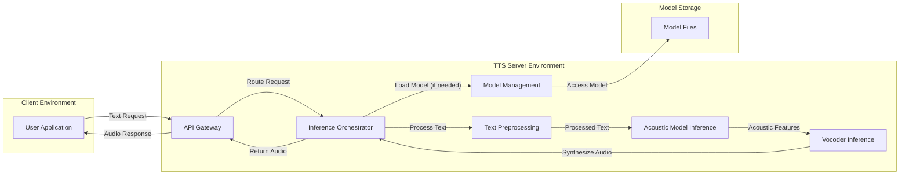
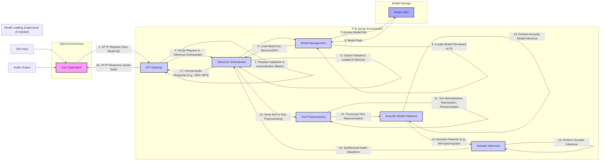

## Project Design Document: Coqui TTS

**Version:** 1.1
**Date:** October 26, 2023
**Author:** AI Architecture Expert

### 1. Introduction

This document provides an enhanced design specification for the Coqui TTS project, an open-source text-to-speech library and toolkit. This detailed design serves as a comprehensive blueprint for understanding the system's architecture, individual components, and the flow of data within the system. It is specifically intended to be used as the foundation for subsequent threat modeling activities, ensuring a clear understanding of the system's boundaries and potential vulnerabilities.

### 2. Project Overview

The Coqui TTS project offers a versatile platform for both training and deploying high-quality text-to-speech models. Its core functionalities encompass model training, efficient inference, and the provision of TTS capabilities via a well-defined API. The project's design emphasizes accessibility and extensibility, empowering users to utilize pre-trained models or develop custom models tailored to their specific needs.

### 3. Goals

* Deliver a robust and performant text-to-speech inference engine capable of generating high-quality audio.
* Provide a comprehensive suite of tools and utilities for training custom TTS models, catering to diverse datasets and requirements.
* Facilitate the straightforward deployment of trained TTS models through a dedicated server component.
* Support a wide array of contemporary TTS architectures and underlying techniques, ensuring flexibility and adaptability.
* Foster an active open-source community, encouraging contributions and collaborative development.

### 4. Non-Goals

* Development of a fully featured graphical user interface (GUI) for model training or inference within the core project scope.
* Implementation of sophisticated, enterprise-grade user authentication and authorization mechanisms within the core TTS server application. Basic security considerations will be addressed, but advanced features are out of scope.
* Offering a fully managed, commercially supported cloud service for Coqui TTS. The project focuses on providing the building blocks for such services.
* Prioritizing real-time, ultra-low-latency streaming as the primary mode of operation. While streaming might be achievable, it's not the central design focus.

### 5. Architecture

The Coqui TTS project's architecture is modular, comprising several key components that interact to deliver the text-to-speech functionality.

#### 5.1. High-Level Architecture Diagram

#### 5.2. Component Descriptions

* **User Application:** Any external application, service, or script that initiates a text-to-speech request to the Coqui TTS server. This could range from a simple command-line utility to a complex web service.
* **API Gateway:** The designated entry point for all external requests targeting the TTS server. Its responsibilities include request routing, basic validation of incoming requests, and formatting the server's responses.
* **Inference Orchestrator:** The central control unit of the TTS process. It receives processed text, manages the loading of appropriate models via the Model Management component, orchestrates the text processing and inference steps, and assembles the final audio output.
* **Model Management:** Responsible for loading and managing trained TTS models. This includes locating models based on identifiers, loading them into memory for efficient access by the Inference Orchestrator, and potentially caching models.
* **Text Preprocessing:** This component handles the initial transformation of the input text into a format suitable for the acoustic model. This may involve normalization, tokenization, handling of special characters, and conversion to phoneme sequences.
* **Acoustic Model Inference:**  Utilizes the loaded acoustic model to predict acoustic features (e.g., mel-spectrograms) from the processed text. This is a computationally intensive step that forms the core of the TTS process.
* **Vocoder Inference:** Takes the acoustic features generated by the Acoustic Model Inference component and synthesizes the final audio waveform. Different vocoders offer varying levels of audio quality and computational cost.
* **Model Files:**  The persistent storage location for trained TTS model parameters, configurations, and potentially metadata. This could be a local file system, a network file share, or a cloud-based object storage service.

#### 5.3. Data Flow Diagram (Detailed Inference Request)

#### 5.4. Data Stores

* **Model Files:** Persistently stored on disk or in a cloud storage service. These files contain the trained parameters of the acoustic and vocoder models, along with any necessary configuration.
* **Configuration Files:** Store settings for the TTS server and individual components, such as model paths, API keys (if implemented), logging levels, and resource allocation parameters.
* **Temporary Files:** May be utilized for intermediate processing stages, such as storing preprocessed text representations or chunks of generated audio before final assembly.
* **Logs:** Record operational events, errors, and performance metrics within the TTS server for debugging, monitoring, and auditing purposes.

#### 5.5. External Interfaces

* **REST API:** The primary interface for external interaction with the TTS server. It accepts text input, optionally a model identifier, and returns the synthesized audio data.
* **Command-Line Interface (CLI):**  May be provided for administrative tasks, model training initiation, local inference testing, and overall system management.
* **Model Download Sources:** Potentially external repositories, cloud storage buckets, or model hubs from which pre-trained models can be downloaded and integrated into the system.

### 6. Security Considerations

This section details potential security considerations relevant to the Coqui TTS project, providing a basis for subsequent threat modeling activities.

* **Input Validation Vulnerabilities:** The API Gateway and Text Preprocessing components are critical points for input validation. Insufficient validation could lead to:
    * **Injection Attacks:** Maliciously crafted input text could be designed to exploit vulnerabilities in the underlying processing logic or operating system commands if not properly sanitized.
    * **Denial of Service (DoS):**  Submitting excessively long or complex input strings could consume excessive server resources, leading to performance degradation or service unavailability.
* **Model Security Risks:** The integrity and confidentiality of the trained TTS models are paramount. Potential threats include:
    * **Unauthorized Access:**  If model files are not adequately protected, unauthorized individuals could gain access, leading to intellectual property theft or the ability to deploy modified, potentially malicious models.
    * **Model Tampering:**  Malicious actors could attempt to alter model files, leading to unexpected or undesirable behavior in the synthesized speech.
    * **Mitigation:** Implement strict access controls on model storage, utilize secure transfer protocols, and consider model signing or verification mechanisms.
* **API Security Weaknesses:**  The REST API is a primary attack vector. Potential vulnerabilities include:
    * **Lack of Authentication/Authorization:** Without proper authentication, anyone could potentially access and utilize the TTS service. While the core project might not mandate advanced authentication, deployments should strongly consider implementing API keys, OAuth 2.0, or similar mechanisms.
    * **Rate Limiting Absence:**  Without rate limiting, malicious actors could flood the server with requests, leading to resource exhaustion and denial of service.
    * **Exposure of Sensitive Information:** Error messages or API responses might inadvertently reveal sensitive information about the server's configuration or internal workings.
* **Dependency Vulnerabilities:** The project relies on external libraries and dependencies, which may contain security vulnerabilities.
    * **Mitigation:** Implement a robust dependency management strategy, regularly scan dependencies for known vulnerabilities using tools like `safety` or `snyk`, and keep dependencies updated. Utilize Software Bill of Materials (SBOMs) for better tracking.
* **Resource Exhaustion Attacks:** Malicious actors could attempt to overwhelm the TTS server with a large volume of concurrent requests.
    * **Mitigation:** Implement resource limits (CPU, memory), connection limits, and request queue management. Employ monitoring and alerting to detect and respond to suspicious activity.
* **Data Privacy Concerns:** If the TTS system processes sensitive or personally identifiable information (PII), data privacy must be a key consideration.
    * **Mitigation:** Implement data anonymization or pseudonymization techniques where applicable. Ensure compliance with relevant data privacy regulations (e.g., GDPR, CCPA). Securely handle and store any processed text data.
* **Logging and Monitoring Deficiencies:** Inadequate logging and monitoring can hinder the detection and response to security incidents.
    * **Mitigation:** Implement comprehensive logging of API requests, server events, and errors. Securely store and regularly analyze logs for suspicious patterns. Implement real-time monitoring and alerting for critical security events.
* **Code Injection Risks:** If the system allows users to provide custom code or configurations (e.g., custom text processing scripts), there's a risk of code injection vulnerabilities.
    * **Mitigation:**  Thoroughly sanitize and validate any user-provided code or configurations. Employ sandboxing or containerization to limit the impact of potentially malicious code.

### 7. Deployment

The Coqui TTS server offers flexibility in deployment options, catering to various needs and environments:

* **Local Machine Deployment:** Suitable for development, experimentation, and testing purposes.
* **Virtual Machine (VM) Deployment:** Can be deployed on individual VMs, either on-premises or within cloud environments (e.g., AWS EC2, Azure VMs, GCP Compute Engine).
* **Containerized Deployment (Docker):** A highly recommended approach, providing isolation, portability, and ease of management. Docker containers can be deployed on various platforms.
* **Container Orchestration (Kubernetes):** For managing and scaling containerized deployments in production environments, offering features like automated scaling, self-healing, and load balancing.
* **Cloud Platform Services:** Leveraging managed services offered by cloud providers (e.g., AWS ECS/Fargate, Azure Container Instances, GCP Cloud Run) for simplified deployment and management.

Key deployment considerations include:

* **Resource Provisioning:**  Appropriate allocation of CPU, memory, and potentially GPU resources based on expected workload and model complexity.
* **Network Configuration:** Securely exposing the API endpoint, potentially using HTTPS and firewalls.
* **Scalability and High Availability:** Designing the deployment architecture to handle varying levels of traffic and ensure continuous availability. This might involve load balancing and deploying multiple instances.
* **Monitoring and Logging Infrastructure:** Setting up robust monitoring and logging solutions to track the health, performance, and security of the deployed system.

### 8. Technologies Used

* **Primary Programming Language:** Python
* **Deep Learning Frameworks:** Primarily PyTorch, with potential support for TensorFlow depending on the specific models utilized.
* **Web Framework (for API):**  Likely Flask or FastAPI for building the REST API.
* **Audio Processing Libraries:**  Commonly used libraries include Librosa, SoundFile, and potentially others for audio manipulation and encoding.
* **Build and Packaging Tools:**  Standard Python packaging tools such as `setuptools` or `poetry` for managing dependencies and creating distributable packages.
* **Containerization Technology:** Docker for packaging and distributing the application.
* **Configuration Management:** Potentially using libraries like `hydra` or standard configuration file formats (e.g., YAML, JSON).

This enhanced design document provides a more detailed and comprehensive understanding of the Coqui TTS project's architecture and potential security considerations. It serves as a solid foundation for conducting thorough threat modeling and implementing appropriate security measures.