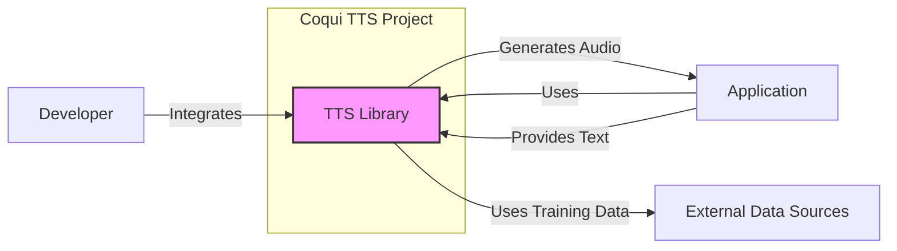
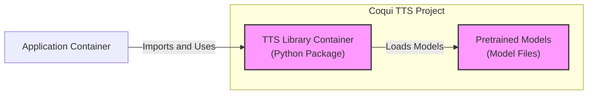

# BUSINESS POSTURE

The coqui-ai/tts repository provides a library and tools for Text-to-Speech (TTS) synthesis.

- Business Priorities and Goals:
  - Democratize access to high-quality Text-to-Speech technology.
  - Enable developers to easily integrate TTS capabilities into their applications.
  - Foster innovation and research in the field of TTS.
  - Provide an open-source alternative to commercial TTS services.

- Business Risks:
  - Misuse of the TTS technology for malicious purposes (e.g., generating deepfakes, impersonation).
  - Data privacy concerns if the library is used to process sensitive user input.
  - Vulnerabilities in the library could be exploited in applications that use it.
  - Lack of commercial support or guarantees for production use.
  - Dependency on community contributions for maintenance and security updates.

# SECURITY POSTURE

- Existing Security Controls:
  - security control: Open Source Code - The code is publicly available on GitHub, allowing for community review and scrutiny. Implemented: GitHub Repository.
  - security control: Code Review - Contributions are likely reviewed by maintainers before being merged. Implemented: GitHub Pull Request process (assumed).
  - security control: Version Control - Git is used for version control, providing traceability of changes. Implemented: GitHub Repository.
  - security control: Issue Tracking - GitHub Issues are used for bug reports and feature requests. Implemented: GitHub Issues.
  - accepted risk: Reliance on community for security vulnerability discovery and patching.
  - accepted risk: Potential vulnerabilities in dependencies.
  - accepted risk: No formal security audit process is mentioned.

- Recommended Security Controls:
  - security control: Implement automated vulnerability scanning for dependencies and code.
  - security control: Establish a process for reporting and handling security vulnerabilities.
  - security control: Provide secure deployment guidelines for applications using the TTS library.
  - security control: Consider adding input validation examples and best practices to documentation.

- Security Requirements:
  - Authentication: Not directly applicable to the TTS library itself, as it's designed to be integrated into other applications which will handle authentication. However, if the project provides API endpoints for demonstration or services, authentication will be required for those.
  - Authorization: Authorization will be managed by the applications integrating the TTS library. The library itself should not enforce authorization. If API endpoints are provided, authorization will be needed to control access to TTS functionalities.
  - Input Validation:  Applications using the TTS library must perform input validation on the text provided for synthesis to prevent injection attacks or unexpected behavior. The library should be robust against malformed input but the responsibility primarily lies with the integrating application.
  - Cryptography: Cryptography might be relevant if the TTS library handles sensitive data (e.g., training data, user input in certain applications). If so, data at rest and in transit should be encrypted. For the library itself, cryptography is less of a direct requirement unless it's dealing with sensitive keys or data internally. Applications using the library might need to encrypt the audio output or input text depending on their security requirements.

# DESIGN

## C4 CONTEXT



- Context Diagram Elements:
  - - Name: Developer
    - Type: Person
    - Description: Software developers who integrate the Coqui TTS library into their applications.
    - Responsibilities: Integrate the TTS library, provide input text, handle audio output, manage application security.
    - Security controls: security control: Secure development practices, input validation in applications, secure deployment of applications.
  - - Name: Application
    - Type: Software System
    - Description: Applications that utilize the Coqui TTS library to provide text-to-speech functionality to end-users or other systems.
    - Responsibilities: Provide text input to the TTS library, process audio output, manage user interactions, handle application-level security, data privacy.
    - Security controls: security control: Authentication, security control: Authorization, security control: Input validation, security control: Data encryption (if handling sensitive audio or text), security control: Secure logging and monitoring.
  - - Name: TTS Library
    - Type: Software System
    - Description: The Coqui TTS library, providing the core text-to-speech synthesis functionality.
    - Responsibilities: Text-to-speech synthesis, model loading and management, audio generation.
    - Security controls: security control: Input validation (within the library itself), security control: Memory safety, security control: Dependency management, security control: Vulnerability scanning (recommended).
  - - Name: External Data Sources
    - Type: External System
    - Description: Sources of training data used to train TTS models. Could be public datasets or private datasets.
    - Responsibilities: Provide training data for TTS models.
    - Security controls: security control: Data integrity of training data, security control: Access control to training data (if private), security control: Data provenance and lineage.

## C4 CONTAINER



- Container Diagram Elements:
  - - Name: TTS Library Container
    - Type: Container (Python Package)
    - Description:  The core TTS library packaged as a Python package. Contains the TTS synthesis logic, model loading mechanisms, and API for applications to interact with.
    - Responsibilities: Text-to-speech synthesis, model management, providing a Python API.
    - Security controls: security control: Input validation, security control: Dependency management, security control: Memory safety, security control: Vulnerability scanning (recommended during development).
  - - Name: Pretrained Models
    - Type: Container (Model Files)
    - Description: Collection of pretrained TTS models. These are data files required by the TTS Library to perform synthesis.
    - Responsibilities: Storing pretrained models, providing models to the TTS Library.
    - Security controls: security control: Integrity checks of model files, security control: Access control to model files (if sensitive or proprietary), security control: Version control of models.
  - - Name: Application Container
    - Type: Container (Application Runtime)
    - Description: The runtime environment of the application that integrates and uses the TTS Library. This could be a web server, desktop application, mobile app, etc.
    - Responsibilities: Running the application, providing input to the TTS Library, handling output, managing application-level security.
    - Security controls: security control: Application-level authentication and authorization, security control: Input validation, security control: Secure communication, security control: Secure logging and monitoring, security control: Secure deployment configuration.

## DEPLOYMENT

For a library like `coqui-ai/tts`, deployment primarily refers to how it's integrated into other applications. A common deployment scenario is within a Python application running in a cloud environment.

```mermaid
flowchart LR
    subgraph "Cloud Environment"
        subgraph "Application Server"
            ApplicationInstance["Application Instance\n(Python Runtime)"]
            TTSLibraryInstance["TTS Library\n(Python Package)"]
            PretrainedModelsVolume["Pretrained Models\n(Volume Storage)"]
        end
        LoadBalancer["Load Balancer"]
        Firewall["Firewall"]
        Internet["Internet"]
        Users["Users"]
    end

    Users -- Internet -- LoadBalancer
    LoadBalancer -- ApplicationServer
    ApplicationInstance -- TTSLibraryInstance
    ApplicationInstance -- PretrainedModelsVolume
    style ApplicationInstance fill:#ccf,stroke:#333,stroke-width:2px
    style TTSLibraryInstance fill:#ccf,stroke:#333,stroke-width:2px
    style PretrainedModelsVolume fill:#ccf,stroke:#333,stroke-width:2px
```

- Deployment Diagram Elements:
  - - Name: Cloud Environment
    - Type: Environment
    - Description: The cloud infrastructure where the application using the TTS library is deployed.
    - Responsibilities: Providing infrastructure for application execution, ensuring availability and scalability.
    - Security controls: security control: Cloud provider security controls (physical security, network security), security control: Infrastructure as Code (IaC), security control: Security monitoring and logging at the infrastructure level.
  - - Name: Load Balancer
    - Type: Infrastructure Component
    - Description: Distributes incoming traffic across multiple application instances for scalability and availability.
    - Responsibilities: Traffic distribution, high availability, SSL termination (optional).
    - Security controls: security control: DDoS protection, security control: SSL/TLS encryption, security control: Access control lists (ACLs).
  - - Name: Firewall
    - Type: Infrastructure Component
    - Description: Controls network traffic to and from the application server, limiting access to authorized ports and protocols.
    - Responsibilities: Network security, access control.
    - Security controls: security control: Network segmentation, security control: Rule-based access control, security control: Intrusion detection/prevention (optional).
  - - Name: Application Server
    - Type: Infrastructure Component
    - Description: Server instance(s) hosting the application runtime, TTS library, and pretrained models.
    - Responsibilities: Executing the application code, running the TTS library, serving requests.
    - Security controls: security control: Operating system hardening, security control: Security patching, security control: Access control to server instances, security control: Monitoring and logging at the server level.
  - - Name: Application Instance
    - Type: Software Component Instance
    - Description: A running instance of the application code (Python runtime) that integrates the TTS library.
    - Responsibilities: Handling application logic, using the TTS library for synthesis, interacting with users.
    - Security controls: security control: Application-level security controls (authentication, authorization, input validation), security control: Secure coding practices, security control: Application monitoring and logging.
  - - Name: TTS Library Instance
    - Type: Software Component Instance
    - Description: Instance of the Coqui TTS Python package running within the application instance.
    - Responsibilities: Text-to-speech synthesis.
    - Security controls: Inherited security controls from the library itself and the application environment.
  - - Name: Pretrained Models Volume
    - Type: Data Storage
    - Description: Persistent storage volume attached to the application server, containing the pretrained TTS model files.
    - Responsibilities: Storing and providing access to model files.
    - Security controls: security control: Access control to the volume, security control: Encryption at rest (optional), security control: Integrity monitoring.
  - - Name: Users
    - Type: Person
    - Description: End-users interacting with the application via the internet.
    - Responsibilities: Using the application, providing text input.
    - Security controls: User-side security practices (strong passwords, avoiding phishing, etc.).

## BUILD

```mermaid
flowchart LR
    Developer["Developer"] -->|Code Commit| GitHub["GitHub Repository"]
    GitHub -->|Webhook Trigger| CI["CI/CD System\n(e.g., GitHub Actions)"]
    CI -->|Build & Test| BuildEnvironment["Build Environment"]
    BuildEnvironment -->|SAST, Linter, Tests| SecurityChecks["Security Checks"]
    SecurityChecks -- Pass -->|Package & Publish| ArtifactRepository["Artifact Repository\n(e.g., PyPI, GitHub Packages)"]
    SecurityChecks -- Fail -->|Notify Developer| Developer
    ArtifactRepository -->|Download & Deploy| DeploymentEnvironment["Deployment Environment"]
    style CI fill:#ccf,stroke:#333,stroke-width:2px
    style BuildEnvironment fill:#ccf,stroke:#333,stroke-width:2px
    style SecurityChecks fill:#ccf,stroke:#333,stroke-width:2px
    style ArtifactRepository fill:#ccf,stroke:#333,stroke-width:2px
```

- Build Process Elements:
  - - Name: Developer
    - Type: Person
    - Description: Software developers contributing to the Coqui TTS project.
    - Responsibilities: Writing code, committing changes, addressing build failures and security issues.
    - Security controls: security control: Secure coding practices, security control: Code review, security control: Access control to the repository.
  - - Name: GitHub Repository
    - Type: Code Repository
    - Description:  The central repository hosting the source code of the Coqui TTS project.
    - Responsibilities: Version control, code storage, collaboration platform.
    - Security controls: security control: Access control (authentication and authorization), security control: Branch protection, security control: Audit logging.
  - - Name: CI/CD System
    - Type: Automation System
    - Description:  Continuous Integration and Continuous Delivery system (e.g., GitHub Actions) that automates the build, test, and release process.
    - Responsibilities: Build automation, testing, security checks, artifact publishing, deployment automation (optional).
    - Security controls: security control: Secure configuration of CI/CD pipelines, security control: Access control to CI/CD system, security control: Secret management for credentials, security control: Audit logging of CI/CD activities.
  - - Name: Build Environment
    - Type: Environment
    - Description:  The environment where the code is compiled, built, and tested.
    - Responsibilities: Providing a consistent and reproducible build environment.
    - Security controls: security control: Secure build environment (hardened images, minimal tools), security control: Isolation of build processes.
  - - Name: Security Checks
    - Type: Automated Checks
    - Description: Automated security checks integrated into the build pipeline, such as SAST (Static Application Security Testing), linters, dependency vulnerability scanning, and unit/integration tests.
    - Responsibilities: Identifying potential security vulnerabilities and code quality issues early in the development lifecycle.
    - Security controls: security control: SAST tools, security control: Dependency scanning tools, security control: Code linters, security control: Unit and integration tests.
  - - Name: Artifact Repository
    - Type: Package Registry
    - Description: Repository for storing and distributing build artifacts (e.g., Python packages on PyPI, container images).
    - Responsibilities: Storing and distributing build artifacts, versioning, access control to artifacts.
    - Security controls: security control: Access control to the artifact repository, security control: Integrity checks of artifacts (e.g., checksums, signatures), security control: Vulnerability scanning of published artifacts (optional).
  - - Name: Deployment Environment
    - Type: Environment
    - Description: The target environment where the application or library is deployed (e.g., cloud environment, user's local machine).
    - Responsibilities: Running the application or library.
    - Security controls: Security controls as described in the DEPLOYMENT section.

# RISK ASSESSMENT

- Critical Business Processes:
  - Providing Text-to-Speech synthesis functionality to applications and users.
  - Maintaining the integrity and availability of the TTS library and pretrained models.
  - Protecting the reputation and trustworthiness of the Coqui TTS project.

- Data to Protect and Sensitivity:
  - Input Text: Potentially sensitive if users provide personal or confidential information for synthesis. Sensitivity: Medium to High, depending on the application.
  - Generated Audio: Could be sensitive depending on the input text and application context. Sensitivity: Medium to High, depending on the application.
  - Pretrained Models: Represent significant effort and knowledge. If proprietary or custom models are used, they are highly sensitive. Sensitivity: High (for proprietary models), Medium (for publicly available models).
  - Training Data: If custom training data is used, it might contain sensitive information and is crucial for model quality. Sensitivity: High (if private or sensitive data).
  - Source Code: Core intellectual property of the project. Sensitivity: Medium to High.

# QUESTIONS & ASSUMPTIONS

- Questions:
  - What are the primary use cases and target users for the Coqui TTS library? (e.g., research, commercial applications, accessibility tools).
  - Are there plans to offer a hosted TTS service based on this library?
  - Are there specific security certifications or compliance requirements that the project needs to meet?
  - What is the process for reporting and handling security vulnerabilities in the project?
  - Are there any proprietary or sensitive pretrained models or training data used in the project (beyond publicly available ones)?

- Assumptions:
  - The Coqui TTS project is primarily intended to be used as a library integrated into other applications.
  - Security is a concern for the project, but it is currently managed through standard open-source development practices and community contributions.
  - Applications integrating the TTS library are responsible for implementing application-level security controls (authentication, authorization, input validation, etc.).
  - The project aims to provide a high-quality and reliable TTS solution, but does not offer commercial support or guarantees in its current open-source form.
  - The deployment scenario described (cloud environment) is a common use case, but the library can be deployed in various other environments as well.