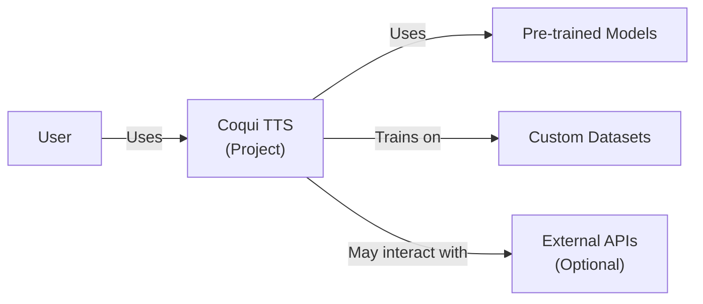
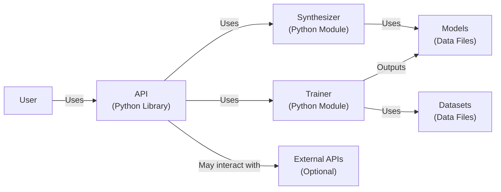
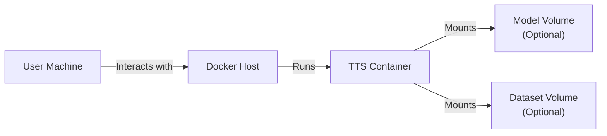
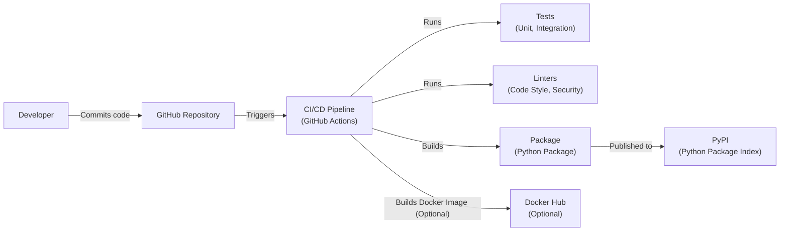

# BUSINESS POSTURE

Business Priorities and Goals:

*   Provide a user-friendly, open-source text-to-speech (TTS) library.
*   Offer state-of-the-art pre-trained models for various languages and voices.
*   Enable researchers and developers to easily experiment with and build upon existing TTS models.
*   Foster a community around TTS research and development.
*   Provide tools for training new TTS models on custom datasets.
*   Offer a platform for generating high-quality, natural-sounding synthetic speech.

Business Risks:

*   Malicious use of generated speech: Deepfakes, impersonation, and misinformation campaigns.
*   Data privacy concerns: If users provide personal data for training or fine-tuning models, this data must be protected.
*   Model bias: The models may exhibit biases present in the training data, leading to unfair or discriminatory outputs.
*   Intellectual property infringement: The use of copyrighted material in training data or model outputs could lead to legal issues.
*   Computational resource abuse: Running TTS models can be computationally expensive, and malicious actors could attempt to abuse the service.
*   Supply chain attacks: Compromised dependencies or build processes could introduce vulnerabilities.

# SECURITY POSTURE

Existing Security Controls:

*   security control: Open-source codebase: Allows for community review and identification of vulnerabilities. (Described in the GitHub repository)
*   security control: MIT License: Permissive license that encourages responsible use but doesn't explicitly address security concerns. (Described in the GitHub repository license file)
*   security control: Basic input sanitization: Some level of input sanitization is likely present in the code to prevent common injection vulnerabilities, but this needs to be verified. (Needs to be verified in the codebase)

Accepted Risks:

*   accepted risk: The project is open-source and relies on community contributions, which may introduce vulnerabilities.
*   accepted risk: The project does not currently have a formal security audit process.
*   accepted risk: The project does not provide explicit guarantees against malicious use of generated speech.

Recommended Security Controls:

*   security control: Implement a comprehensive input validation and sanitization strategy to prevent injection attacks and other vulnerabilities.
*   security control: Conduct regular security audits and penetration testing to identify and address potential vulnerabilities.
*   security control: Develop a responsible use policy that outlines acceptable use cases and prohibits malicious activities.
*   security control: Implement mechanisms to detect and prevent the generation of deepfakes or other harmful content.
*   security control: Provide clear guidelines on data privacy and security for users who provide personal data.
*   security control: Implement robust authentication and authorization mechanisms if the library is deployed as a service.
*   security control: Monitor the usage of the service to detect and prevent abuse.
*   security control: Implement supply chain security measures to protect against compromised dependencies.
*   security control: Use static application security testing (SAST) and dynamic application security testing (DAST) tools to identify vulnerabilities during development.
*   security control: Implement Software Composition Analysis (SCA) to identify and manage vulnerabilities in third-party libraries.

Security Requirements:

*   Authentication: If deployed as a service, strong authentication mechanisms (e.g., multi-factor authentication) should be used to protect user accounts and prevent unauthorized access.
*   Authorization: Access control mechanisms should be implemented to restrict access to sensitive data and functionality based on user roles and permissions.
*   Input Validation: All user inputs, including text inputs and configuration parameters, must be rigorously validated and sanitized to prevent injection attacks and other vulnerabilities. This includes checking for data type, length, format, and range.
*   Cryptography: If sensitive data is stored or transmitted, appropriate cryptographic techniques (e.g., encryption, hashing, digital signatures) should be used to protect its confidentiality and integrity.
*   Output Encoding: Output encoding should be used to prevent cross-site scripting (XSS) vulnerabilities when displaying generated content in web interfaces.

# DESIGN

## C4 CONTEXT

Element Descriptions:

*   Element:
    *   Name: User
    *   Type: Person
    *   Description: A person who interacts with the Coqui TTS system, either directly through the library or through an application that uses it.
    *   Responsibilities: Provides text input, configures the TTS engine, and receives audio output.
    *   Security controls: If interacting with a deployed service, the user should be authenticated and authorized.

*   Element:
    *   Name: Coqui TTS (Project)
    *   Type: Software System
    *   Description: The core Coqui TTS library, including the code, models, and tools.
    *   Responsibilities: Converts text to speech, provides APIs for training and inference, manages models and data.
    *   Security controls: Input validation, output encoding, secure coding practices, regular security audits.

*   Element:
    *   Name: Pre-trained Models
    *   Type: Data
    *   Description: Pre-trained TTS models provided by Coqui or the community.
    *   Responsibilities: Provide the acoustic and linguistic knowledge for speech synthesis.
    *   Security controls: Integrity checks, provenance tracking, regular security scans.

*   Element:
    *   Name: Custom Datasets
    *   Type: Data
    *   Description: Datasets provided by users for training or fine-tuning models.
    *   Responsibilities: Provide the data for training new or customized TTS models.
    *   Security controls: Data privacy protection, input validation, data sanitization.

*   Element:
    *   Name: External APIs (Optional)
    *   Type: Software System
    *   Description: External APIs that Coqui TTS may interact with, such as cloud storage services or authentication providers.
    *   Responsibilities: Provide specific services to Coqui TTS.
    *   Security controls: Secure communication channels (HTTPS), API keys, authentication and authorization.

## C4 CONTAINER

Element Descriptions:

*   Element:
    *   Name: User
    *   Type: Person
    *   Description: A person who interacts with the Coqui TTS system.
    *   Responsibilities: Provides text input, configures the TTS engine, and receives audio output.
    *   Security controls: If interacting with a deployed service, the user should be authenticated and authorized.

*   Element:
    *   Name: API (Python Library)
    *   Type: Container: Python Library
    *   Description: The main interface for interacting with Coqui TTS.
    *   Responsibilities: Provides functions for text-to-speech conversion, model loading, and training.
    *   Security controls: Input validation, output encoding, secure coding practices.

*   Element:
    *   Name: Trainer (Python Module)
    *   Type: Container: Python Module
    *   Description: The module responsible for training TTS models.
    *   Responsibilities: Loads data, trains models, saves models.
    *   Security controls: Input validation, data sanitization, secure handling of training data.

*   Element:
    *   Name: Synthesizer (Python Module)
    *   Type: Container: Python Module
    *   Description: The module responsible for generating speech from text.
    *   Responsibilities: Loads models, processes text, generates audio.
    *   Security controls: Input validation, secure handling of model parameters.

*   Element:
    *   Name: Models (Data Files)
    *   Type: Container: Data Files
    *   Description: Trained TTS models.
    *   Responsibilities: Provide the acoustic and linguistic knowledge for speech synthesis.
    *   Security controls: Integrity checks, provenance tracking.

*   Element:
    *   Name: Datasets (Data Files)
    *   Type: Container: Data Files
    *   Description: Datasets used for training TTS models.
    *   Responsibilities: Provide the data for training new or customized TTS models.
    *   Security controls: Data privacy protection, input validation, data sanitization.

*   Element:
    *   Name: External APIs (Optional)
    *   Type: Software System
    *   Description: External APIs that Coqui TTS may interact with.
    *   Responsibilities: Provide specific services to Coqui TTS.
    *   Security controls: Secure communication channels (HTTPS), API keys, authentication and authorization.

## DEPLOYMENT

Possible deployment solutions:

1.  Local installation: Users can install the library directly on their machines using pip.
2.  Docker container: The library can be packaged into a Docker container for easy deployment and portability.
3.  Cloud-based service: The library can be deployed as a service on a cloud platform (e.g., AWS, Google Cloud, Azure).
4.  Serverless functions: Specific TTS functions can be deployed as serverless functions for on-demand speech synthesis.

Chosen deployment solution (Docker container):

Element Descriptions:

*   Element:
    *   Name: User Machine
    *   Type: Device
    *   Description: The user's computer or device.
    *   Responsibilities: Sends requests to the TTS service and receives the audio output.
    *   Security controls: Firewall, antivirus software.

*   Element:
    *   Name: Docker Host
    *   Type: Server
    *   Description: The machine that runs the Docker engine.
    *   Responsibilities: Hosts and manages the TTS container.
    *   Security controls: Operating system hardening, Docker security best practices, network security.

*   Element:
    *   Name: TTS Container
    *   Type: Container: Docker Container
    *   Description: The Docker container that runs the Coqui TTS library.
    *   Responsibilities: Provides the TTS service.
    *   Security controls: Container security best practices, minimal base image, regular security updates.

*   Element:
    *   Name: Model Volume (Optional)
    *   Type: Volume
    *   Description: A Docker volume that stores the pre-trained models.
    *   Responsibilities: Provides persistent storage for the models.
    *   Security controls: Access control, data encryption.

*   Element:
    *   Name: Dataset Volume (Optional)
    *   Type: Volume
    *   Description: A Docker volume that stores the training datasets.
    *   Responsibilities: Provides persistent storage for the datasets.
    *   Security controls: Access control, data encryption, data privacy protection.

## BUILD

The build process for Coqui TTS involves several steps, from code development to packaging and distribution.

Build Process Description:

1.  Developers write and commit code to the GitHub repository.
2.  GitHub Actions (CI/CD pipeline) is triggered by commits and pull requests.
3.  The CI pipeline runs unit and integration tests to ensure code quality.
4.  Linters (e.g., pylint, flake8, bandit) are used to check for code style and potential security issues.
5.  If all tests and linters pass, the CI pipeline builds a Python package.
6.  The package is published to PyPI (Python Package Index).
7.  Optionally, a Docker image can be built and published to Docker Hub.

Security Controls in Build Process:

*   security control: Code review: All code changes are reviewed by other developers before merging.
*   security control: Automated testing: Unit and integration tests are run automatically to catch bugs and regressions.
*   security control: Static code analysis: Linters are used to identify potential security vulnerabilities and code style issues.
*   security control: Dependency management: Dependencies are managed using a package manager (pip) and are regularly checked for vulnerabilities.
*   security control: CI/CD pipeline: The build process is automated using GitHub Actions, which provides a consistent and reproducible environment.
*   security control: Software Composition Analysis (SCA): Tools like `pip-audit` or Dependabot can be integrated into the CI/CD pipeline to scan for known vulnerabilities in dependencies.

# RISK ASSESSMENT

Critical Business Processes:

*   Providing accurate and reliable text-to-speech conversion.
*   Maintaining the integrity and availability of the TTS service (if deployed as a service).
*   Protecting user data and privacy.
*   Preventing malicious use of the generated speech.

Data Sensitivity:

*   Text input: May contain personal information, sensitive data, or copyrighted material. Sensitivity: Low to High, depending on the input.
*   Training data: May contain personal information, sensitive data, or copyrighted material. Sensitivity: Low to High, depending on the data.
*   Generated audio: May be used for malicious purposes (deepfakes, impersonation). Sensitivity: Low to High, depending on the content and context.
*   Model weights: Represent intellectual property and could be used to create competing services. Sensitivity: Medium.
*   User credentials (if applicable): Used to authenticate users and access the service. Sensitivity: High.

# QUESTIONS & ASSUMPTIONS

Questions:

*   What specific pre-trained models are included, and what are their licensing terms?
*   What types of datasets are typically used for training, and what are the data privacy implications?
*   Are there any plans to deploy Coqui TTS as a hosted service?
*   What are the performance requirements for the TTS system?
*   What are the specific security concerns of the Coqui TTS community?
*   Are there any existing security audits or penetration tests performed on the project?
*   What is the process for reporting and addressing security vulnerabilities?
*   Are there any plans to implement features for detecting or preventing deepfake generation?

Assumptions:

*   BUSINESS POSTURE: The primary goal is to provide a high-quality, open-source TTS library for research and development. Commercialization is a secondary concern.
*   SECURITY POSTURE: The project relies on community contributions and open-source principles for security, but there is no formal security program in place.
*   DESIGN: The design is modular and flexible, allowing for different deployment scenarios and customization. The primary interface is a Python library. The project uses GitHub Actions for CI/CD.