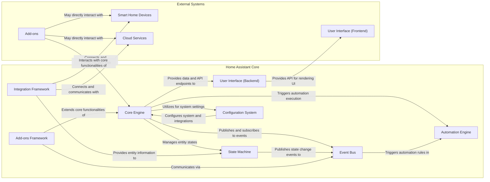
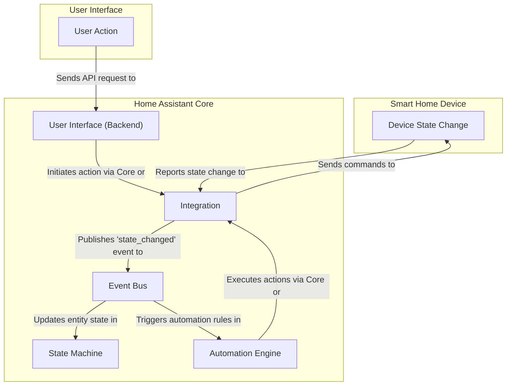

## Project Design Document: Home Assistant Core

**Version:** 1.1
**Date:** October 26, 2023
**Author:** AI Software Architect

### 1. Introduction

This document provides an enhanced architectural design of the Home Assistant Core project. It elaborates on the key components, their interactions, and the overall system structure, offering a more detailed perspective for subsequent threat modeling activities.

### 2. Project Overview

Home Assistant Core is a leading open-source home automation platform developed in Python. Its primary function is to enable users to control and automate a diverse range of smart home devices and services from various vendors and technologies through a unified and customizable interface. The core system is responsible for the underlying logic, the integration framework that connects to devices, and the backend infrastructure for the user interface.

### 3. Architectural Overview

The Home Assistant Core architecture is structured into distinct layers and components, each with specific responsibilities:

*   **Core Engine:** The central processing unit, managing system-wide operations, state transitions, and the execution of automation logic.
*   **Integration Framework:** A modular and extensible system facilitating connections to and control over a wide array of devices and external services.
*   **State Machine:**  A crucial component responsible for maintaining the current state of all managed entities (devices, sensors, virtual entities, etc.).
*   **Event Bus:**  The central communication channel, enabling asynchronous inter-component communication through the publication and subscription of events.
*   **Automation Engine:**  The rule-based system that processes user-defined automation rules based on specified triggers, conditions, and actions.
*   **User Interface (Backend):**  Provides the necessary APIs and data endpoints to support the frontend user interface and external client applications.
*   **Configuration System:**  Manages the loading, parsing, validation, and persistence of system and integration configurations.
*   **Add-ons Framework:**  A mechanism for extending the core functionality through the installation and management of containerized applications.

### 4. Component Details

This section provides a more detailed breakdown of the key components and their functionalities:

*   **Core Engine:**
    *   Orchestrates the entire system, managing the lifecycle of integrations, automations, and other core components.
    *   Provides essential services such as logging, error handling, and scheduling tasks.
    *   Handles user authentication (verifying user identity) and authorization (managing user permissions).
    *   Manages the service registry, allowing components to expose and consume functionalities.

*   **Integration Framework:**
    *   Offers a standardized and modular approach to connect and interact with diverse smart home devices and external services.
    *   Each integration is typically implemented as a separate Python module, encapsulating the logic for a specific technology or vendor.
    *   Handles protocol-specific communication (e.g., Zigbee, Z-Wave, MQTT, vendor-specific APIs, cloud-based APIs).
    *   Abstracts the complexities of individual device communication, presenting a unified entity model to the core.

*   **State Machine:**
    *   Maintains a real-time representation of the current state of all tracked entities, including devices, sensors, and virtual entities.
    *   Provides a consistent and queryable view of the home's status, accessible to other components.
    *   Allows for querying the current state of entities and recording state changes over time (history).

*   **Event Bus:**
    *   Serves as a central asynchronous messaging system for internal communication between different components within Home Assistant Core.
    *   Components can publish events to announce state changes, user actions, or other significant occurrences.
    *   Other components can subscribe to specific event types to react to relevant changes, enabling loosely coupled interactions.

*   **Automation Engine:**
    *   Empowers users to define automated actions based on specific triggers and conditions.
    *   Supports a wide range of trigger types, including time-based triggers, state changes of entities, device events, and webhook calls.
    *   Allows for defining complex conditions involving multiple entities and their states.
    *   Enables the execution of various actions, such as sending commands to devices, calling services, publishing custom events, and sending notifications.

*   **User Interface (Backend):**
    *   Provides RESTful APIs for the frontend user interface (web and mobile apps) and other authorized client applications.
    *   Handles authentication and authorization for API access, ensuring only authorized users and applications can interact with the system.
    *   Provides data endpoints for retrieving entity states, historical data, configuration options, and system information.

*   **Configuration System:**
    *   Loads system and integration configurations primarily from YAML files, providing a human-readable format.
    *   Validates configuration data against predefined schemas to ensure correctness and prevent errors.
    *   Provides mechanisms for users to configure integrations, define automations, customize the user interface, and manage other system settings.

*   **Add-ons Framework:**
    *   Enables users to extend the functionality of Home Assistant Core by installing and managing additional, often community-developed, applications.
    *   Add-ons are typically packaged and run as containerized applications (e.g., using Docker), providing isolation and simplifying management.
    *   Provides controlled mechanisms for add-ons to interact with the core system through defined APIs and the event bus.

### 5. Data Flow

This section details the typical flow of data within the Home Assistant Core system for various scenarios:

*   **Device State Updates:**
    *   A smart home device experiences a change in its state (e.g., a light is turned on, a sensor reading changes).
    *   The device reports this state change to its corresponding integration within Home Assistant Core.
    *   The integration translates the device-specific data into a standardized format understood by the core.
    *   The integration publishes a `state_changed` event on the event bus, containing information about the entity and its new state.
    *   The state machine subscribes to these events and updates the entity's state accordingly.

*   **User Initiated Actions:**
    *   A user interacts with the frontend user interface (web or mobile app), for example, by clicking a button to turn on a light.
    *   The frontend sends an API request to the User Interface (Backend) component, specifying the desired action.
    *   The backend authenticates and authorizes the request to ensure the user has the necessary permissions.
    *   The backend routes the request to the appropriate component, often the Core Engine or the specific integration responsible for the target device.
    *   The system sends a command to the relevant smart home device through its integration.
    *   The device responds to the command, and its state is updated, triggering a "Device State Update" flow.

*   **Automation Execution:**
    *   A trigger event defined in an automation rule occurs (e.g., a specific time is reached, an entity's state changes to a certain value).
    *   The event bus broadcasts this trigger event.
    *   The automation engine subscribes to relevant events and evaluates the conditions of all active automations.
    *   If the conditions of an automation are met, the automation engine executes the defined actions.
    *   Actions can include sending commands to devices, calling services exposed by the core or integrations, publishing custom events, sending notifications, or triggering other automations.

### 6. Key Technologies

*   **Primary Programming Language:** Python (leveraging asynchronous programming with `asyncio`).
*   **Web Application Framework:**  Primarily relies on asynchronous web frameworks, potentially including components built on `aiohttp`.
*   **Data Storage:** Commonly uses a relational database like SQLite (default) or PostgreSQL for persistent storage of configuration, event history, and other data.
*   **Communication Protocols:**  Employs a variety of protocols, including HTTP/HTTPS for API communication, WebSocket for real-time updates to the frontend, and protocols specific to smart home devices (e.g., Zigbee, Z-Wave, MQTT).
*   **Containerization and Orchestration:** Docker is widely used for packaging and distributing Home Assistant Core and its add-ons. Docker Compose or similar tools are used for orchestration in many deployments.

### 7. Deployment Model

Home Assistant Core offers flexible deployment options to suit various user needs and technical expertise:

*   **Operating System Installation:**  Direct installation as a Python application on a host operating system like Linux (Raspberry Pi OS, Ubuntu, etc.), macOS, or Windows. This provides maximum control but requires more manual configuration.
*   **Containerized Deployment (Docker):** Deployment within a Docker container offers isolation, portability, and simplified management. This is a popular method for users with some technical familiarity.
*   **Dedicated Hardware Appliances:** Pre-built hardware devices like Home Assistant Yellow provide a streamlined and integrated experience, often simplifying setup and management.
*   **Virtual Machine Deployment:** Installation within a virtual machine (e.g., using VirtualBox, VMware) provides isolation and can be useful for testing or running multiple instances.
*   **Managed Container Platforms:** Deployment on platforms like Kubernetes or cloud-based container services offers scalability and resilience for advanced users.

### 8. Security Considerations (Enhanced)

This section expands on the initial security considerations, providing more specific examples of potential threats:

*   **Authentication and Authorization:**
    *   **Threats:** Brute-force attacks on login credentials, weak password policies, privilege escalation vulnerabilities allowing unauthorized access to sensitive functions.
    *   **Mitigations:** Strong password enforcement, multi-factor authentication, role-based access control, regular security audits.
*   **API Security:**
    *   **Threats:** Unauthorized access to API endpoints, injection attacks (e.g., SQL injection if database interactions are not properly secured), cross-site scripting (XSS) if API responses are not sanitized.
    *   **Mitigations:** Input validation, output encoding, rate limiting, secure API key management, adherence to secure coding practices.
*   **Integration Security:**
    *   **Threats:** Vulnerabilities in integration code allowing malicious actors to control devices or access sensitive data, insecure communication protocols used by integrations, compromised cloud service accounts.
    *   **Mitigations:** Regular security reviews of integration code, secure storage of API keys and credentials, use of encrypted communication channels (HTTPS), principle of least privilege for integration permissions.
*   **Data Privacy:**
    *   **Threats:** Unauthorized access to stored data (e.g., event history, user preferences), leakage of personal information, non-compliance with data privacy regulations (e.g., GDPR).
    *   **Mitigations:** Encryption of sensitive data at rest and in transit, access controls on database and log files, anonymization or pseudonymization of data where appropriate, clear privacy policies.
*   **Add-on Security:**
    *   **Threats:** Malicious or vulnerable add-ons compromising the entire system, unauthorized access to the host system from within an add-on container.
    *   **Mitigations:**  Secure containerization practices, limitations on add-on capabilities and permissions, code reviews of popular add-ons, user awareness of risks associated with installing third-party software.
*   **Configuration Security:**
    *   **Threats:** Exposure of sensitive configuration data (e.g., API keys, passwords) through insecure storage or access controls.
    *   **Mitigations:** Secure file permissions on configuration files, encryption of sensitive data within configuration, avoiding storing secrets in plain text, secure methods for managing secrets.
*   **Communication Security:**
    *   **Threats:** Man-in-the-middle attacks intercepting communication between Home Assistant Core and devices or external services.
    *   **Mitigations:**  Enforcing HTTPS for web traffic, using secure protocols for device communication where available (e.g., encrypted Zigbee/Z-Wave networks).
*   **Software Supply Chain Security:**
    *   **Threats:** Compromised dependencies introducing vulnerabilities into the system.
    *   **Mitigations:** Regularly updating dependencies, using dependency scanning tools, verifying the integrity of downloaded packages.

### 9. Assumptions and Constraints

*   This document provides a high-level architectural overview and does not delve into the implementation details of every single integration or feature.
*   The architecture is continuously evolving as the project develops, and this document represents a snapshot in time.
*   The security considerations outlined are not exhaustive and should be further explored during dedicated threat modeling sessions.

### 10. Future Considerations

*   Development of more granular diagrams for specific subsystems, such as the automation engine or the integration framework.
*   Creation of detailed sequence diagrams illustrating the interaction flow for specific use cases.
*   Formal identification of critical assets, trust boundaries, and potential attack vectors to facilitate more targeted threat modeling.
*   Exploration of security best practices for specific deployment scenarios.

This enhanced design document provides a more comprehensive understanding of the Home Assistant Core architecture, offering valuable insights for conducting thorough and effective threat modeling activities.
